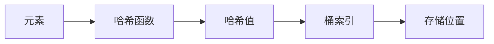

# C++ 无序容器

## 什么是无序容器？

无序容器是C++11标准引入的一组基于哈希表实现的STL容器。与有序容器（如`std::map`、`std::set`）不同，无序容器不会对元素进行排序，而是通过哈希函数将元素映射到特定的桶（bucket）中。这种实现方式使得无序容器在大多数操作上具有平均常数时间复杂度O(1)，相比于有序容器的对数时间复杂度O(log n)更为高效。

C++标准库提供了四种无序容器：

- `std::unordered_set`：存储唯一键值的集合
- `std::unordered_multiset`：允许重复键值的集合
- `std::unordered_map`：存储键值对，键唯一
- `std::unordered_multimap`：存储键值对，允许键重复

## 无序容器的基本原理

无序容器基于哈希表实现，其工作原理如下：



1. 哈希函数将元素映射为哈希值
2. 哈希值被转换为桶索引
3. 元素被存储在相应的桶中
4. 如果发生哈希冲突（不同元素映射到同一个桶），则采用链表或其他数据结构来存储冲突元素

## 基本操作与用法

### 引入头文件

使用无序容器首先需要包含相应的头文件：

```cpp
#include <unordered_map>  // 用于 unordered_map 和 unordered_multimap
#include <unordered_set>  // 用于 unordered_set 和 unordered_multiset
```

### 创建与初始化

```cpp
// 创建空的无序容器
std::unordered_set<int> uset;
std::unordered_map<std::string, int> umap;

// 使用初始化列表
std::unordered_set<int> uset2 = {1, 2, 3, 4, 5};
std::unordered_map<std::string, int> umap2 = {
    {"apple", 1},
    {"banana", 2},
    {"orange", 3}
};
```

### 基本操作示例

以下是`unordered_map`的基本操作示例：

```cpp
#include <iostream>
#include <unordered_map>
#include <string>

int main() {
    // 创建并初始化
    std::unordered_map<std::string, int> scores = {
        {"Alice", 95},
        {"Bob", 87},
        {"Charlie", 92}
    };
    
    // 插入元素
    scores.insert({"David", 88});
    scores["Eve"] = 90;
    
    // 访问元素
    std::cout << "Bob's score: " << scores["Bob"] << std::endl;
    
    // 检查键是否存在
    if (scores.find("Frank") != scores.end()) {
        std::cout << "Frank's score exists" << std::endl;
    } else {
        std::cout << "Frank's score doesn't exist" << std::endl;
    }
    
    // 遍历所有元素
    std::cout << "All scores:" << std::endl;
    for (const auto& pair : scores) {
        std::cout << pair.first << ": " << pair.second << std::endl;
    }
    
    // 删除元素
    scores.erase("Charlie");
    
    // 获取容器大小
    std::cout << "Number of students: " << scores.size() << std::endl;
    
    return 0;
}
```

输出结果：
```
Bob's score: 87
Frank's score doesn't exist
All scores:
Alice: 95
Eve: 90
David: 88
Bob: 87
Charlie: 92
Number of students: 4
```

:::note
注意输出顺序是不确定的，因为无序容器不保证任何特定的元素顺序。
:::

### unordered_set 示例

```cpp
#include <iostream>
#include <unordered_set>
#include <string>

int main() {
    std::unordered_set<std::string> fruits = {"apple", "banana", "orange"};
    
    // 插入元素
    fruits.insert("grape");
    
    // 检查元素是否存在
    if (fruits.count("apple") > 0) {
        std::cout << "Apple exists in the set" << std::endl;
    }
    
    // 遍历元素
    for (const auto& fruit : fruits) {
        std::cout << fruit << " ";
    }
    std::cout << std::endl;
    
    // 删除元素
    fruits.erase("banana");
    
    return 0;
}
```

## 无序容器的性能特点

### 时间复杂度

无序容器的主要操作时间复杂度如下：

| 操作 | 平均时间复杂度 | 最坏时间复杂度 |
|------|--------------|--------------|
| 插入 | O(1)         | O(n)         |
| 查找 | O(1)         | O(n)         |
| 删除 | O(1)         | O(n)         |

最坏情况发生在哈希冲突严重时，所有元素都被哈希到同一个桶中，此时无序容器退化为链表，性能下降。

### 与有序容器的比较

| 特性 | 无序容器 | 有序容器 |
|------|--------|--------|
| 元素排序 | 无序 | 有序 |
| 实现方式 | 哈希表 | 平衡二叉树（红黑树） |
| 查找/插入/删除 | 平均 O(1) | O(log n) |
| 内存消耗 | 通常较高 | 较低 |
| 迭代器失效 | 插入可能导致所有迭代器失效 | 插入通常只使指向受影响元素的迭代器失效 |

## 自定义哈希函数

默认情况下，C++标准库为常见类型如`int`、`float`、`std::string`等提供了哈希函数。但对于自定义类型，你需要提供自定义的哈希函数。

```cpp
#include <iostream>
#include <unordered_set>
#include <string>

// 自定义类型
struct Person {
    std::string name;
    int age;
    
    bool operator==(const Person& other) const {
        return name == other.name && age == other.age;
    }
};

// 为Person类型定义哈希函数
namespace std {
    template<>
    struct hash<Person> {
        size_t operator()(const Person& p) const {
            // 组合name和age的哈希值
            return hash<std::string>()(p.name) ^ hash<int>()(p.age);
        }
    };
}

int main() {
    std::unordered_set<Person> people;
    
    people.insert({"Alice", 25});
    people.insert({"Bob", 30});
    
    for (const auto& person : people) {
        std::cout << "Name: " << person.name << ", Age: " << person.age << std::endl;
    }
    
    return 0;
}
```

## 常用成员函数

无序容器提供了许多有用的成员函数，以下是一些常用的：

### 通用成员函数

- `insert()`: 插入元素
- `emplace()`: 原地构造并插入元素
- `erase()`: 删除元素
- `find()`: 查找元素
- `count()`: 计算特定键的元素数量
- `clear()`: 清空容器
- `size()`: 返回容器中的元素数量
- `empty()`: 检查容器是否为空

### 特有成员函数

- `bucket_count()`: 返回桶的数量
- `load_factor()`: 返回负载因子（元素数量/桶数量）
- `max_load_factor()`: 设置或获取最大负载因子
- `rehash()`: 设置桶的数量
- `reserve()`: 预留空间，确保能容纳指定数量的元素而不必重新哈希

```cpp
#include <iostream>
#include <unordered_map>
#include <string>

int main() {
    std::unordered_map<std::string, int> umap;
    
    // 预留空间
    umap.reserve(100);
    
    // 显示当前桶数量
    std::cout << "Bucket count: " << umap.bucket_count() << std::endl;
    
    // 插入元素
    for (int i = 0; i < 50; ++i) {
        umap["key" + std::to_string(i)] = i;
    }
    
    // 显示负载因子
    std::cout << "Load factor: " << umap.load_factor() << std::endl;
    std::cout << "Max load factor: " << umap.max_load_factor() << std::endl;
    
    return 0;
}
```

## 实际应用场景

### 计数问题

统计文本中单词出现的频率：

```cpp
#include <iostream>
#include <unordered_map>
#include <string>
#include <sstream>

int main() {
    std::string text = "the quick brown fox jumps over the lazy dog";
    std::unordered_map<std::string, int> wordFrequency;
    
    std::istringstream iss(text);
    std::string word;
    
    // 统计每个单词出现的次数
    while (iss >> word) {
        wordFrequency[word]++;
    }
    
    // 输出结果
    for (const auto& pair : wordFrequency) {
        std::cout << pair.first << ": " << pair.second << std::endl;
    }
    
    return 0;
}
```

### 缓存实现

使用`unordered_map`实现简单的缓存：

```cpp
#include <iostream>
#include <unordered_map>
#include <string>

// 模拟一个计算开销较大的函数
std::string expensiveComputation(const std::string& key) {
    std::cout << "Computing result for " << key << " (expensive operation)" << std::endl;
    // 假设这是一个耗时的计算
    return "Result for " + key;
}

class SimpleCache {
private:
    std::unordered_map<std::string, std::string> cache;
    
public:
    std::string getResult(const std::string& key) {
        // 检查结果是否已经在缓存中
        auto it = cache.find(key);
        if (it != cache.end()) {
            std::cout << "Cache hit for " << key << std::endl;
            return it->second;
        }
        
        // 如果不在缓存中，计算结果并存储
        std::string result = expensiveComputation(key);
        cache[key] = result;
        return result;
    }
};

int main() {
    SimpleCache cache;
    
    // 首次调用会执行计算
    std::cout << cache.getResult("key1") << std::endl;
    
    // 第二次调用会使用缓存
    std::cout << cache.getResult("key1") << std::endl;
    
    // 不同的键会执行新计算
    std::cout << cache.getResult("key2") << std::endl;
    
    return 0;
}
```

### 快速去重

使用`unordered_set`快速去除重复元素：

```cpp
#include <iostream>
#include <unordered_set>
#include <vector>

std::vector<int> removeDuplicates(const std::vector<int>& input) {
    std::unordered_set<int> seen;
    std::vector<int> result;
    
    for (int value : input) {
        // 如果元素之前没有出现过
        if (seen.insert(value).second) {
            result.push_back(value);
        }
    }
    
    return result;
}

int main() {
    std::vector<int> numbers = {1, 3, 5, 1, 7, 3, 9, 5};
    std::vector<int> uniqueNumbers = removeDuplicates(numbers);
    
    std::cout << "Original array: ";
    for (int num : numbers) {
        std::cout << num << " ";
    }
    std::cout << std::endl;
    
    std::cout << "After removing duplicates: ";
    for (int num : uniqueNumbers) {
        std::cout << num << " ";
    }
    std::cout << std::endl;
    
    return 0;
}
```

## 注意事项和最佳实践

### 迭代器稳定性

无序容器的插入操作在重新哈希时可能导致所有迭代器失效。如果你在迭代的同时需要修改容器，需要特别小心。

```cpp
auto it = container.begin();
// 不安全：插入可能导致迭代器失效
container.insert(newValue); 
// 迭代器it可能已经失效
```

### 性能优化

1. **合理设置初始容量**：使用`reserve()`预设容量，减少重新哈希的次数。
2. **调整负载因子**：`max_load_factor()`可以调整容器的填充程度，较低的值意味着更少的冲突但更多的内存消耗。
3. **自定义哈希函数**：为自定义类型提供高效的哈希函数，尽量减少冲突。

### 避免常见错误

1. **访问不存在的键**：使用`[]`运算符访问`unordered_map`中不存在的键会插入一个新元素，如果仅需检查，应使用`find()`或`count()`。

```cpp
// 不好的做法 - 这会在键不存在时创建一个新元素
if (myMap["key"] == expectedValue) { /* ... */ }

// 更好的做法
if (myMap.count("key") > 0 && myMap["key"] == expectedValue) { /* ... */ }
// 或者
auto it = myMap.find("key");
if (it != myMap.end() && it->second == expectedValue) { /* ... */ }
```

2. **忘记实现相等运算符**：自定义类型不仅需要哈希函数，还需要实现`operator==`。

## 总结

无序容器是C++中非常实用的数据结构，它们利用哈希表的特性提供了平均O(1)时间复杂度的查找、插入和删除操作。主要包括`unordered_map`、`unordered_multimap`、`unordered_set`和`unordered_multiset`。

虽然无序容器在大多数情况下比有序容器更高效，但它们也有自己的局限性：不保证元素顺序、可能占用更多内存、迭代器稳定性较差，以及在极端情况下可能出现性能下降。

在选择容器类型时，应考虑应用场景的需求：如果需要按顺序访问元素，应选择有序容器；如果需要最快的查找速度且不关心元素顺序，则无序容器是更好的选择。

## 练习题

1. 编写一个程序，使用`unordered_map`统计一个字符串中每个字符出现的次数。
2. 实现一个简单的电话簿应用，使用`unordered_map`存储人名和电话号码。
3. 使用`unordered_set`找出两个数组的交集（即同时出现在两个数组中的元素）。
4. 为一个自定义的`Student`类实现哈希函数，使其可以在`unordered_set`中使用。
5. 比较`std::map`和`std::unordered_map`在不同数据量下的性能差异。

:::tip
记住，无序容器的实际性能受到许多因素影响，包括哈希函数的质量、负载因子设置以及数据分布。在性能关键的应用中，建议进行实际测试来确定最合适的容器类型。
:::