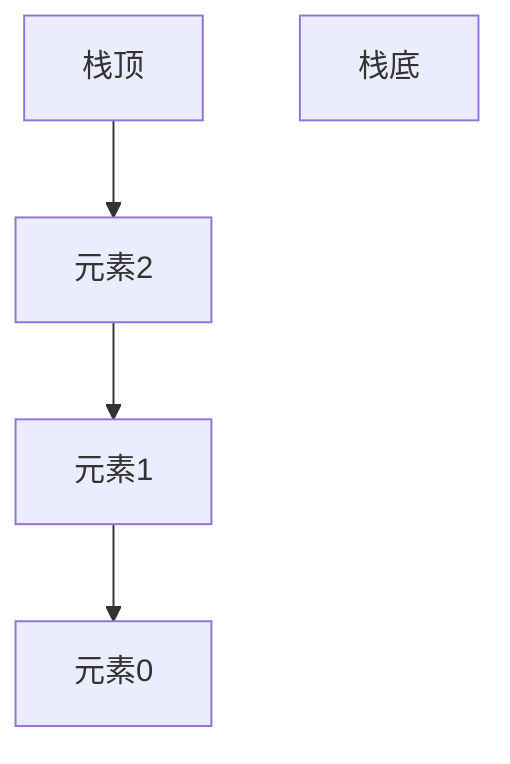
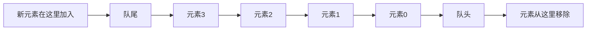
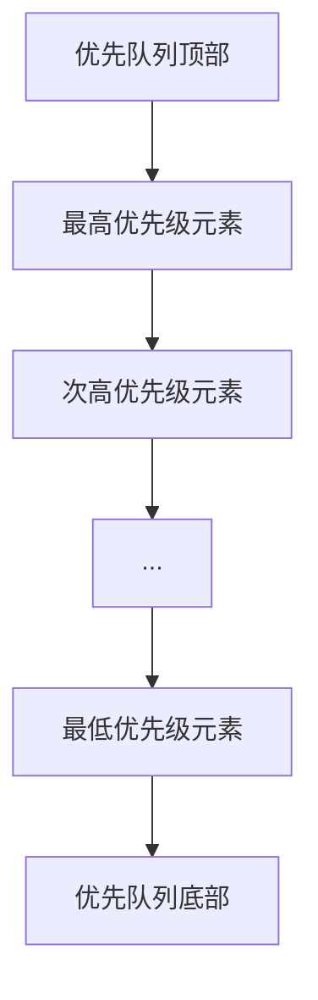

# C++ 容器适配器

## 什么是容器适配器？

容器适配器是C++ STL提供的一种特殊容器，它们不是直接存储元素，而是基于其他容器实现特定的数据结构和操作接口。容器适配器通过封装其他容器（如`vector`、`deque`或`list`），并限制其功能，从而提供特定的数据结构语义。

C++ STL提供了三种主要的容器适配器：

1. **栈（stack）**：后进先出(LIFO)的数据结构
2. **队列（queue）**：先进先出(FIFO)的数据结构
3. **优先队列（priority_queue）**：元素具有优先级的队列，最高优先级的元素总是首先出队

:::note
容器适配器不是独立实现的容器，而是在现有容器基础上提供特定接口的"封装器"。
:::

## 栈（stack）

### 栈的基本概念

栈是一种后进先出(LIFO)的数据结构，就像一堆叠放的盘子，只能从顶部添加或移除元素。



### 栈的操作

- `push()`：将元素添加到栈顶
- `pop()`：移除栈顶元素
- `top()`：返回栈顶元素的引用
- `empty()`：检查栈是否为空
- `size()`：返回栈中的元素个数

### 栈的实现与使用

默认情况下，`stack`基于`deque`容器实现，但也可以使用`vector`或`list`作为底层容器。

```cpp
#include <iostream>
#include <stack>
#include <vector>

int main() {
    // 默认基于deque实现的栈
    std::stack<int> s1;
    
    // 基于vector实现的栈
    std::stack<int, std::vector<int>> s2;
    
    // 添加元素
    s1.push(10);
    s1.push(20);
    s1.push(30);
    
    std::cout << "栈顶元素: " << s1.top() << std::endl;  // 输出: 30
    std::cout << "栈的大小: " << s1.size() << std::endl; // 输出: 3
    
    // 弹出栈顶元素
    s1.pop();
    std::cout << "弹出后的栈顶元素: " << s1.top() << std::endl; // 输出: 20
    
    // 遍历并清空栈
    std::cout << "栈中所有元素: ";
    while (!s1.empty()) {
        std::cout << s1.top() << " ";
        s1.pop();
    }
    std::cout << std::endl;  // 输出: 20 10
    
    return 0;
}
```

### 栈的应用场景

1. **函数调用管理**：程序执行时的函数调用栈
2. **表达式求值**：如中缀表达式转换为后缀表达式
3. **括号匹配检查**：验证括号是否正确配对
4. **撤销操作**：许多程序的撤销功能

#### 实际案例：括号匹配检查

```cpp
#include <iostream>
#include <stack>
#include <string>

bool isBalanced(const std::string& expr) {
    std::stack<char> s;
    
    for (char c : expr) {
        if (c == '(' || c == '[' || c == '{') {
            s.push(c);
        } else if (c == ')' || c == ']' || c == '}') {
            if (s.empty()) return false;
            
            char top = s.top();
            if ((c == ')' && top != '(') ||
                (c == ']' && top != '[') ||
                (c == '}' && top != '{')) {
                return false;
            }
            s.pop();
        }
    }
    
    return s.empty();
}

int main() {
    std::string expr1 = "{[()]}";
    std::string expr2 = "{[(])}";
    
    std::cout << expr1 << " 是否匹配: " << (isBalanced(expr1) ? "是" : "否") << std::endl;
    std::cout << expr2 << " 是否匹配: " << (isBalanced(expr2) ? "是" : "否") << std::endl;
    
    return 0;
}
```

输出:
```
{[()]} 是否匹配: 是
{[(])} 是否匹配: 否
```

## 队列（queue）

### 队列的基本概念

队列是一种先进先出(FIFO)的数据结构，类似于现实生活中的排队，先到的人先服务，后到的人后服务。



### 队列的操作

- `push()`：将元素添加到队尾
- `pop()`：移除队头元素
- `front()`：返回队头元素的引用
- `back()`：返回队尾元素的引用
- `empty()`：检查队列是否为空
- `size()`：返回队列中的元素个数

### 队列的实现与使用

默认情况下，`queue`基于`deque`容器实现，但也可以使用`list`作为底层容器。

```cpp
#include <iostream>
#include <queue>
#include <list>

int main() {
    // 默认基于deque实现的队列
    std::queue<int> q1;
    
    // 基于list实现的队列
    std::queue<int, std::list<int>> q2;
    
    // 添加元素
    q1.push(10);
    q1.push(20);
    q1.push(30);
    
    std::cout << "队头元素: " << q1.front() << std::endl; // 输出: 10
    std::cout << "队尾元素: " << q1.back() << std::endl;  // 输出: 30
    std::cout << "队列大小: " << q1.size() << std::endl;  // 输出: 3
    
    // 移除队头元素
    q1.pop();
    std::cout << "移除后的队头元素: " << q1.front() << std::endl; // 输出: 20
    
    // 遍历并清空队列
    std::cout << "队列中所有元素: ";
    while (!q1.empty()) {
        std::cout << q1.front() << " ";
        q1.pop();
    }
    std::cout << std::endl;  // 输出: 20 30
    
    return 0;
}
```

### 队列的应用场景

1. **缓冲区管理**：如打印任务队列
2. **广度优先搜索(BFS)**：图算法中的广度优先遍历
3. **任务调度**：操作系统中的进程调度
4. **消息队列**：异步消息处理系统

#### 实际案例：用队列实现广度优先搜索

```cpp
#include <iostream>
#include <queue>
#include <vector>

// 简化的无向图结构
struct Graph {
    int vertices;
    std::vector<std::vector<int>> adjacencyList;
    
    Graph(int v) : vertices(v), adjacencyList(v) {}
    
    void addEdge(int src, int dest) {
        adjacencyList[src].push_back(dest);
        adjacencyList[dest].push_back(src);
    }
    
    // 广度优先搜索
    void BFS(int startVertex) {
        std::vector<bool> visited(vertices, false);
        std::queue<int> q;
        
        visited[startVertex] = true;
        q.push(startVertex);
        
        std::cout << "BFS 遍历结果: ";
        
        while (!q.empty()) {
            int current = q.front();
            q.pop();
            std::cout << current << " ";
            
            // 访问所有邻接节点
            for (int adjacent : adjacencyList[current]) {
                if (!visited[adjacent]) {
                    visited[adjacent] = true;
                    q.push(adjacent);
                }
            }
        }
        std::cout << std::endl;
    }
};

int main() {
    Graph g(6);
    g.addEdge(0, 1);
    g.addEdge(0, 2);
    g.addEdge(1, 3);
    g.addEdge(2, 3);
    g.addEdge(2, 4);
    g.addEdge(3, 4);
    g.addEdge(3, 5);
    
    g.BFS(0);
    
    return 0;
}
```

输出:
```
BFS 遍历结果: 0 1 2 3 4 5 
```

## 优先队列（priority_queue）

### 优先队列的基本概念

优先队列是一种特殊的队列，其中每个元素都有一个"优先级"，元素出队的顺序是按照优先级而不是入队顺序决定的。默认情况下，优先队列是最大堆，即优先级最高的元素（最大值）最先出队。



### 优先队列的操作

- `push()`：将元素添加到优先队列
- `pop()`：移除具有最高优先级的元素
- `top()`：返回具有最高优先级的元素的引用
- `empty()`：检查优先队列是否为空
- `size()`：返回优先队列中的元素个数

### 优先队列的实现与使用

默认情况下，`priority_queue`基于`vector`容器实现，并使用`less<T>`比较器来创建最大堆。

```cpp
#include <iostream>
#include <queue>
#include <vector>
#include <functional> // 用于 greater<int>

int main() {
    // 默认最大堆（最大元素在顶部）
    std::priority_queue<int> maxHeap;
    
    // 最小堆（最小元素在顶部）
    std::priority_queue<int, std::vector<int>, std::greater<int>> minHeap;
    
    // 添加元素到最大堆
    maxHeap.push(10);
    maxHeap.push(30);
    maxHeap.push(20);
    
    std::cout << "最大堆顶部元素: " << maxHeap.top() << std::endl; // 输出: 30
    
    // 添加元素到最小堆
    minHeap.push(10);
    minHeap.push(30);
    minHeap.push(20);
    
    std::cout << "最小堆顶部元素: " << minHeap.top() << std::endl; // 输出: 10
    
    // 遍历并清空最大堆
    std::cout << "从最大堆按优先级顺序出队: ";
    while (!maxHeap.empty()) {
        std::cout << maxHeap.top() << " ";
        maxHeap.pop();
    }
    std::cout << std::endl; // 输出: 30 20 10
    
    // 遍历并清空最小堆
    std::cout << "从最小堆按优先级顺序出队: ";
    while (!minHeap.empty()) {
        std::cout << minHeap.top() << " ";
        minHeap.pop();
    }
    std::cout << std::endl; // 输出: 10 20 30
    
    return 0;
}
```

### 使用自定义类型和比较器

```cpp
#include <iostream>
#include <queue>
#include <string>

// 任务结构体
struct Task {
    std::string name;
    int priority;
    
    Task(const std::string& n, int p) : name(n), priority(p) {}
};

// 自定义比较器
struct TaskComparator {
    bool operator()(const Task& t1, const Task& t2) const {
        // 注意：返回true表示t1的优先级低于t2
        return t1.priority < t2.priority;
    }
};

int main() {
    // 使用自定义比较器的优先队列
    std::priority_queue<Task, std::vector<Task>, TaskComparator> taskQueue;
    
    taskQueue.push(Task("发送邮件", 2));
    taskQueue.push(Task("系统更新", 5));
    taskQueue.push(Task("数据备份", 4));
    taskQueue.push(Task("日志清理", 1));
    taskQueue.push(Task("安全扫描", 3));
    
    std::cout << "按优先级处理任务:" << std::endl;
    while (!taskQueue.empty()) {
        Task currentTask = taskQueue.top();
        std::cout << "处理任务: " << currentTask.name 
                  << " (优先级: " << currentTask.priority << ")" << std::endl;
        taskQueue.pop();
    }
    
    return 0;
}
```

输出:
```
按优先级处理任务:
处理任务: 系统更新 (优先级: 5)
处理任务: 数据备份 (优先级: 4)
处理任务: 安全扫描 (优先级: 3)
处理任务: 发送邮件 (优先级: 2)
处理任务: 日志清理 (优先级: 1)
```

### 优先队列的应用场景

1. **任务调度**：根据优先级处理任务
2. **图算法**：如Dijkstra最短路径算法和Prim最小生成树算法
3. **事件模拟**：模拟按时间顺序发生的事件
4. **数据压缩**：如Huffman编码
5. **作业系统**：实时系统中的作业调度

## 容器适配器的比较

| 特性 | stack | queue | priority_queue |
|------|-------|-------|----------------|
| 顺序 | 后进先出(LIFO) | 先进先出(FIFO) | 按优先级 |
| 底层容器 | deque, vector, list | deque, list | vector, deque |
| 访问方式 | 只能访问顶部 | 只能访问首尾 | 只能访问顶部 |
| 添加元素 | push() | push() | push() |
| 删除元素 | pop() | pop() | pop() |
| 访问最近元素 | top() | front(), back() | top() |

## 总结

容器适配器是C++ STL中非常实用的组件，它们通过封装基础容器，提供了特定的数据结构接口：

1. **栈(stack)**提供LIFO（后进先出）操作，适用于需要反向处理数据的场景。
2. **队列(queue)**提供FIFO（先进先出）操作，适用于按顺序处理数据的场景。
3. **优先队列(priority_queue)**根据优先级出队元素，适用于需要按重要性处理数据的场景。

这些适配器简化了特定数据结构的实现，让我们可以专注于解决问题，而不是构建底层数据结构。

## 练习

1. 使用栈实现一个简单的计算器，可以计算后缀表达式（如"3 4 + 2 *"表示(3+4)*2）。
2. 使用队列模拟一个打印任务队列，添加和处理不同的打印任务。
3. 使用优先队列实现一个医院急诊室的病人排队系统，根据病情严重程度决定治疗顺序。
4. 结合使用栈和队列，实现一个简单的迷宫搜索算法，分别使用深度优先搜索(DFS)和广度优先搜索(BFS)。

## 进一步学习资源

- [C++ Reference - Stack](https://en.cppreference.com/w/cpp/container/stack)
- [C++ Reference - Queue](https://en.cppreference.com/w/cpp/container/queue)
- [C++ Reference - Priority Queue](https://en.cppreference.com/w/cpp/container/priority_queue)
- 《Effective STL》 by Scott Meyers，深入了解STL容器的最佳实践
- 《C++ Primer》第11章：关联容器和第12章：动态内存

容器适配器是面向特定场景的强大工具，掌握它们的使用可以让你的代码更加简洁高效。多加练习，熟能生巧！