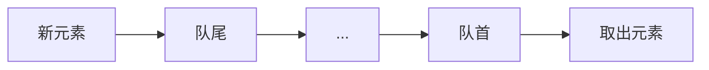

# C++ queue

## 队列的概念

队列(queue)是一种先进先出(FIFO, First-In-First-Out)的数据结构。想象一下日常生活中排队买票的场景：先到的人先买票，后到的人后买票。在队列中，我们只能从一端(称为队尾)添加元素，从另一端(称为队首)取出元素。



## 队列在STL中的位置

在C++ STL中，`queue` 是一个容器适配器(container adapter)，它基于其他容器(如 `deque`或`list`)实现。默认情况下，`queue` 基于 `deque` 容器实现。

要使用`queue`，我们需要包含以下头文件：

```cpp
#include <queue>
```

## queue的基本操作

### 创建队列

```cpp
#include <iostream>
#include <queue>

int main() {
    // 创建一个空队列，其中元素类型为int
    std::queue<int> q;
    
    // 使用deque创建队列
    std::deque<int> d = {1, 2, 3};
    std::queue<int> q1(d);
    
    // 使用另一个队列创建队列
    std::queue<int> q2(q1);
    
    return 0;
}
```

### 基本操作

队列提供了以下几个主要操作：

1. **push()**：在队尾添加一个元素
2. **pop()**：删除队首元素
3. **front()**：返回队首元素的引用
4. **back()**：返回队尾元素的引用
5. **empty()**：检查队列是否为空
6. **size()**：返回队列中的元素数量

下面是这些操作的简单示例：

```cpp
#include <iostream>
#include <queue>

int main() {
    std::queue<int> q;
    
    // 添加元素
    q.push(10);
    q.push(20);
    q.push(30);
    
    // 获取队列大小
    std::cout << "队列大小: " << q.size() << std::endl;
    
    // 访问队首和队尾元素
    std::cout << "队首元素: " << q.front() << std::endl;
    std::cout << "队尾元素: " << q.back() << std::endl;
    
    // 删除队首元素
    q.pop();
    std::cout << "执行pop()后，队首元素: " << q.front() << std::endl;
    
    // 检查队列是否为空
    if (!q.empty()) {
        std::cout << "队列不为空" << std::endl;
    }
    
    return 0;
}
```

输出：
```
队列大小: 3
队首元素: 10
队尾元素: 30
执行pop()后，队首元素: 20
队列不为空
```

:::caution
队列的pop()操作只会删除元素，不会返回被删除的值。如果你需要获取队首元素，应该先使用front()获取其值，然后再使用pop()删除它。
:::

## queue的局限性

queue作为STL容器适配器有一些局限性：

1. 不支持迭代器，因此不能使用STL算法遍历队列
2. 不能随机访问元素，只能访问队首和队尾元素
3. 没有提供清空队列的直接方法

如果需要清空队列，可以使用以下方法：

```cpp
// 使用swap清空队列
std::queue<int> empty;
myQueue.swap(empty);

// 或者循环弹出所有元素
while (!myQueue.empty()) {
    myQueue.pop();
}
```

## 自定义队列元素类型

队列可以存储任何类型的元素，包括自定义类型：

```cpp
#include <iostream>
#include <queue>
#include <string>

// 自定义类型
struct Person {
    std::string name;
    int age;
    
    Person(std::string n, int a) : name(n), age(a) {}
};

int main() {
    std::queue<Person> personQueue;
    
    // 添加Person对象到队列
    personQueue.push({"Alice", 25});
    personQueue.push({"Bob", 30});
    personQueue.push({"Charlie", 22});
    
    // 处理队列中的元素
    while (!personQueue.empty()) {
        Person p = personQueue.front();
        std::cout << "处理: " << p.name << ", " << p.age << "岁" << std::endl;
        personQueue.pop();
    }
    
    return 0;
}
```

输出：
```
处理: Alice, 25岁
处理: Bob, 30岁
处理: Charlie, 22岁
```

## 更改底层容器

默认情况下，queue使用deque作为其底层容器。但我们也可以指定其他符合要求的容器，如list：

```cpp
#include <iostream>
#include <queue>
#include <list>

int main() {
    // 使用list作为底层容器的队列
    std::queue<int, std::list<int>> listQueue;
    
    listQueue.push(10);
    listQueue.push(20);
    
    std::cout << "队首元素: " << listQueue.front() << std::endl;
    
    return 0;
}
```

输出：
```
队首元素: 10
```

## 实际应用场景

### 1. 广度优先搜索(BFS)

队列在图算法中的广度优先搜索算法中扮演着关键角色：

```cpp
#include <iostream>
#include <queue>
#include <vector>
#include <unordered_map>

// 使用队列实现简单的BFS
void bfs(std::unordered_map<int, std::vector<int>>& graph, int start) {
    std::queue<int> q;
    std::vector<bool> visited(graph.size() + 1, false);
    
    q.push(start);
    visited[start] = true;
    
    while (!q.empty()) {
        int node = q.front();
        q.pop();
        std::cout << "访问节点: " << node << std::endl;
        
        for (int neighbor : graph[node]) {
            if (!visited[neighbor]) {
                q.push(neighbor);
                visited[neighbor] = true;
            }
        }
    }
}

int main() {
    // 创建一个简单图
    std::unordered_map<int, std::vector<int>> graph;
    graph[1] = {2, 3};
    graph[2] = {1, 4, 5};
    graph[3] = {1, 6};
    graph[4] = {2};
    graph[5] = {2};
    graph[6] = {3};
    
    std::cout << "BFS遍历结果:" << std::endl;
    bfs(graph, 1);
    
    return 0;
}
```

### 2. 任务调度器

队列常用于任务调度：

```cpp
#include <iostream>
#include <queue>
#include <string>

struct Task {
    std::string name;
    int priority;
    
    Task(std::string n, int p) : name(n), priority(p) {}
};

class TaskScheduler {
private:
    std::queue<Task> tasks;
    
public:
    void addTask(const Task& task) {
        tasks.push(task);
        std::cout << "任务 '" << task.name << "' 添加到队列" << std::endl;
    }
    
    void executeTasks() {
        std::cout << "\n开始执行任务..." << std::endl;
        while (!tasks.empty()) {
            Task currentTask = tasks.front();
            std::cout << "执行任务: " << currentTask.name 
                      << " (优先级: " << currentTask.priority << ")" << std::endl;
            tasks.pop();
        }
        std::cout << "所有任务执行完毕" << std::endl;
    }
};

int main() {
    TaskScheduler scheduler;
    
    scheduler.addTask({"发送邮件", 1});
    scheduler.addTask({"备份数据", 2});
    scheduler.addTask({"更新系统", 3});
    
    scheduler.executeTasks();
    
    return 0;
}
```

输出：
```
任务 '发送邮件' 添加到队列
任务 '备份数据' 添加到队列
任务 '更新系统' 添加到队列

开始执行任务...
执行任务: 发送邮件 (优先级: 1)
执行任务: 备份数据 (优先级: 2)
执行任务: 更新系统 (优先级: 3)
所有任务执行完毕
```

### 3. 打印队列模拟

```cpp
#include <iostream>
#include <queue>
#include <string>
#include <thread>
#include <chrono>

struct PrintJob {
    std::string document;
    int pages;
    
    PrintJob(std::string doc, int p) : document(doc), pages(p) {}
};

class PrinterQueue {
private:
    std::queue<PrintJob> jobs;
    
public:
    void addJob(const PrintJob& job) {
        jobs.push(job);
        std::cout << "文档 '" << job.document << "' 添加到打印队列" << std::endl;
    }
    
    void startPrinting() {
        std::cout << "\n开始打印..." << std::endl;
        while (!jobs.empty()) {
            PrintJob currentJob = jobs.front();
            std::cout << "打印: " << currentJob.document 
                      << " (" << currentJob.pages << " 页)" << std::endl;
            
            // 模拟打印时间
            std::this_thread::sleep_for(std::chrono::seconds(1));
            
            jobs.pop();
            std::cout << "打印完成: " << currentJob.document << std::endl;
        }
        std::cout << "所有文档打印完毕" << std::endl;
    }
};

int main() {
    PrinterQueue printer;
    
    printer.addJob({"工作报告.pdf", 5});
    printer.addJob({"会议笔记.docx", 2});
    printer.addJob({"预算表格.xlsx", 8});
    
    printer.startPrinting();
    
    return 0;
}
```

## 总结

`queue` 是C++ STL中实现队列数据结构的容器适配器，它提供了先进先出(FIFO)的操作方式：

1. 最主要的操作包括：`push()`、`pop()`、`front()`、`back()`、`empty()`和`size()`
2. 队列不支持迭代器，只能访问队首和队尾元素
3. 默认基于`deque`容器实现，但也可以使用`list`作为底层容器
4. 在实际应用中，队列常用于广度优先搜索、任务调度、消息处理等场景

队列是一种非常简单却功能强大的数据结构，掌握它的使用将帮助你解决许多实际编程问题。

## 练习

1. 编写一个程序，使用队列实现一个简单的银行柜台模拟系统，可以添加客户到队列并处理客户。
2. 实现一个函数，判断一个字符串是否是回文(正读和反读都一样)，使用队列和栈来解决。
3. 修改上面的打印队列示例，添加一个功能允许紧急任务插队(提示：可能需要使用其他数据结构)。

## 进一步学习

如果你想更深入地学习队列，可以探索以下相关主题：

- 优先队列(`priority_queue`)
- 双端队列(`deque`)
- 循环队列的实现
- 队列在并发编程中的应用

:::tip
队列常与栈配合使用，特别是在需要反向操作或临时存储数据的场景中。建议同时学习并理解栈的概念和用法。
:::