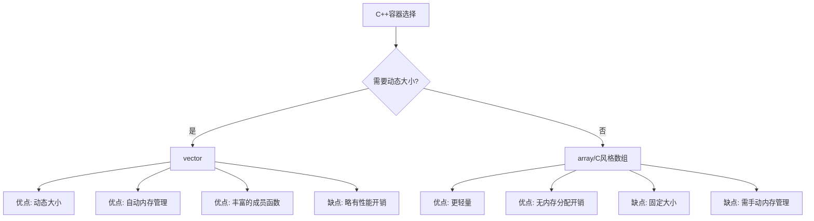

# C++ vector

## vector 介绍

在 C++ 中，`vector` 是标准模板库（STL）中最常用的容器之一，它提供了一个动态数组，可以在运行时改变大小。与传统数组相比，`vector` 不仅可以存储元素，还能自动管理内存空间的分配和释放，是一个功能强大且易于使用的容器。

`vector` 的主要特点包括：

- **动态大小**：可以在运行时根据需要增加或减少元素数量
- **随机访问**：支持通过索引直接访问元素，时间复杂度为 O(1)
- **自动内存管理**：自动处理内存的分配和释放
- **顺序存储**：元素在内存中连续存储，有利于缓存命中率
- **尾部操作高效**：在尾部添加或删除元素通常是高效的

## vector 的基本用法

### 包含头文件

要使用 `vector`，首先需要包含相应的头文件：

```cpp
#include <vector>
```

### 创建 vector

创建 `vector` 有多种方式：

```cpp
// 创建一个空的整数vector
std::vector<int> vec1;

// 创建一个包含5个元素，每个元素初始化为0的vector
std::vector<int> vec2(5);

// 创建一个包含3个元素，每个元素初始化为7的vector
std::vector<int> vec3(3, 7);

// 使用初始化列表
std::vector<int> vec4 = {1, 2, 3, 4, 5};

// 从另一个vector复制
std::vector<int> vec5(vec4);
```

### 基本操作

```cpp
#include <iostream>
#include <vector>

int main() {
    // 创建并初始化vector
    std::vector<int> numbers = {10, 20, 30};
    
    // 添加元素
    numbers.push_back(40);
    numbers.push_back(50);
    
    // 遍历并输出元素
    std::cout << "Vector elements: ";
    for (int num : numbers) {
        std::cout << num << " ";
    }
    std::cout << std::endl;
    
    // 访问元素
    std::cout << "First element: " << numbers[0] << std::endl;
    std::cout << "Second element: " << numbers.at(1) << std::endl;
    
    // 获取vector大小
    std::cout << "Size: " << numbers.size() << std::endl;
    
    // 修改元素
    numbers[0] = 100;
    std::cout << "Modified first element: " << numbers[0] << std::endl;
    
    return 0;
}
```

输出结果：
```
Vector elements: 10 20 30 40 50 
First element: 10
Second element: 20
Size: 5
Modified first element: 100
```

## vector 的常用成员函数

### 元素访问

- `at(index)`：返回指定位置的元素，带有边界检查
- `operator[]`：返回指定位置的元素，不进行边界检查
- `front()`：返回第一个元素
- `back()`：返回最后一个元素
- `data()`：返回指向第一个元素的指针

### 容量操作

- `size()`：返回元素数量
- `max_size()`：返回可容纳的最大元素数量
- `resize(n)`：调整容器大小为n
- `capacity()`：返回当前分配的存储空间大小
- `empty()`：检查容器是否为空
- `reserve(n)`：预先分配至少能容纳n个元素的存储空间
- `shrink_to_fit()`：减小容量以适应实际元素数量

### 修改容器

- `push_back(value)`：在末尾添加元素
- `pop_back()`：移除末尾元素
- `insert(pos, value)`：在指定位置插入元素
- `erase(pos)`：移除指定位置的元素
- `swap(vector2)`：与另一个vector交换内容
- `clear()`：移除所有元素

### 示例代码

```cpp
#include <iostream>
#include <vector>

int main() {
    std::vector<int> vec = {1, 2, 3, 4, 5};
    
    // 元素访问
    std::cout << "First element: " << vec.front() << std::endl;
    std::cout << "Last element: " << vec.back() << std::endl;
    
    // 容量操作
    std::cout << "Size: " << vec.size() << std::endl;
    std::cout << "Capacity: " << vec.capacity() << std::endl;
    
    // 修改容器
    vec.push_back(6);
    vec.push_back(7);
    
    std::cout << "After adding elements:" << std::endl;
    for (int num : vec) {
        std::cout << num << " ";
    }
    std::cout << std::endl;
    
    // 使用insert在位置2插入元素10
    vec.insert(vec.begin() + 2, 10);
    
    std::cout << "After inserting 10 at position 2:" << std::endl;
    for (int num : vec) {
        std::cout << num << " ";
    }
    std::cout << std::endl;
    
    // 使用erase删除位置3的元素
    vec.erase(vec.begin() + 3);
    
    std::cout << "After erasing element at position 3:" << std::endl;
    for (int num : vec) {
        std::cout << num << " ";
    }
    std::cout << std::endl;
    
    return 0;
}
```

输出结果：
```
First element: 1
Last element: 5
Size: 5
Capacity: 5
After adding elements:
1 2 3 4 5 6 7 
After inserting 10 at position 2:
1 2 10 3 4 5 6 7 
After erasing element at position 3:
1 2 10 4 5 6 7 
```

## vector 迭代器

Vector 提供了迭代器来遍历和访问元素。迭代器是一种类似于指针的对象，用于遍历容器中的元素。

### 常用迭代器函数

- `begin()`：返回指向第一个元素的迭代器
- `end()`：返回指向最后一个元素之后位置的迭代器
- `rbegin()`：返回指向最后一个元素的反向迭代器
- `rend()`：返回指向第一个元素之前位置的反向迭代器

### 迭代器示例

```cpp
#include <iostream>
#include <vector>

int main() {
    std::vector<int> vec = {1, 2, 3, 4, 5};
    
    // 使用迭代器正向遍历
    std::cout << "Forward traversal: ";
    for (std::vector<int>::iterator it = vec.begin(); it != vec.end(); ++it) {
        std::cout << *it << " ";
    }
    std::cout << std::endl;
    
    // 使用auto关键字简化迭代器声明
    std::cout << "Forward traversal with auto: ";
    for (auto it = vec.begin(); it != vec.end(); ++it) {
        std::cout << *it << " ";
    }
    std::cout << std::endl;
    
    // 使用迭代器反向遍历
    std::cout << "Reverse traversal: ";
    for (auto rit = vec.rbegin(); rit != vec.rend(); ++rit) {
        std::cout << *rit << " ";
    }
    std::cout << std::endl;
    
    return 0;
}
```

输出结果：
```
Forward traversal: 1 2 3 4 5 
Forward traversal with auto: 1 2 3 4 5 
Reverse traversal: 5 4 3 2 1 
```

## vector 内存管理

`vector` 在内部使用动态数组来存储元素，并自动管理内存。当添加元素导致当前分配的空间不足时，`vector` 会分配更大的内存空间，并将原有元素复制到新分配的空间中。

:::caution
由于内存重新分配会导致迭代器、指针和引用失效，因此在修改 vector 时需要格外小心。
:::

可以使用 `reserve()` 函数预先分配足够的内存，避免频繁的内存重新分配，提高性能：

```cpp
#include <iostream>
#include <vector>
#include <chrono>

int main() {
    const int SIZE = 1000000;
    
    // 不预分配内存
    auto start1 = std::chrono::high_resolution_clock::now();
    std::vector<int> vec1;
    for (int i = 0; i < SIZE; i++) {
        vec1.push_back(i);
    }
    auto end1 = std::chrono::high_resolution_clock::now();
    
    // 预分配内存
    auto start2 = std::chrono::high_resolution_clock::now();
    std::vector<int> vec2;
    vec2.reserve(SIZE);  // 预分配内存
    for (int i = 0; i < SIZE; i++) {
        vec2.push_back(i);
    }
    auto end2 = std::chrono::high_resolution_clock::now();
    
    std::chrono::duration<double, std::milli> time1 = end1 - start1;
    std::chrono::duration<double, std::milli> time2 = end2 - start2;
    
    std::cout << "Without reserve: " << time1.count() << " ms" << std::endl;
    std::cout << "With reserve: " << time2.count() << " ms" << std::endl;
    
    return 0;
}
```

输出结果可能类似：
```
Without reserve: 25.4793 ms
With reserve: 12.9854 ms
```

## vector 的实际应用场景

### 1. 学生成绩管理系统

```cpp
#include <iostream>
#include <vector>
#include <string>
#include <algorithm>

struct Student {
    std::string name;
    int score;
    
    Student(const std::string& n, int s) : name(n), score(s) {}
};

int main() {
    std::vector<Student> students;
    
    // 添加学生信息
    students.push_back(Student("Alice", 92));
    students.push_back(Student("Bob", 85));
    students.push_back(Student("Charlie", 78));
    students.push_back(Student("David", 95));
    students.push_back(Student("Eve", 88));
    
    // 按成绩排序（降序）
    std::sort(students.begin(), students.end(), 
              [](const Student& a, const Student& b) {
                  return a.score > b.score;
              });
    
    // 输出成绩排名
    std::cout << "Student Rankings:" << std::endl;
    for (size_t i = 0; i < students.size(); ++i) {
        std::cout << i + 1 << ". " << students[i].name 
                  << " - " << students[i].score << std::endl;
    }
    
    // 计算平均分
    int total = 0;
    for (const auto& student : students) {
        total += student.score;
    }
    double average = static_cast<double>(total) / students.size();
    
    std::cout << "\nClass average: " << average << std::endl;
    
    return 0;
}
```

输出结果：
```
Student Rankings:
1. David - 95
2. Alice - 92
3. Eve - 88
4. Bob - 85
5. Charlie - 78

Class average: 87.6
```

### 2. 简单的任务管理器

```cpp
#include <iostream>
#include <vector>
#include <string>

struct Task {
    std::string description;
    bool completed;
    
    Task(const std::string& desc) : description(desc), completed(false) {}
};

class TaskManager {
private:
    std::vector<Task> tasks;
    
public:
    void addTask(const std::string& description) {
        tasks.push_back(Task(description));
        std::cout << "Task added.\n";
    }
    
    void markCompleted(size_t index) {
        if (index < tasks.size()) {
            tasks[index].completed = true;
            std::cout << "Task marked as completed.\n";
        } else {
            std::cout << "Invalid task index.\n";
        }
    }
    
    void listTasks() {
        if (tasks.empty()) {
            std::cout << "No tasks to show.\n";
            return;
        }
        
        std::cout << "Tasks:\n";
        for (size_t i = 0; i < tasks.size(); ++i) {
            std::cout << i + 1 << ". " 
                      << (tasks[i].completed ? "[X] " : "[ ] ")
                      << tasks[i].description << std::endl;
        }
    }
    
    void removeCompletedTasks() {
        auto newEnd = std::remove_if(tasks.begin(), tasks.end(),
            [](const Task& task) { return task.completed; });
        
        size_t removed = tasks.end() - newEnd;
        tasks.erase(newEnd, tasks.end());
        
        std::cout << removed << " completed task(s) removed.\n";
    }
};

int main() {
    TaskManager manager;
    
    manager.addTask("Complete C++ assignment");
    manager.addTask("Buy groceries");
    manager.addTask("Call customer support");
    
    manager.listTasks();
    
    manager.markCompleted(0);
    manager.markCompleted(2);
    
    std::cout << "\nAfter marking tasks as completed:\n";
    manager.listTasks();
    
    manager.removeCompletedTasks();
    
    std::cout << "\nAfter removing completed tasks:\n";
    manager.listTasks();
    
    return 0;
}
```

输出结果：
```
Task added.
Task added.
Task added.
Tasks:
1. [ ] Complete C++ assignment
2. [ ] Buy groceries
3. [ ] Call customer support
Task marked as completed.
Task marked as completed.

After marking tasks as completed:
Tasks:
1. [X] Complete C++ assignment
2. [ ] Buy groceries
3. [X] Call customer support
2 completed task(s) removed.

After removing completed tasks:
Tasks:
1. [ ] Buy groceries
```

## vector 与数组的对比

相比传统的 C 风格数组，`vector` 有许多优势：



| 特性 | vector | 数组 |
|------|--------|------|
| 大小 | 动态可变 | 固定 |
| 内存管理 | 自动 | 手动 |
| 边界检查 | at() 提供 | 无 |
| 接口 | 丰富的成员函数 | 基础操作 |
| 性能 | 略有开销 | 直接访问 |
| 灵活性 | 可动态调整大小 | 固定大小 |
| 易用性 | 高 | 低 |

## vector 的性能注意事项

使用 `vector` 时，应当注意以下几点以获得更好的性能：

1. **预分配内存**：使用 `reserve()` 预先分配足够的内存空间，减少重新分配
2. **避免频繁插入**：在 `vector` 中间位置插入元素代价较高，需要移动后续元素
3. **移除元素**：移除元素后考虑使用 `shrink_to_fit()` 释放多余内存
4. **传递 vector**：将大型 vector 作为参数传递时，尽量使用引用或 const 引用
5. **合理使用 emplace_back**：使用 `emplace_back()` 代替 `push_back()` 可避免不必要的复制操作

:::tip
当需要频繁在容器中间插入或删除元素时，考虑使用其他容器如 `list` 或 `deque`。
:::

## 总结

`vector` 是 C++ STL 中最常用的容器之一，它提供了一个动态数组实现，具有以下特点：

- 动态调整大小，自动管理内存
- 随机访问元素，访问效率高
- 在末尾添加或删除元素效率高
- 丰富的成员函数和迭代器支持
- 在中间位置插入或删除元素效率较低

掌握 `vector` 容器的使用对于 C++ 编程至关重要，它可以帮助你高效地管理和操作数据集合，适用于广泛的应用场景。

## 练习题

1. 创建一个程序，使用 `vector` 存储 10 个随机数，然后计算它们的平均值、最大值和最小值。
2. 实现一个函数，接收两个 `vector<int>`，返回它们的交集（即两个 vector 中都出现的元素）。
3. 编写一个程序，使用 `vector` 实现简单的多项式加法（每个系数存储在 vector 中）。
4. 创建一个程序，读取用户输入的一系列整数，存储在 `vector` 中，然后按升序排序并输出。
5. 实现一个文本编辑器的简单撤销功能，使用 `vector` 存储操作历史。

## 参考资源

- [C++ Reference - vector](https://en.cppreference.com/w/cpp/container/vector)
- 《C++ Primer》第五版
- 《Effective STL》by Scott Meyers

祝你学习愉快，向成为 C++ 大师迈进一步！