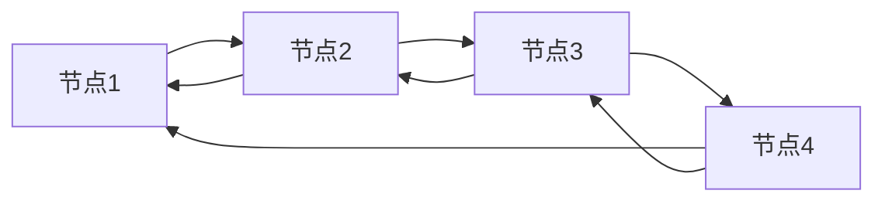

# C++ List 容器

## 什么是List容器？

List容器是C++ STL(标准模板库)中提供的一种序列式容器，它实现了一个双向链表(doubly linked list)。与vector等基于数组的容器不同，list容器中的元素在内存中并不是连续存储的，而是通过指针相互连接形成链表结构。

:::note
List容器的每个元素都包含一个值和两个指针，这两个指针分别指向前一个元素和后一个元素。
:::



## List的特点

List容器与其他STL容器相比具有以下特点：

1. **高效的插入和删除操作**：在list的任何位置插入或删除元素都是常数时间O(1)的操作。
2. **不支持随机访问**：不能像数组那样通过下标直接访问元素，必须通过迭代器逐个遍历。
3. **占用空间较大**：由于需要存储前后指针，所以比vector等容器占用更多内存。
4. **不支持元素排序的随机访问算法**：如`std::sort`，但提供了自己的排序方法`sort()`。

## 如何使用List容器

### 包含必要的头文件

```cpp
#include <list>
#include <iostream>
```

### 创建List容器

```cpp
// 创建一个空的整型list
std::list<int> myList;

// 创建具有5个元素的list，每个元素都初始化为100
std::list<int> myList2(5, 100);

// 使用初始化列表创建list
std::list<int> myList3 = {1, 2, 3, 4, 5};

// 使用另一个list初始化
std::list<int> myList4(myList3);
```

### 基本操作

#### 添加元素

```cpp
std::list<int> myList;

// 在末尾添加元素
myList.push_back(10);
myList.push_back(20);

// 在开头添加元素
myList.push_front(5);

// 在指定位置插入元素
auto it = myList.begin();
++it; // 移动到第二个元素
myList.insert(it, 15);
```

执行上述代码后，myList的内容为：`5, 15, 10, 20`

#### 删除元素

```cpp
std::list<int> myList = {1, 2, 3, 4, 5};

// 删除第一个元素
myList.pop_front();

// 删除最后一个元素
myList.pop_back();

// 删除特定值的元素
myList.remove(3);

// 使用条件删除元素
myList.remove_if([](int n){ return n % 2 == 0; }); // 删除所有偶数
```

执行上述代码后，myList的内容为：`5`（只剩下5）

#### 访问元素

```cpp
std::list<int> myList = {10, 20, 30, 40, 50};

// 访问第一个元素
int first = myList.front();

// 访问最后一个元素
int last = myList.back();

// 通过迭代器访问元素
for (auto it = myList.begin(); it != myList.end(); ++it) {
    std::cout << *it << " ";
}
```

输出：
```
10 20 30 40 50
```

#### 其他常用操作

```cpp
std::list<int> myList = {3, 7, 9, 2, 5, 8, 1, 6, 4};

// 获取list大小
size_t size = myList.size();
std::cout << "List size: " << size << std::endl;

// 检查list是否为空
bool isEmpty = myList.empty();
std::cout << "Is list empty? " << (isEmpty ? "Yes" : "No") << std::endl;

// 清空list
myList.clear();

// 为list重新分配元素
myList.assign(5, 10); // 5个值为10的元素
```

输出：
```
List size: 9
Is list empty? No
```

### List的特殊操作

List容器提供了一些其他容器没有的特殊操作：

#### 排序

```cpp
std::list<int> myList = {5, 2, 9, 1, 7, 3};

// 升序排序
myList.sort();

std::cout << "Sorted list: ";
for (const auto& elem : myList) {
    std::cout << elem << " ";
}
std::cout << std::endl;

// 使用自定义比较函数降序排序
myList.sort([](int a, int b) { return a > b; });

std::cout << "Reverse sorted list: ";
for (const auto& elem : myList) {
    std::cout << elem << " ";
}
std::cout << std::endl;
```

输出：
```
Sorted list: 1 2 3 5 7 9
Reverse sorted list: 9 7 5 3 2 1
```

#### 合并两个有序list

```cpp
std::list<int> list1 = {1, 3, 5, 7};
std::list<int> list2 = {2, 4, 6, 8};

// 合并两个有序list（两个list必须已排序）
list1.merge(list2);

std::cout << "Merged list: ";
for (const auto& elem : list1) {
    std::cout << elem << " ";
}
std::cout << std::endl;

// list2现在为空
std::cout << "Size of list2 after merge: " << list2.size() << std::endl;
```

输出：
```
Merged list: 1 2 3 4 5 6 7 8
Size of list2 after merge: 0
```

#### 反转list

```cpp
std::list<int> myList = {1, 2, 3, 4, 5};

// 反转list
myList.reverse();

std::cout << "Reversed list: ";
for (const auto& elem : myList) {
    std::cout << elem << " ";
}
std::cout << std::endl;
```

输出：
```
Reversed list: 5 4 3 2 1
```

#### 删除重复元素

```cpp
std::list<int> myList = {1, 2, 2, 3, 3, 3, 4, 5, 5};

// 删除连续的重复元素（list必须已排序）
myList.unique();

std::cout << "After removing duplicates: ";
for (const auto& elem : myList) {
    std::cout << elem << " ";
}
std::cout << std::endl;
```

输出：
```
After removing duplicates: 1 2 3 4 5
```

## 实际应用场景

### 场景1：任务队列管理

在需要频繁在两端插入和删除元素的情况下，list是一个很好的选择：

```cpp
#include <list>
#include <iostream>
#include <string>

class TaskManager {
private:
    std::list<std::string> taskQueue;

public:
    void addUrgentTask(const std::string& task) {
        taskQueue.push_front(task);
        std::cout << "Added urgent task: " << task << std::endl;
    }

    void addRegularTask(const std::string& task) {
        taskQueue.push_back(task);
        std::cout << "Added regular task: " << task << std::endl;
    }

    void executeNextTask() {
        if (!taskQueue.empty()) {
            std::cout << "Executing task: " << taskQueue.front() << std::endl;
            taskQueue.pop_front();
        } else {
            std::cout << "No tasks to execute." << std::endl;
        }
    }

    void displayAllTasks() {
        if (taskQueue.empty()) {
            std::cout << "No tasks in the queue." << std::endl;
            return;
        }

        std::cout << "Current tasks in the queue:" << std::endl;
        int index = 1;
        for (const auto& task : taskQueue) {
            std::cout << index++ << ". " << task << std::endl;
        }
    }
};

int main() {
    TaskManager manager;
    
    manager.addRegularTask("Send email");
    manager.addRegularTask("Update database");
    manager.addUrgentTask("Fix critical bug");
    
    manager.displayAllTasks();
    
    manager.executeNextTask();
    manager.executeNextTask();
    
    manager.displayAllTasks();
    
    return 0;
}
```

输出：
```
Added regular task: Send email
Added regular task: Update database
Added urgent task: Fix critical bug
Current tasks in the queue:
1. Fix critical bug
2. Send email
3. Update database
Executing task: Fix critical bug
Executing task: Send email
Current tasks in the queue:
1. Update database
```

### 场景2：多项式表示

list可以用来表示和操作多项式：

```cpp
#include <list>
#include <iostream>
#include <utility> // for std::pair

class Polynomial {
private:
    // 每个元素是一个(指数,系数)对
    std::list<std::pair<int, int>> terms;

public:
    // 添加一项到多项式
    void addTerm(int coefficient, int exponent) {
        if (coefficient == 0) return; // 系数为0不添加
        
        auto it = terms.begin();
        // 找到合适的位置插入（按指数降序）
        while (it != terms.end() && it->first > exponent) {
            ++it;
        }
        
        // 如果指数已存在，则合并系数
        if (it != terms.end() && it->first == exponent) {
            it->second += coefficient;
            // 如果合并后系数为0，则移除该项
            if (it->second == 0) {
                terms.erase(it);
            }
        } else {
            terms.insert(it, std::make_pair(exponent, coefficient));
        }
    }

    // 显示多项式
    void display() const {
        if (terms.empty()) {
            std::cout << "0" << std::endl;
            return;
        }

        bool isFirst = true;
        for (const auto& term : terms) {
            if (term.second > 0 && !isFirst) {
                std::cout << " + ";
            } else if (term.second < 0 && !isFirst) {
                std::cout << " - ";
            } else if (term.second < 0) {
                std::cout << "-";
            }

            int absCoeff = std::abs(term.second);
            if (absCoeff != 1 || term.first == 0) {
                std::cout << absCoeff;
            }
            
            if (term.first > 0) {
                std::cout << "x";
                if (term.first > 1) {
                    std::cout << "^" << term.first;
                }
            }
            
            isFirst = false;
        }
        std::cout << std::endl;
    }
};

int main() {
    Polynomial poly;
    
    poly.addTerm(3, 4); // 3x^4
    poly.addTerm(-2, 2); // -2x^2
    poly.addTerm(1, 1); // x
    poly.addTerm(5, 0); // 5
    
    std::cout << "Polynomial: ";
    poly.display();
    
    // 修改多项式
    poly.addTerm(2, 2); // 将抵消之前的-2x^2
    poly.addTerm(7, 4); // 将与3x^4合并为10x^4
    
    std::cout << "Modified polynomial: ";
    poly.display();
    
    return 0;
}
```

输出：
```
Polynomial: 3x^4 - 2x^2 + x + 5
Modified polynomial: 10x^4 + x + 5
```

## List容器的性能特点

为了更好地理解何时应该选择list容器，以下是list与vector性能比较的表格：

| 操作 | list | vector |
|------|------|--------|
| 随机访问元素 | O(n) | O(1) |
| 在开头插入/删除 | O(1) | O(n) |
| 在结尾插入/删除 | O(1) | 平均O(1) |
| 在中间插入/删除 | O(1) | O(n) |
| 内存开销 | 较高 | 较低 |

:::tip
选择list还是vector取决于你的应用程序需求：
- 如果需要频繁插入和删除元素，特别是在容器中间，选择list
- 如果需要随机访问元素或者内存连续性，选择vector
:::

## 总结

C++ STL的list容器提供了双向链表的实现，它支持高效的插入和删除操作，但不支持随机访问。list在需要频繁插入、删除且不需要随机访问的场景中表现出色。

关键特性回顾：
1. 实现了双向链表数据结构
2. 支持常数时间的插入和删除操作
3. 提供了特殊的操作，如sort()、merge()、unique()等
4. 对迭代器的支持稳定（插入和删除操作不会导致已存在的迭代器失效，除非指向被删除的元素）
5. 内存占用比vector等容器更高

## 练习题

1. 创建一个list，将1到10的整数添加到list中，然后删除所有奇数。
2. 创建两个已排序的list，然后将它们合并成一个仍然有序的list。
3. 创建一个包含重复元素的list，并使用unique()函数删除重复元素。
4. 编写一个函数，接受一个list并将其反转，但不使用list的reverse()方法。
5. 实现一个简单的音乐播放列表，使用list来存储歌曲，并支持添加、删除和播放操作。

## 延伸阅读

- C++ STL的其他容器（如deque、vector、forward_list）
- list与其他容器的性能比较与适用场景分析
- C++中更高级的list操作，如splice()和自定义分配器

通过理解和掌握list容器，你将能够更有效地解决需要频繁插入和删除操作的编程问题，并为你的C++工具箱增添一个强大的数据结构。