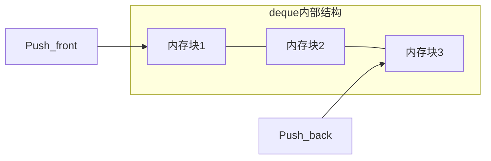

# C++ deque

## 什么是deque？

deque（double-ended queue，双端队列）是C++ STL中提供的一种容器，它允许在容器的两端进行高效的插入和删除操作。与vector不同，deque不要求其元素在内存中连续存储，这使得它在两端进行元素插入和删除时比vector更高效。

:::tip 重点提示
deque 的发音通常为"deck"，而非"de-queue"。
:::

## deque的特性

deque容器具有以下主要特性：

1. **双端操作**：可以在容器的两端（头部和尾部）进行快速插入和删除操作，时间复杂度为O(1)
2. **随机访问**：支持通过索引随机访问元素，时间复杂度为O(1)
3. **动态大小**：与vector类似，deque可以动态增长和缩小
4. **内存分配**：deque通常使用多个固定大小的内存块来存储元素，而不是单个大块连续内存



## 如何使用deque

### 包含头文件

要使用deque，首先需要包含相应的头文件：

```cpp
#include <deque>
```

### 创建deque对象

```cpp
// 创建一个存储int类型的空deque
std::deque<int> dq1;

// 创建一个包含5个元素，每个元素值为10的deque
std::deque<int> dq2(5, 10);

// 使用初始化列表创建deque
std::deque<int> dq3 = {1, 2, 3, 4, 5};

// 从另一个deque复制创建
std::deque<int> dq4(dq3);
```

### 基本操作

deque提供了丰富的成员函数用于访问和修改其元素：

#### 在两端插入和删除元素

```cpp
#include <iostream>
#include <deque>

int main() {
    std::deque<int> dq;
    
    // 在尾部添加元素
    dq.push_back(10);
    dq.push_back(20);
    
    // 在头部添加元素
    dq.push_front(5);
    dq.push_front(1);
    
    // 此时deque中的元素为: 1, 5, 10, 20
    
    // 删除头部元素
    dq.pop_front();
    
    // 删除尾部元素
    dq.pop_back();
    
    // 此时deque中的元素为: 5, 10
    
    for (int num : dq) {
        std::cout << num << " ";
    }
    // 输出: 5 10
    
    return 0;
}
```

#### 访问元素

```cpp
#include <iostream>
#include <deque>

int main() {
    std::deque<int> dq = {10, 20, 30, 40, 50};
    
    // 访问第一个元素
    std::cout << "第一个元素: " << dq.front() << std::endl;
    // 输出: 第一个元素: 10
    
    // 访问最后一个元素
    std::cout << "最后一个元素: " << dq.back() << std::endl;
    // 输出: 最后一个元素: 50
    
    // 使用下标访问元素
    std::cout << "第三个元素: " << dq[2] << std::endl;
    // 输出: 第三个元素: 30
    
    // 使用at()方法访问元素(带边界检查)
    try {
        std::cout << "第四个元素: " << dq.at(3) << std::endl;
        std::cout << "第六个元素: " << dq.at(5) << std::endl; // 这会抛出异常
    } catch (const std::out_of_range& e) {
        std::cout << "发生越界访问: " << e.what() << std::endl;
    }
    
    return 0;
}
```

#### 其他常用操作

```cpp
#include <iostream>
#include <deque>

int main() {
    std::deque<int> dq;
    
    // 检查deque是否为空
    if (dq.empty()) {
        std::cout << "deque是空的" << std::endl;
    }
    
    // 添加元素
    dq.push_back(10);
    dq.push_back(20);
    dq.push_back(30);
    
    // 获取deque大小
    std::cout << "deque大小: " << dq.size() << std::endl;
    // 输出: deque大小: 3
    
    // 在特定位置插入元素
    auto it = dq.begin() + 1;  // 指向第二个元素的迭代器
    dq.insert(it, 15);  // 在第二个元素前插入15
    
    // 此时deque中的元素为: 10, 15, 20, 30
    
    // 删除特定位置的元素
    it = dq.begin() + 2;  // 指向第三个元素的迭代器
    dq.erase(it);  // 删除第三个元素(20)
    
    // 此时deque中的元素为: 10, 15, 30
    
    // 遍历并打印所有元素
    for (int num : dq) {
        std::cout << num << " ";
    }
    std::cout << std::endl;
    // 输出: 10 15 30
    
    // 清空deque
    dq.clear();
    std::cout << "清空后大小: " << dq.size() << std::endl;
    // 输出: 清空后大小: 0
    
    return 0;
}
```

## deque vs vector

虽然deque和vector都是序列容器，但它们之间存在一些重要的区别：

| 特性 | deque | vector |
|------|-------|--------|
| 内存布局 | 多个内存块 | 单一连续内存块 |
| 头部插入/删除 | O(1) | O(n) |
| 尾部插入/删除 | O(1) | 均摊O(1)，最坏O(n) |
| 中间插入/删除 | O(n) | O(n) |
| 随机访问 | O(1)，但比vector慢 | O(1) |
| 内存管理 | 较复杂，开销稍大 | 较简单 |

:::caution 注意
虽然deque提供了类似vector的功能，但由于其内部结构复杂，在某些操作上可能比vector慢一些。选择使用哪种容器应该基于具体的使用场景。
:::

## 实际应用场景

### 1. 实现滑动窗口

deque非常适合实现滑动窗口算法，因为它能够在两端高效地添加和删除元素：

```cpp
#include <iostream>
#include <deque>
#include <vector>

// 计算给定数组中大小为k的窗口的最大值
std::vector<int> maxSlidingWindow(const std::vector<int>& nums, int k) {
    std::vector<int> result;
    std::deque<int> dq;  // 存储索引
    
    for (int i = 0; i < nums.size(); i++) {
        // 移除窗口外的元素（保持窗口大小为k）
        if (!dq.empty() && dq.front() == i - k) {
            dq.pop_front();
        }
        
        // 移除队列中比当前元素小的元素（它们不可能是窗口最大值）
        while (!dq.empty() && nums[dq.back()] < nums[i]) {
            dq.pop_back();
        }
        
        // 将当前元素索引加入队列
        dq.push_back(i);
        
        // 当窗口形成后，添加结果
        if (i >= k - 1) {
            result.push_back(nums[dq.front()]);
        }
    }
    
    return result;
}

int main() {
    std::vector<int> nums = {1, 3, -1, -3, 5, 3, 6, 7};
    int k = 3;
    
    std::vector<int> result = maxSlidingWindow(nums, k);
    
    std::cout << "滑动窗口的最大值: ";
    for (int num : result) {
        std::cout << num << " ";
    }
    std::cout << std::endl;
    // 输出: 滑动窗口的最大值: 3 3 5 5 6 7
    
    return 0;
}
```

### 2. 实现简单的Web浏览器历史记录

deque可以很好地用于实现Web浏览器的前进和后退功能：

```cpp
#include <iostream>
#include <deque>
#include <string>

class BrowserHistory {
private:
    std::deque<std::string> history;
    int currentPos;

public:
    BrowserHistory(const std::string& homepage) {
        history.push_back(homepage);
        currentPos = 0;
    }
    
    void visit(const std::string& url) {
        // 清除当前位置之后的所有历史记录
        while (history.size() > currentPos + 1) {
            history.pop_back();
        }
        
        // 添加新的URL
        history.push_back(url);
        currentPos++;
    }
    
    std::string back(int steps) {
        int actualSteps = std::min(steps, currentPos);
        currentPos -= actualSteps;
        return history[currentPos];
    }
    
    std::string forward(int steps) {
        int maxSteps = history.size() - currentPos - 1;
        int actualSteps = std::min(steps, maxSteps);
        currentPos += actualSteps;
        return history[currentPos];
    }
    
    void printHistory() {
        std::cout << "浏览历史：";
        for (size_t i = 0; i < history.size(); i++) {
            std::cout << history[i];
            if (i == currentPos) {
                std::cout << "*"; // 标记当前位置
            }
            if (i < history.size() - 1) {
                std::cout << " -> ";
            }
        }
        std::cout << std::endl;
    }
};

int main() {
    BrowserHistory browser("homepage.com");
    browser.printHistory();
    
    browser.visit("google.com");
    browser.visit("facebook.com");
    browser.visit("youtube.com");
    browser.printHistory();
    
    std::cout << "后退一步: " << browser.back(1) << std::endl;
    browser.printHistory();
    
    std::cout << "前进一步: " << browser.forward(1) << std::endl;
    browser.printHistory();
    
    browser.visit("github.com");
    browser.printHistory();
    
    return 0;
}
```

### 3. 任务队列

deque可以用来实现一个简单的任务队列，支持优先任务插入到队列前端：

```cpp
#include <iostream>
#include <deque>
#include <string>
#include <thread>
#include <mutex>
#include <condition_variable>
#include <chrono>

class TaskQueue {
private:
    std::deque<std::string> tasks;
    std::mutex mtx;
    std::condition_variable cv;
    bool stop;

public:
    TaskQueue() : stop(false) {}
    
    void addTask(const std::string& task) {
        {
            std::lock_guard<std::mutex> lock(mtx);
            tasks.push_back(task);
            std::cout << "添加普通任务: " << task << std::endl;
        }
        cv.notify_one();
    }
    
    void addPriorityTask(const std::string& task) {
        {
            std::lock_guard<std::mutex> lock(mtx);
            tasks.push_front(task);
            std::cout << "添加优先任务: " << task << std::endl;
        }
        cv.notify_one();
    }
    
    std::string getTask() {
        std::unique_lock<std::mutex> lock(mtx);
        cv.wait(lock, [this] { return !tasks.empty() || stop; });
        
        if (stop && tasks.empty()) {
            return "";
        }
        
        std::string task = tasks.front();
        tasks.pop_front();
        return task;
    }
    
    void shutdown() {
        {
            std::lock_guard<std::mutex> lock(mtx);
            stop = true;
        }
        cv.notify_all();
    }
};

void workerFunction(TaskQueue& queue, int workerId) {
    while (true) {
        std::string task = queue.getTask();
        if (task.empty()) {
            std::cout << "工作线程 " << workerId << " 退出" << std::endl;
            break;
        }
        
        std::cout << "工作线程 " << workerId << " 执行任务: " << task << std::endl;
        // 模拟任务处理时间
        std::this_thread::sleep_for(std::chrono::milliseconds(500));
    }
}

int main() {
    TaskQueue taskQueue;
    
    // 创建工作线程
    std::thread worker1(workerFunction, std::ref(taskQueue), 1);
    std::thread worker2(workerFunction, std::ref(taskQueue), 2);
    
    // 添加一些任务
    taskQueue.addTask("普通任务 1");
    taskQueue.addTask("普通任务 2");
    taskQueue.addPriorityTask("紧急任务!");
    taskQueue.addTask("普通任务 3");
    taskQueue.addPriorityTask("又一个紧急任务!");
    
    // 等待一段时间让任务处理
    std::this_thread::sleep_for(std::chrono::seconds(5));
    
    // 关闭队列
    taskQueue.shutdown();
    
    // 等待工作线程结束
    worker1.join();
    worker2.join();
    
    return 0;
}
```

## 总结

deque是C++ STL中一个非常有用的容器，它提供了在两端高效操作的能力，同时保持了随机访问的特性。主要优势包括：

1. 在两端进行O(1)时间复杂度的插入和删除操作
2. 随机访问元素
3. 不需要连续内存空间，能更好地处理大量元素

相比vector，当需要频繁在容器开头插入或删除元素时，deque是更好的选择。而相比list，deque提供了更高效的随机访问能力。

deque适用于需要双端操作的场景，如任务队列、滑动窗口算法、浏览历史记录等应用。

## 练习题

1. 使用deque实现一个简单的回文检查器，检查一个字符串是否为回文。
2. 实现一个基于deque的简单计算器，支持撤销操作。
3. 使用deque实现约瑟夫环问题（Josephus problem）。
4. 编写一个程序，使用deque维护一个固定大小的最新数据缓冲区。

## 进一步学习资源

- C++参考文档：[cppreference - deque](https://en.cppreference.com/w/cpp/container/deque)
- 《C++ Primer》第9章：顺序容器
- 《Effective STL》Item 16：了解如何将vector和string数据传给旧式API
- 《STL源码剖析》第4章：序列式容器

通过本教程，你应该已经对C++ deque容器有了全面的了解，并且能够在实际编程中灵活运用它。继续练习和探索，将帮助你更深入地掌握这个重要的STL容器。