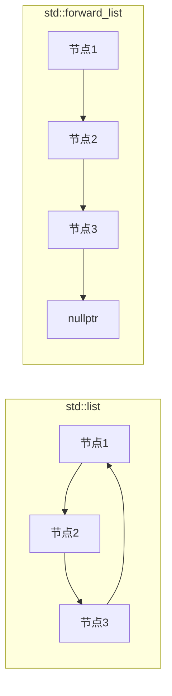

# forward_list 单向链表

## 什么是 forward_list？

`std::forward_list` 是 C++11 引入的一种单向链表容器，它提供了一个高效的单链表数据结构。与 `std::list`（双向链表）相比，`forward_list` 只能从前向后遍历，没有反向遍历的能力，但内存占用更小，在某些场景下性能更佳。

:::note
`forward_list` 设计的主要目标是将C风格单链表的性能特性带入C++标准库，同时提供现代C++的安全性和便利性。
:::

## forward_list 的基本特性

- **单向遍历**：只能从头到尾遍历
- **无大小操作**：不提供 `size()` 方法（获取大小需要O(n)时间）
- **插入和删除高效**：在已知位置插入和删除元素的时间复杂度为O(1)
- **不支持随机访问**：必须遍历到特定位置才能访问元素
- **内存高效**：每个节点只需存储一个"下一个"指针，比双向链表节省内存

## 基本用法

### 包含头文件

```cpp
#include <forward_list>
```

### 创建和初始化

```cpp
// 创建空的forward_list
std::forward_list<int> list1;

// 使用初始化列表创建
std::forward_list<int> list2 = {1, 2, 3, 4, 5};

// 创建包含n个相同元素的forward_list
std::forward_list<std::string> list3(5, "hello");

// 从另一个forward_list复制
std::forward_list<int> list4 = list2;
```

### 基本操作

以下是一些 `forward_list` 常用的操作：

```cpp
#include <iostream>
#include <forward_list>

int main() {
    std::forward_list<int> myList = {10, 20, 30, 40, 50};
    
    // 在开头插入元素
    myList.push_front(5);
    
    // 遍历并打印列表
    std::cout << "List contents: ";
    for (const auto& element : myList) {
        std::cout << element << " ";
    }
    std::cout << std::endl;
    
    // 从开头移除元素
    myList.pop_front();
    
    // 检查是否为空
    if (!myList.empty()) {
        std::cout << "First element: " << myList.front() << std::endl;
    }
    
    // 清空整个列表
    myList.clear();
    
    return 0;
}
```

输出：
```
List contents: 5 10 20 30 40 50 
First element: 10
```

## 特殊操作和方法

### 插入操作

由于 `forward_list` 是单向链表，插入操作需要特别注意。对于中间位置的插入，它提供了 `insert_after` 系列函数：

```cpp
#include <iostream>
#include <forward_list>
#include <string>

int main() {
    std::forward_list<std::string> languages = {"Python", "Java", "JavaScript"};
    
    // 获取指向第一个元素的迭代器
    auto it = languages.begin();
    
    // 在"Python"之后插入"C++"
    languages.insert_after(it, "C++");
    
    // 打印结果
    std::cout << "Programming languages: ";
    for (const auto& lang : languages) {
        std::cout << lang << " ";
    }
    std::cout << std::endl;
    
    return 0;
}
```

输出：
```
Programming languages: Python C++ Java JavaScript 
```

### 使用 before_begin

`forward_list` 提供了一个特殊的迭代器 `before_begin()`，它指向第一个元素之前的位置，用于在列表开头插入元素：

```cpp
std::forward_list<int> numbers = {2, 3, 4};

// 在列表开头插入1
numbers.insert_after(numbers.before_begin(), 1);

// 现在numbers包含：1, 2, 3, 4
```

### 合并和拼接操作

`forward_list` 提供了高效的合并和拼接操作：

```cpp
#include <iostream>
#include <forward_list>
#include <algorithm>

int main() {
    std::forward_list<int> list1 = {1, 3, 5, 7};
    std::forward_list<int> list2 = {2, 4, 6, 8};
    
    // 确保两个列表都是已排序的
    list1.sort();
    list2.sort();
    
    // 合并两个有序列表
    list1.merge(list2);
    
    std::cout << "Merged list: ";
    for (int n : list1) {
        std::cout << n << " ";
    }
    std::cout << std::endl;
    
    // 注意：merge操作后list2将为空
    std::cout << "Is list2 empty? " << (list2.empty() ? "Yes" : "No") << std::endl;
    
    return 0;
}
```

输出：
```
Merged list: 1 2 3 4 5 6 7 8 
Is list2 empty? Yes
```

### 其他常用操作

```cpp
std::forward_list<int> myList = {3, 1, 4, 1, 5, 9, 2, 6};

// 排序
myList.sort();  // {1, 1, 2, 3, 4, 5, 6, 9}

// 移除指定值
myList.remove(1);  // 移除所有值为1的元素

// 按条件移除
myList.remove_if([](int n){ return n % 2 == 0; });  // 移除所有偶数

// 去重（要求已排序）
myList.unique();  // 移除连续的重复元素

// 反转
myList.reverse();  // 反转列表中的元素顺序
```

## forward_list 与 list 的比较



| 特性 | forward_list | list |
|------|--------------|------|
| 链接方向 | 单向 | 双向 |
| 内存消耗 | 更小 | 较大 |
| size()操作 | 不支持 | O(1)复杂度 |
| 反向迭代器 | 不支持 | 支持 |
| push_back() | 不支持 | 支持 |
| 在已知位置插入 | O(1) | O(1) |

## 实际应用场景

### 场景1：内存受限的嵌入式系统

在资源受限的嵌入式系统中，`forward_list` 比 `list` 更节省内存，是实现链表数据结构的首选：

```cpp
#include <forward_list>
#include <string>

struct LogEntry {
    std::string message;
    int priority;
};

class EmbeddedLogger {
private:
    std::forward_list<LogEntry> log_entries;
    int max_entries;
    int current_entries;

public:
    EmbeddedLogger(int max) : max_entries(max), current_entries(0) {}
    
    void log(const std::string& message, int priority) {
        if (current_entries >= max_entries) {
            log_entries.pop_front();  // 移除最旧的日志
        } else {
            current_entries++;
        }
        log_entries.push_front({message, priority});
    }
    
    // 其他日志处理方法...
};
```

### 场景2：高频的头部操作

当你主要在列表的开头进行插入和删除操作时，`forward_list` 是理想选择：

```cpp
#include <forward_list>
#include <chrono>
#include <iostream>

int main() {
    const int OPERATIONS = 1000000;
    
    // 使用forward_list
    std::forward_list<int> fl;
    auto start = std::chrono::high_resolution_clock::now();
    
    for (int i = 0; i < OPERATIONS; ++i) {
        fl.push_front(i);
    }
    
    auto end = std::chrono::high_resolution_clock::now();
    std::chrono::duration<double, std::milli> fl_duration = end - start;
    
    std::cout << "forward_list插入" << OPERATIONS 
              << "个元素用时: " << fl_duration.count() << " ms\n";
    
    return 0;
}
```

## 性能考量

使用 `forward_list` 时需要记住以下几点：

1. **没有 size() 方法**：如果你需要频繁获取列表大小，可能需要自己维护一个计数器或使用 `std::list`。

2. **无法从尾部添加元素**：如果需要频繁的尾部操作，`forward_list` 不是好选择。

3. **只能单向遍历**：这意味着某些算法可能实现起来不如使用 `std::list` 方便。

4. **查找元素需要线性时间**：与所有链表一样，查找特定元素需要O(n)时间。

:::tip 性能优化
当需要在特定位置前插入元素时，可以记住前一个位置的迭代器，避免重新遍历链表。
:::

## 总结

`std::forward_list` 是C++11添加的单向链表容器，它提供了一种内存效率高、适合单向遍历的数据结构。它的主要优势是：

- 内存开销比 `std::list` 小
- 在列表头部操作非常高效
- 在已知位置插入和删除元素的时间复杂度为O(1)

但也有一些限制：

- 只能从头到尾遍历
- 没有 `size()` 方法
- 不支持尾部操作

在选择容器时，如果你主要进行头部操作，并且内存效率重要，那么 `forward_list` 是一个很好的选择。如果你需要双向遍历或频繁访问容器大小，那么 `std::list` 可能更适合。

## 练习题

1. 实现一个函数，将两个已排序的 `forward_list` 合并为一个新的已排序 `forward_list`。
2. 编写一个程序，使用 `forward_list` 实现简单的多项式表示和多项式加法。
3. 使用 `forward_list` 实现一个简单的LRU缓存。
4. 比较 `forward_list` 和 `vector` 在不同操作下的性能差异。

## 进一步学习资源

- [C++ Reference - forward_list](https://en.cppreference.com/w/cpp/container/forward_list)
- 《Effective STL》 by Scott Meyers
- 《The C++ Standard Library》by Nicolai M. Josuttis