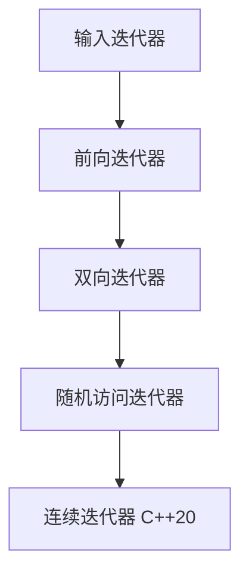

# C++ 迭代器基础

## 什么是迭代器

迭代器是C++标准模板库(STL)中最重要的概念之一，它提供了一种访问容器内元素的统一方式。可以把迭代器理解为指向容器元素的指针，通过迭代器，我们可以遍历容器中的元素，而无需关心容器的内部实现细节。

:::note
迭代器桥接了算法与容器之间的关系，使得我们可以用相同的方式处理不同类型的容器。
:::

## 迭代器的作用

迭代器在C++编程中发挥着关键作用：

1. **提供统一接口**：不同容器可以使用相同的遍历方式
2. **支持泛型编程**：允许编写与容器类型无关的通用代码
3. **实现算法与容器的分离**：STL算法通过迭代器操作容器元素

## 迭代器的类型

C++ STL中定义了几种不同类型的迭代器，按照功能从弱到强排序：



1. **输入迭代器**：只读，单遍扫描，只能递增
2. **输出迭代器**：只写，单遍扫描，只能递增
3. **前向迭代器**：可读写，多遍扫描，只能递增
4. **双向迭代器**：可读写，多遍扫描，可递增递减
5. **随机访问迭代器**：可读写，多遍扫描，支持随机访问和迭代器算术
6. **连续迭代器**（C++20）：随机访问迭代器的增强版，保证物理存储连续

## 常见容器的迭代器类型

| 容器 | 迭代器类型 |
|------|------------|
| `vector` | 随机访问迭代器 |
| `deque` | 随机访问迭代器 |
| `list` | 双向迭代器 |
| `set/map` | 双向迭代器 |
| `unordered_set/unordered_map` | 前向迭代器 |

## 迭代器的基本操作

### 声明迭代器

```cpp
// 使用auto (C++11及以后)
auto it = container.begin();

// 显式声明
std::vector<int>::iterator it = vec.begin();
std::list<std::string>::iterator strListIt = stringList.begin();
```

### 基本迭代器操作

| 操作 | 描述 |
|------|------|
| `*iter` | 解引用迭代器，访问元素值 |
| `iter->member` | 访问元素的成员 |
| `++iter` / `iter++` | 迭代器前进到下一个元素 |
| `--iter` / `iter--` | 迭代器后退到前一个元素（双向及随机访问迭代器） |
| `iter1 == iter2` | 检查两个迭代器是否相等 |
| `iter1 != iter2` | 检查两个迭代器是否不相等 |

### 随机访问迭代器的额外操作

```cpp
iter + n       // 向前移动n个位置
iter - n       // 向后移动n个位置
iter1 - iter2  // 计算两个迭代器之间的距离
iter[n]        // 访问迭代器当前位置之后的第n个元素
iter1 < iter2  // 比较迭代器位置
iter1 <= iter2
iter1 > iter2
iter1 >= iter2
```

## 容器提供的迭代器函数

大多数STL容器提供以下迭代器相关函数：

- `begin()`: 返回指向容器第一个元素的迭代器
- `end()`: 返回指向容器"末尾后"位置的迭代器
- `rbegin()`: 返回指向容器最后一个元素的反向迭代器
- `rend()`: 返回指向容器"开始前"位置的反向迭代器

C++11后增加了：
- `cbegin()`, `cend()`: 返回常量迭代器（不能修改元素）
- `crbegin()`, `crend()`: 返回常量反向迭代器

## 使用迭代器的示例

### 基本遍历

```cpp
#include <iostream>
#include <vector>

int main() {
    std::vector<int> numbers = {1, 2, 3, 4, 5};
    
    // 使用迭代器遍历并打印容器内容
    std::cout << "Vector elements: ";
    for (std::vector<int>::iterator it = numbers.begin(); it != numbers.end(); ++it) {
        std::cout << *it << " ";
    }
    std::cout << std::endl;
    
    return 0;
}
```

**输出：**
```
Vector elements: 1 2 3 4 5
```

### 使用auto关键字（C++11及以后）

```cpp
#include <iostream>
#include <vector>

int main() {
    std::vector<int> numbers = {1, 2, 3, 4, 5};
    
    // 使用auto关键字简化迭代器声明
    std::cout << "Vector elements: ";
    for (auto it = numbers.begin(); it != numbers.end(); ++it) {
        std::cout << *it << " ";
    }
    std::cout << std::endl;
    
    return 0;
}
```

### 使用范围for循环（C++11及以后）

```cpp
#include <iostream>
#include <vector>

int main() {
    std::vector<int> numbers = {1, 2, 3, 4, 5};
    
    // 使用范围for循环（内部使用了迭代器）
    std::cout << "Vector elements: ";
    for (const auto& num : numbers) {
        std::cout << num << " ";
    }
    std::cout << std::endl;
    
    return 0;
}
```

### 修改容器元素

```cpp
#include <iostream>
#include <vector>

int main() {
    std::vector<int> numbers = {1, 2, 3, 4, 5};
    
    // 使用迭代器修改元素
    for (auto it = numbers.begin(); it != numbers.end(); ++it) {
        *it *= 2; // 将每个元素乘以2
    }
    
    // 打印修改后的元素
    std::cout << "Modified elements: ";
    for (const auto& num : numbers) {
        std::cout << num << " ";
    }
    std::cout << std::endl;
    
    return 0;
}
```

**输出：**
```
Modified elements: 2 4 6 8 10
```

### 双向迭代器示例（使用list）

```cpp
#include <iostream>
#include <list>

int main() {
    std::list<int> myList = {10, 20, 30, 40, 50};
    
    // 正向遍历
    std::cout << "Forward: ";
    for (auto it = myList.begin(); it != myList.end(); ++it) {
        std::cout << *it << " ";
    }
    std::cout << std::endl;
    
    // 反向遍历（使用双向迭代器的特性）
    std::cout << "Backward: ";
    auto it = myList.end();
    while (it != myList.begin()) {
        --it;  // 先递减，因为end()指向末尾之后的位置
        std::cout << *it << " ";
    }
    std::cout << std::endl;
    
    return 0;
}
```

**输出：**
```
Forward: 10 20 30 40 50
Backward: 50 40 30 20 10
```

### 随机访问迭代器示例（使用vector）

```cpp
#include <iostream>
#include <vector>

int main() {
    std::vector<int> numbers = {10, 20, 30, 40, 50};
    
    // 获取迭代器
    auto it = numbers.begin();
    
    // 随机访问
    std::cout << "First element: " << *it << std::endl;
    std::cout << "Third element: " << *(it + 2) << std::endl;
    std::cout << "Last element: " << *(it + 4) << std::endl;
    
    // 迭代器算术
    auto mid = numbers.begin() + numbers.size() / 2;
    std::cout << "Middle element: " << *mid << std::endl;
    
    // 计算迭代器距离
    std::cout << "Distance from begin to mid: " 
              << mid - numbers.begin() << std::endl;
    
    return 0;
}
```

**输出：**
```
First element: 10
Third element: 30
Last element: 50
Middle element: 30
Distance from begin to mid: 2
```

## 迭代器失效

迭代器指向容器中的特定位置，但当容器结构发生变化时，迭代器可能失效。

:::warning
在修改容器结构时（如添加、删除元素），必须注意迭代器是否失效。使用已失效的迭代器会导致未定义行为。
:::

不同容器迭代器失效的情况：

- **vector/string**：插入元素可能导致所有迭代器失效（如果发生重新分配）；删除元素会使指向被删除元素及其后元素的迭代器失效
- **list/forward_list**：只有指向被删除元素的迭代器失效
- **deque**：在两端之外插入元素使所有迭代器失效；在两端插入只会使指向该端的迭代器失效
- **map/set**：插入操作不会使迭代器失效；删除元素只会使指向被删除元素的迭代器失效

### 迭代器失效示例

```cpp
#include <iostream>
#include <vector>

int main() {
    std::vector<int> numbers = {1, 2, 3, 4, 5};
    
    // 错误的删除方法（可能导致未定义行为）
    std::cout << "Incorrect removal (don't do this!):" << std::endl;
    
    /*
    // 此代码会导致问题
    for (auto it = numbers.begin(); it != numbers.end(); ++it) {
        if (*it % 2 == 0) {  // 删除偶数
            numbers.erase(it);  // 迭代器失效！
        }
    }
    */
    
    // 正确的删除方法
    std::cout << "Correct removal:" << std::endl;
    for (auto it = numbers.begin(); it != numbers.end();) {
        if (*it % 2 == 0) {
            it = numbers.erase(it);  // erase返回下一个有效的迭代器
        } else {
            ++it;
        }
    }
    
    // 打印结果
    std::cout << "After removal: ";
    for (const auto& num : numbers) {
        std::cout << num << " ";
    }
    std::cout << std::endl;
    
    return 0;
}
```

**输出：**
```
Correct removal:
After removal: 1 3 5
```

## 实际应用案例

### 案例1：使用迭代器实现自定义查找算法

```cpp
#include <iostream>
#include <vector>
#include <string>

// 自定义查找函数，返回迭代器
template <typename Iterator, typename T>
Iterator customFind(Iterator first, Iterator last, const T& value) {
    while (first != last) {
        if (*first == value) {
            return first;
        }
        ++first;
    }
    return last;  // 未找到时返回last
}

int main() {
    std::vector<int> numbers = {15, 27, 33, 45, 59};
    std::vector<std::string> fruits = {"apple", "banana", "orange", "grape"};
    
    // 在数字集合中查找
    auto numIt = customFind(numbers.begin(), numbers.end(), 33);
    if (numIt != numbers.end()) {
        std::cout << "Found number: " << *numIt << " at position: " 
                  << (numIt - numbers.begin()) << std::endl;
    } else {
        std::cout << "Number not found" << std::endl;
    }
    
    // 在字符串集合中查找
    auto strIt = customFind(fruits.begin(), fruits.end(), "orange");
    if (strIt != fruits.end()) {
        std::cout << "Found fruit: " << *strIt << " at position: " 
                  << (strIt - fruits.begin()) << std::endl;
    } else {
        std::cout << "Fruit not found" << std::endl;
    }
    
    return 0;
}
```

**输出：**
```
Found number: 33 at position: 2
Found fruit: orange at position: 2
```

### 案例2：使用迭代器连接两个容器

```cpp
#include <iostream>
#include <vector>
#include <list>
#include <iterator>

template <typename Container>
void printContainer(const Container& c, const std::string& name) {
    std::cout << name << ": ";
    for (const auto& item : c) {
        std::cout << item << " ";
    }
    std::cout << std::endl;
}

int main() {
    std::vector<int> vec = {1, 2, 3, 4, 5};
    std::list<int> lst = {10, 20, 30};
    
    printContainer(vec, "Vector before");
    printContainer(lst, "List before");
    
    // 将list中的元素插入到vector的末尾
    vec.insert(vec.end(), lst.begin(), lst.end());
    
    printContainer(vec, "Vector after");
    
    return 0;
}
```

**输出：**
```
Vector before: 1 2 3 4 5
List before: 10 20 30
Vector after: 1 2 3 4 5 10 20 30
```

## 总结

在这篇教程中，我们全面介绍了C++迭代器的基础知识：

- 迭代器是STL中连接容器和算法的桥梁
- 不同类型的迭代器具有不同的功能和限制
- 基本的迭代器操作包括解引用、递增递减、比较等
- STL容器提供了各种获取迭代器的方法
- 使用迭代器可以遍历、修改容器元素
- 需要注意迭代器失效问题

通过掌握迭代器的使用，你可以更高效地操作STL容器，编写更加灵活和通用的代码。

## 练习

1. 编写一个程序，使用迭代器反向打印一个`vector<int>`的内容。
2. 实现一个函数，接受一对迭代器和一个值，返回该值在范围内出现的次数。
3. 编写一个程序，删除`vector<int>`中所有奇数，使用正确的迭代器处理方法。
4. 使用迭代器合并两个已排序的`list<int>`，结果仍然有序。
5. 实现一个函数，接受一个`map<string, int>`的迭代器范围，打印出所有键值对。

## 进阶资源

如果你想深入了解迭代器，可以参考以下资源：

- C++ 标准库参考文档
- 《The C++ Standard Library》by Nicolai M. Josuttis
- 《Effective STL》by Scott Meyers