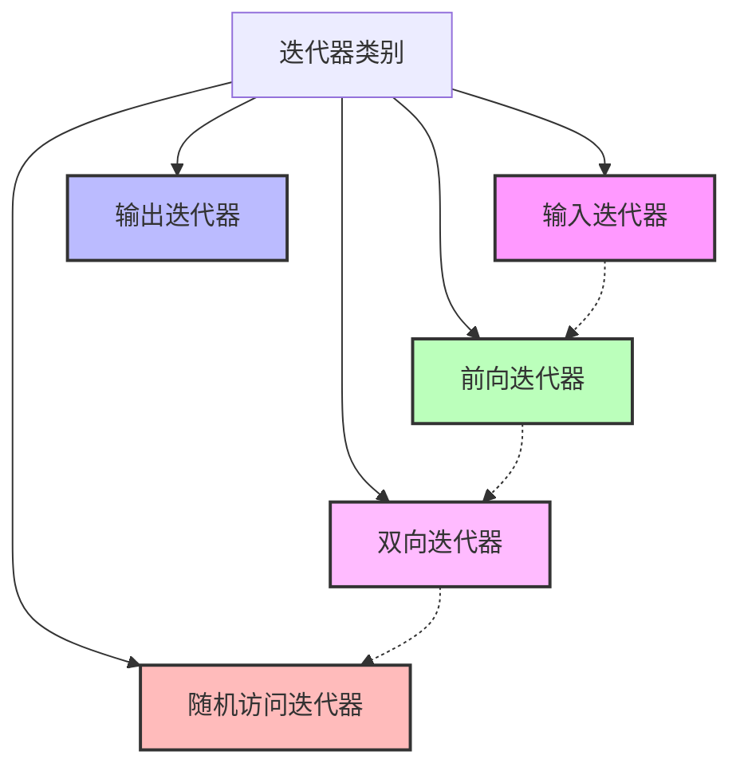

# C++ 迭代器类别

## 迭代器概述

在C++标准模板库(STL)中，迭代器是连接算法和容器的桥梁。它们提供了一种访问容器中元素的统一方式，使得算法可以不依赖于具体容器类型而工作。根据功能和特性的不同，C++将迭代器分为五个主要类别，每种类别都支持不同的操作集合。



## 五种迭代器类别

### 1. 输入迭代器（Input Iterator）

输入迭代器是最基础的迭代器类型，它支持从容器中读取数据并向前移动。

**特性：**
- 只能单次遍历容器
- 只读访问元素
- 支持相等/不相等比较
- 支持前缀和后缀递增操作
- 支持解引用操作（只读）

**典型用法：**

```cpp
#include <iostream>
#include <vector>

int main() {
    std::vector<int> numbers = {1, 2, 3, 4, 5};
    
    // 使用输入迭代器来读取元素
    std::vector<int>::iterator it = numbers.begin();
    while (it != numbers.end()) {
        std::cout << *it << " ";
        ++it;
    }
    // 输出: 1 2 3 4 5
    
    return 0;
}
```

### 2. 输出迭代器（Output Iterator）

输出迭代器允许向容器写入数据。它与输入迭代器正好相反。

**特性：**
- 只能单次遍历容器
- 只写访问元素
- 支持前缀和后缀递增操作
- 支持解引用操作（只写）

**典型用法：**

```cpp
#include <iostream>
#include <vector>
#include <iterator>

int main() {
    std::vector<int> numbers(5);
    
    // 使用输出迭代器向容器写入数据
    std::fill_n(numbers.begin(), 5, 10);
    
    // 输出结果验证
    for (int num : numbers) {
        std::cout << num << " ";
    }
    // 输出: 10 10 10 10 10
    
    return 0;
}
```

### 3. 前向迭代器（Forward Iterator）

前向迭代器结合了输入和输出迭代器的功能，可以多次遍历容器，但只能向前移动。

**特性：**
- 可多次遍历容器
- 支持读写访问元素
- 支持相等/不相等比较
- 支持前缀和后缀递增操作

**典型用法：**

```cpp
#include <iostream>
#include <forward_list>

int main() {
    std::forward_list<int> numbers = {1, 2, 3, 4, 5};
    
    // 使用前向迭代器读取和修改元素
    std::forward_list<int>::iterator it = numbers.begin();
    while (it != numbers.end()) {
        *it = *it * 2;  // 修改元素
        ++it;
    }
    
    // 再次遍历查看修改后的结果
    for (int num : numbers) {
        std::cout << num << " ";
    }
    // 输出: 2 4 6 8 10
    
    return 0;
}
```

### 4. 双向迭代器（Bidirectional Iterator）

双向迭代器在前向迭代器的基础上增加了向后移动的能力。

**特性：**
- 可多次遍历容器
- 支持读写访问元素
- 支持相等/不相等比较
- 支持前缀和后缀递增、递减操作

**典型用法：**

```cpp
#include <iostream>
#include <list>

int main() {
    std::list<int> numbers = {1, 2, 3, 4, 5};
    
    // 使用双向迭代器向前和向后移动
    std::list<int>::iterator it = numbers.begin();
    
    // 向前移动到末尾前一个元素
    ++it; ++it; ++it; ++it;  // 现在指向5
    
    // 向后移动
    std::cout << "向后遍历: ";
    while (it != numbers.begin()) {
        std::cout << *it << " ";
        --it;
    }
    std::cout << *it << std::endl;
    // 输出: 向后遍历: 5 4 3 2 1
    
    return 0;
}
```

### 5. 随机访问迭代器（Random Access Iterator）

随机访问迭代器是功能最强大的迭代器类型，它允许对容器中的任意元素进行直接访问。

**特性：**
- 支持双向迭代器的所有操作
- 支持迭代器算术运算（如加减操作）
- 支持迭代器与整数的加减运算
- 支持下标操作符 `[]`
- 支持关系运算符`（<, >, <=, >=）`

**典型用法：**

```cpp
#include <iostream>
#include <vector>

int main() {
    std::vector<int> numbers = {10, 20, 30, 40, 50};
    
    // 使用随机访问迭代器
    std::vector<int>::iterator it = numbers.begin();
    
    // 直接跳转到第三个元素
    it += 2;
    std::cout << "第三个元素: " << *it << std::endl;  // 输出: 30
    
    // 使用下标访问
    std::cout << "第四个元素: " << it[1] << std::endl;  // 输出: 40
    
    // 元素比较
    std::vector<int>::iterator it2 = numbers.begin();
    if (it > it2) {
        std::cout << "it指向的位置在it2之后" << std::endl;
    }
    
    // 计算两个迭代器之间的距离
    std::cout << "距离: " << it - it2 << std::endl;  // 输出: 2
    
    return 0;
}
```

## 容器与迭代器类别对应关系

下面是常见STL容器所支持的迭代器类别：

| 容器            | 迭代器类别       |
|-----------------|-----------------|
| vector          | 随机访问迭代器   |
| array           | 随机访问迭代器   |
| deque           | 随机访问迭代器   |
| list            | 双向迭代器       |
| forward_list    | 前向迭代器       |
| set/multiset    | 双向迭代器       |
| map/multimap    | 双向迭代器       |
| unordered_set   | 前向迭代器       |
| unordered_map   | 前向迭代器       |

:::tip
记住这个对应关系对于选择合适的算法和容器组合非常有帮助！
:::

## 实际应用场景

### 场景一：数据处理管道

假设我们需要处理一个整数列表：筛选出偶数，将它们乘以2，然后计算总和。

```cpp
#include <iostream>
#include <vector>
#include <algorithm>
#include <numeric>

int main() {
    std::vector<int> numbers = {1, 2, 3, 4, 5, 6, 7, 8, 9, 10};
    std::vector<int> evenNumbers;
    
    // 使用输出迭代器将偶数筛选到新容器
    std::copy_if(numbers.begin(), numbers.end(), 
                std::back_inserter(evenNumbers),
                [](int n) { return n % 2 == 0; });
    
    // 使用双向迭代器修改元素
    std::transform(evenNumbers.begin(), evenNumbers.end(), 
                  evenNumbers.begin(),
                  [](int n) { return n * 2; });
    
    // 使用输入迭代器计算总和
    int sum = std::accumulate(evenNumbers.begin(), evenNumbers.end(), 0);
    
    std::cout << "处理后的数组: ";
    for (int num : evenNumbers) {
        std::cout << num << " ";
    }
    std::cout << "\n总和: " << sum << std::endl;
    // 输出:
    // 处理后的数组: 4 8 12 16 20
    // 总和: 60
    
    return 0;
}
```

### 场景二：自定义迭代器

有时我们需要创建自定义迭代器来适应特殊数据结构。以下是一个简单的奇数生成器迭代器：

```cpp
#include <iostream>
#include <iterator>

class OddNumberGenerator {
private:
    int current;
    
public:
    // 迭代器类
    class iterator {
    private:
        int value;
        
    public:
        // 定义迭代器特性
        using iterator_category = std::input_iterator_tag;
        using value_type = int;
        using difference_type = std::ptrdiff_t;
        using pointer = int*;
        using reference = int&;
        
        explicit iterator(int start = -1) : value(start) {}
        
        // 前缀递增
        iterator& operator++() {
            value += 2;
            return *this;
        }
        
        // 后缀递增
        iterator operator++(int) {
            iterator temp = *this;
            value += 2;
            return temp;
        }
        
        // 解引用
        int operator*() const {
            return value;
        }
        
        // 相等比较
        bool operator==(const iterator& other) const {
            return value == other.value;
        }
        
        // 不相等比较
        bool operator!=(const iterator& other) const {
            return !(*this == other);
        }
    };
    
    OddNumberGenerator(int start = 1) : current(start) {
        // 确保从奇数开始
        if (current % 2 == 0) current++;
    }
    
    iterator begin() {
        return iterator(current);
    }
    
    iterator end() {
        // 这里使用一个特殊值表示结束
        return iterator(-1);
    }
    
    // 设置上限
    void setLimit(int limit, iterator& endIt) {
        endIt = iterator(limit);
    }
};

int main() {
    OddNumberGenerator odds(1);
    
    std::cout << "前10个奇数: ";
    int count = 0;
    for (auto it = odds.begin(); it != odds.end() && count < 10; ++it, ++count) {
        std::cout << *it << " ";
    }
    // 输出: 前10个奇数: 1 3 5 7 9 11 13 15 17 19
    
    return 0;
}
```

## 常见问题与注意事项

### 迭代器失效

:::caution
当对容器进行修改操作后，某些迭代器可能会失效。例如，在vector中插入新元素可能导致所有迭代器失效，这是因为可能发生了内存重新分配。
:::

```cpp
#include <iostream>
#include <vector>

int main() {
    std::vector<int> numbers = {1, 2, 3};
    
    auto it = numbers.begin() + 1;  // 指向2
    std::cout << "当前元素: " << *it << std::endl;
    
    // 添加元素可能导致迭代器失效
    numbers.push_back(4);
    numbers.push_back(5);
    numbers.push_back(6);  // 可能触发重新分配
    
    // 危险操作！迭代器可能已失效
    // std::cout << *it << std::endl;  // 可能导致未定义行为
    
    // 安全做法：重新获取迭代器
    it = numbers.begin() + 1;
    std::cout << "更新后的元素: " << *it << std::endl;
    
    return 0;
}
```

### 使用正确的迭代器类别

选择算法时，应注意其所需的迭代器类别，例如：`std::sort` 需要随机访问迭代器，所以不能用于 `std::list`。

```cpp
#include <iostream>
#include <list>
#include <algorithm>

int main() {
    std::list<int> numbers = {5, 2, 8, 1, 9};
    
    // 错误：std::sort需要随机访问迭代器
    // std::sort(numbers.begin(), numbers.end());  // 编译错误
    
    // 正确：使用list自带的sort方法
    numbers.sort();
    
    for (int num : numbers) {
        std::cout << num << " ";
    }
    // 输出: 1 2 5 8 9
    
    return 0;
}
```

## 总结

迭代器是C++ STL的核心概念之一，理解不同类别的迭代器及其功能对于有效使用STL至关重要：

1. **输入迭代器**：只读、单向、单次遍历
2. **输出迭代器**：只写、单向、单次遍历
3. **前向迭代器**：可读写、单向、多次遍历
4. **双向迭代器**：可读写、双向、多次遍历
5. **随机访问迭代器**：可读写、随机访问、支持算术运算

记住，每种更高级别的迭代器都包含低级别迭代器的所有功能。选择合适的容器和迭代器对于实现高效的算法至关重要。

## 练习题

1. 写一个程序，使用适当的迭代器反向打印一个vector中的元素。
2. 编写一个函数，使用迭代器实现在链表（`std::list`）的指定位置插入一个元素。
3. 创建一个使用前向迭代器的算法，查找容器中的最大值和最小值。
4. 使用双向迭代器实现一个函数，将链表中的元素两两交换。

## 进一步阅读

- C++标准库中的迭代器适配器如 `back_inserter`, `front_inserter` 和 `inserter`
- 流迭代器：`istream_iterator` 和 `ostream_iterator`
- 迭代器与算法的配合使用
- C++20中新引入的概念和约束在迭代器中的应用

掌握这些迭代器类别及其用法将使你能够更有效地使用STL，并编写出更通用、更高效的代码。