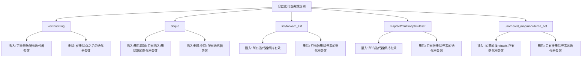

# C++ 迭代器失效

当你进一步深入学习STL容器和迭代器时，会遇到一个常见但容易被忽视的问题：**迭代器失效**。这个问题如果处理不当，可能导致程序崩溃或产生难以调试的错误。本文将全面介绍迭代器失效的概念、发生场景以及避免方法。

## 什么是迭代器失效

迭代器失效是指在使用迭代器过程中，由于对容器进行了修改操作，导致之前获取的迭代器不再有效的情况。简单来说，当你修改容器内容时，可能会使得指向容器元素的迭代器变得无效，继续使用这些迭代器将导致未定义行为。

:::warning
使用失效的迭代器可能导致程序崩溃、数据损坏或其他不可预期的行为！
:::

## 导致迭代器失效的常见操作

不同容器类型的迭代器失效规则不同，主要取决于其内部实现方式。下面我们分别介绍几种常见容器的迭代器失效情况：

### 1. vector迭代器失效情况

`std::vector` 是连续存储的容器，其迭代器失效规则较为严格：

- **添加元素**：当vector因添加元素而重新分配内存时（如容量不足），所有之前的迭代器、指针和引用都将失效
- **删除元素**：删除元素会使被删除元素之后的所有迭代器、指针和引用失效

让我们看一个vector迭代器失效的例子：

```cpp
#include <iostream>
#include <vector>

int main() {
    std::vector<int> nums = {1, 2, 3, 4, 5};
    
    // 获取指向第二个元素的迭代器
    auto it = nums.begin() + 1;
    std::cout << "Before push_back, *it = " << *it << std::endl;
    
    // 添加足够多的元素触发内存重分配
    for (int i = 0; i < 10; i++) {
        nums.push_back(10 + i);
    }
    
    // 危险操作！it可能已经失效
    std::cout << "After push_back, *it = " << *it << std::endl; // 可能导致未定义行为
    
    return 0;
}
```

**输出可能是**：
```
Before push_back, *it = 2
[程序崩溃或输出随机值]
```

### 2. list迭代器失效情况

`std::list` 作为双向链表实现，其迭代器失效规则相对宽松：

- **添加元素**：不会导致任何迭代器失效
- **删除元素**：只有指向被删除元素的迭代器失效，其他迭代器不受影响

```cpp
#include <iostream>
#include <list>

int main() {
    std::list<int> myList = {1, 2, 3, 4, 5};
    
    auto it1 = myList.begin();  // 指向第一个元素
    auto it2 = std::next(it1);  // 指向第二个元素
    
    std::cout << "it1 points to: " << *it1 << std::endl;
    std::cout << "it2 points to: " << *it2 << std::endl;
    
    // 删除第一个元素
    myList.erase(it1);  // it1现在失效了
    
    // it2仍然有效
    std::cout << "After deletion, it2 points to: " << *it2 << std::endl;
    
    return 0;
}
```

**输出**：
```
it1 points to: 1
it2 points to: 2
After deletion, it2 points to: 2
```

### 3. map和set迭代器失效情况

`std::map`和`std::set`等关联容器的迭代器失效规则：

- **添加元素**：不会导致任何迭代器失效（除非是rehash的无序容器）
- **删除元素**：只有指向被删除元素的迭代器失效，其他迭代器不受影响

```cpp
#include <iostream>
#include <map>
#include <string>

int main() {
    std::map<int, std::string> myMap = {
        {1, "one"}, {2, "two"}, {3, "three"}
    };
    
    auto it1 = myMap.find(1);
    auto it2 = myMap.find(2);
    auto it3 = myMap.find(3);
    
    // 删除key为2的元素
    myMap.erase(it2);  // 只有it2失效
    
    // it1和it3仍然有效
    std::cout << "it1: " << it1->first << " -> " << it1->second << std::endl;
    std::cout << "it3: " << it3->first << " -> " << it3->second << std::endl;
    
    return 0;
}
```

**输出**：
```
it1: 1 -> one
it3: 3 -> three
```

## 容器迭代器失效规则总结

下表总结了不同容器在各种操作下的迭代器失效规则：



## 迭代器失效的实际案例

### 案例一：在循环中删除vector元素

初学者常犯的错误是在遍历容器的同时删除元素：

```cpp
#include <iostream>
#include <vector>

// 错误示例：在循环中删除元素
void removeEvenNumbers_Wrong(std::vector<int>& nums) {
    for (auto it = nums.begin(); it != nums.end(); ++it) {
        if (*it % 2 == 0) {
            nums.erase(it);  // 错误：删除后it失效
            // 继续使用it将导致未定义行为
        }
    }
}

// 正确示例：安全地删除元素
void removeEvenNumbers_Correct(std::vector<int>& nums) {
    for (auto it = nums.begin(); it != nums.end(); ) {
        if (*it % 2 == 0) {
            it = nums.erase(it);  // erase返回下一个有效迭代器
        } else {
            ++it;
        }
    }
}

int main() {
    std::vector<int> nums = {1, 2, 3, 4, 5, 6, 7, 8, 9, 10};
    
    // 使用正确的方法
    removeEvenNumbers_Correct(nums);
    
    std::cout << "After removing even numbers: ";
    for (int num : nums) {
        std::cout << num << " ";
    }
    std::cout << std::endl;
    
    return 0;
}
```

**输出**：
```
After removing even numbers: 1 3 5 7 9 
```

### 案例二：保存end()迭代器

另一个常见错误是保存容器的end()迭代器，然后在添加元素后继续使用它：

```cpp
#include <iostream>
#include <vector>

int main() {
    std::vector<int> numbers = {1, 2, 3};
    
    // 保存end迭代器
    auto endIt = numbers.end();
    
    std::cout << "Size before: " << numbers.size() << std::endl;
    
    // 添加更多元素
    numbers.push_back(4);
    numbers.push_back(5);
    
    std::cout << "Size after: " << numbers.size() << std::endl;
    
    // 错误：endIt可能已经失效
    // std::cout << "Distance to end: " << std::distance(numbers.begin(), endIt) << std::endl;
    
    // 正确：获取新的end迭代器
    auto newEndIt = numbers.end();
    std::cout << "New distance to end: " << std::distance(numbers.begin(), newEndIt) << std::endl;
    
    return 0;
}
```

**输出**：
```
Size before: 3
Size after: 5
New distance to end: 5
```

## 如何避免迭代器失效问题

以下是一些避免迭代器失效问题的最佳实践：

1. **总是更新迭代器**：当对容器进行可能导致迭代器失效的操作后，使用返回的新迭代器

```cpp
// 正确删除元素的方法
iter = container.erase(iter);  // erase返回下一个有效迭代器
```

2. **使用合适的容器**：如果需要频繁插入和删除，考虑使用链表结构的容器（如`std::list`）

3. **复制元素而非删除**：有时可以通过复制保留的元素到新容器来避免迭代器失效

```cpp
std::vector<int> result;
for (const auto& element : original) {
    if (shouldKeep(element)) {
        result.push_back(element);
    }
}
original = result;
```

4. **使用稳定的算法**：STL提供了许多算法来安全地修改容器，如`std::remove_if`和`erase`组合

```cpp
// 使用remove_if和erase组合删除偶数
auto newEnd = std::remove_if(numbers.begin(), numbers.end(), 
                            [](int n) { return n % 2 == 0; });
numbers.erase(newEnd, numbers.end());
```

:::tip
对于vector，可以考虑先使用`reserve()`预先分配足够的空间，减少因容量增长导致的重新分配和迭代器失效。
:::

## 总结

迭代器失效是C++编程中常见的陷阱，但只要掌握了各种容器的失效规则，就能有效避免这类问题。记住：

1. 了解不同容器的迭代器失效规则
2. 在修改容器后更新迭代器
3. 选择合适的容器和算法
4. 在代码审查中特别注意迭代器的使用

通过正确处理迭代器失效问题，你可以写出更健壮、更可靠的C++代码。

## 练习题

1. 编写一个函数，安全地从`std::vector<int>`中删除所有重复元素，保持元素顺序不变
2. 比较在`std::vector`和`std::list`中删除满足特定条件的元素的性能差异
3. 实现一个安全的迭代器包装类，能够处理容器修改后的迭代器更新

## 更多资源

- [C++ Reference: vector::erase](https://en.cppreference.com/w/cpp/container/vector/erase)
- 《Effective STL》by Scott Meyers，特别是关于迭代器失效的章节
- [C++ Core Guidelines: 容器规则](http://isocpp.github.io/CppCoreGuidelines/CppCoreGuidelines#csl-containers)

掌握迭代器失效是成为熟练C++程序员的重要一步。通过理解本文中的概念和示例，你将能够更自信地使用STL容器和迭代器，避免一些常见的陷阱。