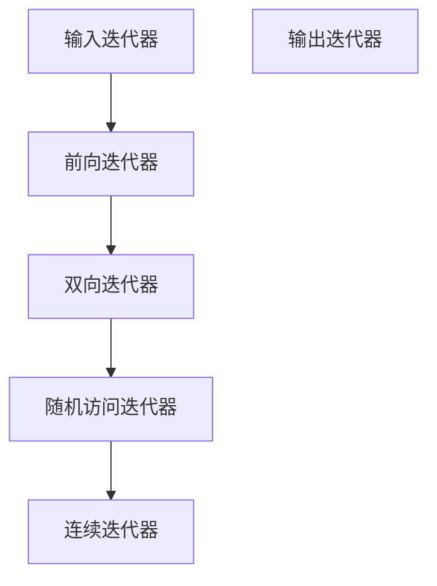

# C++ 迭代器最佳实践

## 迭代器概述

迭代器是C++ STL（标准模板库）中的一个核心概念，它提供了一种访问容器元素的统一方式，而无需关心容器的具体实现。迭代器可以看作是指针的泛化，它使我们能够遍历序列中的元素，同时抽象出容器的内部细节。

:::tip 提示
迭代器是连接算法和容器的桥梁。掌握迭代器的最佳实践，可以让你的代码更加高效、安全且易于维护。
:::

## 迭代器类型

在深入讨论最佳实践之前，让我们先了解C++ STL中的主要迭代器类型：

1. **输入迭代器**：只读，单向，一次性遍历
2. **输出迭代器**：只写，单向，一次性遍历
3. **前向迭代器**：可读写，单向，可多次遍历
4. **双向迭代器**：可读写，双向，可多次遍历
5. **随机访问迭代器**：可读写，随机访问，可多次遍历
6. **连续迭代器**（C++17）：随机访问迭代器的子集，保证元素在内存中连续存储



## 迭代器的最佳实践

### 1. 使用合适的迭代器声明

#### 使用 auto 简化迭代器声明

```cpp
// 传统声明方式
std::vector<int>::iterator it = vec.begin();

// 使用auto简化（推荐）
auto it = vec.begin();
```

#### 使用 cbegin() 和 cend() 获取常量迭代器

```cpp
// 当不需要修改容器元素时，使用常量迭代器
for (auto it = container.cbegin(); it != container.cend(); ++it) {
    // 只读取元素，不修改
    std::cout << *it << " ";
}
```

### 2. 迭代器失效问题

迭代器失效是使用迭代器时最常见的问题之一。当容器的内部结构被修改时，指向该容器的迭代器可能会失效。

:::warning 警告
在循环中修改容器时，要特别小心迭代器失效问题。不同容器的迭代器失效规则不同。
:::

#### 示例：在循环中安全地删除元素

```cpp
#include <iostream>
#include <vector>

int main() {
    std::vector<int> numbers = {1, 2, 3, 4, 5, 6};
    
    // 错误方式：会导致迭代器失效
    /*
    for (auto it = numbers.begin(); it != numbers.end(); ++it) {
        if (*it % 2 == 0) { // 删除偶数
            numbers.erase(it); // 错误：erase会使迭代器失效
        }
    }
    */
    
    // 正确方式
    for (auto it = numbers.begin(); it != numbers.end();) {
        if (*it % 2 == 0) {
            it = numbers.erase(it); // erase返回下一个有效的迭代器
        } else {
            ++it;
        }
    }
    
    // 输出结果
    for (int num : numbers) {
        std::cout << num << " ";
    }
    
    return 0;
}
```

**输出结果**：
```
1 3 5
```

### 3. 使用迭代器的范围for循环

C++11引入了范围for循环，它是使用迭代器的一种简洁方式。

```cpp
#include <iostream>
#include <vector>

int main() {
    std::vector<int> numbers = {1, 2, 3, 4, 5};
    
    // 传统迭代器遍历
    for (auto it = numbers.begin(); it != numbers.end(); ++it) {
        std::cout << *it << " ";
    }
    std::cout << std::endl;
    
    // 范围for循环（推荐）
    for (const auto& num : numbers) {
        std::cout << num << " ";
    }
    
    return 0;
}
```

**输出结果**：
```
1 2 3 4 5
1 2 3 4 5
```

:::note 备注
使用`const auto&`可以避免不必要的复制，特别是对于非基本类型的元素。
:::

### 4. 优先使用前缀递增（++it）而不是后缀递增（it++）

前缀递增通常更高效，尤其是对于复杂的迭代器类型：

```cpp
// 推荐：前缀递增
for (auto it = container.begin(); it != container.end(); ++it) {
    // 处理元素
}

// 不推荐：后缀递增
for (auto it = container.begin(); it != container.end(); it++) {
    // 处理元素
}
```

### 5. 利用算法库与迭代器结合

STL算法库提供了许多与迭代器配合使用的强大功能：

```cpp
#include <iostream>
#include <vector>
#include <algorithm>

int main() {
    std::vector<int> numbers = {5, 2, 8, 1, 9};
    
    // 使用迭代器和算法查找元素
    auto it = std::find(numbers.begin(), numbers.end(), 8);
    
    if (it != numbers.end()) {
        std::cout << "找到元素: " << *it << " 在位置: " 
                  << std::distance(numbers.begin(), it) << std::endl;
    } else {
        std::cout << "未找到元素" << std::endl;
    }
    
    // 使用迭代器和算法排序
    std::sort(numbers.begin(), numbers.end());
    
    std::cout << "排序后: ";
    for (int num : numbers) {
        std::cout << num << " ";
    }
    
    return 0;
}
```

**输出结果**：
```
找到元素: 8 在位置: 2
排序后: 1 2 5 8 9
```

### 6. 迭代器操作的安全性

#### 使用迭代器前验证容器是否为空

```cpp
if (!container.empty()) {
    auto it = container.begin();
    // 安全地使用迭代器
}
```

#### 总是检查迭代器的有效性

```cpp
auto it = std::find(container.begin(), container.end(), value);
if (it != container.end()) {
    // 安全地使用迭代器
}
```

### 7. 实际案例：自定义迭代器

有时候，你可能需要为自己的数据结构实现迭代器。下面是一个简单的示例：

```cpp
#include <iostream>
#include <iterator>

// 一个简单的整数范围类
class IntRange {
private:
    int start;
    int end;
    
public:
    IntRange(int start, int end) : start(start), end(end) {}
    
    // 自定义迭代器
    class Iterator {
    private:
        int current;
    public:
        using iterator_category = std::forward_iterator_tag;
        using difference_type = std::ptrdiff_t;
        using value_type = int;
        using pointer = int*;
        using reference = int&;
        
        Iterator(int current) : current(current) {}
        
        int operator*() const { return current; }
        
        // 前缀递增
        Iterator& operator++() {
            ++current;
            return *this;
        }
        
        // 后缀递增
        Iterator operator++(int) {
            Iterator temp = *this;
            ++current;
            return temp;
        }
        
        bool operator==(const Iterator& other) const {
            return current == other.current;
        }
        
        bool operator!=(const Iterator& other) const {
            return current != other.current;
        }
    };
    
    Iterator begin() { return Iterator(start); }
    Iterator end() { return Iterator(end); }
};

int main() {
    IntRange range(1, 6);
    
    std::cout << "范围内的数字: ";
    for (int value : range) {
        std::cout << value << " ";
    }
    
    return 0;
}
```

**输出结果**：
```
范围内的数字: 1 2 3 4 5
```

## 总结

高效使用C++迭代器的最佳实践：

1. 使用`auto`简化迭代器声明
2. 当不需要修改元素时，使用常量迭代器（`cbegin()`和`cend()`）
3. 谨防迭代器失效问题
4. 尽量使用范围for循环简化代码
5. 优先使用前缀递增（`++it`）而非后缀递增（`it++`）
6. 结合STL算法库使用迭代器
7. 始终确保迭代器的安全性和有效性
8. 了解如何为自定义数据结构实现迭代器

通过遵循这些最佳实践，你将能够编写更高效、更安全、更易于维护的C++代码。

## 练习

1. 编写一个程序，使用迭代器安全地从`std::vector`中删除所有奇数。
2. 实现一个函数，使用迭代器将两个已排序的容器合并为一个新的已排序容器。
3. 为二叉树实现一个中序遍历迭代器。
4. 编写一个程序，演示三种不同的迭代器失效情况及其解决方案。

## 进一步学习资源

- **《Effective STL》** - Scott Meyers的经典著作
- **C++ Reference** - 查阅迭代器和容器的详细文档
- **C++ Core Guidelines** - 有关迭代器使用的指导原则
- **《C++ Templates: The Complete Guide》** - 深入了解迭代器的模板实现