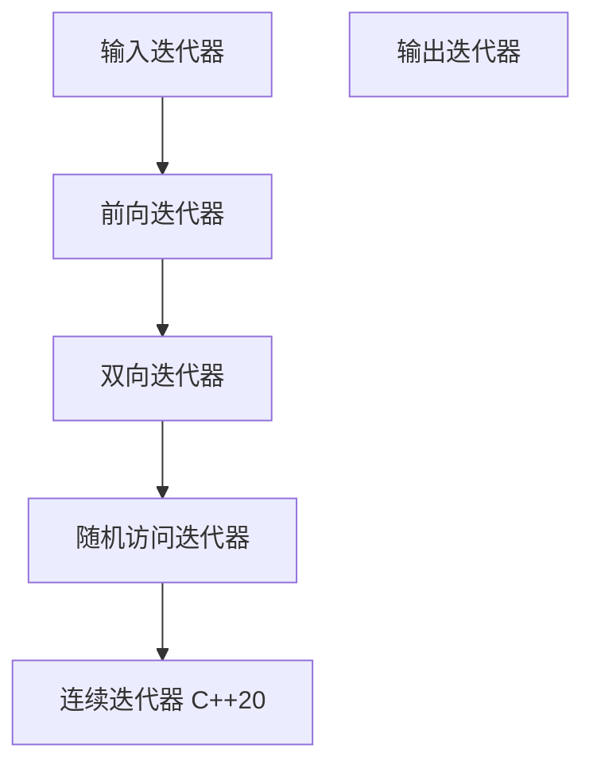

# C++ 输入迭代器

在C++标准模板库(STL)中，迭代器是连接算法和容器的桥梁。它们让我们能够访问和操作容器中的元素，而不需要知道容器的具体实现。其中，**输入迭代器**是STL迭代器层次结构中最基本的迭代器类型之一。

## 什么是输入迭代器？

输入迭代器是一种单向、只读的迭代器，它支持从容器中读取数据的操作，但不能用于修改数据。它被称为"输入"迭代器是因为它类似于从输入流(如键盘、文件)读取数据的操作。

### 输入迭代器的特性

1. **只读访问**：只能读取元素，不能修改元素
2. **单向移动**：只能向前移动（使用++运算符），不能后退
3. **单遍算法**：只保证能够遍历一次序列
4. **相等比较**：支持相等(==)和不等(!=)比较

## 输入迭代器操作

输入迭代器支持以下操作：

- **`*iter`**：解引用操作，返回当前位置的元素（只读）
- **`iter->member`**：访问当前元素的成员（等价于`(*iter).member`）
- **`++iter`** 和 **`iter++`**：迭代器向前移动
- **`iter1 == iter2`**：判断两个迭代器是否指向同一位置
- **`iter1 != iter2`**：判断两个迭代器是否不指向同一位置

## 输入迭代器示例

### 标准输入流迭代器

最典型的输入迭代器是`std::istream_iterator`，它可以从输入流中读取数据：

```cpp
#include <iostream>
#include <iterator>
#include <vector>
#include <algorithm>

int main() {
    // 创建一个从标准输入读取整数的输入迭代器
    std::istream_iterator<int> input_iter(std::cin);
    std::istream_iterator<int> eof; // 默认构造的迭代器表示结束
    
    // 用输入迭代器构造vector
    std::vector<int> numbers(input_iter, eof);
    
    // 打印读取的数字
    std::cout << "读取的数字: ";
    for (const auto& n : numbers) {
        std::cout << n << " ";
    }
    std::cout << std::endl;
    
    return 0;
}
```

**输入示例**：
```
1 2 3 4 5
```

**输出**：
```
读取的数字: 1 2 3 4 5
```

:::note
当你输入完数字后，按下Ctrl+D(Unix/Linux)或Ctrl+Z(Windows)来表示输入结束。
:::

### 使用算法

以下示例展示了如何结合`std::find`算法使用输入迭代器：

```cpp
#include <iostream>
#include <iterator>
#include <algorithm>

int main() {
    std::cout << "请输入一系列整数，以查找第一个5 (输入结束请按Ctrl+D或Ctrl+Z):" << std::endl;
    
    // 从标准输入创建输入迭代器
    std::istream_iterator<int> start(std::cin);
    std::istream_iterator<int> end;
    
    // 使用find算法查找值为5的元素
    auto result = std::find(start, end, 5);
    
    if (result != end) {
        std::cout << "找到数字5!" << std::endl;
    } else {
        std::cout << "没有找到数字5!" << std::endl;
    }
    
    return 0;
}
```

## 输入迭代器的实际应用

### 文件解析

输入迭代器常用于从文件读取数据：

```cpp
#include <iostream>
#include <fstream>
#include <iterator>
#include <vector>
#include <string>

int main() {
    // 打开文件
    std::ifstream file("data.txt");
    if (!file) {
        std::cerr << "无法打开文件!" << std::endl;
        return 1;
    }
    
    // 使用输入迭代器读取文件中的所有字符串
    std::istream_iterator<std::string> file_iter(file);
    std::istream_iterator<std::string> eof;
    
    std::vector<std::string> words(file_iter, eof);
    
    // 显示读取的单词数量和内容
    std::cout << "读取了 " << words.size() << " 个单词" << std::endl;
    std::cout << "前5个单词: ";
    
    int count = 0;
    for (const auto& word : words) {
        if (count++ < 5) {
            std::cout << word << " ";
        } else {
            break;
        }
    }
    std::cout << std::endl;
    
    return 0;
}
```

### 数据转换和处理

可以使用输入迭代器从一个源读取数据，并进行处理后写入目标：

```cpp
#include <iostream>
#include <iterator>
#include <algorithm>
#include <vector>

int main() {
    std::cout << "请输入一些整数 (输入结束请按Ctrl+D或Ctrl+Z):" << std::endl;
    
    // 输入迭代器
    std::istream_iterator<int> input_iter(std::cin);
    std::istream_iterator<int> eof;
    
    // 输出迭代器
    std::ostream_iterator<int> output_iter(std::cout, " ");
    
    // 计算输入的平方并输出
    std::cout << "输入数字的平方: ";
    std::transform(
        input_iter, eof,  // 输入范围
        output_iter,      // 输出位置
        [](int value) { return value * value; }  // 转换函数
    );
    std::cout << std::endl;
    
    return 0;
}
```

## 自定义输入迭代器

虽然较为高级，但了解如何创建自定义输入迭代器对深入理解迭代器概念很有帮助：

```cpp
#include <iostream>
#include <iterator>

// 一个简单的输入迭代器，生成斐波那契数列
class FibonacciIterator {
private:
    unsigned long long a;
    unsigned long long b;
    int count;
    int max_count;
    
public:
    // 迭代器特征类型定义
    using iterator_category = std::input_iterator_tag;
    using value_type = unsigned long long;
    using difference_type = std::ptrdiff_t;
    using pointer = const unsigned long long*;
    using reference = const unsigned long long&;
    
    // 构造函数
    FibonacciIterator(int max = 0) : a(0), b(1), count(0), max_count(max) {}
    
    // 解引用操作
    value_type operator*() const { return a; }
    
    // 递增操作
    FibonacciIterator& operator++() {
        unsigned long long temp = a;
        a = b;
        b = temp + b;
        ++count;
        return *this;
    }
    
    FibonacciIterator operator++(int) {
        FibonacciIterator temp = *this;
        ++*this;
        return temp;
    }
    
    // 相等比较
    bool operator==(const FibonacciIterator& other) const {
        return (count >= max_count && other.count >= other.max_count) ||
               (count == other.count && a == other.a && b == other.b);
    }
    
    bool operator!=(const FibonacciIterator& other) const {
        return !(*this == other);
    }
};

int main() {
    FibonacciIterator start(10);  // 生成10个斐波那契数
    FibonacciIterator end;        // 结束迭代器
    
    std::cout << "斐波那契数列的前10个数: ";
    for (int i = 0; i < 10; ++i, ++start) {
        std::cout << *start << " ";
    }
    std::cout << std::endl;
    
    return 0;
}
```

**输出**：
```
斐波那契数列的前10个数: 0 1 1 2 3 5 8 13 21 34
```

## 输入迭代器的限制

虽然输入迭代器很有用，但它有一些限制：

1. **单向传递**：只能前进，不能后退
2. **只读**：不能修改元素
3. **单遍算法**：迭代器可能仅支持遍历序列一次
4. **解引用有效性**：迭代器解引用结果可能仅在进一步递增迭代器之前有效

:::caution
输入迭代器适用于单遍操作。如果需要多次遍历或需要双向操作，应考虑使用更高级别的迭代器类型，如前向迭代器或双向迭代器。
:::

## 输入迭代器和其他迭代器的关系

在STL中，迭代器按功能从低到高分为以下几类：



每个更高级的迭代器都包含前一级迭代器的所有功能，并增加了新功能。

## 总结

输入迭代器是C++ STL中最基本的迭代器类型之一，它提供了从容器或流中读取数据的能力。尽管功能有限（只读、只能前进），但它在需要从数据源顺序读取数据的场景中非常有用，如文件读取、流处理等。

理解输入迭代器对于掌握整个STL迭代器体系至关重要，因为它是其他更复杂迭代器的基础。

## 练习

1. 编写一个程序，使用`std::istream_iterator`从文件中读取一系列整数，并计算它们的平均值。
2. 实现一个函数，接受两个输入迭代器参数，返回指定范围内所有元素的和。
3. 创建一个自定义输入迭代器，生成无限的随机数序列。
4. 使用`std::istream_iterator`和适当的STL算法统计文本文件中特定单词的出现次数。
5. 尝试编写一个程序，从标准输入读取一系列浮点数，去除重复项后按升序排列输出。

:::tip
要深入理解输入迭代器，建议查看STL中的实际实现，如`std::istream_iterator`和`std::find`、`std::count`等算法的源代码。
:::