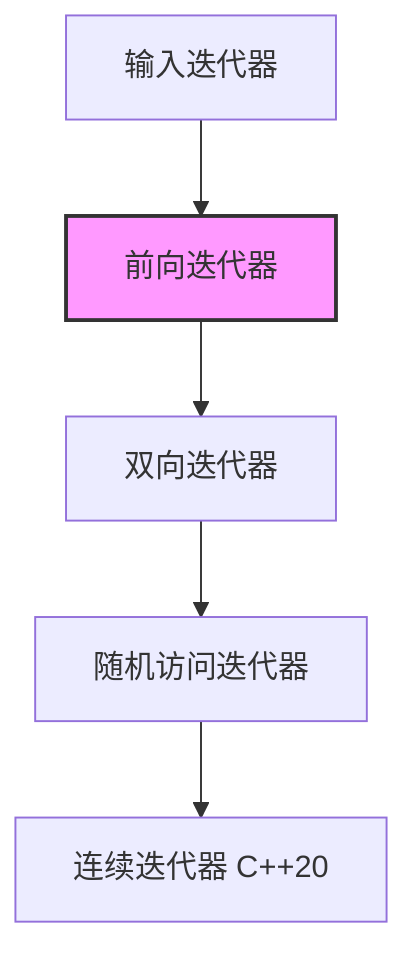

# C++ 前向迭代器

## 前向迭代器是什么？

前向迭代器是C++ STL迭代器层次结构中的一种基本迭代器类型，它允许我们**单向遍历**容器中的元素。与输入迭代器不同，前向迭代器可以多次读取同一个元素，并且它支持多遍算法。想象一下，前向迭代器就像是一个只能向前行走的指针，不能后退。

:::note
前向迭代器在STL迭代器分类中位于输入迭代器和双向迭代器之间，提供比输入迭代器更强的功能，但比双向迭代器功能弱一些。
:::

## 前向迭代器的特性

1. **单向移动**：只能使用 `++` 运算符向前移动
2. **可解引用**：可以使用 `*` 操作符访问元素值
3. **可比较**：可以用 `==` 和 `!=` 比较两个迭代器
4. **多遍访问**：可以多次遍历相同的元素序列
5. **可默认构造**：支持默认构造函数

## 前向迭代器支持的操作

下面是前向迭代器支持的基本操作：

```cpp
ForwardIterator it;          // 默认构造
ForwardIterator it2(it);     // 复制构造
it = it2;                    // 赋值
*it                          // 解引用，访问元素
it->member                   // 访问元素的成员（等同于(*it).member）
++it                         // 前置递增
it++                         // 后置递增
it == it2                    // 相等比较
it != it2                    // 不等比较
```

## 使用前向迭代器的容器

在STL中，以下容器提供了前向迭代器：

1. `forward_list` - 单向链表
2. `unordered_set` - 无序集合
3. `unordered_multiset` - 无序多重集合  
4. `unordered_map` - 无序映射
5. `unordered_multimap` - 无序多重映射

## 实际使用示例

### 示例1：使用 `forward_list` 的前向迭代器

```cpp
#include <iostream>
#include <forward_list>

int main() {
    std::forward_list<int> flist = {1, 2, 3, 4, 5};
    
    std::cout << "forward_list的元素： ";
    
    // 使用前向迭代器遍历
    for (auto it = flist.begin(); it != flist.end(); ++it) {
        std::cout << *it << " ";
    }
    std::cout << std::endl;
    
    // 查找并修改元素
    for (auto it = flist.begin(); it != flist.end(); ++it) {
        if (*it == 3) {
            *it = 30;
        }
    }
    
    std::cout << "修改后的元素： ";
    for (const auto& elem : flist) {
        std::cout << elem << " ";
    }
    std::cout << std::endl;
    
    return 0;
}
```

**输出结果**：
```
forward_list的元素： 1 2 3 4 5
修改后的元素： 1 2 30 4 5
```

### 示例2：使用 `unordered_set` 的前向迭代器

```cpp
#include <iostream>
#include <unordered_set>
#include <string>

int main() {
    std::unordered_set<std::string> languages = {"C++", "Python", "Java", "JavaScript"};
    
    // 使用前向迭代器遍历
    std::cout << "编程语言列表：\n";
    for (auto it = languages.begin(); it != languages.end(); ++it) {
        std::cout << "- " << *it << "\n";
    }
    
    // 查找特定元素
    auto it = languages.find("Python");
    if (it != languages.end()) {
        std::cout << "找到了：" << *it << std::endl;
    }
    
    return 0;
}
```

**输出结果**：
```
编程语言列表：
- JavaScript
- Java
- Python
- C++
找到了：Python
```

:::caution
由于 `unordered_set` 是基于哈希表实现的，所以元素的输出顺序可能与插入顺序不同！
:::

## 前向迭代器的局限性

虽然前向迭代器很有用，但它也有一些局限性：

1. **不支持向后移动**：不能使用 `--` 运算符
2. **不支持随机访问**：不能使用 `it + n` 或 `it[n]` 直接访问任意位置的元素
3. **不保证迭代顺序**：对于无序容器，迭代顺序通常不可预测

## 前向迭代器与其他迭代器的比较



## 实际应用场景

### 场景1：数据转换

假设我们有一个存储学生分数的 `forward_list`，需要将所有不及格的分数`（<60）`标记为需要补考。

```cpp
#include <iostream>
#include <forward_list>
#include <string>

struct StudentScore {
    std::string name;
    int score;
    bool needRetest;
    
    StudentScore(const std::string& n, int s) 
        : name(n), score(s), needRetest(false) {}
};

int main() {
    std::forward_list<StudentScore> scores = {
        {"Alice", 85},
        {"Bob", 55},
        {"Charlie", 70},
        {"David", 45}
    };
    
    // 使用前向迭代器标记不及格的学生
    for (auto it = scores.begin(); it != scores.end(); ++it) {
        if (it->score < 60) {
            it->needRetest = true;
        }
    }
    
    // 显示结果
    std::cout << "学生成绩列表：\n";
    for (const auto& student : scores) {
        std::cout << student.name << ": " << student.score 
                  << (student.needRetest ? " (需要补考)" : "") << "\n";
    }
    
    return 0;
}
```

**输出结果**：
```
学生成绩列表：
Alice: 85
Bob: 55 (需要补考)
Charlie: 70
David: 45 (需要补考)
```

### 场景2：单词频率统计

使用 `unordered_map` 和前向迭代器来统计一段文本中单词的出现频率。

```cpp
#include <iostream>
#include <unordered_map>
#include <string>
#include <sstream>
#include <algorithm>

int main() {
    std::string text = "this is a sample text this is just a sample";
    
    // 使用无序映射和前向迭代器统计单词频率
    std::unordered_map<std::string, int> wordFreq;
    std::istringstream iss(text);
    std::string word;
    
    while (iss >> word) {
        ++wordFreq[word];
    }
    
    // 显示单词频率
    std::cout << "单词频率统计：\n";
    for (auto it = wordFreq.begin(); it != wordFreq.end(); ++it) {
        std::cout << it->first << ": " << it->second << " 次\n";
    }
    
    // 找出出现最多的单词
    auto maxIt = std::max_element(
        wordFreq.begin(), 
        wordFreq.end(),
        [](const auto& a, const auto& b) { 
            return a.second < b.second; 
        }
    );
    
    std::cout << "\n出现最多的单词是: " << maxIt->first 
              << " (" << maxIt->second << " 次)" << std::endl;
    
    return 0;
}
```

**输出结果**：
```
单词频率统计：
sample: 2 次
just: 1 次
a: 2 次
this: 2 次
is: 2 次

出现最多的单词是: sample (2 次)
```

## 自定义前向迭代器

在某些情况下，你可能需要为自己的数据结构实现前向迭代器。下面是一个简单的例子，为一个自定义的单向链表实现前向迭代器：

```cpp
#include <iostream>
#include <iterator>
#include <cstddef>

// 简单的单向链表节点
template<typename T>
struct Node {
    T data;
    Node* next;
    Node(const T& d, Node* n = nullptr) : data(d), next(n) {}
};

// 简单的单向链表
template<typename T>
class SimpleList {
private:
    Node<T>* head;
    
public:
    // 前向迭代器实现
    class iterator {
    private:
        Node<T>* current;
        
    public:
        // 迭代器特性标签定义
        using iterator_category = std::forward_iterator_tag;
        using value_type = T;
        using difference_type = std::ptrdiff_t;
        using pointer = T*;
        using reference = T&;
        
        // 构造函数
        iterator(Node<T>* node = nullptr) : current(node) {}
        
        // 解引用操作符
        reference operator*() const { return current->data; }
        pointer operator->() const { return &(current->data); }
        
        // 前置递增
        iterator& operator++() {
            current = current->next;
            return *this;
        }
        
        // 后置递增
        iterator operator++(int) {
            iterator tmp = *this;
            current = current->next;
            return tmp;
        }
        
        // 比较操作符
        bool operator==(const iterator& other) const {
            return current == other.current;
        }
        
        bool operator!=(const iterator& other) const {
            return current != other.current;
        }
    };
    
    // 构造函数
    SimpleList() : head(nullptr) {}
    
    // 析构函数
    ~SimpleList() {
        Node<T>* current = head;
        while (current) {
            Node<T>* next = current->next;
            delete current;
            current = next;
        }
    }
    
    // 添加元素到链表头部
    void push_front(const T& value) {
        head = new Node<T>(value, head);
    }
    
    // 迭代器方法
    iterator begin() { return iterator(head); }
    iterator end() { return iterator(nullptr); }
};

int main() {
    SimpleList<int> myList;
    
    // 添加一些元素
    myList.push_front(5);
    myList.push_front(4);
    myList.push_front(3);
    myList.push_front(2);
    myList.push_front(1);
    
    // 使用我们的前向迭代器遍历列表
    std::cout << "链表元素: ";
    for (auto it = myList.begin(); it != myList.end(); ++it) {
        std::cout << *it << " ";
    }
    std::cout << std::endl;
    
    return 0;
}
```

**输出结果**：
```
链表元素: 1 2 3 4 5
```

## 总结

前向迭代器是STL迭代器家族中的重要成员，它提供了单向遍历容器的能力。虽然它比双向迭代器和随机访问迭代器功能少，但在处理单向链表和基于哈希表的容器时非常有用。

前向迭代器的主要特性是：
- 只能向前移动
- 支持多次读取同一元素
- 可以进行相等性比较
- 支持默认构造

掌握前向迭代器有助于我们更好地使用STL容器和算法，特别是在处理 `forward_list` 和无序关联容器时。

## 练习

1. 创建一个 `std::forward_list<int>`，填充一些数字，然后使用前向迭代器找出并删除所有偶数。
2. 实现一个函数，使用前向迭代器在 `std::unordered_set<std::string>` 中查找最长的字符串。
3. 扩展上面的 `SimpleList` 类，添加一个 `insert_after` 方法，该方法接受一个迭代器和一个值，在迭代器指向的元素之后插入新值。
4. 使用 `std::unordered_map` 实现一个简单的缓存系统，可以存储和检索键值对。利用前向迭代器实现一个"清理最旧项"的功能。

## 进一步阅读

- C++ 参考文档中关于[迭代器](https://en.cppreference.com/w/cpp/iterator)的部分
- 《Effective STL》第三章：迭代器
- 《C++ Standard Library》第六章：STL迭代器

通过这些实践和深入学习，你将能够熟练掌握前向迭代器，并在日常编程中有效地使用它们！