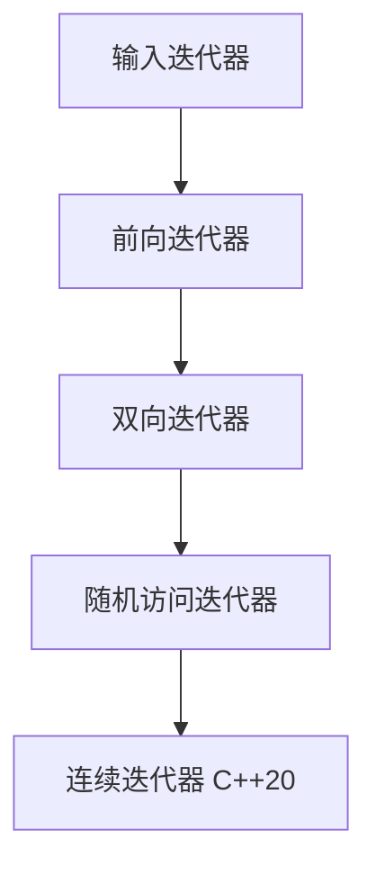

# C++ 双向迭代器

## 什么是双向迭代器？

双向迭代器(Bidirectional Iterator)是C++ STL中的一种迭代器类型，它允许程序员在容器中进行双向移动，即可以向前也可以向后遍历容器的元素。与前向迭代器只能向前移动不同，双向迭代器支持 `++` 操作符向前移动和 `--` 操作符向后移动，使得对容器的操作更加灵活。

## 双向迭代器的特性

双向迭代器具有以下主要特性：

1. **双向移动**：可以使用 `++` 和 `--` 操作符分别向前和向后移动
2. **读写操作**：支持读取和修改所指向的元素（非const迭代器）
3. **多次遍历**：可以多次遍历容器
4. **相等比较**：支持使用 `==` 和 `!=` 操作符进行比较

:::note
双向迭代器继承了前向迭代器的所有特性，并增加了向后移动的能力。
:::

## 支持双向迭代器的STL容器

以下C++ STL容器提供了双向迭代器：

1. `std::list`（双向链表）
2. `std::set`（集合）
3. `std::multiset`（多重集合）
4. `std::map`（映射）
5. `std::multimap`（多重映射）

## 双向迭代器的操作

双向迭代器支持的主要操作包括：

| 操作 | 描述 |
|------|------|
| `*iter` | 解引用迭代器，访问当前元素 |
| `iter->member` | 访问当前元素的成员（等价于`(*iter).member`） |
| `++iter` | 前缀递增，移动到下一个元素 |
| `iter++` | 后缀递增，移动到下一个元素 |
| `--iter` | 前缀递减，移动到前一个元素 |
| `iter--` | 后缀递减，移动到前一个元素 |
| `iter1 == iter2` | 判断两个迭代器是否相等 |
| `iter1 != iter2` | 判断两个迭代器是否不等 |

## 使用双向迭代器的示例

### 示例1：使用`std::list`的双向迭代器

```cpp
#include <iostream>
#include <list>

int main() {
    // 创建一个list容器并初始化
    std::list<int> myList = {10, 20, 30, 40, 50};
    
    std::cout << "正向遍历list:" << std::endl;
    for (auto it = myList.begin(); it != myList.end(); ++it) {
        std::cout << *it << " ";
    }
    std::cout << std::endl;
    
    std::cout << "反向遍历list:" << std::endl;
    auto it = myList.end();
    do {
        --it;  // 先减减，因为end()指向末尾之后
        std::cout << *it << " ";
    } while (it != myList.begin());
    
    std::cout << std::endl;
    
    return 0;
}
```

输出：
```
正向遍历list:
10 20 30 40 50 
反向遍历list:
50 40 30 20 10 
```

### 示例2：使用`std::map`的双向迭代器

```cpp
#include <iostream>
#include <map>
#include <string>

int main() {
    // 创建一个map容器
    std::map<std::string, int> ageMap = {
        {"Alice", 25},
        {"Bob", 30},
        {"Charlie", 22},
        {"David", 28}
    };
    
    std::cout << "正向遍历map:" << std::endl;
    for (auto it = ageMap.begin(); it != ageMap.end(); ++it) {
        std::cout << it->first << ": " << it->second << std::endl;
    }
    
    std::cout << "\n反向遍历map:" << std::endl;
    auto it = ageMap.end();
    while (it != ageMap.begin()) {
        --it;
        std::cout << it->first << ": " << it->second << std::endl;
    }
    
    return 0;
}
```

输出：
```
正向遍历map:
Alice: 25
Bob: 30
Charlie: 22
David: 28

反向遍历map:
David: 28
Charlie: 22
Bob: 30
Alice: 25
```

## 双向迭代器与其他迭代器的区别



以下表格展示了双向迭代器与其他迭代器类型的能力比较：

| 功能 | 输入迭代器 | 前向迭代器 | 双向迭代器 | 随机访问迭代器 |
|------|---------|---------|---------|------------|
| 读取元素 | ✅ | ✅ | ✅ | ✅ |
| 多次遍历 | ❌ | ✅ | ✅ | ✅ |
| 向前移动 | ✅ | ✅ | ✅ | ✅ |
| 向后移动 | ❌ | ❌ | ✅ | ✅ |
| 随机访问 | ❌ | ❌ | ❌ | ✅ |
| 算术运算 | ❌ | ❌ | ❌ | ✅ |

## 实际应用场景

### 场景1：双向链表的操作

双向迭代器特别适合用于双向链表（`std::list`）的操作，因为双向链表需要在两个方向上移动以实现高效的插入和删除操作。

```cpp
#include <iostream>
#include <list>

int main() {
    std::list<int> numbers = {1, 2, 3, 4, 5};
    
    // 寻找值为3的元素
    auto it = numbers.begin();
    while (it != numbers.end() && *it != 3) {
        ++it;
    }
    
    if (it != numbers.end()) {
        // 在3前面插入元素
        numbers.insert(it, 10);
        
        // 向后移动到4
        ++it;
        
        // 删除4
        if (*it == 4) {
            it = numbers.erase(it);
        }
    }
    
    // 输出结果
    for (const auto& num : numbers) {
        std::cout << num << " ";
    }
    std::cout << std::endl;
    
    return 0;
}
```

输出：
```
1 2 10 3 5 
```

### 场景2：有序数据的区间搜索

在有序容器中（如`std::set`、`std::map`），双向迭代器可用于高效地定位和遍历特定范围的元素。

```cpp
#include <iostream>
#include <set>

int main() {
    std::set<int> numbers = {10, 15, 20, 25, 30, 35, 40};
    
    auto lower = numbers.lower_bound(20); // 指向20
    auto upper = numbers.upper_bound(35); // 指向40
    
    std::cout << "在[20, 35]范围内的元素：" << std::endl;
    for (auto it = lower; it != upper; ++it) {
        std::cout << *it << " ";
    }
    std::cout << std::endl;
    
    // 反向遍历同一范围
    std::cout << "反向遍历[20, 35]范围：" << std::endl;
    auto it = upper;
    while (it != lower) {
        --it;
        std::cout << *it << " ";
    }
    std::cout << std::endl;
    
    return 0;
}
```

输出：
```
在[20, 35]范围内的元素：
20 25 30 35 
反向遍历[20, 35]范围：
35 30 25 20 
```

### 场景3：函数返回迭代器的应用

许多STL算法返回迭代器，使用双向迭代器可以更灵活地处理这些结果。

```cpp
#include <iostream>
#include <list>
#include <algorithm>

int main() {
    std::list<int> numbers = {1, 3, 5, 7, 9, 11, 13};
    
    // 查找第一个大于10的元素
    auto it = std::find_if(numbers.begin(), numbers.end(), 
                           [](int n) { return n > 10; });
    
    std::cout << "第一个大于10的元素是：" << *it << std::endl;
    
    // 向前移动查看前一个元素
    if (it != numbers.begin()) {
        --it;
        std::cout << "前一个元素是：" << *it << std::endl;
    }
    
    return 0;
}
```

输出：
```
第一个大于10的元素是：11
前一个元素是：9
```

## 双向迭代器的自定义实现示例

下面是一个简单的双向链表节点和对应双向迭代器的实现示例：

```cpp
#include <iostream>
#include <iterator>

// 简单的双向链表节点
template <typename T>
struct Node {
    T data;
    Node* prev;
    Node* next;
    
    Node(const T& value) : data(value), prev(nullptr), next(nullptr) {}
};

// 自定义双向迭代器
template <typename T>
class MyBidirectionalIterator {
private:
    Node<T>* current;
    
public:
    // 迭代器特征定义
    using iterator_category = std::bidirectional_iterator_tag;
    using value_type = T;
    using difference_type = std::ptrdiff_t;
    using pointer = T*;
    using reference = T&;
    
    // 构造函数
    MyBidirectionalIterator(Node<T>* ptr = nullptr) : current(ptr) {}
    
    // 解引用操作符
    T& operator*() const {
        return current->data;
    }
    
    T* operator->() const {
        return &(current->data);
    }
    
    // 前缀递增
    MyBidirectionalIterator& operator++() {
        current = current->next;
        return *this;
    }
    
    // 后缀递增
    MyBidirectionalIterator operator++(int) {
        MyBidirectionalIterator temp = *this;
        current = current->next;
        return temp;
    }
    
    // 前缀递减
    MyBidirectionalIterator& operator--() {
        current = current->prev;
        return *this;
    }
    
    // 后缀递减
    MyBidirectionalIterator operator--(int) {
        MyBidirectionalIterator temp = *this;
        current = current->prev;
        return temp;
    }
    
    // 相等比较
    bool operator==(const MyBidirectionalIterator& other) const {
        return current == other.current;
    }
    
    // 不等比较
    bool operator!=(const MyBidirectionalIterator& other) const {
        return current != other.current;
    }
};

// 简单的双向链表类
template <typename T>
class MyList {
private:
    Node<T>* head;
    Node<T>* tail;
    
public:
    using iterator = MyBidirectionalIterator<T>;
    
    MyList() : head(nullptr), tail(nullptr) {}
    
    ~MyList() {
        while (head) {
            Node<T>* temp = head;
            head = head->next;
            delete temp;
        }
    }
    
    // 在末尾添加元素
    void push_back(const T& value) {
        Node<T>* newNode = new Node<T>(value);
        
        if (!head) {
            head = tail = newNode;
        } else {
            newNode->prev = tail;
            tail->next = newNode;
            tail = newNode;
        }
    }
    
    // 返回指向开始的迭代器
    iterator begin() {
        return iterator(head);
    }
    
    // 返回指向结束的迭代器
    iterator end() {
        return iterator(nullptr);
    }
};

// 测试自定义的双向迭代器
int main() {
    MyList<int> myList;
    myList.push_back(10);
    myList.push_back(20);
    myList.push_back(30);
    
    std::cout << "正向遍历：";
    for (auto it = myList.begin(); it != myList.end(); ++it) {
        std::cout << *it << " ";
    }
    std::cout << std::endl;
    
    return 0;
}
```

输出：
```
正向遍历：10 20 30 
```

:::warning
上面的实现仅作为教学示例，实际项目中应使用STL提供的容器和迭代器，它们经过了充分的测试和优化。
:::

## 总结

双向迭代器是C++ STL中的重要迭代器类型，它在前向迭代器的基础上增加了向后遍历的能力。双向迭代器主要支持以下操作：

1. 通过 `++` 操作符向前移动
2. 通过 `--` 操作符向后移动
3. 通过 `*` 和 `->` 操作符访问元素
4. 通过 `==` 和 `!=` 操作符进行比较

双向迭代器被广泛应用于`std::list`、`std::set`、`std::map`等容器，这些容器的内部结构使得双向迭代能够高效实现。双向迭代器为容器操作提供了更大的灵活性，特别是在需要双向遍历或在特定位置前后插入删除元素时。

## 练习

1. 使用`std::list`和双向迭代器实现一个函数，该函数接收一个整数列表，并删除所有偶数。
2. 实现一个函数，使用双向迭代器在`std::map`中找到特定键值对，并输出它的前一个和后一个键值对。
3. 创建一个自定义类，并实现具有双向迭代器功能的`begin()`和`end()`方法。
4. 比较在`std::vector`和`std::list`中执行相同的插入和删除操作的性能差异，解释观察到的结果。

## 进一步阅读

- [C++ Reference - Iterator Library](https://en.cppreference.com/w/cpp/iterator)
- [C++ Reference - std::bidirectional_iterator_tag](https://en.cppreference.com/w/cpp/iterator/iterator_tags)
- [C++ Reference - std::list](https://en.cppreference.com/w/cpp/container/list)
- [C++ Reference - std::map](https://en.cppreference.com/w/cpp/container/map)