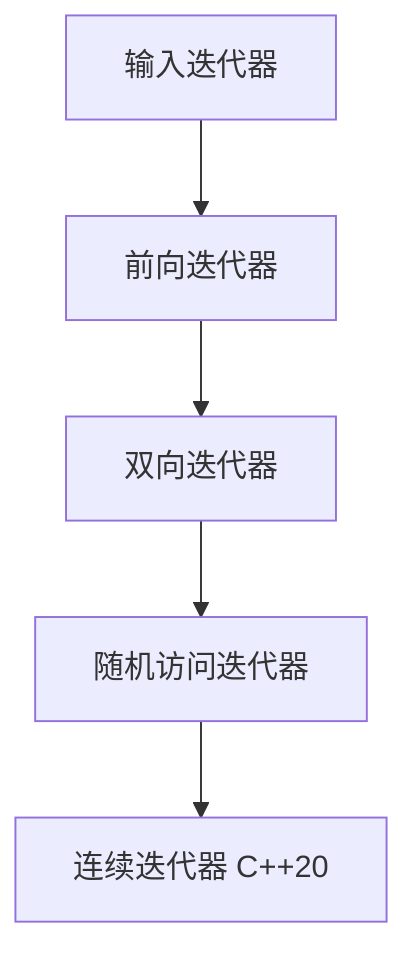

# C++ 随机访问迭代器

## 什么是随机访问迭代器

随机访问迭代器（Random Access Iterator）是C++ STL中功能最强大的一类迭代器。它不仅支持前向迭代器和双向迭代器的全部操作，还允许我们在常数时间内跳转到容器中的任意位置，就像我们使用数组下标一样方便。

随机访问迭代器的主要特点是：
- 支持随机访问元素（如 `it + n`, `it - n`）
- 支持迭代器之间的差值计算（如 `it2 - it1`）
- 支持比较操作（如 `<`, `<=`, `>`, `>=`）
- 可以直接访问元素（如 `it[n]`）

:::note
在STL容器中，`std::vector`、`std::deque` 和 `std::array` 支持随机访问迭代器，而 `std::list` 和关联容器如 `std::map` 则不支持。
:::

## 随机访问迭代器的操作

随机访问迭代器支持以下操作：

| 操作 | 描述 |
|------|------|
| `*it` | 解引用迭代器，访问它所指向的元素 |
| `it->member` | 访问迭代器所指向元素的成员 |
| `++it`, `it++` | 将迭代器向前移动一个位置 |
| `--it`, `it--` | 将迭代器向后移动一个位置 |
| `it + n` | 返回向前移动n个位置的迭代器 |
| `it - n` | 返回向后移动n个位置的迭代器 |
| `it += n` | 将迭代器向前移动n个位置 |
| `it -= n` | 将迭代器向后移动n个位置 |
| `it1 - it2` | 计算两个迭代器之间的距离 |
| `it[n]` | 访问相对于迭代器位置偏移n的元素（等同于 `*(it + n)`） |
| `it1 < it2`, `it1 <= it2`, `it1 > it2`, `it1 >= it2` | 比较两个迭代器的位置 |

## 随机访问迭代器的基本用法

让我们来看一个基本的例子，展示如何使用随机访问迭代器：

```cpp
#include <iostream>
#include <vector>

int main() {
    std::vector<int> numbers = {10, 20, 30, 40, 50};
    
    // 获取随机访问迭代器
    std::vector<int>::iterator it = numbers.begin();
    
    // 使用 * 操作符访问元素
    std::cout << "第一个元素: " << *it << std::endl;
    
    // 使用 + 操作符移动迭代器
    it = it + 2;
    std::cout << "第三个元素: " << *it << std::endl;
    
    // 使用 [] 操作符访问元素
    std::cout << "第五个元素: " << it[2] << std::endl;
    
    // 使用 -= 操作符移动迭代器
    it -= 1;
    std::cout << "第二个元素: " << *(it - 1) << std::endl;
    
    // 计算迭代器之间的距离
    auto distance = numbers.end() - numbers.begin();
    std::cout << "容器大小: " << distance << std::endl;
    
    return 0;
}
```

输出：
```
第一个元素: 10
第三个元素: 30
第五个元素: 50
第二个元素: 10
容器大小: 5
```

## 随机访问迭代器与其他迭代器的比较

C++标准库中的迭代器按照功能强弱可以分为五种类型：



- **输入迭代器**：只能读取元素，只能前进，不能比较（除了与同类型迭代器）
- **前向迭代器**：可以读取元素，可以前进，可以比较
- **双向迭代器**：可以读取元素，可以前进和后退，可以比较
- **随机访问迭代器**：可以读取元素，可以前进和后退，可以比较，可以随机访问
- **连续迭代器**（C++20）：是随机访问迭代器的增强版，保证元素在内存中连续存储

下表展示了不同容器支持的迭代器类型：

| 容器 | 迭代器类型 |
|------|------------|
| std::vector | 随机访问 |
| std::deque | 随机访问 |
| std::array | 随机访问 |
| std::list | 双向 |
| std::forward_list | 前向 |
| std::map, std::set | 双向 |
| std::unordered_map, std::unordered_set | 前向 |

## 随机访问迭代器的实际应用

### 1. 高效的元素访问和遍历

```cpp
#include <iostream>
#include <vector>
#include <chrono>

int main() {
    const int SIZE = 10000000;
    std::vector<int> vec(SIZE);
    
    // 填充向量
    for (int i = 0; i < SIZE; i++) {
        vec[i] = i;
    }
    
    // 使用随机访问迭代器访问元素
    auto start = std::chrono::high_resolution_clock::now();
    long long sum = 0;
    for (auto it = vec.begin(); it != vec.end(); ++it) {
        sum += *it;
    }
    auto end = std::chrono::high_resolution_clock::now();
    
    std::chrono::duration<double, std::milli> elapsed = end - start;
    std::cout << "使用迭代器遍历耗时: " << elapsed.count() << " ms\n";
    std::cout << "结果: " << sum << std::endl;
    
    return 0;
}
```

### 2. 实现二分查找

随机访问迭代器允许我们高效实现二分查找算法：

```cpp
#include <iostream>
#include <vector>
#include <algorithm>

template<typename RandomIt, typename T>
RandomIt binary_search_custom(RandomIt first, RandomIt last, const T& value) {
    while (first < last) {
        // 找到中间点
        RandomIt mid = first + (last - first) / 2;
        
        if (*mid == value) {
            return mid;  // 找到了目标值
        } else if (*mid < value) {
            first = mid + 1;  // 在右半部分继续查找
        } else {
            last = mid;       // 在左半部分继续查找
        }
    }
    return last;  // 没有找到目标值
}

int main() {
    std::vector<int> data = {1, 3, 4, 5, 7, 9, 11, 13, 15, 17, 19};
    
    // 使用我们自定义的二分查找
    int target = 11;
    auto it = binary_search_custom(data.begin(), data.end(), target);
    
    if (it != data.end() && *it == target) {
        std::cout << "找到值 " << target << " 在位置 " << (it - data.begin()) << std::endl;
    } else {
        std::cout << "未找到值 " << target << std::endl;
    }
    
    return 0;
}
```

输出：
```
找到值 11 在位置 6
```

### 3. 高效的排序和元素操作

```cpp
#include <iostream>
#include <vector>
#include <algorithm>

int main() {
    std::vector<int> data = {9, 5, 3, 7, 1, 8, 2, 6, 4};
    
    // 使用迭代器进行排序
    std::sort(data.begin(), data.end());
    
    std::cout << "排序后: ";
    for (int num : data) {
        std::cout << num << " ";
    }
    std::cout << std::endl;
    
    // 使用随机访问迭代器进行部分反转
    std::reverse(data.begin() + 2, data.begin() + 7);
    
    std::cout << "部分反转后: ";
    for (int num : data) {
        std::cout << num << " ";
    }
    std::cout << std::endl;
    
    return 0;
}
```

输出：
```
排序后: 1 2 3 4 5 6 7 8 9 
部分反转后: 1 2 7 6 5 4 3 8 9 
```

## 自定义类中实现随机访问迭代器

在实际项目中，我们可能需要为自定义容器类实现随机访问迭代器。下面是一个简单的示例：

```cpp
#include <iostream>
#include <iterator>

// 自定义容器类
template <typename T>
class MyContainer {
private:
    T* data;
    size_t capacity;
    size_t size_;

public:
    // 迭代器类实现
    class Iterator {
    private:
        T* ptr;
    
    public:
        // 迭代器特性类型定义
        using iterator_category = std::random_access_iterator_tag;
        using value_type = T;
        using difference_type = std::ptrdiff_t;
        using pointer = T*;
        using reference = T&;
        
        // 构造函数
        Iterator(T* p = nullptr) : ptr(p) {}
        
        // 解引用操作
        reference operator*() const { return *ptr; }
        pointer operator->() const { return ptr; }
        
        // 自增操作
        Iterator& operator++() { ++ptr; return *this; }
        Iterator operator++(int) { Iterator tmp = *this; ++ptr; return tmp; }
        
        // 自减操作
        Iterator& operator--() { --ptr; return *this; }
        Iterator operator--(int) { Iterator tmp = *this; --ptr; return tmp; }
        
        // 随机访问操作
        Iterator& operator+=(difference_type n) { ptr += n; return *this; }
        Iterator operator+(difference_type n) const { return Iterator(ptr + n); }
        Iterator& operator-=(difference_type n) { ptr -= n; return *this; }
        Iterator operator-(difference_type n) const { return Iterator(ptr - n); }
        difference_type operator-(const Iterator& other) const { return ptr - other.ptr; }
        
        // 下标操作
        reference operator[](difference_type n) const { return ptr[n]; }
        
        // 比较操作
        bool operator==(const Iterator& other) const { return ptr == other.ptr; }
        bool operator!=(const Iterator& other) const { return ptr != other.ptr; }
        bool operator<(const Iterator& other) const { return ptr < other.ptr; }
        bool operator<=(const Iterator& other) const { return ptr <= other.ptr; }
        bool operator>(const Iterator& other) const { return ptr > other.ptr; }
        bool operator>=(const Iterator& other) const { return ptr >= other.ptr; }
    };
    
    MyContainer(size_t cap = 10) : capacity(cap), size_(0) {
        data = new T[capacity];
    }
    
    ~MyContainer() {
        delete[] data;
    }
    
    void push_back(const T& value) {
        if (size_ < capacity) {
            data[size_++] = value;
        }
    }
    
    size_t size() const { return size_; }
    
    // 迭代器方法
    Iterator begin() { return Iterator(data); }
    Iterator end() { return Iterator(data + size_); }
};

// 全局运算符重载
template <typename T>
typename MyContainer<T>::Iterator operator+(
    typename MyContainer<T>::Iterator::difference_type n,
    const typename MyContainer<T>::Iterator& it) {
    return it + n;
}

int main() {
    MyContainer<int> container;
    for (int i = 0; i < 10; i++) {
        container.push_back(i * 10);
    }
    
    // 使用迭代器遍历
    std::cout << "容器内容: ";
    for (auto it = container.begin(); it != container.end(); ++it) {
        std::cout << *it << " ";
    }
    std::cout << std::endl;
    
    // 随机访问
    auto it = container.begin();
    std::cout << "第三个元素: " << *(it + 2) << std::endl;
    std::cout << "第五个元素: " << it[4] << std::endl;
    
    // 计算距离
    auto mid = container.begin() + 5;
    std::cout << "从开始到中间的距离: " << mid - container.begin() << std::endl;
    
    return 0;
}
```

输出：
```
容器内容: 0 10 20 30 40 50 60 70 80 90 
第三个元素: 20
第五个元素: 40
从开始到中间的距离: 5
```

## 常见错误和注意事项

:::caution
1. **越界访问**：使用随机访问迭代器时，特别容易发生越界访问。始终确保你的迭代器在容器的有效范围内。

2. **无效迭代器**：对容器进行修改操作（如插入、删除）可能会使迭代器失效。在修改容器后，应谨慎使用之前获取的迭代器。

3. **使用错误的迭代器类型**：不是所有容器都支持随机访问迭代器。例如，`std::list` 和关联容器只支持双向迭代器。
:::

## 使用随机访问迭代器的最佳实践

1. **尽量使用算法库**：STL算法库中的许多函数都针对随机访问迭代器进行了优化。

2. **合理利用迭代器的算术操作**：随机访问迭代器允许你进行如 `it + n` 的操作，这比调用 `std::advance(it, n)` 更直观高效。

3. **考虑使用 `auto`**：使用 `auto` 关键字可以避免冗长的迭代器类型声明。

```cpp
auto it = vec.begin(); // 替代 std::vector<int>::iterator it = vec.begin();
```

4. **了解迭代器的性能特性**：随机访问迭代器提供O(1)时间复杂度的访问，而其他类型的迭代器可能需要O(n)时间复杂度。

## 总结

随机访问迭代器是C++ STL中最强大的迭代器类型，它为我们提供了类似数组的随机访问能力。主要特点包括支持算术运算（如 `+`, `-`），比较操作（如 `<`, `>`），以及下标访问（如 `[]`）。

随机访问迭代器被 `std::vector`、`std::deque` 和 `std::array` 等容器支持，是实现高效算法的关键工具。通过本文的学习，你应该能够理解随机访问迭代器的概念，掌握其基本操作，并能够在实际编程中灵活运用。

## 练习题

1. 编写一个函数，使用随机访问迭代器实现容器元素的反转（不使用 `std::reverse`）。

2. 实现一个函数，使用随机访问迭代器来旋转容器中的元素（将前n个元素移到末尾）。

3. 创建一个自定义类，为其实现支持随机访问的迭代器，并使用这些迭代器实现一个简单的查找算法。

## 相关资源

- [C++ 参考手册 - 迭代器](https://en.cppreference.com/w/cpp/iterator)
- [C++标准模板库(STL) - 迭代器](https://www.cplusplus.com/reference/iterator/)
- 《Effective STL》by Scott Meyers

通过掌握随机访问迭代器，你将能更高效地操作容器，更深入地理解STL的工作原理，迈向C++编程的下一个层次。