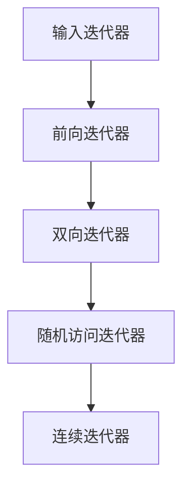

# C++ 连续迭代器(C++20)

## 引言

C++20标准引入了一个新的迭代器概念——连续迭代器（Contiguous Iterator）。它是随机访问迭代器的一个更专门的类别，提供了对内存中连续存储元素的额外保证。在本文中，我们将深入探讨连续迭代器的概念、特点以及在实际开发中的应用。

## 什么是连续迭代器

连续迭代器是C++20中引入的新迭代器概念，是迭代器类别层次结构中最专门的一种。它们具有以下特点：

1. 满足随机访问迭代器的所有要求
2. 额外保证其所指向的元素在内存中是连续存储的
3. 使得迭代器与指针之间的转换更加自然和安全

简单来说，如果一个容器的元素在内存中是相邻存储的（如数组、`std::vector`、`std::string`等），则可以提供连续迭代器来访问这些元素。

## 迭代器概念层次结构

在C++20中，迭代器按能力从低到高被分为以下几类：



连续迭代器位于这个层次结构的顶端，这意味着它拥有其他所有类型迭代器的全部功能，并额外具有内存连续性保证。

## 连续迭代器的要求

要成为一个连续迭代器，必须满足以下要求：

1. 满足随机访问迭代器的所有要求
2. 对于任何两个迭代器 `a` 和 `b` 及其之间的距离 `n`，满足 `*(a + n) = *(std::addressof(*a) + n)`
3. 对于迭代器 `i` 和 `j`，如果 `i <= j`，则 `std::addressof(*i) <= std::addressof(*j)`

:::note
第2点本质上是说，通过迭代器算术得到的结果等同于通过原始指针算术得到的结果。第3点则确保了元素在内存中的顺序与迭代顺序一致。
:::

## 支持连续迭代器的标准容器

C++20中，以下标准容器提供了符合连续迭代器要求的迭代器：

- `std::array`
- `std::vector`
- `std::string`
- `std::string_view`
- `std::span`（C++20新增）
- 原生数组

## 连续迭代器的应用场景

### 1. 高效内存访问

由于连续迭代器保证元素在内存中连续存储，它非常适合需要高性能内存访问的场景：

```cpp
#include <vector>
#include <iostream>

int main() {
    std::vector<int> vec = {1, 2, 3, 4, 5};
    
    // 使用连续迭代器进行访问
    auto it = vec.begin();
    
    // 可以直接获取底层指针
    int* ptr = &(*it);
    
    // 可以直接进行指针算术
    for (int i = 0; i < vec.size(); ++i) {
        std::cout << ptr[i] << " ";
    }
    // 输出: 1 2 3 4 5
    
    return 0;
}
```

### 2. 与C风格API的无缝集成

连续迭代器非常适合与期望指向连续内存的函数（如C风格API）进行交互：

```cpp
#include <vector>
#include <cstring>
#include <iostream>

void c_style_function(const int* data, size_t size) {
    for (size_t i = 0; i < size; ++i) {
        std::cout << data[i] << " ";
    }
}

int main() {
    std::vector<int> vec = {10, 20, 30, 40, 50};
    
    // 直接将vector的数据传递给C风格函数
    c_style_function(vec.data(), vec.size());  // 输出: 10 20 30 40 50
    
    // 也可以通过迭代器
    c_style_function(&(*vec.begin()), vec.size());  // 输出: 10 20 30 40 50
    
    return 0;
}
```

### 3. 使用std::span进行连续内存视图操作

`std::span`是C++20引入的一个非常有用的容器适配器，它提供了对连续存储序列的视图：

```cpp
#include <span>
#include <vector>
#include <array>
#include <iostream>

// 接受任何连续存储的容器
void process(std::span<const int> data) {
    for (int value : data) {
        std::cout << value << " ";
    }
    std::cout << std::endl;
}

int main() {
    // 使用vector
    std::vector<int> vec = {1, 2, 3, 4, 5};
    process(vec);  // 输出: 1 2 3 4 5
    
    // 使用array
    std::array<int, 3> arr = {10, 20, 30};
    process(arr);  // 输出: 10 20 30
    
    // 使用原生数组
    int c_array[] = {100, 200, 300, 400};
    process(c_array);  // 输出: 100 200 300 400
    
    // 使用部分序列
    process(std::span(vec).subspan(1, 3));  // 输出: 2 3 4
    
    return 0;
}
```

## 在编译时检查迭代器概念

C++20的概念（Concepts）特性允许我们在编译时检查迭代器类型：

```cpp
#include <concepts>
#include <vector>
#include <list>
#include <forward_list>
#include <string>
#include <iostream>

template<std::contiguous_iterator Iter>
void process_contiguous(Iter begin, Iter end) {
    std::cout << "Processing with contiguous iterator" << std::endl;
}

template<std::random_access_iterator Iter>
void process_random_access(Iter begin, Iter end) {
    std::cout << "Processing with random access iterator" << std::endl;
}

int main() {
    std::vector<int> vec = {1, 2, 3};
    process_contiguous(vec.begin(), vec.end());  // 可以
    process_random_access(vec.begin(), vec.end());  // 也可以
    
    std::list<int> lst = {1, 2, 3};
    // process_contiguous(lst.begin(), lst.end());  // 编译错误，list不提供连续迭代器
    process_random_access(lst.begin(), lst.end());  // 编译错误，list不提供随机访问迭代器
    
    std::string str = "hello";
    process_contiguous(str.begin(), str.end());  // 可以
    
    return 0;
}
```

## 性能优势

连续迭代器因其内存布局而具有明显的性能优势：

1. **缓存友好性**：连续内存访问可以更好地利用CPU缓存
2. **矢量化**：编译器可以更容易地为连续内存操作生成SIMD指令
3. **直接内存访问**：可以使用指针算术直接访问元素

## 实际案例：图像处理

以下是一个简单的图像处理示例，展示了连续迭代器在实际应用中的优势：

```cpp
#include <vector>
#include <algorithm>
#include <iostream>

// 简单的像素结构
struct Pixel {
    unsigned char r, g, b;
};

// 图像类
class Image {
private:
    std::vector<Pixel> pixels;
    size_t width, height;

public:
    Image(size_t w, size_t h) : width(w), height(h) {
        pixels.resize(w * h);
    }

    // 获取像素引用
    Pixel& at(size_t x, size_t y) {
        return pixels[y * width + x];
    }

    // 获取迭代器
    auto begin() { return pixels.begin(); }
    auto end() { return pixels.end(); }
    
    // 图像尺寸
    size_t getWidth() const { return width; }
    size_t getHeight() const { return height; }
};

// 应用灰度滤镜
void applyGrayscaleFilter(Image& img) {
    // 由于Image使用vector存储像素，其迭代器是连续迭代器
    // 可以进行高效的遍历
    std::for_each(img.begin(), img.end(), [](Pixel& p) {
        // 简单的灰度转换公式
        unsigned char gray = static_cast<unsigned char>(0.299 * p.r + 0.587 * p.g + 0.114 * p.b);
        p.r = p.g = p.b = gray;
    });
}

int main() {
    // 创建一个10x10的图像
    Image img(10, 10);
    
    // 设置一些像素值
    for (size_t y = 0; y < img.getHeight(); ++y) {
        for (size_t x = 0; x < img.getWidth(); ++x) {
            img.at(x, y) = {
                static_cast<unsigned char>(x * 25), 
                static_cast<unsigned char>(y * 25), 
                static_cast<unsigned char>((x+y) * 12)
            };
        }
    }
    
    // 应用灰度滤镜
    applyGrayscaleFilter(img);
    
    // 输出几个像素的值
    std::cout << "灰度图像像素示例:" << std::endl;
    for (size_t i = 0; i < 3; ++i) {
        Pixel& p = img.at(i, i);
        std::cout << "Pixel(" << i << "," << i << "): " 
                  << static_cast<int>(p.r) << " " 
                  << static_cast<int>(p.g) << " " 
                  << static_cast<int>(p.b) << std::endl;
    }
    
    return 0;
}
```

## 总结

连续迭代器是C++20中一个强大的新概念，它为需要高性能内存访问的应用场景提供了明确的保证和优化机会。理解连续迭代器的特性可以帮助我们：

1. 编写更高效的代码，特别是在处理大量数据时
2. 更好地与需要连续内存布局的API（如图形库、网络库等）进行交互
3. 在适当的场景选择正确的容器类型
4. 利用`std::span`等新工具更灵活地处理连续内存

随着C++20的广泛应用，连续迭代器将成为高性能C++程序设计的重要工具之一。

## 练习

1. 编写一个函数模板，接受任何提供连续迭代器的容器，并计算其元素的和。
2. 使用`std::span`创建一个函数，可以处理任何连续容器的子序列。
3. 比较使用连续迭代器和使用非连续迭代器（如`std::list`的迭代器）执行相同操作的性能差异。
4. 实现一个简单的矩阵类，利用连续迭代器提供高效的矩阵运算。

## 延伸阅读

- [C++20标准中的迭代器概念](https://en.cppreference.com/w/cpp/iterator)
- [std::span详解](https://en.cppreference.com/w/cpp/container/span)
- [C++20概念（Concepts）](https://en.cppreference.com/w/cpp/language/constraints)