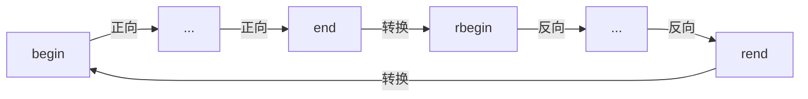

# C++ 迭代器适配器

## 什么是迭代器适配器？

迭代器适配器(Iterator Adaptor)是C++ STL中的一种特殊迭代器，它可以转换一个迭代器的行为，使其具有新的功能或不同的特性。迭代器适配器不直接访问容器元素，而是通过封装一个基础迭代器，修改其默认行为来实现特定功能。

C++标准库提供了三种主要的迭代器适配器：

1. **反向迭代器**（Reverse Iterator）
2. **插入迭代器**（Insert Iterator）
3. **流迭代器**（Stream Iterator）

这些适配器允许我们以更灵活的方式操作容器和数据流，极大地扩展了迭代器的功能。

:::tip
迭代器适配器是学习STL的重要内容，掌握它们可以让你更高效地处理容器操作。
:::

## 反向迭代器（Reverse Iterator）

### 概念介绍

反向迭代器使容器可以从尾到头反向遍历。它将前向移动转换为后向移动，即`++`操作变成向前一个元素，`--`操作变成向后一个元素。

### 如何获取反向迭代器

所有支持双向迭代的STL容器都提供了`rbegin()`和`rend()`方法来获取反向迭代器：

- `rbegin()` - 返回指向容器最后一个元素的反向迭代器
- `rend()` - 返回指向容器第一个元素之前位置的反向迭代器

### 代码示例

```cpp
#include <iostream>
#include <vector>

int main() {
    std::vector<int> vec = {1, 2, 3, 4, 5};
    
    // 正向遍历
    std::cout << "正向遍历: ";
    for (auto it = vec.begin(); it != vec.end(); ++it) {
        std::cout << *it << " ";
    }
    std::cout << std::endl;
    
    // 反向遍历
    std::cout << "反向遍历: ";
    for (auto rit = vec.rbegin(); rit != vec.rend(); ++rit) {
        std::cout << *rit << " ";
    }
    std::cout << std::endl;
    
    return 0;
}
```

**输出结果：**
```
正向遍历: 1 2 3 4 5 
反向遍历: 5 4 3 2 1 
```

### 转换关系

反向迭代器和正向迭代器存在一个重要的对应关系：反向迭代器的`rbegin()`对应正向迭代器的`end()-1`，而`rend()`对应正向迭代器的`begin()-1`。



## 插入迭代器（Insert Iterator）

插入迭代器是一种输出迭代器，用于在容器中插入元素而不是覆盖现有元素。STL提供了三种插入迭代器：

### 1. 后向插入迭代器（back_inserter）

将元素添加到容器的末尾，要求容器支持`push_back()`方法。

```cpp
#include <iostream>
#include <vector>
#include <algorithm>
#include <iterator>

int main() {
    std::vector<int> source = {1, 2, 3, 4, 5};
    std::vector<int> dest;
    
    // 使用后向插入迭代器将source中的元素复制到dest
    std::copy(source.begin(), source.end(), 
              std::back_inserter(dest));
    
    // 输出dest中的元素
    std::cout << "dest: ";
    for (auto i : dest) {
        std::cout << i << " ";
    }
    std::cout << std::endl;
    
    return 0;
}
```

**输出结果：**
```
dest: 1 2 3 4 5 
```

### 2. 前向插入迭代器（front_inserter）

将元素添加到容器的开头，要求容器支持`push_front()`方法。

```cpp
#include <iostream>
#include <list>
#include <algorithm>
#include <iterator>

int main() {
    std::list<int> source = {1, 2, 3, 4, 5};
    std::list<int> dest;
    
    // 使用前向插入迭代器将source中的元素复制到dest
    std::copy(source.begin(), source.end(), 
              std::front_inserter(dest));
    
    // 输出dest中的元素
    std::cout << "dest: ";
    for (auto i : dest) {
        std::cout << i << " ";
    }
    std::cout << std::endl;
    
    return 0;
}
```

**输出结果：**
```
dest: 5 4 3 2 1 
```

:::note
注意这里的输出顺序是反过来的，这是因为每次插入都在容器的开头，导致元素顺序颠倒。
:::

### 3. 一般插入迭代器（inserter）

在容器的指定位置前插入元素，要求容器支持`insert()`方法。

```cpp
#include <iostream>
#include <vector>
#include <algorithm>
#include <iterator>

int main() {
    std::vector<int> source = {1, 2, 3, 4, 5};
    std::vector<int> dest = {10, 20, 30};
    
    // 使用一般插入迭代器在dest[1]位置前插入source中的元素
    std::copy(source.begin(), source.end(), 
              std::inserter(dest, dest.begin() + 1));
    
    // 输出dest中的元素
    std::cout << "dest: ";
    for (auto i : dest) {
        std::cout << i << " ";
    }
    std::cout << std::endl;
    
    return 0;
}
```

**输出结果：**
```
dest: 10 1 2 3 4 5 20 30 
```

## 流迭代器（Stream Iterator）

流迭代器提供了在STL容器和输入/输出流之间传输数据的便捷方式。

### 1. 输入流迭代器（istream_iterator）

输入流迭代器从输入流读取数据，如从标准输入或文件读取数据。

```cpp
#include <iostream>
#include <iterator>
#include <vector>
#include <algorithm>

int main() {
    // 从标准输入读取数字，以非数字输入结束
    std::cout << "请输入一些整数，以非整数输入结束：" << std::endl;
    std::istream_iterator<int> input_iter(std::cin);
    std::istream_iterator<int> eof; // 默认构造的流迭代器表示EOF
    
    // 使用流迭代器直接构造vector
    std::vector<int> numbers(input_iter, eof);
    
    // 计算和
    int sum = std::accumulate(numbers.begin(), numbers.end(), 0);
    
    // 输出结果
    std::cout << "你输入了" << numbers.size() << "个整数，总和为：" << sum << std::endl;
    
    return 0;
}
```

**输入示例：**
```
5 10 15 20 q
```

**输出结果：**
```
请输入一些整数，以非整数输入结束：
5 10 15 20 q
你输入了4个整数，总和为：50
```

### 2. 输出流迭代器（ostream_iterator）

输出流迭代器将数据写入输出流，如标准输出或文件。

```cpp
#include <iostream>
#include <iterator>
#include <vector>
#include <algorithm>

int main() {
    std::vector<int> numbers = {1, 2, 3, 4, 5};
    
    // 创建输出流迭代器，以空格分隔
    std::ostream_iterator<int> output_iter(std::cout, " ");
    
    // 直接输出vector中的内容
    std::copy(numbers.begin(), numbers.end(), output_iter);
    std::cout << std::endl;
    
    // 也可以直接使用赋值运算符
    std::cout << "每个数字的平方：";
    for (int num : numbers) {
        *output_iter = num * num;  // 实际上是调用了operator=
        ++output_iter;  // 这行是可选的，不会做任何事
    }
    std::cout << std::endl;
    
    return 0;
}
```

**输出结果：**
```
1 2 3 4 5 
每个数字的平方：1 4 9 16 25 
```

## 实际应用案例

### 案例1：使用反向迭代器查找最后出现的元素

```cpp
#include <iostream>
#include <vector>
#include <algorithm>

int main() {
    std::vector<int> data = {1, 5, 3, 7, 2, 5, 9, 4, 5, 8};
    
    // 查找最后一个值为5的元素
    auto rit = std::find(data.rbegin(), data.rend(), 5);
    
    if (rit != data.rend()) {
        // 计算正向索引位置
        std::cout << "最后一个值为5的元素在位置: " 
                  << std::distance(data.begin(), (rit + 1).base() - 1)
                  << std::endl;
    }
    
    return 0;
}
```

**输出结果：**
```
最后一个值为5的元素在位置: 8
```

:::caution
在将反向迭代器转换为正向迭代器位置时要小心。`rit.base()`指向的是反向迭代器当前指向元素的下一个位置，所以通常需要进行调整。
:::

### 案例2：使用插入迭代器合并容器

```cpp
#include <iostream>
#include <vector>
#include <set>
#include <algorithm>
#include <iterator>

int main() {
    std::vector<int> vec1 = {1, 3, 5, 7, 9};
    std::vector<int> vec2 = {2, 4, 6, 8, 10};
    
    // 使用set存储合并且排序后的元素
    std::set<int> result;
    
    // 将两个vector合并到set中
    std::copy(vec1.begin(), vec1.end(), std::inserter(result, result.end()));
    std::copy(vec2.begin(), vec2.end(), std::inserter(result, result.end()));
    
    // 输出结果
    std::cout << "合并和排序后的结果: ";
    std::copy(result.begin(), result.end(), 
              std::ostream_iterator<int>(std::cout, " "));
    std::cout << std::endl;
    
    return 0;
}
```

**输出结果：**
```
合并和排序后的结果: 1 2 3 4 5 6 7 8 9 10 
```

### 案例3：使用流迭代器进行文件操作

```cpp
#include <iostream>
#include <fstream>
#include <iterator>
#include <vector>
#include <algorithm>

int main() {
    // 创建示例数据
    std::vector<int> data = {10, 20, 30, 40, 50};
    
    // 写入文件
    {
        std::ofstream outFile("numbers.txt");
        if (!outFile) {
            std::cerr << "无法创建文件!" << std::endl;
            return 1;
        }
        
        std::copy(data.begin(), data.end(), 
                  std::ostream_iterator<int>(outFile, "\n"));
    }
    
    // 从文件读取
    {
        std::ifstream inFile("numbers.txt");
        if (!inFile) {
            std::cerr << "无法打开文件!" << std::endl;
            return 1;
        }
        
        std::vector<int> readData(
            std::istream_iterator<int>(inFile),
            std::istream_iterator<int>()
        );
        
        // 计算读取数据的和
        int sum = std::accumulate(readData.begin(), readData.end(), 0);
        
        std::cout << "从文件读取的数据和为: " << sum << std::endl;
    }
    
    return 0;
}
```

**输出结果：**
```
从文件读取的数据和为: 150
```

## 总结

迭代器适配器是C++ STL中强大且灵活的工具，它们扩展了基础迭代器的功能：

1. **反向迭代器**允许我们以相反的顺序访问容器元素
2. **插入迭代器**帮助我们在不覆盖现有数据的情况下添加新元素
3. **流迭代器**提供了容器和I/O流之间的桥梁

掌握这些迭代器适配器可以帮助你编写更简洁、更高效的代码，并更好地利用STL算法。

## 练习

1. 使用反向迭代器打印字符串的反序。
2. 实现一个程序，从用户输入读取一系列数字，然后输出它们的平方值。
3. 使用插入迭代器将两个有序容器合并为一个有序容器。
4. 编写程序使用流迭代器从文件中读取单词，计算出现次数最多的单词。

## 附加资源

- C++ 标准库文档中关于[迭代器库](https://en.cppreference.com/w/cpp/iterator)的部分
- 《Effective STL》 by Scott Meyers，深入讲解STL迭代器和算法的使用
- 《C++ Primer》第5版，第10章对迭代器有详细介绍

这些迭代器适配器不仅是C++ STL的重要组成部分，也是理解和充分利用STL算法库的关键工具。通过灵活运用这些适配器，你可以使代码更加简洁、高效且易于维护。