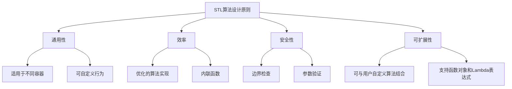

# C++ 算法库概述

## 什么是C++ STL算法库

C++ STL（Standard Template Library，标准模板库）算法库是C++标准库的重要组成部分，提供了一系列通用算法，可以对容器中的元素进行各种操作，如搜索、排序、计数、操作和数值计算等。这些算法设计为与STL容器（如`vector`、`list`、`map`等）和迭代器配合使用，从而实现高效且通用的数据处理功能。

:::note
算法库的核心优势在于**通用性**和**效率**。通过使用STL算法，你可以避免重复编写常见的算法逻辑，提高代码质量和开发效率。
:::

## STL算法库的位置

STL算法主要定义在以下几个头文件中：

- `<algorithm>`: 包含大多数通用算法
- `<numeric>`: 包含数值相关的算法
- `<functional>`: 包含函数对象和函数适配器

## STL算法分类

STL算法库中的算法可以大致分为以下几类：

### 1. 非修改性序列操作

这类算法不会修改容器中的元素，主要用于查找、计数等操作。

常见算法包括：
- `find`、`find_if`：查找元素
- `count`、`count_if`：计数元素
- `for_each`：对每个元素执行操作
- `equal`、`mismatch`：比较序列

### 2. 修改性序列操作

这类算法会修改容器中的元素值或顺序。

常见算法包括：
- `copy`、`move`：复制或移动元素
- `transform`：转换元素
- `replace`、`replace_if`：替换元素
- `fill`、`generate`：填充元素
- `remove`、`remove_if`：移除元素

### 3. 排序和相关操作

这类算法提供了各种排序功能和与排序相关的操作。

常见算法包括：
- `sort`、`stable_sort`：排序
- `partial_sort`：部分排序
- `nth_element`：找到第n个元素
- `binary_search`、`lower_bound`、`upper_bound`：二分查找
- `merge`：合并有序序列
- `min`、`max`、`minmax`：找最小值、最大值

### 4. 数值算法

这类算法用于进行数值计算。

常见算法包括：
- `accumulate`：累加
- `inner_product`：内积
- `partial_sum`：部分和
- `adjacent_difference`：相邻差

## 基本使用方式

大多数STL算法都遵循类似的调用模式，通常需要指定操作范围（通过迭代器）以及可能的其他参数：

```cpp
algorithm_name(InputIterator first, InputIterator last, ... other params ...);
```

## 常用算法示例

### 例1: 查找元素 (find)

```cpp
#include <iostream>
#include <vector>
#include <algorithm>

int main() {
    std::vector<int> numbers = {1, 2, 3, 4, 5};
    
    // 查找值为3的元素
    auto it = std::find(numbers.begin(), numbers.end(), 3);
    
    if (it != numbers.end()) {
        std::cout << "找到元素3，位置: " << (it - numbers.begin()) << std::endl;
    } else {
        std::cout << "未找到元素3" << std::endl;
    }
    
    return 0;
}
```

**输出:**
```
找到元素3，位置: 2
```

### 例2: 排序 (sort)

```cpp
#include <iostream>
#include <vector>
#include <algorithm>

int main() {
    std::vector<int> numbers = {5, 2, 8, 1, 9};
    
    // 升序排序
    std::sort(numbers.begin(), numbers.end());
    
    std::cout << "升序排序后: ";
    for (const auto& num : numbers) {
        std::cout << num << " ";
    }
    std::cout << std::endl;
    
    // 降序排序
    std::sort(numbers.begin(), numbers.end(), std::greater<int>());
    
    std::cout << "降序排序后: ";
    for (const auto& num : numbers) {
        std::cout << num << " ";
    }
    std::cout << std::endl;
    
    return 0;
}
```

**输出:**
```
升序排序后: 1 2 5 8 9 
降序排序后: 9 8 5 2 1 
```

### 例3: 累加 (accumulate)

```cpp
#include <iostream>
#include <vector>
#include <numeric>

int main() {
    std::vector<int> numbers = {1, 2, 3, 4, 5};
    
    // 计算总和
    int sum = std::accumulate(numbers.begin(), numbers.end(), 0);
    std::cout << "总和: " << sum << std::endl;
    
    // 计算乘积
    int product = std::accumulate(numbers.begin(), numbers.end(), 1, 
                                  std::multiplies<int>());
    std::cout << "乘积: " << product << std::endl;
    
    return 0;
}
```

**输出:**
```
总和: 15
乘积: 120
```

## 自定义比较函数

许多STL算法允许你传入自定义的比较函数或谓词(predicate)，以便根据特定需求进行操作。

```cpp
#include <iostream>
#include <vector>
#include <algorithm>

// 自定义结构体
struct Person {
    std::string name;
    int age;
};

int main() {
    std::vector<Person> people = {
        {"张三", 25},
        {"李四", 30},
        {"王五", 20}
    };
    
    // 按年龄排序
    std::sort(people.begin(), people.end(),
              [](const Person& a, const Person& b) {
                  return a.age < b.age;
              });
    
    std::cout << "按年龄排序后:" << std::endl;
    for (const auto& person : people) {
        std::cout << person.name << ": " << person.age << "岁" << std::endl;
    }
    
    return 0;
}
```

**输出:**
```
按年龄排序后:
王五: 20岁
张三: 25岁
李四: 30岁
```

## 实际应用场景

### 场景1: 数据分析

假设我们有一组销售数据，需要找出销售额最高的几项产品：

```cpp
#include <iostream>
#include <vector>
#include <algorithm>
#include <string>

struct Product {
    std::string name;
    double sales;
};

int main() {
    std::vector<Product> products = {
        {"电视", 15000.0},
        {"手机", 25000.0},
        {"电脑", 30000.0},
        {"耳机", 5000.0},
        {"平板", 12000.0}
    };
    
    // 按销售额降序排序
    std::sort(products.begin(), products.end(),
              [](const Product& a, const Product& b) {
                  return a.sales > b.sales;
              });
    
    // 显示销售额最高的3项产品
    std::cout << "销售额最高的3项产品:" << std::endl;
    int count = 0;
    for (const auto& product : products) {
        std::cout << product.name << ": " << product.sales << std::endl;
        count++;
        if (count >= 3) break;
    }
    
    return 0;
}
```

**输出:**
```
销售额最高的3项产品:
电脑: 30000
手机: 25000
电视: 15000
```

### 场景2: 文本处理

假设我们需要统计一段文本中每个单词出现的次数：

```cpp
#include <iostream>
#include <vector>
#include <algorithm>
#include <string>
#include <sstream>
#include <map>

int main() {
    std::string text = "the quick brown fox jumps over the lazy dog";
    std::istringstream iss(text);
    std::vector<std::string> words;
    std::string word;
    
    // 拆分文本为单词
    while (iss >> word) {
        words.push_back(word);
    }
    
    // 统计每个单词出现的次数
    std::map<std::string, int> wordCount;
    for (const auto& w : words) {
        wordCount[w]++;
    }
    
    // 显示结果
    std::cout << "单词统计结果:" << std::endl;
    for (const auto& pair : wordCount) {
        std::cout << pair.first << ": " << pair.second << std::endl;
    }
    
    return 0;
}
```

**输出:**
```
单词统计结果:
brown: 1
dog: 1
fox: 1
jumps: 1
lazy: 1
over: 1
quick: 1
the: 2
```

## 算法库设计原则

STL算法库遵循以下设计原则：



## 性能考虑

使用STL算法通常比自己编写循环更高效，因为：

1. STL算法是由C++专家精心优化过的
2. 对于特定容器，算法可能有特殊优化
3. 编译器对标准库函数通常有更好的优化策略

## 总结

C++ STL算法库是一套功能强大、设计优雅的工具集，为C++程序员提供了丰富的算法实现，使开发者能够专注于更高层次的问题解决，而不必重新发明轮子。

主要优点包括：

- **通用性**：可以与任何符合要求的容器和迭代器一起工作
- **效率**：经过优化的实现，性能出色
- **可读性**：使用标准算法可以提高代码的表达能力和可读性
- **可靠性**：经过广泛测试的代码，减少错误

初学者应该逐步熟悉STL算法库中的常用算法，并学习如何在实际编程中应用它们。随着经验的积累，你会发现STL算法库是C++编程中不可或缺的工具。

## 练习与深入学习

1. 实现一个程序，从用户输入中读取一串数字，然后计算它们的平均值、最大值和最小值。
2. 使用`std::transform`将一个字符串中的所有小写字母转换为大写。
3. 实现一个简单的文本文件单词频率分析器，统计文件中出现频率最高的10个单词。
4. 使用`std::remove_if`和`std::erase`组合删除向量中的所有偶数。
5. 尝试使用`std::partition`将一个数组分成奇数在前、偶数在后的两部分。

### 进一步阅读资源

- C++ 参考文档 - [https://en.cppreference.com/w/cpp/algorithm](https://en.cppreference.com/w/cpp/algorithm)
- 《Effective STL》 - Scott Meyers
- 《The C++ Standard Library》 - Nicolai M. Josuttis