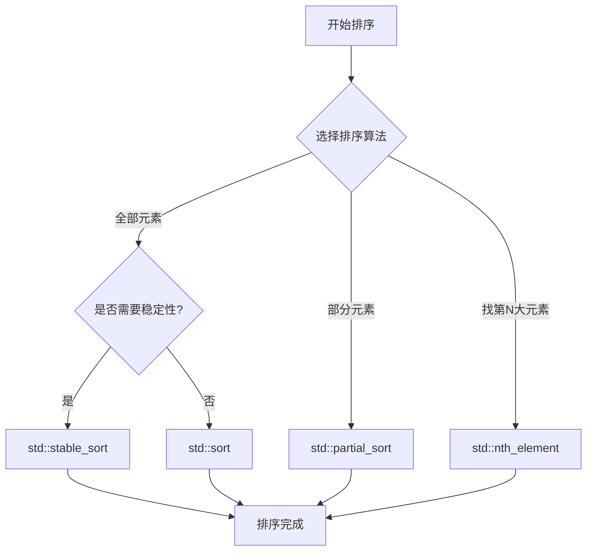

# C++ 排序操作

## 引言

在编程中，排序是一项基础且常见的操作。无论是对用户数据进行分类、准备数据进行分析，还是优化搜索算法，高效的排序操作都是不可或缺的。C++标准模板库(STL)提供了多种排序算法，使开发者能够根据不同场景选择最适合的排序方法。

本文将详细介绍C++中的各种排序操作，包括基本用法、效率分析以及实际应用场景，帮助你掌握这一重要的程序设计工具。

## 基础知识

在深入了解排序操作前，我们需要先了解一些基础知识：

1. **迭代器(Iterator)**：STL中的排序算法通常使用迭代器指定排序范围。
2. **比较函数**：决定元素如何排序的规则。
3. **排序稳定性**：指相等元素在排序后是否保持原有顺序。
4. **时间复杂度**：不同排序算法的效率特性。

## std::sort - 基本排序函数

`std::sort` 是最常用的排序算法，它实现了一种优化的快速排序。

### 基本用法

```cpp
#include <iostream>
#include <vector>
#include <algorithm>

int main() {
    std::vector<int> numbers = {5, 2, 8, 1, 9, 3};
    
    // 升序排序
    std::sort(numbers.begin(), numbers.end());
    
    // 输出排序结果
    for (int num : numbers) {
        std::cout << num << " ";
    }
    // 输出: 1 2 3 5 8 9
    
    return 0;
}
```

### 自定义比较函数

你可以提供自定义的比较函数来控制排序方式：

```cpp
#include <iostream>
#include <vector>
#include <algorithm>

// 自定义比较函数
bool descending(int a, int b) {
    return a > b;  // 降序排序
}

int main() {
    std::vector<int> numbers = {5, 2, 8, 1, 9, 3};
    
    // 使用自定义比较函数
    std::sort(numbers.begin(), numbers.end(), descending);
    
    // 输出排序结果
    for (int num : numbers) {
        std::cout << num << " ";
    }
    // 输出: 9 8 5 3 2 1
    
    return 0;
}
```

### 使用Lambda表达式

C++11引入的Lambda表达式可以让代码更简洁：

```cpp
std::vector<int> numbers = {5, 2, 8, 1, 9, 3};
    
// 使用Lambda表达式实现降序排序
std::sort(numbers.begin(), numbers.end(), [](int a, int b) {
    return a > b;
});
```

### 对结构体/类排序

对于结构体或类，可以定义操作符或比较函数：

```cpp
#include <iostream>
#include <vector>
#include <algorithm>
#include <string>

struct Student {
    std::string name;
    int age;
    double score;
    
    // 重载小于操作符用于排序
    bool operator<(const Student& other) const {
        return score > other.score;  // 按分数降序
    }
};

int main() {
    std::vector<Student> students = {
        {"Alice", 20, 85.5},
        {"Bob", 22, 91.0},
        {"Charlie", 19, 78.5}
    };
    
    // 使用默认排序（调用重载的<运算符）
    std::sort(students.begin(), students.end());
    
    // 输出排序结果
    for (const auto& student : students) {
        std::cout << student.name << ": " << student.score << std::endl;
    }
    // 输出:
    // Bob: 91
    // Alice: 85.5
    // Charlie: 78.5
    
    return 0;
}
```

也可以使用比较函数对不同字段进行排序：

```cpp
// 按年龄排序
std::sort(students.begin(), students.end(), [](const Student& a, const Student& b) {
    return a.age < b.age;
});
```

:::tip
`std::sort`的时间复杂度是 O(n log n)，是一种非稳定排序，即相等元素的相对顺序可能会改变。
:::

## std::stable_sort - 稳定排序

如果需要保持相等元素的原有顺序，应使用`std::stable_sort`。

```cpp
#include <iostream>
#include <vector>
#include <algorithm>

struct Person {
    std::string name;
    int age;
};

int main() {
    std::vector<Person> people = {
        {"Alice", 25},
        {"Bob", 20},
        {"Charlie", 25},
        {"David", 20}
    };
    
    // 按年龄稳定排序
    std::stable_sort(people.begin(), people.end(), [](const Person& a, const Person& b) {
        return a.age < b.age;
    });
    
    // 输出结果
    for (const auto& person : people) {
        std::cout << person.name << ": " << person.age << std::endl;
    }
    // 输出:
    // Bob: 20
    // David: 20
    // Alice: 25
    // Charlie: 25
    
    return 0;
}
```

在上面的例子中，Bob和David的相对顺序以及Alice和Charlie的相对顺序将保持不变。

:::note
`std::stable_sort`的时间复杂度在最佳情况下是O(n log n)，在内存不足时可能降为O(n log² n)。
:::

## std::partial_sort - 部分排序

当只需要排序前几个元素时，可以使用`std::partial_sort`来提高效率：

```cpp
#include <iostream>
#include <vector>
#include <algorithm>

int main() {
    std::vector<int> numbers = {9, 8, 7, 6, 5, 4, 3, 2, 1};
    
    // 只排序前3个元素
    std::partial_sort(numbers.begin(), numbers.begin() + 3, numbers.end());
    
    // 输出结果
    for (int num : numbers) {
        std::cout << num << " ";
    }
    // 输出类似: 1 2 3 9 8 7 6 5 4
    // 前3个元素已排序，其余元素顺序不定
    
    return 0;
}
```

## std::nth_element - 快速选择

`std::nth_element`算法能够将特定位置的元素放到正确的排序位置，并确保其前面的元素都不大于它，后面的元素都不小于它：

```cpp
#include <iostream>
#include <vector>
#include <algorithm>

int main() {
    std::vector<int> numbers = {9, 8, 7, 6, 5, 4, 3, 2, 1};
    
    // 找出第5个位置的元素（中位数）
    std::nth_element(numbers.begin(), numbers.begin() + 4, numbers.end());
    
    std::cout << "中位数是: " << numbers[4] << std::endl;  // 输出: 5
    
    // 此时数组被部分排序，numbers[4] = 5
    // 数组中小于5的元素都在前面，大于5的元素都在后面
    for (int num : numbers) {
        std::cout << num << " ";
    }
    
    return 0;
}
```

## std::is_sorted - 检查是否已排序

`std::is_sorted`函数可以检查容器是否已按指定顺序排序：

```cpp
#include <iostream>
#include <vector>
#include <algorithm>

int main() {
    std::vector<int> ascending = {1, 2, 3, 4, 5};
    std::vector<int> descending = {5, 4, 3, 2, 1};
    
    bool is_asc_sorted = std::is_sorted(ascending.begin(), ascending.end());
    std::cout << "升序数组是否已排序: " << (is_asc_sorted ? "是" : "否") << std::endl;
    
    bool is_desc_sorted = std::is_sorted(descending.begin(), descending.end(), 
                                        [](int a, int b) { return a > b; });
    std::cout << "降序数组是否已排序: " << (is_desc_sorted ? "是" : "否") << std::endl;
    
    return 0;
}
```

## 排序实际应用案例

### 案例1：成绩排名系统

以下是一个学生成绩排名系统的简单实现：

```cpp
#include <iostream>
#include <vector>
#include <algorithm>
#include <string>
#include <iomanip>

struct Student {
    std::string id;
    std::string name;
    double totalScore;
    std::vector<double> subjectScores;
    
    // 计算总分
    void calculateTotal() {
        totalScore = 0;
        for (double score : subjectScores) {
            totalScore += score;
        }
    }
};

int main() {
    // 创建学生数据
    std::vector<Student> students = {
        {"1001", "张三", 0, {85, 90, 78, 92}},
        {"1002", "李四", 0, {76, 85, 90, 88}},
        {"1003", "王五", 0, {90, 92, 91, 85}},
        {"1004", "赵六", 0, {82, 78, 76, 84}}
    };
    
    // 计算每个学生总分
    for (auto& student : students) {
        student.calculateTotal();
    }
    
    // 按总分排序（降序）
    std::sort(students.begin(), students.end(), [](const Student& a, const Student& b) {
        return a.totalScore > b.totalScore;
    });
    
    // 输出排名表
    std::cout << "=== 学生成绩排名表 ===" << std::endl;
    std::cout << std::left << std::setw(6) << "排名" 
              << std::setw(8) << "学号" 
              << std::setw(10) << "姓名" 
              << std::setw(10) << "总分" << std::endl;
    
    int rank = 1;
    for (const auto& student : students) {
        std::cout << std::left << std::setw(6) << rank++ 
                  << std::setw(8) << student.id 
                  << std::setw(10) << student.name 
                  << std::setw(10) << student.totalScore << std::endl;
    }
    
    return 0;
}
```

### 案例2：优先级任务调度

以下是使用排序来实现任务优先级调度的示例：

```cpp
#include <iostream>
#include <vector>
#include <algorithm>
#include <string>
#include <queue>

struct Task {
    int id;
    std::string name;
    int priority;  // 优先级，数字越小优先级越高
    int duration;  // 执行时长（分钟）
    
    bool operator<(const Task& other) const {
        return priority > other.priority;  // 注意这里是反向比较，因为优先队列默认是最大堆
    }
};

class TaskScheduler {
private:
    std::priority_queue<Task> taskQueue;
    
public:
    void addTask(const Task& task) {
        taskQueue.push(task);
    }
    
    void executeTasks() {
        std::cout << "=== 开始执行任务 ===" << std::endl;
        
        while (!taskQueue.empty()) {
            Task currentTask = taskQueue.top();
            taskQueue.pop();
            
            std::cout << "执行任务 ID: " << currentTask.id 
                      << ", 名称: " << currentTask.name
                      << ", 优先级: " << currentTask.priority
                      << ", 执行时长: " << currentTask.duration << "分钟" << std::endl;
            
            // 模拟任务执行...
        }
    }
};

int main() {
    TaskScheduler scheduler;
    
    // 添加任务
    scheduler.addTask({1, "系统备份", 3, 30});
    scheduler.addTask({2, "紧急修复", 1, 15});
    scheduler.addTask({3, "日常维护", 4, 60});
    scheduler.addTask({4, "安全更新", 2, 25});
    
    // 执行任务（会按优先级顺序执行）
    scheduler.executeTasks();
    
    return 0;
}
```

## 排序算法性能对比

下表比较了不同排序算法的特性：

| 算法 | 时间复杂度 | 稳定性 | 使用场景 |
|------|------------|--------|----------|
| std::sort | O(n log n) | 不稳定 | 一般排序场景 |
| std::stable_sort | O(n log n) 或 O(n log² n) | 稳定 | 需要保持相等元素原有顺序 |
| std::partial_sort | O(n log m) | 不稳定 | 只需要前m个有序元素 |
| std::nth_element | O(n) 平均情况 | 不稳定 | 需要获取第n大/小元素 |

## 排序算法流程图



## 总结

C++STL提供的排序操作非常强大且灵活，本文介绍了几种主要的排序算法：

1. **std::sort**: 最常用的全序排序算法
2. **std::stable_sort**: 保持相等元素原有顺序的稳定排序
3. **std::partial_sort**: 只排序部分元素时的高效选择
4. **std::nth_element**: 快速找出第n个位置的元素
5. **std::is_sorted**: 检查序列是否已排序

根据实际需求选择合适的排序算法可以显著提高程序性能。在实际应用中，应该考虑数据规模、是否需要稳定性、是否需要全部排序等因素来选择最适合的排序算法。

## 练习题

1. 编写程序，读取一个包含学生信息（姓名、年龄、分数）的CSV文件，并实现按不同字段排序的功能。
2. 实现一个"Top K"问题的解决方案，找出数组中最大的K个数。
3. 编写一个字符串排序函数，可以按字母顺序或字符串长度排序。
4. 实现一个自定义的排序函数，使用冒泡排序算法，并与std::sort比较性能差异。
5. 设计一个日程安排系统，可以根据日期、优先级或类别对任务进行排序。

## 扩展阅读资源

- [C++ 参考手册 - 算法库](https://en.cppreference.com/w/cpp/algorithm)
- 《Effective STL》by Scott Meyers
- 《C++ Primer》第5版，关于算法部分的章节
- 《算法导论》中关于排序算法的章节

掌握C++的排序操作是成为高效开发者的重要一步，希望本文能帮助你更好地理解和应用这些关键工具！