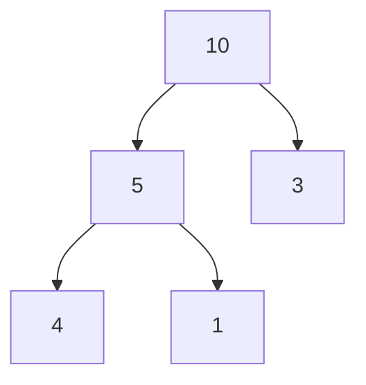

# C++ 堆操作

## 什么是堆？

在数据结构中，堆(Heap)是一种特殊的完全二叉树。根据其性质，堆可以分为两种类型：

1. **最大堆(Max Heap)**: 父节点的值总是大于或等于其子节点的值
2. **最小堆(Min Heap)**: 父节点的值总是小于或等于其子节点的值

在C++ STL中，提供了一系列函数来操作容器中的元素，使其满足堆的性质。这些函数都位于`<algorithm>`头文件中。

:::note
C++ STL中的堆操作默认构建的是最大堆，即堆顶元素是最大值。
:::

## C++ STL中的堆操作函数

### 1. `make_heap` - 构建堆

`make_heap`函数用于将指定范围内的元素重新排列，使其满足堆的性质。

**语法**:
```cpp
void make_heap(RandomAccessIterator first, RandomAccessIterator last);
void make_heap(RandomAccessIterator first, RandomAccessIterator last, Compare comp);
```

**示例**:

```cpp
#include <iostream>
#include <vector>
#include <algorithm>

int main() {
    std::vector<int> v = {4, 10, 3, 5, 1};
    
    std::make_heap(v.begin(), v.end());
    
    std::cout << "堆顶元素: " << v.front() << std::endl;
    std::cout << "堆中所有元素: ";
    for(int num : v) {
        std::cout << num << " ";
    }
    
    return 0;
}
```

**输出**:
```
堆顶元素: 10
堆中所有元素: 10 5 3 4 1
```

### 2. `push_heap` - 向堆中添加元素

`push_heap`函数用于将容器末尾的元素添加到堆中，保持堆的性质。

**语法**:
```cpp
void push_heap(RandomAccessIterator first, RandomAccessIterator last);
void push_heap(RandomAccessIterator first, RandomAccessIterator last, Compare comp);
```

:::caution
在调用`push_heap`之前，新元素必须已经添加到容器的末尾。
:::

**示例**:

```cpp
#include <iostream>
#include <vector>
#include <algorithm>

int main() {
    std::vector<int> v = {10, 5, 3, 4, 1};
    
    // 确保当前容器已经是一个堆
    std::make_heap(v.begin(), v.end());
    
    // 添加一个新元素到容器末尾
    v.push_back(8);
    
    // 将新元素加入堆
    std::push_heap(v.begin(), v.end());
    
    std::cout << "添加新元素后的堆: ";
    for(int num : v) {
        std::cout << num << " ";
    }
    
    return 0;
}
```

**输出**:
```
添加新元素后的堆: 10 8 3 4 1 5
```

### 3. `pop_heap` - 从堆中移除最大元素

`pop_heap`函数用于将堆顶元素移到容器的末尾，并使剩余的元素重新满足堆的性质。

**语法**:
```cpp
void pop_heap(RandomAccessIterator first, RandomAccessIterator last);
void pop_heap(RandomAccessIterator first, RandomAccessIterator last, Compare comp);
```

:::caution
`pop_heap`并不从容器中移除元素，它只是将堆顶元素移到容器末尾。如果要真正移除元素，还需要调用容器的`pop_back()`方法。
:::

**示例**:

```cpp
#include <iostream>
#include <vector>
#include <algorithm>

int main() {
    std::vector<int> v = {10, 8, 3, 4, 1, 5};
    
    // 确保当前容器是一个堆
    std::make_heap(v.begin(), v.end());
    
    // 弹出堆顶元素（将其移至容器末尾）
    std::pop_heap(v.begin(), v.end());
    
    // 获取并移除容器末尾的元素（原堆顶元素）
    int top = v.back();
    v.pop_back();
    
    std::cout << "堆顶元素: " << top << std::endl;
    std::cout << "移除堆顶后的堆: ";
    for(int num : v) {
        std::cout << num << " ";
    }
    
    return 0;
}
```

**输出**:
```
堆顶元素: 10
移除堆顶后的堆: 8 5 3 4 1
```

### 4. `sort_heap` - 对堆进行排序

`sort_heap`函数用于将堆转换为有序序列。它会将堆中的元素按照升序排列。

**语法**:
```cpp
void sort_heap(RandomAccessIterator first, RandomAccessIterator last);
void sort_heap(RandomAccessIterator first, RandomAccessIterator last, Compare comp);
```

:::note
排序后，容器不再满足堆的性质。
:::

**示例**:

```cpp
#include <iostream>
#include <vector>
#include <algorithm>

int main() {
    std::vector<int> v = {4, 10, 3, 5, 1};
    
    std::make_heap(v.begin(), v.end());
    std::cout << "初始堆: ";
    for(int num : v) {
        std::cout << num << " ";
    }
    std::cout << std::endl;
    
    std::sort_heap(v.begin(), v.end());
    std::cout << "排序后: ";
    for(int num : v) {
        std::cout << num << " ";
    }
    
    return 0;
}
```

**输出**:
```
初始堆: 10 5 3 4 1
排序后: 1 3 4 5 10
```

### 5. `is_heap` 和 `is_heap_until` - 检查堆性质

`is_heap`函数用于检查给定范围内的元素是否满足堆的性质，返回一个布尔值。
`is_heap_until`函数返回一个迭代器，指向第一个不符合堆性质的元素。

**语法**:
```cpp
bool is_heap(RandomAccessIterator first, RandomAccessIterator last);
bool is_heap(RandomAccessIterator first, RandomAccessIterator last, Compare comp);

RandomAccessIterator is_heap_until(RandomAccessIterator first, RandomAccessIterator last);
RandomAccessIterator is_heap_until(RandomAccessIterator first, RandomAccessIterator last, Compare comp);
```

**示例**:

```cpp
#include <iostream>
#include <vector>
#include <algorithm>

int main() {
    std::vector<int> v1 = {10, 5, 3, 4, 1}; // 一个堆
    std::vector<int> v2 = {1, 3, 4, 5, 10}; // 不是一个堆
    
    bool is_v1_heap = std::is_heap(v1.begin(), v1.end());
    bool is_v2_heap = std::is_heap(v2.begin(), v2.end());
    
    std::cout << "v1是一个堆? " << (is_v1_heap ? "是" : "否") << std::endl;
    std::cout << "v2是一个堆? " << (is_v2_heap ? "是" : "否") << std::endl;
    
    auto it = std::is_heap_until(v2.begin(), v2.end());
    if(it != v2.end()) {
        std::cout << "v2中第一个不符合堆性质的元素: " << *it << std::endl;
    }
    
    return 0;
}
```

**输出**:
```
v1是一个堆? 是
v2是一个堆? 否
v2中第一个不符合堆性质的元素: 1
```

## 自定义比较函数

默认情况下，C++ STL中的堆操作创建的是最大堆。如果需要创建最小堆或者根据其他规则排序的堆，可以提供自定义的比较函数。

**示例 - 创建最小堆**:

```cpp
#include <iostream>
#include <vector>
#include <algorithm>

int main() {
    std::vector<int> v = {4, 10, 3, 5, 1};
    
    // 使用greater<int>创建最小堆
    std::make_heap(v.begin(), v.end(), std::greater<int>());
    
    std::cout << "最小堆顶元素: " << v.front() << std::endl;
    std::cout << "最小堆中所有元素: ";
    for(int num : v) {
        std::cout << num << " ";
    }
    
    return 0;
}
```

**输出**:
```
最小堆顶元素: 1
最小堆中所有元素: 1 4 3 5 10
```

## 实际应用场景

### 1. 优先队列

堆最常见的应用是实现优先队列，其中元素按照优先级排序。C++ STL中的`std::priority_queue`就是基于堆实现的。

```cpp
#include <iostream>
#include <queue>

int main() {
    // 默认是最大堆
    std::priority_queue<int> max_pq;
    max_pq.push(4);
    max_pq.push(10);
    max_pq.push(3);
    
    std::cout << "最大优先队列顶部元素: " << max_pq.top() << std::endl;
    
    // 使用比较函数创建最小堆
    std::priority_queue<int, std::vector<int>, std::greater<int>> min_pq;
    min_pq.push(4);
    min_pq.push(10);
    min_pq.push(3);
    
    std::cout << "最小优先队列顶部元素: " << min_pq.top() << std::endl;
    
    return 0;
}
```

**输出**:
```
最大优先队列顶部元素: 10
最小优先队列顶部元素: 3
```

### 2. 堆排序

堆排序是一种高效的排序算法，其时间复杂度为O(n log n)。

```cpp
#include <iostream>
#include <vector>
#include <algorithm>

int main() {
    std::vector<int> v = {4, 10, 3, 5, 1};
    
    // 堆排序
    std::make_heap(v.begin(), v.end());
    std::sort_heap(v.begin(), v.end());
    
    std::cout << "排序后: ";
    for(int num : v) {
        std::cout << num << " ";
    }
    
    return 0;
}
```

**输出**:
```
排序后: 1 3 4 5 10
```

### 3. Top K 问题

堆在解决"找出最大/最小的K个元素"类型的问题时非常有用。

**示例 - 找出数组中最大的3个元素**:

```cpp
#include <iostream>
#include <vector>
#include <algorithm>

int main() {
    std::vector<int> v = {4, 10, 3, 5, 1, 8, 7, 6, 2, 9};
    
    // 创建一个包含3个元素的最小堆
    std::vector<int> top3(3);
    std::copy_n(v.begin(), 3, top3.begin());
    std::make_heap(top3.begin(), top3.end(), std::greater<int>());
    
    // 遍历剩余元素
    for(size_t i = 3; i < v.size(); ++i) {
        if(v[i] > top3.front()) {
            std::pop_heap(top3.begin(), top3.end(), std::greater<int>());
            top3.back() = v[i];
            std::push_heap(top3.begin(), top3.end(), std::greater<int>());
        }
    }
    
    // 排序最大的3个元素
    std::sort_heap(top3.begin(), top3.end(), std::greater<int>());
    
    std::cout << "最大的3个元素: ";
    for(int num : top3) {
        std::cout << num << " ";
    }
    
    return 0;
}
```

**输出**:
```
最大的3个元素: 8 9 10
```

## 堆的底层实现

堆通常使用数组来实现。对于存储在从0开始索引的数组中的堆，有以下关系：

- 父节点索引: `(i - 1) / 2`
- 左子节点索引: `2 * i + 1`
- 右子节点索引: `2 * i + 2`

其中，`i`是当前节点的索引。



上图展示了一个最大堆的例子，数组表示为 `[10, 5, 3, 4, 1]`。

## 总结

堆是一种重要的数据结构，在许多算法和应用中有广泛的应用。C++ STL提供了一系列函数来操作堆，使得堆操作变得简单和高效。

本文介绍了以下关键堆操作函数：
- `make_heap`: 构建堆
- `push_heap`: 向堆中添加元素
- `pop_heap`: 从堆中移除最大元素
- `sort_heap`: 对堆进行排序
- `is_heap`和`is_heap_until`: 检查堆性质

通过这些函数，我们可以轻松地实现优先队列、堆排序和解决Top K问题等应用。

## 练习

1. 实现一个函数，找出数组中第K大的元素。
2. 使用堆操作函数实现你自己的优先队列类。
3. 如何使用堆求解数据流的中位数？
4. 使用堆排序对一个大型数组进行排序，并与其他排序算法进行比较。
5. 尝试实现一个双端优先队列，可以同时获取最大和最小元素。

## 附加资源

- [C++参考手册 - 堆操作](https://en.cppreference.com/w/cpp/algorithm/make_heap)
- [堆数据结构详解](https://www.geeksforgeeks.org/heap-data-structure/)
- [优先队列和堆排序](https://www.programiz.com/dsa/priority-queue)

通过学习和实践这些堆操作，你将能够更高效地解决各种算法问题，并深入理解C++ STL的强大功能。