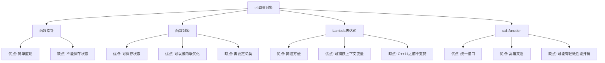

# C++ 可调用对象

## 什么是可调用对象？

在C++中，**可调用对象**是指那些能够像函数一样被调用的对象。当我们使用圆括号 `()` 操作符，传入零个或多个参数时，这些对象会执行特定的操作。可调用对象是C++中非常灵活和强大的概念，它们在STL算法和现代C++编程中扮演着重要角色。

C++中的可调用对象主要包括以下几种类型：

1. 函数指针
2. 函数对象（仿函数）
3. Lambda表达式
4. 带有`operator()`成员函数的类对象
5. 可被转换为函数指针的类对象
6. 类成员函数指针

## 函数指针

函数指针是最基本的可调用对象类型，它指向一个函数。

```cpp
#include <iostream>

// 定义普通函数
int add(int a, int b) {
    return a + b;
}

int main() {
    // 定义函数指针
    int (*funcPtr)(int, int) = add;
    
    // 通过函数指针调用函数
    int result = funcPtr(5, 3);
    std::cout << "5 + 3 = " << result << std::endl;
    
    return 0;
}
```

**输出**:
```
5 + 3 = 8
```

:::note
函数指针的语法可能看起来有些复杂。`int (*funcPtr)(int, int)` 表示 `funcPtr` 是一个指针，它指向一个接受两个 `int` 参数并返回 `int` 的函数。
:::

## 函数对象（仿函数）

函数对象是实现了`operator()`（函数调用运算符）的类的实例。它们可以像函数一样被调用，但同时拥有类的特性，如可以保存状态。

```cpp
#include <iostream>

// 定义函数对象类
class Multiplier {
private:
    int factor;
    
public:
    Multiplier(int f) : factor(f) {}
    
    // 重载函数调用运算符
    int operator()(int x) const {
        return x * factor;
    }
};

int main() {
    // 创建函数对象实例
    Multiplier times2(2);
    Multiplier times5(5);
    
    // 使用函数对象
    std::cout << "7 * 2 = " << times2(7) << std::endl;
    std::cout << "7 * 5 = " << times5(7) << std::endl;
    
    return 0;
}
```

**输出**:
```
7 * 2 = 14
7 * 5 = 35
```

函数对象的优点在于它们可以保存状态（如上例中的`factor`成员变量），这使它们比普通函数更加灵活。

## Lambda表达式

Lambda表达式是C++11引入的新特性，它允许我们定义匿名函数对象，简化代码。

```cpp
#include <iostream>
#include <vector>
#include <algorithm>

int main() {
    std::vector<int> numbers = {1, 2, 3, 4, 5};
    
    // 使用lambda表达式找出大于3的数
    std::cout << "大于3的数有：";
    std::for_each(numbers.begin(), numbers.end(), [](int n) {
        if (n > 3) {
            std::cout << n << " ";
        }
    });
    std::cout << std::endl;
    
    // 带有捕获的lambda表达式
    int threshold = 2;
    std::cout << "大于" << threshold << "的数有：";
    std::for_each(numbers.begin(), numbers.end(), [threshold](int n) {
        if (n > threshold) {
            std::cout << n << " ";
        }
    });
    std::cout << std::endl;
    
    return 0;
}
```

**输出**:
```
大于3的数有：4 5 
大于2的数有：3 4 5 
```

Lambda表达式的基本语法是：

```
[捕获列表](参数列表) -> 返回类型 { 函数体 }
```

其中返回类型可以省略，编译器会自动推导。

## std::function - 通用函数包装器

`std::function`是一个模板类，它可以包装任何类型的可调用对象，统一它们的使用方式。

```cpp
#include <iostream>
#include <functional>

// 普通函数
int add(int a, int b) {
    return a + b;
}

// 函数对象类
class Multiplier {
public:
    int operator()(int a, int b) const {
        return a * b;
    }
};

int main() {
    // 使用std::function包装不同类型的可调用对象
    std::function<int(int, int)> operation;
    
    // 包装普通函数
    operation = add;
    std::cout << "3 + 4 = " << operation(3, 4) << std::endl;
    
    // 包装函数对象
    operation = Multiplier();
    std::cout << "3 * 4 = " << operation(3, 4) << std::endl;
    
    // 包装Lambda表达式
    operation = [](int a, int b) { return a - b; };
    std::cout << "3 - 4 = " << operation(3, 4) << std::endl;
    
    return 0;
}
```

**输出**:
```
3 + 4 = 7
3 * 4 = 12
3 - 4 = -1
```

`std::function`的声明格式为`std::function<返回类型(参数类型列表)>`。

## 可调用对象的实际应用

### 1. 自定义排序

```cpp
#include <iostream>
#include <vector>
#include <algorithm>

struct Person {
    std::string name;
    int age;
    
    Person(std::string n, int a) : name(n), age(a) {}
};

int main() {
    std::vector<Person> people = {
        {"Alice", 25},
        {"Bob", 20},
        {"Charlie", 30}
    };
    
    // 使用lambda表达式按年龄排序
    std::sort(people.begin(), people.end(), [](const Person& a, const Person& b) {
        return a.age < b.age;
    });
    
    std::cout << "按年龄排序：" << std::endl;
    for (const auto& person : people) {
        std::cout << person.name << " - " << person.age << std::endl;
    }
    
    return 0;
}
```

**输出**:
```
按年龄排序：
Bob - 20
Alice - 25
Charlie - 30
```

### 2. 回调函数

```cpp
#include <iostream>
#include <functional>

class Button {
private:
    std::function<void()> onClick;
    std::string label;
    
public:
    Button(const std::string& text) : label(text) {}
    
    void setOnClickListener(std::function<void()> callback) {
        onClick = callback;
    }
    
    void click() {
        std::cout << "Button \"" << label << "\" clicked!" << std::endl;
        if (onClick) {
            onClick();
        }
    }
};

int main() {
    Button submitButton("Submit");
    
    // 设置点击回调
    submitButton.setOnClickListener([]() {
        std::cout << "处理表单提交..." << std::endl;
    });
    
    // 模拟点击
    submitButton.click();
    
    return 0;
}
```

**输出**:
```
Button "Submit" clicked!
处理表单提交...
```

## 不同类型可调用对象的比较

让我们比较一下各种可调用对象的特点：



## 总结

C++中的可调用对象是一个强大而灵活的概念，它包括函数指针、函数对象、Lambda表达式等多种形式。理解和掌握可调用对象的使用可以帮助我们编写更加灵活、模块化的代码，尤其是在使用STL算法和设计回调机制时。

- **函数指针**是最基础的可调用对象，适用于简单场景。
- **函数对象**可以保存状态，更加灵活。
- **Lambda表达式**提供了定义匿名函数对象的简便方法，特别适合用于短小的回调。
- **std::function**统一了各种可调用对象的接口，使代码更加通用。

## 练习题

1. 编写一个函数对象，计算一个数的n次幂。
2. 使用Lambda表达式，过滤出一个整数vector中的所有偶数。
3. 创建一个函数，该函数接受一个可调用对象和两个整数，返回调用该可调用对象的结果。
4. 使用std::function实现一个简单的计算器，可以执行加、减、乘、除操作。

## 扩展阅读

- [C++参考手册 - std::function](https://en.cppreference.com/w/cpp/utility/functional/function)
- [C++参考手册 - Lambda表达式](https://en.cppreference.com/w/cpp/language/lambda)
- 《Effective Modern C++》- Scott Meyers

通过本文，你应该对C++中的可调用对象有了全面的了解。掌握这些概念将帮助你编写更加灵活和强大的C++程序！