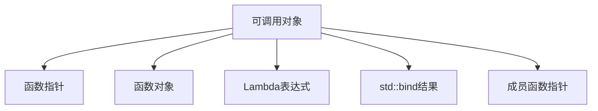

# C++ 自定义函数对象

在C++编程中，函数对象（Function Object）是一个重要的概念，它让我们能够像使用函数一样使用对象。本文将详细介绍如何创建和使用自定义函数对象，以及它们在实际编程中的应用。

## 函数对象基本概念

函数对象，也称为仿函数（Functor），是一个可以行为类似函数的对象。从技术上讲，函数对象是一个定义了`operator()`操作符的类的实例，这使得它可以像函数一样被调用。

:::note
函数对象不是函数，而是行为像函数的对象。
:::

## 为什么需要函数对象？

在C++编程中，与普通函数相比，函数对象具有以下优势：

1. **保持状态**：函数对象可以在对象内部保持状态
2. **类型安全**：编译时类型检查
3. **内联优化**：编译器可能会对短小的函数对象进行内联优化
4. **灵活性**：可以结合面向对象编程的特性

## 创建一个简单的函数对象

让我们从一个简单的例子开始，创建一个函数对象来执行加法操作：

```cpp
#include <iostream>

// 定义一个加法函数对象
class Adder {
private:
    int value; // 保存状态

public:
    // 构造函数，初始化内部状态
    Adder(int val) : value(val) {}

    // 重载()操作符，使对象可以像函数一样被调用
    int operator()(int x) const {
        return x + value;
    }
};

int main() {
    // 创建一个加5的函数对象
    Adder add5(5);
    
    // 使用函数对象
    std::cout << "10 + 5 = " << add5(10) << std::endl;
    std::cout << "20 + 5 = " << add5(20) << std::endl;
    
    // 创建一个加10的函数对象
    Adder add10(10);
    std::cout << "10 + 10 = " << add10(10) << std::endl;
    
    return 0;
}
```

输出：
```
10 + 5 = 15
20 + 5 = 25
10 + 10 = 20
```

在上面的示例中，我们定义了一个名为`Adder`的类，它包含一个内部状态`value`和一个重载的`()`操作符。当我们创建`Adder`类的实例并像函数一样调用它时，实际上是在调用`operator()`方法。

## 函数对象与STL算法的结合

函数对象最常被用于STL算法中。让我们看一个使用自定义函数对象与`std::sort`结合的例子：

```cpp
#include <iostream>
#include <vector>
#include <algorithm>

// 定义一个比较函数对象
class DescendingOrder {
public:
    bool operator()(int a, int b) const {
        return a > b; // 降序排列
    }
};

int main() {
    std::vector<int> numbers = {5, 2, 8, 1, 9, 3};
    
    // 使用自定义函数对象进行排序
    std::sort(numbers.begin(), numbers.end(), DescendingOrder());
    
    // 输出排序后的结果
    std::cout << "排序后的结果（降序）：";
    for (int num : numbers) {
        std::cout << num << " ";
    }
    std::cout << std::endl;
    
    return 0;
}
```

输出：
```
排序后的结果（降序）：9 8 5 3 2 1
```

在这个例子中，我们创建了一个`DescendingOrder`函数对象，用于指定`std::sort`的排序方式为降序排列。

## 带参数的函数对象

函数对象可以接受多个参数，这使得它们非常灵活：

```cpp
#include <iostream>

// 定义一个二元函数对象
class MathOperation {
public:
    // 加法操作
    int add(int a, int b) const {
        return a + b;
    }
    
    // 减法操作
    int subtract(int a, int b) const {
        return a - b;
    }
    
    // 乘法操作
    int operator()(int a, int b) const {
        return a * b;
    }
};

int main() {
    MathOperation math;
    
    // 使用成员函数
    std::cout << "5 + 3 = " << math.add(5, 3) << std::endl;
    std::cout << "5 - 3 = " << math.subtract(5, 3) << std::endl;
    
    // 使用函数对象
    std::cout << "5 * 3 = " << math(5, 3) << std::endl;
    
    return 0;
}
```

输出：
```
5 + 3 = 8
5 - 3 = 2
5 * 3 = 15
```

## 函数对象与Lambda表达式的比较

C++11引入了Lambda表达式，它可以创建匿名函数对象。虽然Lambda表达式在某些情况下可以替代函数对象，但函数对象在复杂场景下仍然具有优势：

```cpp
#include <iostream>
#include <vector>
#include <algorithm>

// 使用函数对象
class Counter {
private:
    int count = 0;
public:
    void operator()(int) {
        ++count;
    }
    int getCount() const {
        return count;
    }
};

int main() {
    std::vector<int> numbers = {1, 2, 3, 4, 5};
    
    // 使用函数对象统计元素
    Counter counter;
    std::for_each(numbers.begin(), numbers.end(), counter);
    std::cout << "元素个数: " << counter.getCount() << std::endl;
    
    // 使用Lambda表达式（需要使用额外变量保存状态）
    int lambdaCount = 0;
    std::for_each(numbers.begin(), numbers.end(), [&lambdaCount](int) {
        ++lambdaCount;
    });
    std::cout << "Lambda统计元素个数: " << lambdaCount << std::endl;
    
    return 0;
}
```

输出：
```
元素个数: 5
Lambda统计元素个数: 5
```

## 实际应用场景

### 场景1：自定义排序

```cpp
#include <iostream>
#include <vector>
#include <string>
#include <algorithm>

class Person {
public:
    std::string name;
    int age;
    
    Person(const std::string& n, int a) : name(n), age(a) {}
};

// 按年龄排序的函数对象
class SortByAge {
public:
    bool operator()(const Person& a, const Person& b) const {
        return a.age < b.age;
    }
};

// 按姓名排序的函数对象
class SortByName {
public:
    bool operator()(const Person& a, const Person& b) const {
        return a.name < b.name;
    }
};

int main() {
    std::vector<Person> people = {
        {"张三", 25},
        {"李四", 19},
        {"王五", 32},
        {"赵六", 22}
    };
    
    // 按年龄排序
    std::sort(people.begin(), people.end(), SortByAge());
    std::cout << "按年龄排序:" << std::endl;
    for (const auto& person : people) {
        std::cout << person.name << " (" << person.age << "岁)" << std::endl;
    }
    
    std::cout << std::endl;
    
    // 按姓名排序
    std::sort(people.begin(), people.end(), SortByName());
    std::cout << "按姓名排序:" << std::endl;
    for (const auto& person : people) {
        std::cout << person.name << " (" << person.age << "岁)" << std::endl;
    }
    
    return 0;
}
```

输出：
```
按年龄排序:
李四 (19岁)
赵六 (22岁)
张三 (25岁)
王五 (32岁)

按姓名排序:
李四 (19岁)
王五 (32岁)
张三 (25岁)
赵六 (22岁)
```

### 场景2：自定义累加器

```cpp
#include <iostream>
#include <vector>
#include <numeric>

// 自定义累加器函数对象
class ProductAccumulator {
public:
    int operator()(int accumulator, int current) const {
        return accumulator * current;
    }
};

int main() {
    std::vector<int> numbers = {1, 2, 3, 4, 5};
    
    // 使用STL中的std::accumulate和自定义函数对象计算乘积
    int product = std::accumulate(numbers.begin(), numbers.end(), 1, ProductAccumulator());
    
    std::cout << "数组元素乘积: " << product << std::endl;
    
    return 0;
}
```

输出：
```
数组元素乘积: 120
```

## 可调用对象的概念

在C++中，函数对象是可调用对象的一种形式。可调用对象包括：

1. 函数指针
2. 函数对象
3. Lambda表达式
4. 绑定表达式（`std::bind`的结果）
5. 成员函数指针

这些可调用对象都可以使用`std::function`来包装和管理。



## 总结

函数对象是C++编程中的强大工具，特别是在与STL算法结合使用时。它们提供了以下优点：

1. 能够保持状态
2. 提供更好的类型安全性
3. 可以被编译器优化
4. 使代码更加灵活和模块化

当你需要一个可以记住状态、适应不同情况的可调用实体时，考虑使用函数对象。尽管C++11中引入了Lambda表达式，但在许多复杂场景中，函数对象仍然是更好的选择。

## 练习

1. 创建一个函数对象，用于统计一个字符串中特定字符的出现次数。
2. 实现一个函数对象，可以检查一个数是否在给定范围内。
3. 编写一个程序，使用自定义函数对象和`std::transform`将一个整数向量转换为其平方值。
4. 创建一个函数对象，实现自定义的字符串比较逻辑（例如，忽略大小写）。

## 扩展阅读资源

- C++ STL官方文档
- 《Effective STL》 by Scott Meyers
- 《C++ Templates: The Complete Guide》by David Vandevoorde and Nicolai M. Josuttis

:::tip
记住，函数对象的强大之处在于它们可以保持状态。当你需要在多次调用之间维护信息时，函数对象是一个理想的选择。
:::