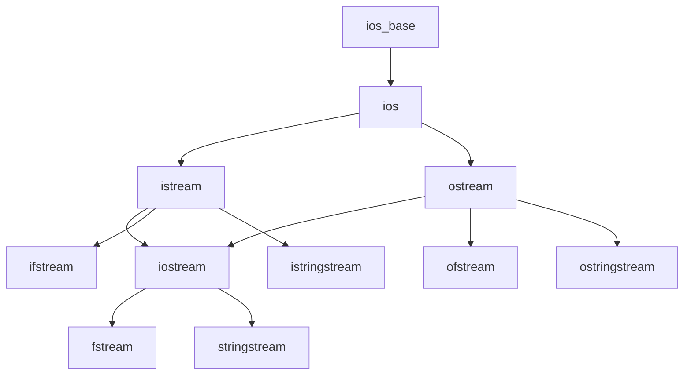

# C++ IO库概述

在现代应用程序开发中，输入和输出(IO)操作是不可或缺的一部分。无论是从控制台读取用户输入，还是将数据写入文件，或者在网络上传输数据，IO操作都扮演着至关重要的角色。C++提供了一套强大而灵活的IO库，使程序能够轻松地处理各种输入和输出任务。

## IO库的基础：流的概念

C++的IO操作是围绕"流"(stream)的概念构建的。流是字符序列的抽象表示，可以看作是数据的来源或目的地。

:::tip 流的本质
流就像是一条单向的数据通道，数据可以从一端进入，从另一端出来。这种抽象使我们不必关心数据的实际来源或目的地的物理细节。
:::


## C++ 标准库中的主要IO类

C++的IO库主要由以下头文件提供：

- `<iostream>`: 提供基本的输入/输出操作
- `<fstream>`: 提供文件相关的输入/输出操作
- `<sstream>`: 提供字符串相关的输入/输出操作

这些头文件中定义了多种IO类，它们都派生自几个基本的类：



### 主要IO类及其作用

| 类名 | 头文件 | 作用 |
|------|--------|------|
| `istream` | `<iostream>` | 输入流的基类，用于从流中读取数据 |
| `ostream` | `<iostream>` | 输出流的基类，用于向流写入数据 |
| `iostream` | `<iostream>` | 同时支持输入和输出的流类 |
| `ifstream` | `<fstream>` | 从文件读取数据 |
| `ofstream` | `<fstream>` | 向文件写入数据 |
| `fstream` | `<fstream>` | 同时支持文件的读和写操作 |
| `istringstream` | `<sstream>` | 从字符串读取数据 |
| `ostringstream` | `<sstream>` | 向字符串写入数据 |
| `stringstream` | `<sstream>` | 同时支持字符串的读和写操作 |

## 标准输入输出流

C++标准库提供了四个预定义的标准流对象：

- `cin`: 标准输入流，通常与键盘相关联
- `cout`: 标准输出流，通常与屏幕相关联
- `cerr`: 标准错误流，用于显示错误消息，通常与屏幕相关联
- `clog`: 标准日志流，用于显示日志信息，通常与屏幕相关联

### 简单的输入输出示例

```cpp
#include <iostream>
using namespace std;

int main() {
    int age;
    string name;
    
    // 输出提示
    cout << "请输入您的姓名: ";
    
    // 从标准输入读取字符串
    cin >> name;
    
    cout << "请输入您的年龄: ";
    
    // 从标准输入读取整数
    cin >> age;
    
    // 输出结果
    cout << "您好，" << name << "！您今年" << age << "岁。" << endl;
    
    return 0;
}
```

输入示例：
```
请输入您的姓名: 张三
请输入您的年龄: 25
```

输出结果：
```
您好，张三！您今年25岁。
```

## 流状态和错误处理

每个流对象都维护一个状态，用于表示该流的当前状况。当发生错误时，流的状态会相应地改变。

### 主要的流状态标志

- `good()`: 如果流处于良好状态（没有错误），返回true
- `eof()`: 如果到达文件末尾，返回true
- `fail()`: 如果发生可恢复的错误，返回true
- `bad()`: 如果发生不可恢复的错误，返回true

### 错误处理示例

```cpp
#include <iostream>
using namespace std;

int main() {
    int value;
    
    cout << "请输入一个整数: ";
    cin >> value;
    
    if (cin.fail()) {
        cout << "输入错误，请确保输入的是整数！" << endl;
        
        // 清除错误状态
        cin.clear();
        
        // 忽略缓冲区中的所有字符，直到遇到换行符
        cin.ignore(numeric_limits<streamsize>::max(), '\n');
    } else {
        cout << "您输入的整数是: " << value << endl;
    }
    
    return 0;
}
```

## IO操作符和格式化

C++的IO库提供了多种操作符和格式化选项，使程序员能够控制数据的输入和输出格式。

### 常用的IO操作符

- `<<`: 输出操作符，用于向流写入数据
- `>>`: 输入操作符，用于从流读取数据

### IO操纵符

IO操纵符是用于控制流格式的特殊函数。常见的操纵符包括：

- `endl`: 插入换行符并刷新流
- `setw(int)`: 设置字段宽度
- `setprecision(int)`: 设置浮点数的精度
- `fixed`: 使用定点表示法表示浮点数
- `scientific`: 使用科学计数法表示浮点数
- `left`, `right`: 设置对齐方式

### 格式化示例

```cpp
#include <iostream>
#include <iomanip>
using namespace std;

int main() {
    double pi = 3.14159265358979;
    
    // 默认格式
    cout << "默认格式的pi: " << pi << endl;
    
    // 设置精度
    cout << "设置精度为4的pi: " << setprecision(4) << pi << endl;
    
    // 固定小数点
    cout << "固定小数点格式的pi: " << fixed << pi << endl;
    
    // 科学计数法
    cout << "科学计数法格式的pi: " << scientific << pi << endl;
    
    // 重新设置为默认格式
    cout.unsetf(ios::scientific | ios::fixed);
    
    // 表格格式输出
    cout << setprecision(6);
    cout << setw(15) << left << "姓名" 
         << setw(10) << right << "年龄" 
         << setw(10) << right << "身高" << endl;
    
    cout << setw(15) << left << "张三" 
         << setw(10) << right << 25 
         << setw(10) << right << 175.5 << endl;
         
    cout << setw(15) << left << "李四" 
         << setw(10) << right << 30 
         << setw(10) << right << 180.0 << endl;
    
    return 0;
}
```

输出结果：
```
默认格式的pi: 3.14159
设置精度为4的pi: 3.142
固定小数点格式的pi: 3.1416
科学计数法格式的pi: 3.141593e+00
姓名                 年龄        身高
张三                   25      175.5
李四                   30        180
```

## 实际应用案例：学生成绩管理系统

以下是一个简单的学生成绩管理系统，展示了如何使用IO流进行数据的读取、处理和输出：

```cpp
#include <iostream>
#include <fstream>
#include <sstream>
#include <vector>
#include <string>
#include <iomanip>
using namespace std;

struct Student {
    string name;
    int id;
    double math_score;
    double english_score;
    double chinese_score;
    double average_score;
};

// 从文件读取学生数据
vector<Student> readStudentsFromFile(const string& filename) {
    vector<Student> students;
    ifstream inFile(filename);
    
    if (!inFile) {
        cerr << "无法打开文件: " << filename << endl;
        return students;
    }
    
    string line;
    // 跳过标题行
    getline(inFile, line);
    
    while (getline(inFile, line)) {
        Student student;
        stringstream ss(line);
        string token;
        
        getline(ss, token, ',');
        student.name = token;
        
        getline(ss, token, ',');
        student.id = stoi(token);
        
        getline(ss, token, ',');
        student.math_score = stod(token);
        
        getline(ss, token, ',');
        student.english_score = stod(token);
        
        getline(ss, token, ',');
        student.chinese_score = stod(token);
        
        student.average_score = (student.math_score + student.english_score + student.chinese_score) / 3.0;
        
        students.push_back(student);
    }
    
    inFile.close();
    return students;
}

// 将学生数据写入文件
void writeStudentsToFile(const string& filename, const vector<Student>& students) {
    ofstream outFile(filename);
    
    if (!outFile) {
        cerr << "无法创建文件: " << filename << endl;
        return;
    }
    
    outFile << "姓名,学号,数学,英语,语文,平均分" << endl;
    
    for (const auto& student : students) {
        outFile << student.name << ","
                << student.id << ","
                << student.math_score << ","
                << student.english_score << ","
                << student.chinese_score << ","
                << fixed << setprecision(2) << student.average_score << endl;
    }
    
    outFile.close();
    cout << "数据已成功写入文件: " << filename << endl;
}

// 显示学生成绩
void displayStudents(const vector<Student>& students) {
    cout << setw(10) << "姓名" 
         << setw(10) << "学号" 
         << setw(10) << "数学" 
         << setw(10) << "英语" 
         << setw(10) << "语文" 
         << setw(10) << "平均分" << endl;
    
    for (const auto& student : students) {
        cout << setw(10) << student.name
             << setw(10) << student.id
             << setw(10) << student.math_score
             << setw(10) << student.english_score
             << setw(10) << student.chinese_score
             << setw(10) << fixed << setprecision(2) << student.average_score << endl;
    }
}

int main() {
    // 创建一些学生数据
    vector<Student> students = {
        {"张三", 10001, 85.5, 92.0, 78.5, 0},
        {"李四", 10002, 90.0, 85.5, 92.0, 0},
        {"王五", 10003, 78.5, 80.0, 85.5, 0}
    };
    
    // 计算平均分
    for (auto& student : students) {
        student.average_score = (student.math_score + student.english_score + student.chinese_score) / 3.0;
    }
    
    // 将数据写入文件
    writeStudentsToFile("students.csv", students);
    
    // 从文件读取数据
    vector<Student> loadedStudents = readStudentsFromFile("students.csv");
    
    // 显示学生数据
    displayStudents(loadedStudents);
    
    return 0;
}
```

## 总结

C++的IO库提供了丰富的功能，使我们能够处理各种输入和输出需求：

1. **流的概念**是C++ IO库的核心，它提供了一种统一的方式来处理不同类型的输入和输出。
2. **标准库中的IO类**包括处理控制台IO、文件IO和字符串IO的各种类。
3. **流状态和错误处理**机制使我们能够检测和应对各种IO错误。
4. **格式化工具**允许我们控制数据的展示方式，使输出更加美观和易读。

在实际开发中，合理使用这些功能可以使程序更加健壮和用户友好。

## 练习

1. 编写一个程序，提示用户输入一个整数，然后将该整数的所有约数写入一个文件。
2. 创建一个简单的文本编辑器，允许用户从控制台输入多行文本，然后将文本保存到用户指定的文件中。
3. 修改上述学生成绩管理系统，添加按平均分排序的功能，并将排序后的结果保存到新文件中。
4. 编写一个程序，从一个文件中读取单词，然后计算每个单词出现的频率，最后将结果以表格形式输出到控制台和一个新文件。

## 扩展阅读

- C++标准库中的IO库还提供了更多高级功能，如二进制IO、随机访问和内存映射等。
- C++17引入了文件系统库`<filesystem>`，提供了更多文件和目录操作的功能。
- 了解流缓冲区的概念和管理，可以帮助优化IO性能。
- 在多线程环境中使用IO时，需要注意线程安全问题，可能需要使用互斥锁等同步机制。

:::caution 注意事项
在实际开发中，始终检查IO操作的结果，确保它们按预期执行。文件操作可能因为各种原因失败，如权限问题、磁盘空间不足或文件不存在等。
:::