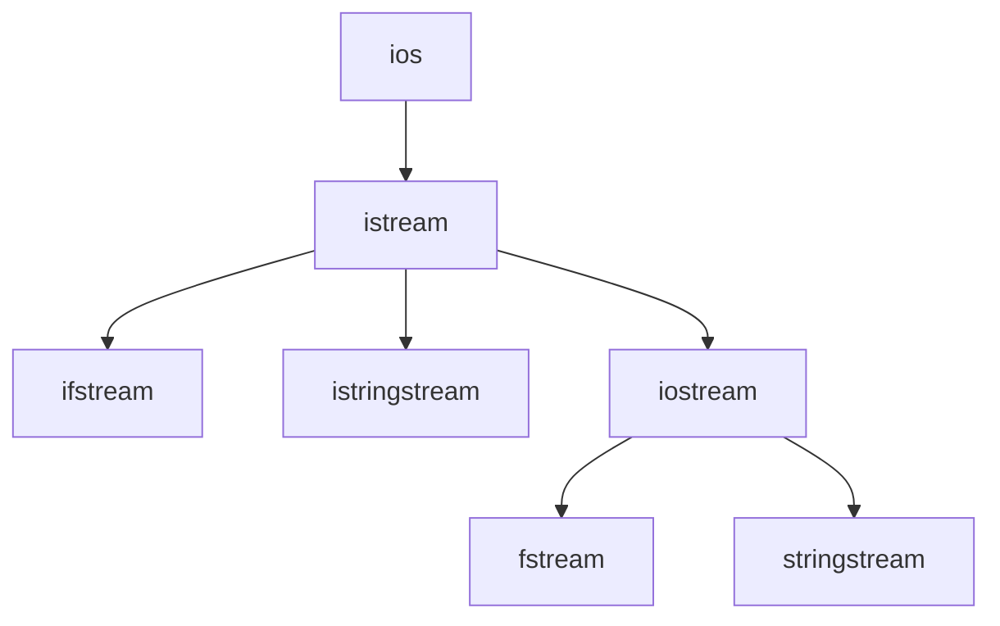

# C++ 输入流

在C++编程中，输入流是从外部源（如键盘、文件或字符串）获取数据的机制。C++提供了一套完整的输入流类和函数，使得从不同来源读取数据变得简单而统一。本文将从基础开始，详细介绍C++输入流的工作原理、常用操作及实际应用。

## 输入流的基本概念

在C++中，输入流主要通过`iostream`库中的类来实现。这些类提供了从各种源读取数据的功能，构成了C++输入/输出系统的基础。

### 输入流类层次结构



最常用的输入流类包括：

- `istream`: 基本输入流类，用于从标准输入设备读取数据
- `ifstream`: 文件输入流类，用于从文件读取数据
- `istringstream`: 字符串输入流类，用于从字符串读取数据

## 标准输入流 cin

`cin`是C++标准库预定义的`istream`类对象，用于从标准输入设备（通常是键盘）读取数据。

### 基本用法

使用`cin`读取基本数据类型的值：

```cpp
#include <iostream>
using namespace std;

int main() {
    int number;
    cout << "请输入一个整数: ";
    cin >> number;
    cout << "您输入的整数是: " << number << endl;
    
    return 0;
}
```

**输出示例**：
```
请输入一个整数: 42
您输入的整数是: 42
```

### 连续读取多个值

`cin`可以连续读取多个值：

```cpp
#include <iostream>
using namespace std;

int main() {
    int a, b, c;
    cout << "请输入三个整数（用空格分隔）: ";
    cin >> a >> b >> c;
    cout << "您输入的三个整数是: " << a << ", " << b << ", " << c << endl;
    
    return 0;
}
```

**输出示例**：
```
请输入三个整数（用空格分隔）: 10 20 30
您输入的三个整数是: 10, 20, 30
```

:::note
`cin`会跳过前导空白字符（空格、制表符、换行符等），然后读取数据直到遇到下一个空白字符为止。
:::

## 读取不同类型的数据

`cin`能够识别并正确处理各种数据类型：

```cpp
#include <iostream>
using namespace std;

int main() {
    int i;
    double d;
    char c;
    string s;
    
    cout << "请输入一个整数: ";
    cin >> i;
    
    cout << "请输入一个浮点数: ";
    cin >> d;
    
    cout << "请输入一个字符: ";
    cin >> c;
    
    cout << "请输入一个字符串: ";
    cin >> s;
    
    cout << "您输入的值为:\n";
    cout << "整数: " << i << endl;
    cout << "浮点数: " << d << endl;
    cout << "字符: " << c << endl;
    cout << "字符串: " << s << endl;
    
    return 0;
}
```

**输出示例**：
```
请输入一个整数: 100
请输入一个浮点数: 3.14
请输入一个字符: A
请输入一个字符串: Hello
您输入的值为:
整数: 100
浮点数: 3.14
字符: A
字符串: Hello
```

## 输入流状态和错误处理

当从输入流读取数据时，可能会发生各种错误。C++提供了检查和管理这些错误的机制。

### 输入流状态标志

输入流有以下状态标志：

- `good()`: 如果流状态良好（没有错误），返回true
- `eof()`: 如果到达文件末尾，返回true
- `fail()`: 如果发生格式错误，返回true
- `bad()`: 如果发生严重错误，返回true

```cpp
#include <iostream>
using namespace std;

int main() {
    int value;
    
    cout << "请输入一个整数: ";
    cin >> value;
    
    if (cin.good()) {
        cout << "输入正确，值为: " << value << endl;
    } else if (cin.eof()) {
        cout << "遇到输入结束标志" << endl;
    } else if (cin.fail()) {
        cout << "输入格式错误" << endl;
        // 清除错误状态
        cin.clear();
        // 忽略错误输入
        cin.ignore(numeric_limits<streamsize>::max(), '\n');
    } else if (cin.bad()) {
        cout << "发生严重的输入流错误" << endl;
    }
    
    return 0;
}
```

:::caution
当输入流发生错误后，需要使用`clear()`方法重置状态标志，并使用`ignore()`方法跳过错误的输入数据，否则后续的输入操作可能会失败。
:::

## 高级输入操作

### 读取整行文本

使用`getline()`函数读取整行文本：

```cpp
#include <iostream>
#include <string>
using namespace std;

int main() {
    string line;
    
    cout << "请输入一行文本: ";
    getline(cin, line);
    
    cout << "您输入的文本是: " << line << endl;
    
    return 0;
}
```

**输出示例**：
```
请输入一行文本: 这是一行包含空格的文本内容
您输入的文本是: 这是一行包含空格的文本内容
```

### 读取单个字符

使用`get()`方法读取单个字符：

```cpp
#include <iostream>
using namespace std;

int main() {
    char ch;
    
    cout << "请输入一个字符: ";
    ch = cin.get();
    
    cout << "您输入的字符是: " << ch << endl;
    
    return 0;
}
```

**输出示例**：
```
请输入一个字符: A
您输入的字符是: A
```

### 定制输入分隔符

使用`getline()`的重载版本可以指定分隔符：

```cpp
#include <iostream>
#include <string>
using namespace std;

int main() {
    string data;
    
    cout << "请输入以逗号结尾的文本: ";
    getline(cin, data, ',');
    
    cout << "逗号前的文本是: " << data << endl;
    
    return 0;
}
```

**输出示例**：
```
请输入以逗号结尾的文本: 你好，世界,
逗号前的文本是: 你好，世界
```

## 从文件读取数据

使用`ifstream`类可以从文件读取数据：

```cpp
#include <iostream>
#include <fstream>
#include <string>
using namespace std;

int main() {
    ifstream inputFile("data.txt");
    
    if (!inputFile.is_open()) {
        cerr << "无法打开文件!" << endl;
        return 1;
    }
    
    string line;
    while (getline(inputFile, line)) {
        cout << line << endl;
    }
    
    inputFile.close();
    return 0;
}
```

假设`data.txt`文件内容为：
```
这是第一行
这是第二行
这是第三行
```

程序将输出：
```
这是第一行
这是第二行
这是第三行
```

## 从字符串读取数据

`istringstream`类用于从字符串读取格式化数据：

```cpp
#include <iostream>
#include <sstream>
#include <string>
using namespace std;

int main() {
    string data = "123 3.14 Hello";
    istringstream iss(data);
    
    int i;
    double d;
    string s;
    
    iss >> i >> d >> s;
    
    cout << "从字符串读取的值：" << endl;
    cout << "整数: " << i << endl;
    cout << "浮点数: " << d << endl;
    cout << "字符串: " << s << endl;
    
    return 0;
}
```

**输出**：
```
从字符串读取的值：
整数: 123
浮点数: 3.14
字符串: Hello
```

## 实际应用案例

### 案例1：简单的通讯录应用

以下示例展示了如何使用输入流来创建一个简单的通讯录应用：

```cpp
#include <iostream>
#include <fstream>
#include <string>
#include <vector>
using namespace std;

struct Contact {
    string name;
    string phone;
    string email;
};

void addContact(vector<Contact>& contacts) {
    Contact newContact;
    cin.ignore(); // 清除之前可能残留的换行符
    
    cout << "输入姓名: ";
    getline(cin, newContact.name);
    
    cout << "输入电话: ";
    getline(cin, newContact.phone);
    
    cout << "输入邮箱: ";
    getline(cin, newContact.email);
    
    contacts.push_back(newContact);
    cout << "联系人添加成功！" << endl;
}

void saveContacts(const vector<Contact>& contacts) {
    ofstream outFile("contacts.txt");
    
    if (!outFile.is_open()) {
        cerr << "无法打开文件进行写入!" << endl;
        return;
    }
    
    for (const auto& contact : contacts) {
        outFile << contact.name << "," 
                << contact.phone << "," 
                << contact.email << endl;
    }
    
    outFile.close();
    cout << "联系人已保存到文件!" << endl;
}

void loadContacts(vector<Contact>& contacts) {
    ifstream inFile("contacts.txt");
    
    if (!inFile.is_open()) {
        cout << "没有找到联系人文件，将创建新文件。" << endl;
        return;
    }
    
    contacts.clear();
    string line;
    
    while (getline(inFile, line)) {
        istringstream iss(line);
        Contact contact;
        
        getline(iss, contact.name, ',');
        getline(iss, contact.phone, ',');
        getline(iss, contact.email);
        
        contacts.push_back(contact);
    }
    
    inFile.close();
    cout << "已加载 " << contacts.size() << " 个联系人。" << endl;
}

void displayContacts(const vector<Contact>& contacts) {
    if (contacts.empty()) {
        cout << "通讯录为空。" << endl;
        return;
    }
    
    cout << "\n===== 联系人列表 =====\n" << endl;
    for (size_t i = 0; i < contacts.size(); i++) {
        cout << "联系人 #" << (i+1) << endl;
        cout << "姓名: " << contacts[i].name << endl;
        cout << "电话: " << contacts[i].phone << endl;
        cout << "邮箱: " << contacts[i].email << endl;
        cout << "---------------------" << endl;
    }
}

int main() {
    vector<Contact> contacts;
    loadContacts(contacts);
    
    int choice;
    do {
        cout << "\n===== 通讯录应用 =====\n" << endl;
        cout << "1. 添加联系人" << endl;
        cout << "2. 显示所有联系人" << endl;
        cout << "3. 保存并退出" << endl;
        cout << "输入您的选择: ";
        cin >> choice;
        
        switch (choice) {
            case 1:
                addContact(contacts);
                break;
            case 2:
                displayContacts(contacts);
                break;
            case 3:
                saveContacts(contacts);
                cout << "再见!" << endl;
                break;
            default:
                cout << "无效选择，请重试。" << endl;
        }
    } while (choice != 3);
    
    return 0;
}
```

### 案例2：配置文件解析器

下面的示例展示了如何使用输入流解析简单的配置文件：

```cpp
#include <iostream>
#include <fstream>
#include <sstream>
#include <string>
#include <map>
using namespace std;

class ConfigParser {
private:
    map<string, string> configMap;
    
public:
    bool loadFromFile(const string& filename) {
        ifstream inFile(filename);
        
        if (!inFile.is_open()) {
            cerr << "无法打开配置文件: " << filename << endl;
            return false;
        }
        
        string line;
        while (getline(inFile, line)) {
            // 跳过空行和注释行
            if (line.empty() || line[0] == '#')
                continue;
                
            istringstream iss(line);
            string key, value;
            
            // 按等号分割
            if (getline(iss, key, '=') && getline(iss, value)) {
                // 去除前后空格
                key.erase(0, key.find_first_not_of(" \t"));
                key.erase(key.find_last_not_of(" \t") + 1);
                
                value.erase(0, value.find_first_not_of(" \t"));
                value.erase(value.find_last_not_of(" \t") + 1);
                
                configMap[key] = value;
            }
        }
        
        inFile.close();
        return true;
    }
    
    string getValue(const string& key, const string& defaultValue = "") const {
        auto it = configMap.find(key);
        if (it != configMap.end()) {
            return it->second;
        }
        return defaultValue;
    }
    
    void displayConfig() const {
        cout << "配置项：" << endl;
        for (const auto& entry : configMap) {
            cout << entry.first << " = " << entry.second << endl;
        }
    }
};

int main() {
    ConfigParser parser;
    
    if (parser.loadFromFile("config.ini")) {
        parser.displayConfig();
        
        // 使用配置值
        string serverAddress = parser.getValue("server_address", "localhost");
        int port = stoi(parser.getValue("port", "8080"));
        string username = parser.getValue("username", "guest");
        
        cout << "\n应用配置：" << endl;
        cout << "服务器地址: " << serverAddress << endl;
        cout << "端口号: " << port << endl;
        cout << "用户名: " << username << endl;
    }
    
    return 0;
}
```

假设`config.ini`文件内容为：
```
# 服务器配置
server_address = 192.168.1.100
port = 9000

# 用户配置
username = admin
password = secure123
```

程序将输出：
```
配置项：
password = secure123
port = 9000
server_address = 192.168.1.100
username = admin

应用配置：
服务器地址: 192.168.1.100
端口号: 9000
用户名: admin
```

## 常见问题与解决方法

### 1. 输入缓冲区的问题

当混用不同的输入方法（如`cin >>`和`getline()`）时，常常会遇到意外行为：

```cpp
#include <iostream>
#include <string>
using namespace std;

int main() {
    int age;
    string name;
    
    cout << "输入年龄: ";
    cin >> age;
    
    cout << "输入姓名: ";
    getline(cin, name);
    
    cout << "年龄: " << age << endl;
    cout << "姓名: " << name << endl;  // 可能无法正确读取
    
    return 0;
}
```

**解决方法**：在使用`getline()`之前清除输入缓冲区中的换行符：

```cpp
cin >> age;
cin.ignore(numeric_limits<streamsize>::max(), '\n');  // 清除输入缓冲区
getline(cin, name);
```

### 2. 输入验证

确保用户输入有效数据：

```cpp
#include <iostream>
#include <limits>
using namespace std;

int getValidInteger() {
    int value;
    while (true) {
        cout << "请输入一个整数: ";
        cin >> value;
        
        if (cin.good()) {
            // 成功读取整数，清除缓冲区并返回
            cin.ignore(numeric_limits<streamsize>::max(), '\n');
            return value;
        } else {
            // 输入错误，重置状态并清除缓冲区
            cout << "无效输入，请重试。" << endl;
            cin.clear();
            cin.ignore(numeric_limits<streamsize>::max(), '\n');
        }
    }
}

int main() {
    int number = getValidInteger();
    cout << "您输入的有效整数是: " << number << endl;
    
    return 0;
}
```

## 总结

C++输入流提供了一套强大而灵活的机制，用于从各种来源读取和处理数据：

- 标准输入流`cin`用于从键盘读取数据
- `ifstream`类用于从文件读取数据
- `istringstream`类用于从字符串读取数据
- `getline()`函数用于读取整行文本
- 输入流状态用于错误处理和输入验证

掌握输入流的正确使用对于创建健壮的C++程序至关重要，它可以帮助您处理各种输入场景，从简单的命令行交互到复杂的文件解析任务。

## 练习

1. 编写一个程序，从键盘读取多个整数（用户输入-1表示结束），然后计算这些整数的平均值。

2. 创建一个程序，从文本文件中读取学生信息（每行包含学号、姓名、成绩），然后计算所有学生的平均成绩。

3. 编写一个简单的CSV文件解析器，能够读取并显示CSV文件的内容，支持带引号的字段和逗号分隔。

4. 实现一个程序，可以将输入的字符串分割成单词，并统计每个单词出现的次数。

5. 开发一个简单的文本编辑器，支持基本的文件读取、编辑和保存功能。

这些练习将帮助您巩固C++输入流的概念，并提高实际应用能力。祝您学习顺利！