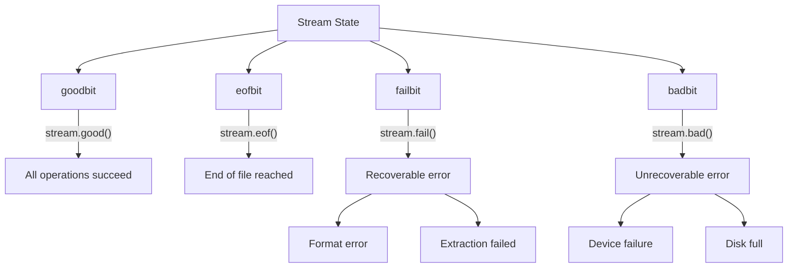

# C++ 流状态

在C++中，输入/输出操作依赖于流(stream)对象来完成数据的传输。无论是从键盘读取数据、向屏幕输出信息，还是与文件交互，都涉及到流的使用。然而，这些操作并不总是顺利进行——文件可能不存在、输入可能格式错误、设备可能故障。为了帮助开发者监测和处理这些情况，C++提供了流状态(stream state)机制。

## 流状态基础

每个流对象都维护着一组状态标志(state flags)，用于表示流的当前状态。C++中主要有四种流状态：

- **good** - 流一切正常，没有错误
- **eof** - 已到达文件末尾(End-Of-File)
- **fail** - 发生了格式错误或操作失败
- **bad** - 发生了严重的错误

这些状态不是互斥的，流可能同时具有多个状态标志。例如，当读取到文件末尾时，`eof`和`fail`标志都可能被设置。

## 检测流状态的方法

C++提供了多种方法来检查流的状态：

### 状态检测函数

```cpp
#include <iostream>
using namespace std;

int main() {
    int number;
    
    cout << "请输入一个整数: ";
    cin >> number;
    
    if (cin.good()) {
        cout << "输入成功，您输入的数字是: " << number << endl;
    } else if (cin.eof()) {
        cout << "遇到文件结束符" << endl;
    } else if (cin.fail()) {
        cout << "输入格式错误" << endl;
    } else if (cin.bad()) {
        cout << "发生了严重的I/O错误" << endl;
    }
    
    return 0;
}
```

如果用户输入了非数字（例如字母），上面的程序会输出：
```
请输入一个整数: abc
输入格式错误
```

### 状态测试操作符

除了直接调用状态检测函数，我们还可以将流对象直接用于条件测试：

```cpp
#include <iostream>
#include <fstream>
using namespace std;

int main() {
    ifstream file("example.txt");
    
    if (!file) { // 等价于 if (file.fail())
        cout << "无法打开文件!" << endl;
        return 1;
    }
    
    // 文件成功打开，可以继续操作
    cout << "文件打开成功!" << endl;
    
    return 0;
}
```

当流对象用于条件表达式时，会自动转换为`bool`类型：如果流处于有效状态（即`good()`返回`true`），则转换为`true`；否则转换为`false`。

## 流状态详解

让我们更详细地了解每种流状态：

### good状态

当流的所有状态标志都未被设置时，流处于good状态。这意味着没有错误发生，可以进行正常的读写操作。

```cpp
if (stream.good()) {
    // 流状态良好，可以进行操作
}
```

### eof状态

当读取操作到达输入流的末尾时，会设置eof标志。这通常发生在读取文件时：

```cpp
#include <iostream>
#include <fstream>
using namespace std;

int main() {
    ifstream file("data.txt");
    if (!file) {
        cout << "无法打开文件!" << endl;
        return 1;
    }
    
    char ch;
    while (file.get(ch)) {
        cout << ch;
    }
    
    if (file.eof()) {
        cout << "\n已读取到文件末尾" << endl;
    }
    
    return 0;
}
```

:::note
重要的是要理解，`eof`标志只有在**尝试读取超过文件末尾**时才会被设置，而不是刚好到达文件末尾时。
:::

### fail状态

当发生可恢复的错误时，会设置fail标志。例如，当尝试将字母读入整数变量时：

```cpp
#include <iostream>
#include <sstream>
using namespace std;

int main() {
    stringstream ss("Hello 123");
    int number;
    
    ss >> number;
    
    if (ss.fail()) {
        cout << "转换失败：无法将文本转换为整数" << endl;
        ss.clear(); // 清除错误状态
        ss.ignore(100, ' '); // 忽略接下来的字符，直到空格
    }
    
    ss >> number; // 现在可以读取123
    if (ss.good()) {
        cout << "成功读取数字: " << number << endl;
    }
    
    return 0;
}
```

输出:
```
转换失败：无法将文本转换为整数
成功读取数字: 123
```

### bad状态

当发生严重的、不可恢复的I/O错误时，会设置bad标志。例如，当磁盘已满或设备故障时：

```cpp
if (stream.bad()) {
    cerr << "发生严重错误，流可能已损坏" << endl;
    // 可能需要关闭和重新打开流，或者采取其他恢复措施
}
```

## 清除流状态

如果流进入错误状态，通常需要清除错误标志后才能继续使用。可以使用`clear()`函数来重置所有状态标志：

```cpp
stream.clear(); // 清除所有错误标志
```

如果只想清除特定的标志，可以提供一个参数：

```cpp
stream.clear(ios::goodbit); // 设置所有标志为good状态
```

有时，仅清除状态标志是不够的，还需要丢弃导致错误的输入。可以使用`ignore()`函数：

```cpp
// 忽略最多100个字符，或直到遇到换行符
cin.ignore(100, '\n');
```

## 实际应用案例

### 案例1：安全的数值输入

```cpp
#include <iostream>
#include <limits>
using namespace std;

int getValidInteger() {
    int number;
    
    while (true) {
        cout << "请输入一个整数: ";
        cin >> number;
        
        if (cin.good()) {
            // 输入成功
            return number;
        } else {
            // 输入失败
            cout << "输入无效，请重试!" << endl;
            
            // 清除错误状态
            cin.clear();
            
            // 丢弃无效输入
            cin.ignore(numeric_limits<streamsize>::max(), '\n');
        }
    }
}

int main() {
    int userNumber = getValidInteger();
    cout << "您成功输入了: " << userNumber << endl;
    
    return 0;
}
```

### 案例2：文件处理与错误检查

```cpp
#include <iostream>
#include <fstream>
#include <string>
using namespace std;

void processFile(const string& filename) {
    ifstream file(filename);
    
    // 检查文件是否成功打开
    if (!file) {
        cerr << "无法打开文件: " << filename << endl;
        return;
    }
    
    string line;
    int lineCount = 0;
    
    // 逐行读取文件
    while (getline(file, line)) {
        lineCount++;
        cout << "第" << lineCount << "行: " << line << endl;
        
        // 检查是否发生错误
        if (file.bad()) {
            cerr << "读取过程中发生严重错误!" << endl;
            break;
        }
    }
    
    // 检查是否正常到达文件末尾
    if (file.eof()) {
        cout << "文件读取完毕，共" << lineCount << "行。" << endl;
    } else if (file.fail() && !file.eof()) {
        cerr << "读取过程中发生格式错误!" << endl;
    }
    
    file.close();
}

int main() {
    processFile("sample.txt");
    return 0;
}
```

## 流状态与异常处理

默认情况下，C++流不会在发生错误时抛出异常。但是，我们可以通过调用`exceptions()`函数来改变这一行为：

```cpp
#include <iostream>
#include <fstream>
using namespace std;

int main() {
    ifstream file;
    
    // 设置文件流在打开失败时抛出异常
    file.exceptions(ifstream::failbit);
    
    try {
        file.open("nonexistent.txt");
        // 如果文件不存在，将不会执行到这里
    }
    catch (const ifstream::failure& e) {
        cout << "文件打开失败: " << e.what() << endl;
    }
    
    return 0;
}
```

## 流状态位图

下面是C++流状态位的关系图：



## 总结

流状态是C++I/O操作中不可或缺的一部分，它使开发者能够检测和处理各种I/O错误：

- **good()** 检查流是否处于良好状态
- **eof()** 检查是否到达文件末尾
- **fail()** 检查是否发生可恢复错误
- **bad()** 检查是否发生严重错误
- **clear()** 清除错误状态
- **ignore()** 忽略输入中的字符

掌握流状态检查和处理可以帮助你编写更健壮的程序，尤其是在处理用户输入和文件操作时。良好的错误处理可以提高程序的可靠性，并提供更好的用户体验。

## 练习

1. 编写一个程序，要求用户输入一个1到100之间的整数。如果用户输入无效（非整数或超出范围），提示错误并要求重新输入。
2. 修改上面的文件处理示例，统计文件中的单词数，而不仅仅是行数。
3. 实现一个函数，从文本文件中读取整数，并计算它们的总和。确保函数能够适当处理格式错误。
4. 编写一个程序，将一个文本文件的内容复制到另一个文件，并在过程中检查可能的I/O错误。

:::tip
记住，良好的错误处理不仅仅是检测错误，还包括提供有用的错误信息和适当的恢复策略！
:::