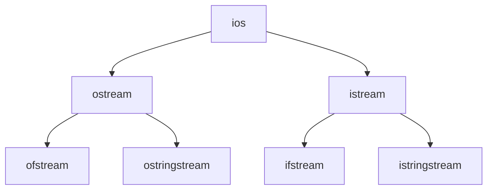

# C++ 输出流

在C++编程中，输出流是向用户显示数据或将数据写入文件的重要机制。C++提供了一套完整的输出流系统，让开发者能够以一种一致且灵活的方式处理数据输出。

## 什么是输出流？

输出流是C++中的一个抽象概念，代表着数据从程序流向外部目标（如屏幕、文件或字符串）的通道。在C++标准库中，所有输出流类都派生自`ostream`基类，提供了统一的接口和操作。



## 标准输出流

C++提供了几个预定义的标准输出流对象：

- `cout` - 标准输出（通常是屏幕）
- `cerr` - 标准错误输出（无缓冲）
- `clog` - 标准日志输出（带缓冲）

### cout - 标准输出

`cout`是最常用的输出流，用于在控制台显示信息：

```cpp
#include <iostream>

int main() {
    std::cout << "Hello, World!" << std::endl;
    int number = 42;
    std::cout << "The answer is: " << number << std::endl;
    return 0;
}
```

输出：
```
Hello, World!
The answer is: 42
```

:::tip
`std::endl`不仅插入换行符，还会刷新输出缓冲区。如果只需要换行而不需要刷新缓冲区，可以直接使用`'\n'`，这样在大量输出时可以提高性能。
:::

### cerr 和 clog - 错误和日志输出

这两个流专门用于输出错误信息和日志：

```cpp
#include <iostream>

int main() {
    std::cout << "Normal output" << std::endl;
    std::cerr << "Error message" << std::endl;
    std::clog << "Log message" << std::endl;
    return 0;
}
```

`cerr`是无缓冲的，意味着输出会立即显示，而不会等待缓冲区填满或刷新。这对于错误信息非常重要，因为即使程序崩溃，错误信息也能显示出来。

## 输出操作符和操纵符

### 插入操作符 `<<`

`<<`是C++中的输出操作符（也称为插入操作符），它被重载用于不同类型的数据输出：

```cpp
#include <iostream>

int main() {
    int number = 10;
    double pi = 3.14159;
    std::string message = "C++ is fun";
    
    std::cout << "Integer: " << number << std::endl;
    std::cout << "Double: " << pi << std::endl;
    std::cout << "String: " << message << std::endl;
    
    return 0;
}
```

### 输出操纵符

操纵符是用于控制输出格式的特殊函数，如设置字段宽度、对齐方式、进制等。

```cpp
#include <iostream>
#include <iomanip> // 必须包含此头文件使用大多数操纵符

int main() {
    int number = 42;
    
    // 设置宽度和填充
    std::cout << std::setw(10) << std::setfill('*') << number << std::endl;
    
    // 设置进制
    std::cout << "十进制: " << std::dec << number << std::endl;
    std::cout << "十六进制: " << std::hex << number << std::endl;
    std::cout << "八进制: " << std::oct << number << std::endl;
    
    // 设置精度
    double value = 3.14159265359;
    std::cout << "默认精度: " << value << std::endl;
    std::cout << "精确到2位: " << std::fixed << std::setprecision(2) << value << std::endl;
    
    return 0;
}
```

输出：
```
********42
十进制: 42
十六进制: 2a
八进制: 52
默认精度: 3.14159
精确到2位: 3.14
```

## 常用的输出操纵符

下面是一些常用的输出操纵符及其功能：

| 操纵符 | 功能 | 头文件 |
|--------|------|--------|
| `endl` | 插入换行并刷新缓冲区 | `<iostream>` |
| `setw(n)` | 设置下一个输出的字段宽度为n | `<iomanip>` |
| `setfill(c)` | 设置填充字符为c | `<iomanip>` |
| `left` | 左对齐 | `<iostream>` |
| `right` | 右对齐 | `<iostream>` |
| `dec` | 十进制输出 | `<iostream>` |
| `hex` | 十六进制输出 | `<iostream>` |
| `oct` | 八进制输出 | `<iostream>` |
| `fixed` | 固定小数点表示 | `<iostream>` |
| `scientific` | 科学计数法表示 | `<iostream>` |
| `setprecision(n)` | 设置浮点数精度为n | `<iomanip>` |
| `boolalpha` | 将bool值输出为true/false | `<iostream>` |
| `noboolalpha` | 将bool值输出为1/0 | `<iostream>` |
| `showpos` | 显示正数的加号 | `<iostream>` |
| `noshowpos` | 不显示正数的加号 | `<iostream>` |

## 文件输出流

除了向控制台输出，C++还提供了向文件输出数据的机制，通过`ofstream`类实现：

```cpp
#include <iostream>
#include <fstream>

int main() {
    std::ofstream outFile("example.txt");
    
    if (outFile.is_open()) {
        outFile << "这是写入文件的第一行" << std::endl;
        outFile << "这是第二行，包含数字: " << 42 << std::endl;
        outFile.close();
        std::cout << "数据已成功写入文件" << std::endl;
    } else {
        std::cerr << "无法打开文件" << std::endl;
    }
    
    return 0;
}
```

:::caution
使用文件流时，始终记得检查文件是否成功打开，并在使用完毕后关闭文件。
:::

## 字符串输出流

`ostringstream`类允许将输出定向到一个字符串对象，非常适合动态构建字符串：

```cpp
#include <iostream>
#include <sstream>
#include <string>

int main() {
    std::ostringstream oss;
    int age = 25;
    std::string name = "Alice";
    
    oss << "姓名: " << name << ", 年龄: " << age;
    
    std::string result = oss.str();
    std::cout << result << std::endl;
    
    return 0;
}
```

输出：
```
姓名: Alice, 年龄: 25
```

## 自定义输出格式

### 设置布尔输出格式

```cpp
#include <iostream>

int main() {
    bool flag = true;
    
    std::cout << "默认布尔输出: " << flag << std::endl;
    std::cout << "使用boolalpha: " << std::boolalpha << flag << std::endl;
    
    return 0;
}
```

输出：
```
默认布尔输出: 1
使用boolalpha: true
```

### 格式化数值输出

```cpp
#include <iostream>
#include <iomanip>

int main() {
    double price = 1234.56789;
    
    // 设置货币格式
    std::cout << "价格: $" << std::fixed << std::setprecision(2) << price << std::endl;
    
    // 右对齐
    std::cout << "右对齐: " << std::right << std::setw(10) << price << std::endl;
    
    // 左对齐
    std::cout << "左对齐: " << std::left << std::setw(10) << price << std::endl;
    
    return 0;
}
```

输出：
```
价格: $1234.57
右对齐:    1234.57
左对齐: 1234.57   
```

## 实际应用案例

### 创建简单的日志系统

```cpp
#include <iostream>
#include <fstream>
#include <string>
#include <ctime>

class Logger {
private:
    std::ofstream logFile;

public:
    enum LogLevel {
        INFO,
        WARNING,
        ERROR
    };

    Logger(const std::string& filename) {
        logFile.open(filename, std::ios::app);
        if (!logFile.is_open()) {
            std::cerr << "无法打开日志文件: " << filename << std::endl;
        }
    }

    ~Logger() {
        if (logFile.is_open()) {
            logFile.close();
        }
    }

    void log(LogLevel level, const std::string& message) {
        time_t now = time(0);
        std::string levelStr;

        switch (level) {
            case INFO:
                levelStr = "INFO";
                break;
            case WARNING:
                levelStr = "WARNING";
                break;
            case ERROR:
                levelStr = "ERROR";
                break;
        }

        if (logFile.is_open()) {
            logFile << "[" << ctime(&now) << "] [" << levelStr << "] " << message << std::endl;
        }

        // 同时输出到控制台
        std::cout << "[" << levelStr << "] " << message << std::endl;
    }
};

int main() {
    Logger logger("application.log");
    logger.log(Logger::INFO, "应用程序启动");
    logger.log(Logger::WARNING, "发现配置问题，使用默认值");
    logger.log(Logger::ERROR, "数据库连接失败");
    
    return 0;
}
```

### 生成格式化报表

```cpp
#include <iostream>
#include <iomanip>
#include <vector>
#include <string>

struct Product {
    std::string name;
    double price;
    int quantity;
};

void printReport(const std::vector<Product>& products) {
    double total = 0.0;
    
    // 打印表头
    std::cout << std::string(50, '-') << std::endl;
    std::cout << std::left << std::setw(20) << "产品名称"
              << std::right << std::setw(10) << "价格"
              << std::right << std::setw(10) << "数量"
              << std::right << std::setw(10) << "小计" << std::endl;
    std::cout << std::string(50, '-') << std::endl;
    
    // 打印产品信息
    for (const auto& product : products) {
        double subtotal = product.price * product.quantity;
        total += subtotal;
        
        std::cout << std::left << std::setw(20) << product.name
                  << std::right << std::setw(10) << std::fixed << std::setprecision(2) << product.price
                  << std::right << std::setw(10) << product.quantity
                  << std::right << std::setw(10) << std::fixed << std::setprecision(2) << subtotal << std::endl;
    }
    
    // 打印总计
    std::cout << std::string(50, '-') << std::endl;
    std::cout << std::right << std::setw(40) << "总计: "
              << std::right << std::setw(10) << std::fixed << std::setprecision(2) << total << std::endl;
    std::cout << std::string(50, '-') << std::endl;
}

int main() {
    std::vector<Product> inventory = {
        {"笔记本电脑", 5999.99, 3},
        {"鼠标", 99.50, 10},
        {"键盘", 299.99, 5},
        {"显示器", 1299.00, 2}
    };
    
    printReport(inventory);
    return 0;
}
```

## 输出流的性能考虑

### 避免频繁刷新

频繁使用`endl`会导致输出缓冲区频繁刷新，影响性能：

```cpp
// 低效的方式
for (int i = 0; i < 10000; i++) {
    std::cout << i << std::endl; // 每次迭代都刷新缓冲区
}

// 更高效的方式
for (int i = 0; i < 10000; i++) {
    std::cout << i << '\n'; // 只换行不刷新
}
std::cout << std::flush; // 最后一次性刷新
```

### 使用流的异常处理

```cpp
#include <iostream>
#include <fstream>

int main() {
    std::ofstream file("data.txt");
    
    // 设置异常掩码，当发生失败时抛出异常
    file.exceptions(std::ofstream::failbit | std::ofstream::badbit);
    
    try {
        for (int i = 0; i < 100; i++) {
            file << "Line " << i << std::endl;
        }
    } catch (const std::ofstream::failure& e) {
        std::cerr << "文件操作失败: " << e.what() << std::endl;
    }
    
    return 0;
}
```

## 总结

C++输出流是C++标准库中不可或缺的一部分，提供了强大而灵活的数据输出能力：

1. `cout`、`cerr`和`clog`提供了向控制台输出的标准方式
2. 输出操纵符提供了丰富的格式化选项
3. 文件输出流`ofstream`实现了向文件写入数据的功能
4. 字符串输出流`ostringstream`允许将输出重定向到字符串对象

掌握这些概念和技术，你将能够在C++程序中实现各种输出需求，从简单的控制台输出到复杂的文件操作和格式化报表生成。

## 练习

1. 创建一个程序，使用不同的操纵符输出同一个浮点数，展示不同的格式效果。
2. 实现一个简单的文件复制程序，将一个文本文件的内容复制到另一个文件中。
3. 使用`ostringstream`创建一个函数，将整数转换为指定进制（二进制、八进制、十六进制）的字符串。
4. 扩展日志系统案例，添加时间戳和日志级别颜色。
5. 创建一个CSV文件生成器，将数据结构化输出到文件中。

## 进一步学习资源

- C++ STL文档中关于输入/输出流的部分
- 《C++ Primer》第8章：IO库
- 《The C++ Standard Library》第13章：输入/输出流和格式化