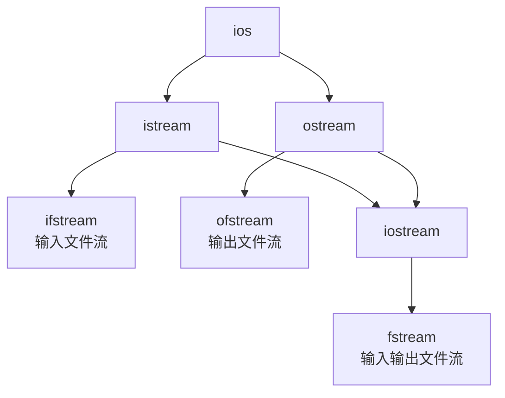

# C++ 文件流

在程序设计中，我们经常需要将数据存储到文件中，或者从文件中读取数据。C++提供了一组强大的类和函数，使得这些操作变得简单而高效。这些类和函数被称为"文件流"，它们是C++标准库的一部分。

## 文件流基础

C++中的文件流基于三个主要类：



- `ifstream`：用于从文件读取数据
- `ofstream`：用于向文件写入数据
- `fstream`：可以同时进行读写操作

要使用这些类，需要包含头文件：

```cpp
#include <fstream>
```

## 打开与关闭文件

### 打开文件

有两种方法可以打开文件：

**方法1：通过构造函数**

```cpp
ifstream inFile("input.txt");  // 打开输入文件
ofstream outFile("output.txt");  // 打开输出文件
```

**方法2：使用open()方法**

```cpp
ifstream inFile;
ofstream outFile;
inFile.open("input.txt");
outFile.open("output.txt");
```

### 文件打开模式

打开文件时，可以指定打开模式：

```cpp
ofstream outFile("output.txt", ios::out | ios::app);
```

常用的打开模式有：

| 模式 | 描述 |
|------|------|
| `ios::in` | 打开文件用于读取 |
| `ios::out` | 打开文件用于写入 |
| `ios::app` | 追加模式，新内容添加到文件末尾 |
| `ios::ate` | 打开文件后立即将位置设置到文件末尾 |
| `ios::trunc` | 如果文件已存在，则删除文件内容 |
| `ios::binary` | 以二进制模式打开文件 |

### 检查文件是否成功打开

在进行读写操作前，最好先检查文件是否成功打开：

```cpp
ifstream inFile("input.txt");
if (!inFile) {
    cerr << "无法打开文件！" << endl;
    return 1;
}
```

### 关闭文件

文件使用完毕后，应该关闭它：

```cpp
inFile.close();
outFile.close();
```

## 文件读写操作

### 文本文件读写

#### 写入文本文件

```cpp
#include <iostream>
#include <fstream>
using namespace std;

int main() {
    ofstream outFile("example.txt");
    
    if (outFile.is_open()) {
        outFile << "Hello, C++ File I/O!" << endl;
        outFile << "这是第二行文本。" << endl;
        outFile << "数值: " << 42 << endl;
        
        outFile.close();
        cout << "文件写入成功！" << endl;
    } else {
        cerr << "无法打开文件！" << endl;
    }
    
    return 0;
}
```

**输出:**
```
文件写入成功！
```

文件 `example.txt` 内容:
```
Hello, C++ File I/O!
这是第二行文本。
数值: 42
```

#### 读取文本文件

**逐行读取：**

```cpp
#include <iostream>
#include <fstream>
#include <string>
using namespace std;

int main() {
    ifstream inFile("example.txt");
    string line;
    
    if (inFile.is_open()) {
        while (getline(inFile, line)) {
            cout << line << endl;
        }
        inFile.close();
    } else {
        cerr << "无法打开文件！" << endl;
    }
    
    return 0;
}
```

**输出:**
```
Hello, C++ File I/O!
这是第二行文本。
数值: 42
```

**逐词读取：**

```cpp
#include <iostream>
#include <fstream>
#include <string>
using namespace std;

int main() {
    ifstream inFile("example.txt");
    string word;
    
    if (inFile.is_open()) {
        while (inFile >> word) {
            cout << word << " ";
        }
        cout << endl;
        inFile.close();
    } else {
        cerr << "无法打开文件！" << endl;
    }
    
    return 0;
}
```

**输出:**
```
Hello, C++ File I/O! 这是第二行文本。 数值: 42 
```

### 二进制文件读写

处理二进制文件时，需要使用 `read()` 和 `write()` 函数：

```cpp
#include <iostream>
#include <fstream>
using namespace std;

struct Person {
    char name[50];
    int age;
    double salary;
};

int main() {
    // 写入二进制文件
    ofstream outFile("data.bin", ios::binary);
    if (outFile.is_open()) {
        Person person = {"张三", 25, 5000.50};
        outFile.write(reinterpret_cast<char*>(&person), sizeof(Person));
        outFile.close();
        cout << "二进制数据写入成功！" << endl;
    }
    
    // 读取二进制文件
    ifstream inFile("data.bin", ios::binary);
    if (inFile.is_open()) {
        Person readPerson;
        inFile.read(reinterpret_cast<char*>(&readPerson), sizeof(Person));
        
        cout << "姓名: " << readPerson.name << endl;
        cout << "年龄: " << readPerson.age << endl;
        cout << "薪资: " << readPerson.salary << endl;
        
        inFile.close();
    }
    
    return 0;
}
```

**输出:**
```
二进制数据写入成功！
姓名: 张三
年龄: 25
薪资: 5000.5
```

## 文件指针操作

文件流提供了几种移动文件指针的方法：

```cpp
#include <iostream>
#include <fstream>
using namespace std;

int main() {
    fstream file("example.txt", ios::in | ios::out);
    
    if (file.is_open()) {
        // 获取文件大小
        file.seekg(0, ios::end);  // 将读指针移到文件末尾
        streampos fileSize = file.tellg();  // 获取当前位置
        cout << "文件大小: " << fileSize << " 字节" << endl;
        
        // 移动到文件起始位置
        file.seekg(0, ios::beg);
        
        // 读取前10个字符
        char buffer[11];
        file.read(buffer, 10);
        buffer[10] = '\0';  // 添加字符串结束符
        cout << "前10个字符: " << buffer << endl;
        
        // 移动到文件中间
        file.seekp(fileSize/2, ios::beg);  // 设置写指针
        file.write(" [插入文本] ", 12);
        
        file.close();
    }
    
    return 0;
}
```

## 错误处理

在进行文件操作时，错误处理非常重要：

```cpp
#include <iostream>
#include <fstream>
using namespace std;

int main() {
    ifstream inFile("不存在的文件.txt");
    
    if (!inFile) {
        cerr << "文件打开失败!" << endl;
        // 查看具体错误原因
        if (inFile.fail()) {
            cerr << "格式错误或其他非严重错误" << endl;
        }
        if (inFile.bad()) {
            cerr << "I/O错误，可能数据丢失" << endl;
        }
        if (inFile.eof()) {
            cerr << "到达文件末尾" << endl;
        }
    }
    
    return 0;
}
```

**输出:**
```
文件打开失败!
格式错误或其他非严重错误
```

## 实际应用案例

### 案例1：学生成绩管理系统

```cpp
#include <iostream>
#include <fstream>
#include <string>
#include <vector>
#include <iomanip>
using namespace std;

struct Student {
    string name;
    int id;
    double score;
};

void saveStudents(const vector<Student>& students) {
    ofstream outFile("students.txt");
    
    if (outFile.is_open()) {
        for (const auto& student : students) {
            outFile << student.name << " " 
                    << student.id << " " 
                    << student.score << endl;
        }
        outFile.close();
        cout << "学生数据保存成功！" << endl;
    } else {
        cerr << "无法打开文件进行写入！" << endl;
    }
}

vector<Student> loadStudents() {
    vector<Student> students;
    ifstream inFile("students.txt");
    
    if (inFile.is_open()) {
        Student temp;
        while (inFile >> temp.name >> temp.id >> temp.score) {
            students.push_back(temp);
        }
        inFile.close();
        cout << "成功加载 " << students.size() << " 个学生记录！" << endl;
    } else {
        cerr << "无法打开文件进行读取！" << endl;
    }
    
    return students;
}

void displayStudents(const vector<Student>& students) {
    cout << "-------------------------" << endl;
    cout << setw(10) << "姓名" << setw(10) << "学号" << setw(10) << "分数" << endl;
    cout << "-------------------------" << endl;
    
    for (const auto& student : students) {
        cout << setw(10) << student.name 
             << setw(10) << student.id 
             << setw(10) << fixed << setprecision(2) << student.score << endl;
    }
    cout << "-------------------------" << endl;
}

int main() {
    vector<Student> students = {
        {"张三", 1001, 85.5},
        {"李四", 1002, 92.0},
        {"王五", 1003, 78.5}
    };
    
    // 保存学生数据到文件
    saveStudents(students);
    
    // 清空学生数组
    students.clear();
    
    // 从文件中加载学生数据
    students = loadStudents();
    
    // 显示加载的学生数据
    displayStudents(students);
    
    return 0;
}
```

**输出:**
```
学生数据保存成功！
成功加载 3 个学生记录！
-------------------------
      姓名      学号      分数
-------------------------
      张三     1001     85.50
      李四     1002     92.00
      王五     1003     78.50
-------------------------
```

### 案例2：简易文本编辑器

```cpp
#include <iostream>
#include <fstream>
#include <string>
#include <vector>
using namespace std;

class SimpleTextEditor {
private:
    string filename;
    vector<string> lines;
    
public:
    SimpleTextEditor(const string& fname) : filename(fname) {}
    
    bool load() {
        lines.clear();
        ifstream file(filename);
        
        if (!file.is_open()) {
            return false;
        }
        
        string line;
        while (getline(file, line)) {
            lines.push_back(line);
        }
        
        file.close();
        return true;
    }
    
    bool save() {
        ofstream file(filename);
        
        if (!file.is_open()) {
            return false;
        }
        
        for (const string& line : lines) {
            file << line << endl;
        }
        
        file.close();
        return true;
    }
    
    void display() {
        cout << "=== 文件内容 ===" << endl;
        for (size_t i = 0; i < lines.size(); ++i) {
            cout << i + 1 << ": " << lines[i] << endl;
        }
        cout << "================" << endl;
    }
    
    void addLine(const string& line) {
        lines.push_back(line);
    }
    
    bool editLine(size_t lineNum, const string& newText) {
        if (lineNum >= 1 && lineNum <= lines.size()) {
            lines[lineNum - 1] = newText;
            return true;
        }
        return false;
    }
    
    bool deleteLine(size_t lineNum) {
        if (lineNum >= 1 && lineNum <= lines.size()) {
            lines.erase(lines.begin() + lineNum - 1);
            return true;
        }
        return false;
    }
};

int main() {
    SimpleTextEditor editor("notes.txt");
    int choice;
    
    // 尝试加载文件
    if (!editor.load()) {
        cout << "创建新文件..." << endl;
    } else {
        editor.display();
    }
    
    do {
        cout << "\n选择操作:" << endl;
        cout << "1. 显示文本" << endl;
        cout << "2. 添加一行" << endl;
        cout << "3. 编辑一行" << endl;
        cout << "4. 删除一行" << endl;
        cout << "5. 保存文件" << endl;
        cout << "0. 退出" << endl;
        cout << "请选择: ";
        cin >> choice;
        cin.ignore(); // 清除输入缓冲区
        
        string text;
        size_t lineNum;
        
        switch (choice) {
            case 1:
                editor.display();
                break;
                
            case 2:
                cout << "输入要添加的内容: ";
                getline(cin, text);
                editor.addLine(text);
                break;
                
            case 3:
                cout << "要编辑的行号: ";
                cin >> lineNum;
                cin.ignore();
                cout << "输入新内容: ";
                getline(cin, text);
                
                if (!editor.editLine(lineNum, text)) {
                    cout << "无效的行号!" << endl;
                }
                break;
                
            case 4:
                cout << "要删除的行号: ";
                cin >> lineNum;
                
                if (!editor.deleteLine(lineNum)) {
                    cout << "无效的行号!" << endl;
                }
                break;
                
            case 5:
                if (editor.save()) {
                    cout << "文件已保存!" << endl;
                } else {
                    cout << "保存失败!" << endl;
                }
                break;
                
            case 0:
                cout << "退出编辑器" << endl;
                break;
                
            default:
                cout << "无效选择，请重试!" << endl;
        }
        
    } while (choice != 0);
    
    return 0;
}
```

## 总结

C++文件流为我们提供了一种灵活、强大的方式来处理文件的读写操作。本文介绍了：

1. 文件流的基本概念与类型
2. 如何打开和关闭文件
3. 文件读写的基本操作
4. 文本文件与二进制文件的处理方法
5. 文件指针的操作
6. 错误处理机制
7. 实际应用案例

在实际编程中，文件操作是非常常见且重要的部分。熟练掌握C++的文件流操作，将使你能够更有效地处理数据存储与传输相关的任务。

:::tip 建议
1. 始终检查文件是否成功打开
2. 使用完文件后记得关闭
3. 适当处理可能出现的错误
4. 对于大文件，考虑使用缓冲读取策略
:::

## 练习题

为了巩固学习成果，尝试完成以下练习：

1. 编写一个程序，统计一个文本文件中的字符数、单词数和行数。
2. 创建一个简单的通讯录程序，可以添加、删除、修改和查询联系人信息，并将数据保存到文件中。
3. 编写一个程序，将两个已排序的文本文件合并为一个新的排序文件。
4. 实现一个文件加密/解密程序，使用简单的替换加密方法。
5. 创建一个日志记录系统，能够将不同级别的日志信息写入文件。

通过这些练习，你将更深入地理解和运用C++文件流的各种功能！