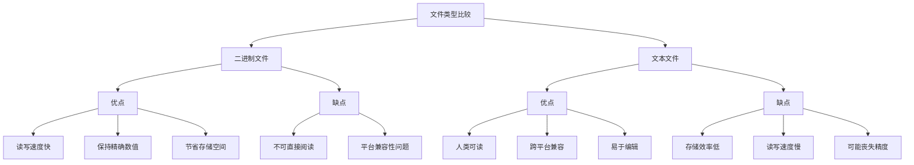

# C++ 二进制文件

在C++编程中，文件操作是一项基础且重要的技能。特别是二进制文件的处理，它与文本文件有着本质的区别，在某些场景下具有不可替代的优势。本文将全面介绍C++中二进制文件的概念、操作方法及应用场景。

## 什么是二进制文件？

二进制文件是以二进制格式存储数据的文件，与文本文件相比，它具有以下特点：

1. **存储格式**：二进制文件直接存储数据在内存中的表示形式，不进行任何转换
2. **高效性**：读写速度通常比文本文件快
3. **精确性**：保存数值数据时不会丢失精度
4. **紧凑性**：通常占用更少的存储空间
5. **不可读性**：无法直接用文本编辑器查看内容

:::note
文本文件和二进制文件的主要区别在于数据的表示方式，而不是文件本身的内容。从本质上讲，所有文件都是以二进制形式存储的。
:::

## 二进制文件操作基础

在C++中，使用`fstream`库中的类可以进行二进制文件操作。

### 打开二进制文件

```cpp
#include <fstream>
#include <iostream>
using namespace std;

int main() {
    // 打开文件用于二进制写入
    ofstream outFile("data.bin", ios::binary);
    
    if (!outFile) {
        cout << "无法打开文件!" << endl;
        return 1;
    }
    
    // 文件操作...
    
    outFile.close();
    return 0;
}
```

注意使用`ios::binary`标志来指定二进制模式。

### 写入二进制文件

使用`write()`函数将数据写入二进制文件：

```cpp
#include <fstream>
#include <iostream>
using namespace std;

int main() {
    ofstream outFile("data.bin", ios::binary);
    
    if (!outFile) {
        cout << "无法打开文件!" << endl;
        return 1;
    }
    
    int numbers[] = {1, 2, 3, 4, 5};
    // 写入整个数组
    outFile.write(reinterpret_cast<char*>(numbers), sizeof(numbers));
    
    outFile.close();
    cout << "数据成功写入文件!" << endl;
    return 0;
}
```

### 读取二进制文件

使用`read()`函数从二进制文件读取数据：

```cpp
#include <fstream>
#include <iostream>
using namespace std;

int main() {
    ifstream inFile("data.bin", ios::binary);
    
    if (!inFile) {
        cout << "无法打开文件!" << endl;
        return 1;
    }
    
    int numbers[5];
    // 从文件读取数据到数组
    inFile.read(reinterpret_cast<char*>(numbers), sizeof(numbers));
    
    cout << "读取的数据: ";
    for (int i = 0; i < 5; i++) {
        cout << numbers[i] << " ";
    }
    cout << endl;
    
    inFile.close();
    return 0;
}
```

输出：
```
读取的数据: 1 2 3 4 5
```

## 二进制文件的高级操作

### 文件指针操作

在二进制文件中，我们可以使用文件指针精确定位到文件中的任何位置：

```cpp
#include <fstream>
#include <iostream>
using namespace std;

int main() {
    fstream file("random.bin", ios::binary | ios::in | ios::out | ios::trunc);
    
    // 写入一些整数
    for (int i = 0; i < 10; i++) {
        file.write(reinterpret_cast<char*>(&i), sizeof(int));
    }
    
    // 移动到文件起始位置
    file.seekg(0, ios::beg);
    
    // 读取第三个整数（偏移量为 2*sizeof(int)）
    int value;
    file.seekg(2 * sizeof(int), ios::beg);
    file.read(reinterpret_cast<char*>(&value), sizeof(int));
    
    cout << "第三个数字是: " << value << endl;  // 输出: 第三个数字是: 2
    
    // 修改第五个整数
    value = 99;
    file.seekp(4 * sizeof(int), ios::beg);
    file.write(reinterpret_cast<char*>(&value), sizeof(int));
    
    // 验证修改
    file.seekg(4 * sizeof(int), ios::beg);
    file.read(reinterpret_cast<char*>(&value), sizeof(int));
    cout << "修改后的第五个数字是: " << value << endl;  // 输出: 修改后的第五个数字是: 99
    
    file.close();
    return 0;
}
```

输出：
```
第三个数字是: 2
修改后的第五个数字是: 99
```

### 结构体的读写

二进制文件特别适合保存结构化数据：

```cpp
#include <fstream>
#include <iostream>
#include <string>
#include <cstring>
using namespace std;

struct Student {
    int id;
    char name[50];
    float gpa;
};

void writeStudent(ofstream& outFile, const Student& student) {
    outFile.write(reinterpret_cast<const char*>(&student), sizeof(Student));
}

Student readStudent(ifstream& inFile) {
    Student student;
    inFile.read(reinterpret_cast<char*>(&student), sizeof(Student));
    return student;
}

int main() {
    // 写入学生信息
    ofstream outFile("students.bin", ios::binary);
    
    Student s1 = {1001, "张三", 3.8};
    Student s2 = {1002, "李四", 3.9};
    Student s3 = {1003, "王五", 3.5};
    
    writeStudent(outFile, s1);
    writeStudent(outFile, s2);
    writeStudent(outFile, s3);
    
    outFile.close();
    
    // 读取学生信息
    ifstream inFile("students.bin", ios::binary);
    
    cout << "学生信息：" << endl;
    for (int i = 0; i < 3; i++) {
        Student s = readStudent(inFile);
        cout << "ID: " << s.id << ", 姓名: " << s.name 
             << ", GPA: " << s.gpa << endl;
    }
    
    inFile.close();
    return 0;
}
```

输出：
```
学生信息：
ID: 1001, 姓名: 张三, GPA: 3.8
ID: 1002, 姓名: 李四, GPA: 3.9
ID: 1003, 姓名: 王五, GPA: 3.5
```

:::caution
在不同平台或编译器之间交换二进制文件时需要注意字节对齐和字节序问题，可能会导致兼容性问题。
:::

## 二进制文件与文本文件的比较

以下是二进制文件与文本文件优缺点的比较：



## 实际应用场景

### 1. 图片处理应用

二进制文件操作在图像处理中非常常见。以下是一个简化的 BMP 文件头部读取示例：

```cpp
#include <fstream>
#include <iostream>
using namespace std;

#pragma pack(push, 1)  // 取消字节对齐
struct BMPHeader {
    char signature[2];  // 'BM'
    int fileSize;
    int reserved;
    int dataOffset;
    int headerSize;
    int width;
    int height;
    short planes;
    short bitsPerPixel;
    // ...其他字段省略
};
#pragma pack(pop)

int main() {
    ifstream bmpFile("example.bmp", ios::binary);
    
    if (!bmpFile) {
        cout << "无法打开BMP文件!" << endl;
        return 1;
    }
    
    BMPHeader header;
    bmpFile.read(reinterpret_cast<char*>(&header), sizeof(BMPHeader));
    
    // 验证文件格式
    if (header.signature[0] != 'B' || header.signature[1] != 'M') {
        cout << "不是有效的BMP文件!" << endl;
        return 1;
    }
    
    cout << "图片宽度: " << header.width << "像素" << endl;
    cout << "图片高度: " << header.height << "像素" << endl;
    cout << "色彩深度: " << header.bitsPerPixel << "位" << endl;
    
    bmpFile.close();
    return 0;
}
```

### 2. 数据库系统

简化版的数据记录读写系统：

```cpp
#include <fstream>
#include <iostream>
#include <string>
#include <vector>
#include <cstring>
using namespace std;

struct Record {
    int id;
    char name[50];
    double salary;
    bool isActive;
};

class SimpleDB {
private:
    string filename;
    
public:
    SimpleDB(const string& file) : filename(file) {}
    
    bool addRecord(const Record& record) {
        ofstream file(filename, ios::binary | ios::app);
        if (!file) return false;
        
        file.write(reinterpret_cast<const char*>(&record), sizeof(Record));
        return true;
    }
    
    vector<Record> getAllRecords() {
        vector<Record> records;
        ifstream file(filename, ios::binary);
        if (!file) return records;
        
        Record record;
        while (file.read(reinterpret_cast<char*>(&record), sizeof(Record))) {
            records.push_back(record);
        }
        
        return records;
    }
    
    bool updateRecord(int id, const Record& newData) {
        fstream file(filename, ios::binary | ios::in | ios::out);
        if (!file) return false;
        
        Record record;
        bool found = false;
        
        while (file.read(reinterpret_cast<char*>(&record), sizeof(Record))) {
            if (record.id == id) {
                // 找到记录，移回该记录起始位置
                file.seekp(-static_cast<int>(sizeof(Record)), ios::cur);
                // 写入新数据
                file.write(reinterpret_cast<const char*>(&newData), sizeof(Record));
                found = true;
                break;
            }
        }
        
        return found;
    }
};

int main() {
    SimpleDB db("employees.db");
    
    // 添加记录
    Record r1 = {1, "张三", 5000.0, true};
    Record r2 = {2, "李四", 6000.0, true};
    db.addRecord(r1);
    db.addRecord(r2);
    
    // 读取所有记录
    cout << "所有员工:" << endl;
    for (const auto& r : db.getAllRecords()) {
        cout << "ID: " << r.id << ", 姓名: " << r.name 
             << ", 工资: " << r.salary << ", 状态: " 
             << (r.isActive ? "在职" : "离职") << endl;
    }
    
    // 更新记录
    Record updated = {2, "李四", 7000.0, true};  // 加薪
    if (db.updateRecord(2, updated)) {
        cout << "\n更新成功！更新后的记录:" << endl;
        for (const auto& r : db.getAllRecords()) {
            cout << "ID: " << r.id << ", 姓名: " << r.name 
                 << ", 工资: " << r.salary << ", 状态: " 
                 << (r.isActive ? "在职" : "离职") << endl;
        }
    }
    
    return 0;
}
```

输出：
```
所有员工:
ID: 1, 姓名: 张三, 工资: 5000, 状态: 在职
ID: 2, 姓名: 李四, 工资: 6000, 状态: 在职

更新成功！更新后的记录:
ID: 1, 姓名: 张三, 工资: 5000, 状态: 在职
ID: 2, 姓名: 李四, 工资: 7000, 状态: 在职
```

## 二进制文件操作的注意事项

1. **平台兼容性**：不同平台可能有不同的字节序和对齐要求
2. **指针和引用**：不应直接将指针或引用写入文件，因为它们仅在程序运行时有效
3. **字符串处理**：对于变长数据如字符串，需要特别处理
4. **错误处理**：读写过程中注意捕获异常和错误
5. **文件损坏**：二进制文件损坏后很难恢复，考虑添加校验机制

## 总结

C++的二进制文件操作为处理大量数据、结构化信息和需要高性能IO的应用提供了强大的工具。通过本文，您已经了解了：

- 二进制文件的基本概念和特点
- 如何打开、读取和写入二进制文件
- 文件指针的移动和定位
- 复杂数据结构的读写
- 二进制文件的实际应用场景
- 处理二进制文件时的注意事项

掌握这些技能将使您能够开发出更加高效、功能强大的C++应用程序。

## 练习题

1. 编写一个程序，创建一个二进制文件，存储10个随机整数，然后读取并计算它们的平均值。
2. 设计一个简单的学生管理系统，使用二进制文件存储学生信息（包括学号、姓名和成绩），并实现添加、查询、修改和删除功能。
3. 创建一个程序，将一个文本文件转换为二进制文件，然后再将二进制文件转换回文本文件，比较两个文本文件是否相同。
4. 实现一个简单的图片复制程序，读取一个BMP文件，然后创建它的副本。

:::tip
建议在掌握基本概念后，尝试完成这些练习来深化对二进制文件操作的理解。对于复杂的文件格式（如BMP），可以先在网上查阅其格式规范，了解文件的结构。
:::