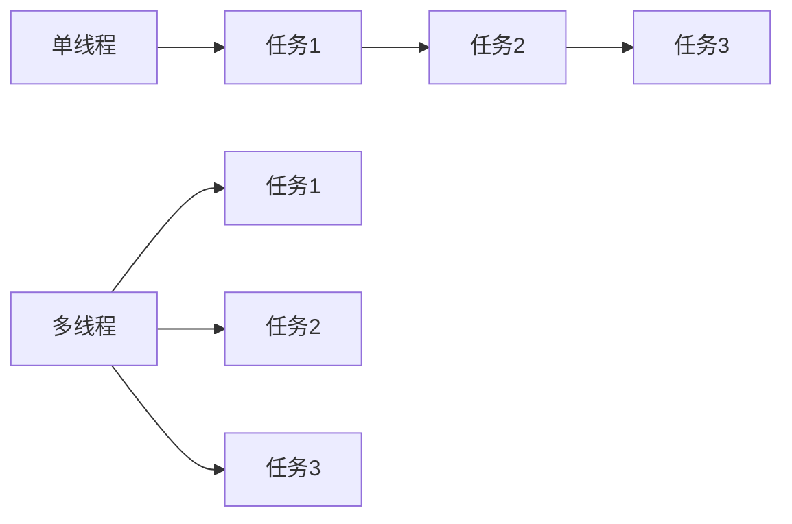
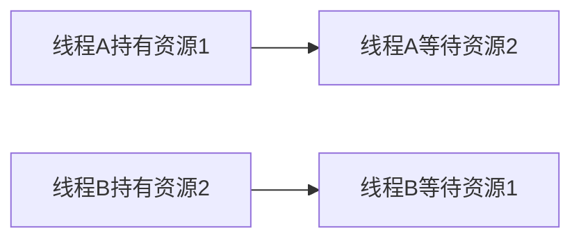

# C++ 多线程概述

## 什么是多线程？

多线程是一种并行计算的方式，它允许程序同时执行多个任务。在传统的单线程程序中，任务是按顺序一个接一个执行的。而在多线程程序中，多个任务可以同时执行，这样可以提高程序的效率和性能。

想象一下，你正在烹饪一顿大餐。如果你是单线程工作，你需要先切菜，然后才能开始烧水，然后才能炒菜。但如果你是多线程工作，你可以一边切菜，一边烧水，一边准备调料，大大提高了效率。



## C++ 中的多线程支持

在C++11标准之前，C++并没有提供官方的多线程支持，程序员通常需要使用操作系统特定的API或第三方库（如POSIX threads或Windows线程API）来实现多线程。

从C++11开始，C++标准库引入了对多线程编程的原生支持，主要通过以下头文件：

- `<thread>`: 提供线程相关的类和函数
- `<mutex>`: 提供互斥锁相关的类和函数
- `<condition_variable>`: 提供条件变量相关的类和函数
- `<future>`: 提供异步操作相关的类和函数
- `<atomic>`: 提供原子操作相关的类和函数

## 创建和管理线程

在C++中，创建一个线程非常简单，只需要包含`<thread>`头文件，然后创建一个`std::thread`对象即可。

### 基本示例

```cpp
#include <iostream>
#include <thread>

// 线程函数
void hello() {
    std::cout << "Hello from thread!" << std::endl;
}

int main() {
    // 创建一个线程，执行hello函数
    std::thread t(hello);
    
    // 等待线程执行完毕
    t.join();
    
    std::cout << "Main thread continues..." << std::endl;
    return 0;
}
```

输出：
```
Hello from thread!
Main thread continues...
```

### 向线程函数传递参数

```cpp
#include <iostream>
#include <thread>
#include <string>

void greet(const std::string& name, int times) {
    for (int i = 0; i < times; i++) {
        std::cout << "Hello, " << name << "!" << std::endl;
    }
}

int main() {
    // 创建一个线程，执行greet函数，并传递参数
    std::thread t(greet, "Alice", 3);
    
    // 等待线程执行完毕
    t.join();
    
    std::cout << "Main thread continues..." << std::endl;
    return 0;
}
```

输出：
```
Hello, Alice!
Hello, Alice!
Hello, Alice!
Main thread continues...
```

:::note
传递参数时，参数会被复制到线程的内存空间中。如果你想传递引用，需要使用`std::ref`或`std::cref`函数。
:::

## 线程同步

当多个线程访问共享资源时，可能会导致竞态条件（race condition）和数据竞争（data race）等问题。为了避免这些问题，我们需要使用线程同步机制。

### 互斥锁（Mutex）

互斥锁是最常用的线程同步机制之一，它可以保证在同一时刻只有一个线程能够访问共享资源。

```cpp
#include <iostream>
#include <thread>
#include <mutex>
#include <vector>

std::mutex mtx; // 互斥锁
int counter = 0; // 共享资源

void increment(int times) {
    for (int i = 0; i < times; i++) {
        mtx.lock(); // 获取锁
        counter++; // 访问共享资源
        mtx.unlock(); // 释放锁
    }
}

int main() {
    std::vector<std::thread> threads;
    
    // 创建10个线程，每个线程递增counter 1000次
    for (int i = 0; i < 10; i++) {
        threads.push_back(std::thread(increment, 1000));
    }
    
    // 等待所有线程执行完毕
    for (auto& t : threads) {
        t.join();
    }
    
    std::cout << "Final counter value: " << counter << std::endl;
    return 0;
}
```

输出：
```
Final counter value: 10000
```

:::tip
使用`std::lock_guard`或`std::unique_lock`可以更安全地管理互斥锁，避免忘记释放锁的问题。
```cpp
void increment(int times) {
    for (int i = 0; i < times; i++) {
        std::lock_guard<std::mutex> lock(mtx); // 自动获取和释放锁
        counter++;
    }
}
```
:::

### 条件变量（Condition Variable）

条件变量是另一种线程同步机制，它可以让线程等待某个条件满足之后再继续执行。

```cpp
#include <iostream>
#include <thread>
#include <mutex>
#include <condition_variable>
#include <queue>

std::mutex mtx;
std::condition_variable cv;
std::queue<int> data_queue;
bool done = false;

void producer() {
    for (int i = 0; i < 10; i++) {
        {
            std::lock_guard<std::mutex> lock(mtx);
            data_queue.push(i);
            std::cout << "Produced: " << i << std::endl;
        }
        cv.notify_one(); // 通知消费者
        std::this_thread::sleep_for(std::chrono::milliseconds(100));
    }
    
    {
        std::lock_guard<std::mutex> lock(mtx);
        done = true;
    }
    cv.notify_one(); // 通知消费者已经完成
}

void consumer() {
    while (true) {
        std::unique_lock<std::mutex> lock(mtx);
        cv.wait(lock, []{ return !data_queue.empty() || done; }); // 等待条件满足
        
        if (data_queue.empty() && done) {
            break;
        }
        
        int value = data_queue.front();
        data_queue.pop();
        lock.unlock();
        
        std::cout << "Consumed: " << value << std::endl;
    }
}

int main() {
    std::thread t1(producer);
    std::thread t2(consumer);
    
    t1.join();
    t2.join();
    
    return 0;
}
```

输出：
```
Produced: 0
Consumed: 0
Produced: 1
Consumed: 1
...
Produced: 9
Consumed: 9
```

## 线程池

在实际应用中，频繁地创建和销毁线程会带来较大的开销。线程池是一种更高效的线程管理方式，它预先创建一组线程，然后重复使用这些线程来执行任务。

下面是一个简单的线程池实现：

```cpp
#include <iostream>
#include <thread>
#include <mutex>
#include <condition_variable>
#include <queue>
#include <functional>
#include <vector>

class ThreadPool {
public:
    ThreadPool(size_t numThreads) {
        for (size_t i = 0; i < numThreads; i++) {
            workers.emplace_back([this] {
                while (true) {
                    std::function<void()> task;
                    
                    {
                        std::unique_lock<std::mutex> lock(queueMutex);
                        condition.wait(lock, [this] { 
                            return this->stop || !this->tasks.empty(); 
                        });
                        
                        if (this->stop && this->tasks.empty()) {
                            return;
                        }
                        
                        task = std::move(this->tasks.front());
                        this->tasks.pop();
                    }
                    
                    task();
                }
            });
        }
    }
    
    template<class F>
    void enqueue(F&& f) {
        {
            std::unique_lock<std::mutex> lock(queueMutex);
            tasks.emplace(std::forward<F>(f));
        }
        condition.notify_one();
    }
    
    ~ThreadPool() {
        {
            std::unique_lock<std::mutex> lock(queueMutex);
            stop = true;
        }
        condition.notify_all();
        for (std::thread& worker : workers) {
            worker.join();
        }
    }
    
private:
    std::vector<std::thread> workers;
    std::queue<std::function<void()>> tasks;
    
    std::mutex queueMutex;
    std::condition_variable condition;
    bool stop = false;
};

int main() {
    ThreadPool pool(4); // 创建一个有4个线程的线程池
    
    for (int i = 0; i < 8; i++) {
        pool.enqueue([i] {
            std::cout << "Task " << i << " executed by thread "
                      << std::this_thread::get_id() << std::endl;
            std::this_thread::sleep_for(std::chrono::seconds(1));
        });
    }
    
    // 让线程池执行完所有任务后才退出
    std::this_thread::sleep_for(std::chrono::seconds(10));
    
    return 0;
}
```

输出（可能不同）：
```
Task 0 executed by thread 140401226457856
Task 1 executed by thread 140401218065152
Task 2 executed by thread 140401209672448
Task 3 executed by thread 140401201279744
Task 4 executed by thread 140401226457856
Task 5 executed by thread 140401218065152
Task 6 executed by thread 140401209672448
Task 7 executed by thread 140401201279744
```

## 实际应用场景

多线程在现实中有很多应用场景，下面是一些常见的例子：

### 1. 图形用户界面（GUI）

在GUI应用程序中，通常会使用一个线程来处理用户界面，另一个或多个线程来处理后台任务，这样可以保证界面的响应性。

### 2. Web服务器

Web服务器通常会为每个客户端连接创建一个线程，这样可以同时处理多个客户端的请求。

### 3. 数据处理

在大数据处理中，可以使用多线程分别处理数据的不同部分，然后将结果合并，这样可以大大提高处理速度。

### 4. 游戏开发

在游戏开发中，通常会使用多线程分别处理物理计算、AI逻辑、渲染等不同模块，以保证游戏的流畅性。

## 多线程的挑战与注意事项

虽然多线程可以提高程序的性能，但也带来了一些挑战：

### 1. 竞态条件和数据竞争

当多个线程同时访问和修改共享数据时，可能会导致不可预测的结果。

### 2. 死锁

当两个或多个线程互相等待对方释放资源时，就会发生死锁。



### 3. 线程安全

确保函数或类在多线程环境中正确工作是一个挑战。

### 4. 性能开销

创建和管理线程也需要消耗资源，过多的线程可能会降低程序的性能。

## 总结

多线程是C++中实现并行计算的重要机制，通过正确使用多线程，可以显著提高程序的性能。C++11及更高版本提供了丰富的多线程支持，包括线程创建、线程同步等功能。

在使用多线程时，需要注意线程安全、避免死锁和竞态条件等问题。线程池是一种高效的线程管理方式，适合于需要频繁执行短任务的场景。

## 练习

1. 创建一个包含5个线程的程序，每个线程打印自己的ID和一条消息。
2. 实现一个简单的生产者-消费者模型，使用互斥锁和条件变量确保线程安全。
3. 使用多线程加速一个大数组的求和操作，比较单线程和多线程版本的性能差异。

## 附加资源

- [C++ Reference - Thread library](https://en.cppreference.com/w/cpp/thread)
- [C++ Concurrency in Action](https://www.manning.com/books/c-plus-plus-concurrency-in-action-second-edition) by Anthony Williams
- [Modern C++ Programming with Test-Driven Development](https://pragprog.com/titles/lotdd/modern-c-programming-with-test-driven-development/) by Jeff Langr