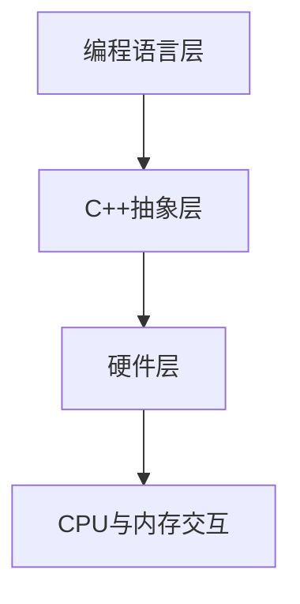

# C++ 内存模型

## 介绍

在C++多线程编程中，内存模型是一个核心概念，它定义了程序中不同线程如何通过内存进行交互。C++11引入了标准化的内存模型，为多线程程序提供了可靠的保证，使开发者能够编写跨平台的并发程序。

理解C++内存模型对于编写正确、高效的多线程程序至关重要。它解决了诸如指令重排序、原子操作、内存可见性等问题，这些问题在多核处理器环境下尤为突出。

## 内存模型基础概念

### 内存位置

在C++中，每个变量都占据一个或多个内存位置。内存模型定义了当多个线程访问相同内存位置时会发生什么。

### 竞态条件

当两个或更多线程同时访问同一内存位置，且至少有一个线程执行写操作时，就会产生竞态条件(race condition)。未经同步的竞态条件会导致未定义行为。

### 指令重排序

为了提高性能，编译器和CPU可能会重排指令的执行顺序，前提是保持单线程语义不变。但在多线程环境中，这可能导致意外行为。

```cpp
int x = 0, y = 0;

// 线程1
void thread1() {
    x = 1;
    y = 2;
}

// 线程2
void thread2() {
    if (y == 2) {
        assert(x == 1); // 在某些情况下可能失败
    }
}
```

在上面的例子中，由于指令重排序，线程1的两个赋值操作可能以任意顺序执行，导致线程2的断言可能失败。

## 内存序(Memory Order)

C++11引入了六种内存序，控制原子操作的同步行为：

1. `memory_order_relaxed`: 最宽松的内存序，只保证原子性，不提供同步操作。
2. `memory_order_consume`: 提供数据依赖性保证。
3. `memory_order_acquire`: 读取操作，建立前序同步。
4. `memory_order_release`: 写入操作，建立后序同步。
5. `memory_order_acq_rel`: 结合了acquire和release语义。
6. `memory_order_seq_cst`: 最严格的内存序，提供全局序列化。

### 示例：使用不同内存序

```cpp
#include <atomic>
#include <thread>
#include <cassert>
#include <iostream>

std::atomic<int> x(0);
std::atomic<int> y(0);
int z = 0;  // 非原子变量

void write_x_then_y() {
    x.store(1, std::memory_order_relaxed);  // 只保证原子性
    y.store(1, std::memory_order_release);  // 释放操作
}

void read_y_then_x() {
    while (y.load(std::memory_order_acquire) != 1) {  // 获取操作
        // 等待y变为1
    }
    // 此时，x的值一定是1
    assert(x.load(std::memory_order_relaxed) == 1);
    std::cout << "断言通过：x == " << x.load(std::memory_order_relaxed) << std::endl;
}

int main() {
    std::thread t1(write_x_then_y);
    std::thread t2(read_y_then_x);
    t1.join();
    t2.join();
    return 0;
}
```

**输出**:
```
断言通过：x == 1
```

在上面的例子中，`memory_order_release`和`memory_order_acquire`配对使用，确保线程2看到线程1对x的修改。

## 原子操作

C++11引入了`std::atomic`模板类，用于执行原子操作。原子操作是不可分割的，保证在多线程环境中的一致性。

### 常用原子操作

```cpp
#include <atomic>
#include <iostream>
#include <thread>
#include <vector>

std::atomic<int> counter(0);

void increment() {
    for (int i = 0; i < 1000; ++i) {
        counter++;  // 原子自增
    }
}

int main() {
    std::vector<std::thread> threads;
    
    // 创建10个线程
    for (int i = 0; i < 10; ++i) {
        threads.push_back(std::thread(increment));
    }
    
    // 等待所有线程完成
    for (auto& t : threads) {
        t.join();
    }
    
    std::cout << "最终结果: " << counter << std::endl;
    return 0;
}
```

**输出**:
```
最终结果: 10000
```

如果不使用原子变量，多个线程同时修改计数器会导致竞态条件，最终结果可能小于预期。

## 内存模型的实际应用

### 单例模式中的双重检查锁定

双重检查锁定是单例模式的常见实现，但在没有正确理解内存模型的情况下可能存在问题。

```cpp
#include <mutex>
#include <atomic>
#include <memory>

class Singleton {
private:
    static std::atomic<Singleton*> instance;
    static std::mutex mutex;
    
    // 私有构造函数
    Singleton() {}
    
public:
    // 禁止复制
    Singleton(const Singleton&) = delete;
    Singleton& operator=(const Singleton&) = delete;
    
    static Singleton* getInstance() {
        Singleton* p = instance.load(std::memory_order_acquire);
        if (p == nullptr) {  // 第一次检查
            std::lock_guard<std::mutex> lock(mutex);
            p = instance.load(std::memory_order_relaxed);
            if (p == nullptr) {  // 第二次检查
                p = new Singleton();
                instance.store(p, std::memory_order_release);
            }
        }
        return p;
    }
};

// 初始化静态成员
std::atomic<Singleton*> Singleton::instance(nullptr);
std::mutex Singleton::mutex;
```

上面的例子使用了acquire和release内存序来确保其他线程能正确看到初始化完成的单例对象。

### 生产者-消费者模型

```cpp
#include <atomic>
#include <thread>
#include <iostream>
#include <vector>
#include <queue>
#include <mutex>
#include <condition_variable>

template<typename T>
class ThreadSafeQueue {
private:
    std::queue<T> queue;
    mutable std::mutex mutex;
    std::condition_variable cv;
    std::atomic<bool> done{false};
    
public:
    void push(T value) {
        {
            std::lock_guard<std::mutex> lock(mutex);
            queue.push(std::move(value));
        }
        cv.notify_one();
    }
    
    bool try_pop(T& value) {
        std::unique_lock<std::mutex> lock(mutex);
        cv.wait(lock, [this] { return !queue.empty() || done.load(std::memory_order_acquire); });
        
        if (queue.empty()) {
            return false;
        }
        
        value = std::move(queue.front());
        queue.pop();
        return true;
    }
    
    void set_done() {
        done.store(true, std::memory_order_release);
        cv.notify_all();
    }
};

int main() {
    ThreadSafeQueue<int> queue;
    
    // 生产者线程
    std::thread producer([&queue] {
        for (int i = 0; i < 10; ++i) {
            std::this_thread::sleep_for(std::chrono::milliseconds(100));
            std::cout << "生产: " << i << std::endl;
            queue.push(i);
        }
        queue.set_done();
    });
    
    // 消费者线程
    std::thread consumer([&queue] {
        int value;
        while (queue.try_pop(value)) {
            std::cout << "消费: " << value << std::endl;
        }
    });
    
    producer.join();
    consumer.join();
    
    return 0;
}
```

这个例子使用了内存屏障来确保消费者线程能正确观察到生产者线程的修改。

## 栅栏(Fence)操作

除了原子操作的内存序之外，C++还提供了栅栏操作，用于在代码中创建同步点。

```cpp
#include <atomic>
#include <thread>
#include <iostream>

int x = 0;
int y = 0;
std::atomic<bool> ready(false);

void producer() {
    x = 1;  // 写入普通变量
    y = 2;  // 写入普通变量
    std::atomic_thread_fence(std::memory_order_release);  // 释放栅栏
    ready.store(true, std::memory_order_relaxed);  // 信号变量
}

void consumer() {
    while (!ready.load(std::memory_order_relaxed)) {
        // 等待信号
    }
    std::atomic_thread_fence(std::memory_order_acquire);  // 获取栅栏
    // 此时可以安全访问x和y
    std::cout << "x = " << x << ", y = " << y << std::endl;
}

int main() {
    std::thread t1(producer);
    std::thread t2(consumer);
    t1.join();
    t2.join();
    return 0;
}
```

**输出**:
```
x = 1, y = 2
```

在这个例子中，栅栏操作确保了消费者线程可以正确地看到生产者线程对x和y的修改。

## 内存模型的层次结构

C++内存模型可以理解为有三个层次：



1. **编程语言层**：程序员编写的代码
2. **C++抽象层**：包含原子操作、内存序等概念
3. **硬件层**：CPU指令、缓存一致性协议等

## 常见问题和解决方案

### 数据竞争(Data Race)

```cpp
#include <thread>
#include <iostream>
#include <atomic>
#include <mutex>

int shared_data = 0;
std::mutex mtx;

void unsafe_increment() {
    // 数据竞争
    for (int i = 0; i < 1000000; ++i) {
        shared_data++;
    }
}

void safe_with_mutex() {
    // 使用互斥锁避免数据竞争
    for (int i = 0; i < 1000000; ++i) {
        std::lock_guard<std::mutex> lock(mtx);
        shared_data++;
    }
}

std::atomic<int> atomic_data(0);
void safe_with_atomic() {
    // 使用原子操作避免数据竞争
    for (int i = 0; i < 1000000; ++i) {
        atomic_data++;
    }
}

int main() {
    // 测试不安全方法
    shared_data = 0;
    std::thread t1(unsafe_increment);
    std::thread t2(unsafe_increment);
    t1.join();
    t2.join();
    std::cout << "不安全结果: " << shared_data << std::endl;
    
    // 测试互斥锁方法
    shared_data = 0;
    std::thread t3(safe_with_mutex);
    std::thread t4(safe_with_mutex);
    t3.join();
    t4.join();
    std::cout << "互斥锁结果: " << shared_data << std::endl;
    
    // 测试原子操作方法
    atomic_data = 0;
    std::thread t5(safe_with_atomic);
    std::thread t6(safe_with_atomic);
    t5.join();
    t6.join();
    std::cout << "原子操作结果: " << atomic_data << std::endl;
    
    return 0;
}
```

**可能的输出**:
```
不安全结果: 1345678  // 这个结果每次运行都不同，小于预期的2000000
互斥锁结果: 2000000
原子操作结果: 2000000
```

### 防止指令重排序

```cpp
#include <atomic>
#include <thread>
#include <iostream>

std::atomic<bool> x(false);
std::atomic<bool> y(false);
std::atomic<int> z(0);

void write_x() {
    x.store(true, std::memory_order_seq_cst);
}

void write_y() {
    y.store(true, std::memory_order_seq_cst);
}

void read_x_then_y() {
    while (!x.load(std::memory_order_seq_cst));
    if (y.load(std::memory_order_seq_cst)) {
        ++z;
    }
}

void read_y_then_x() {
    while (!y.load(std::memory_order_seq_cst));
    if (x.load(std::memory_order_seq_cst)) {
        ++z;
    }
}

int main() {
    std::thread a(write_x);
    std::thread b(write_y);
    std::thread c(read_x_then_y);
    std::thread d(read_y_then_x);
    a.join();
    b.join();
    c.join();
    d.join();
    std::cout << "z = " << z << std::endl;  // 总是为2
    return 0;
}
```

**输出**:
```
z = 2
```

使用`memory_order_seq_cst`可以防止指令重排序，确保程序的行为是可预测的。

## 总结

C++内存模型是现代C++多线程编程的基础。它定义了线程之间如何通过内存交互，提供了控制指令重排序和保证内存可见性的机制。关键概念包括：

1. **原子操作**：提供不可分割的读写操作，避免数据竞争
2. **内存序**：控制内存访问的顺序和可见性规则
3. **栅栏**：创建全局同步点，确保内存访问按预期顺序执行
4. **数据竞争处理**：使用原子操作、互斥锁等机制避免数据竞争

掌握C++内存模型对于编写正确、高效的多线程程序至关重要，它能帮助程序员避免许多常见的并发问题。

## 练习

1. 编写一个使用原子变量实现的线程安全计数器类，提供增加和获取计数值的方法。
2. 实现一个使用内存序实现的简单单生产者-单消费者队列。
3. 尝试编写一个简单的自旋锁，使用原子变量和适当的内存序。
4. 研究并比较不同内存序的性能差异，例如在高并发环境下比较`memory_order_relaxed`和`memory_order_seq_cst`。

## 附加资源

:::tip 推荐阅读
- C++标准库参考文档中关于`<atomic>`的部分
- "C++ Concurrency in Action" by Anthony Williams
- "Effective Modern C++" by Scott Meyers，特别是关于内存模型和并发的章节
:::

:::note
C++内存模型是一个复杂的主题，即使是经验丰富的程序员也需要时间来完全掌握。建议多实践、多阅读相关资料，逐步加深理解。
:::