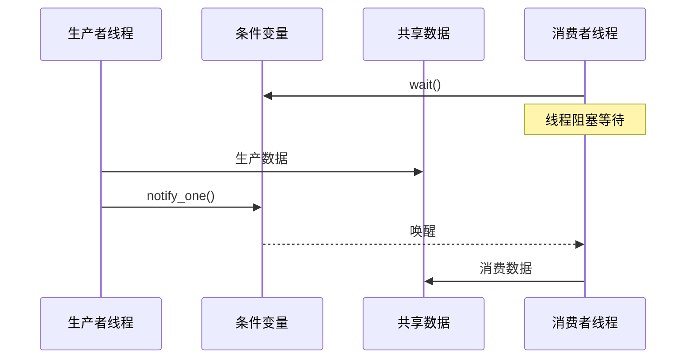

# C++ 线程通信

在多线程编程中，线程之间的通信是一个至关重要的主题。当你的程序中运行着多个线程时，它们往往需要协作完成任务，这就需要线程间能够有效地交换信息。本文将全面介绍C++中线程通信的各种机制，帮助你理解和应用这些技术。

## 为什么需要线程通信？

在深入讨论具体的通信机制之前，让我们先了解为什么线程之间需要通信：

1. **数据共享**：多个线程可能需要访问和修改共同的数据
2. **任务协调**：一个线程的工作可能依赖于另一个线程的结果
3. **同步控制**：确保线程按照预期顺序执行
4. **负载均衡**：合理分配工作以充分利用计算资源

## 线程通信的基本方法

### 1. 共享内存

最基本的线程通信方式是通过共享内存。在C++中，全局变量、堆上分配的对象或者位于同一作用域内的变量都可以被多个线程访问。

```cpp
#include <iostream>
#include <thread>
#include <mutex>

// 共享变量
int shared_data = 0;
std::mutex mtx; // 互斥锁用于保护共享数据

void increment_data() {
    for (int i = 0; i < 1000000; ++i) {
        std::lock_guard<std::mutex> lock(mtx); // 锁保护
        ++shared_data;
    }
}

void decrement_data() {
    for (int i = 0; i < 1000000; ++i) {
        std::lock_guard<std::mutex> lock(mtx); // 锁保护
        --shared_data;
    }
}

int main() {
    std::thread t1(increment_data);
    std::thread t2(decrement_data);
    
    t1.join();
    t2.join();
    
    std::cout << "最终结果: " << shared_data << std::endl;
    return 0;
}
```

输出：
```
最终结果: 0
```

:::warning
共享内存虽然简单，但容易引发数据竞争问题。如上例所示，必须使用互斥锁等同步机制确保数据访问的安全性。
:::

### 2. 条件变量

条件变量是一种同步原语，它允许线程等待特定条件成立后再继续执行。这是线程通信的重要手段，特别适用于生产者-消费者模式。

```cpp
#include <iostream>
#include <thread>
#include <mutex>
#include <condition_variable>
#include <queue>

std::mutex mtx;
std::condition_variable cv;
std::queue<int> data_queue;
bool finished = false;

void producer() {
    for (int i = 0; i < 10; ++i) {
        {
            std::lock_guard<std::mutex> lock(mtx);
            data_queue.push(i);
            std::cout << "生产者生产了: " << i << std::endl;
        }
        cv.notify_one(); // 通知可能等待的消费者
        std::this_thread::sleep_for(std::chrono::milliseconds(100));
    }
    
    {
        std::lock_guard<std::mutex> lock(mtx);
        finished = true;
    }
    cv.notify_one(); // 通知消费者已完成生产
}

void consumer() {
    while (true) {
        std::unique_lock<std::mutex> lock(mtx);
        // 等待队列非空或生产完成
        cv.wait(lock, [] { return !data_queue.empty() || finished; });
        
        if (data_queue.empty() && finished) {
            std::cout << "消费者完成工作" << std::endl;
            break; // 结束消费
        }
        
        int value = data_queue.front();
        data_queue.pop();
        std::cout << "消费者消费了: " << value << std::endl;
    }
}

int main() {
    std::thread prod(producer);
    std::thread cons(consumer);
    
    prod.join();
    cons.join();
    
    return 0;
}
```

输出（可能略有不同）：
```
生产者生产了: 0
消费者消费了: 0
生产者生产了: 1
消费者消费了: 1
生产者生产了: 2
消费者消费了: 2
生产者生产了: 3
消费者消费了: 3
生产者生产了: 4
消费者消费了: 4
生产者生产了: 5
消费者消费了: 5
生产者生产了: 6
消费者消费了: 6
生产者生产了: 7
消费者消费了: 7
生产者生产了: 8
消费者消费了: 8
生产者生产了: 9
消费者消费了: 9
消费者完成工作
```

条件变量的工作流程可以用以下流程图表示：



### 3. Future 和 Promise

C++11引入了`std::future`和`std::promise`，它们提供了一种更现代的线程通信机制，特别适合一次性地从一个线程向另一个线程传递数据。

```cpp
#include <iostream>
#include <thread>
#include <future>
#include <chrono>

void calculate_result(std::promise<int> promise) {
    std::cout << "计算线程开始工作..." << std::endl;
    std::this_thread::sleep_for(std::chrono::seconds(2)); // 模拟耗时计算
    promise.set_value(42);  // 设置结果
    std::cout << "计算线程完成工作" << std::endl;
}

int main() {
    std::promise<int> result_promise;
    std::future<int> result_future = result_promise.get_future();
    
    // 启动计算线程
    std::thread calc_thread(calculate_result, std::move(result_promise));
    
    // 主线程做其他工作
    std::cout << "主线程正在做其他工作..." << std::endl;
    
    // 获取计算结果（如果还未完成，这里会阻塞等待）
    std::cout << "主线程等待结果..." << std::endl;
    int result = result_future.get();
    
    std::cout << "获得结果: " << result << std::endl;
    
    calc_thread.join();
    return 0;
}
```

输出：
```
计算线程开始工作...
主线程正在做其他工作...
主线程等待结果...
计算线程完成工作
获得结果: 42
```

### 4. 原子变量

对于简单的数据类型，可以使用原子变量（`std::atomic`）进行线程间通信，它能确保操作的原子性，避免数据竞争。

```cpp
#include <iostream>
#include <thread>
#include <atomic>
#include <vector>

std::atomic<int> counter(0); // 原子计数器

void increment(int n) {
    for (int i = 0; i < n; ++i) {
        ++counter; // 原子操作，无需互斥锁
    }
}

int main() {
    std::vector<std::thread> threads;
    int num_threads = 10;
    
    // 创建多个线程增加计数器
    for (int i = 0; i < num_threads; ++i) {
        threads.push_back(std::thread(increment, 1000));
    }
    
    // 等待所有线程完成
    for (auto& t : threads) {
        t.join();
    }
    
    std::cout << "最终计数: " << counter << std::endl;
    return 0;
}
```

输出：
```
最终计数: 10000
```

:::tip
原子变量适用于简单的计数器或标志，它们比互斥锁更轻量，性能通常更好。
:::

## 实际应用案例

### 案例1：线程池的任务分发

线程池是多线程编程中常见的模式，它通过线程通信来分发和执行任务。

```cpp
#include <iostream>
#include <thread>
#include <mutex>
#include <condition_variable>
#include <queue>
#include <functional>
#include <vector>

class ThreadPool {
public:
    ThreadPool(size_t num_threads) : stop(false) {
        for (size_t i = 0; i < num_threads; ++i) {
            workers.emplace_back([this] {
                while (true) {
                    std::function<void()> task;
                    
                    {
                        std::unique_lock<std::mutex> lock(queue_mutex);
                        
                        // 等待任务或停止信号
                        condition.wait(lock, [this] { 
                            return stop || !tasks.empty(); 
                        });
                        
                        if (stop && tasks.empty()) {
                            return; // 如果线程池停止且没有任务，退出线程
                        }
                        
                        task = std::move(tasks.front());
                        tasks.pop();
                    }
                    
                    task(); // 执行任务
                }
            });
        }
    }
    
    template<class F>
    void enqueue(F&& f) {
        {
            std::unique_lock<std::mutex> lock(queue_mutex);
            tasks.emplace(std::forward<F>(f));
        }
        condition.notify_one(); // 通知一个等待中的线程
    }
    
    ~ThreadPool() {
        {
            std::unique_lock<std::mutex> lock(queue_mutex);
            stop = true;
        }
        
        condition.notify_all(); // 通知所有线程检查停止标志
        
        // 等待所有线程结束
        for (std::thread &worker : workers) {
            worker.join();
        }
    }
    
private:
    std::vector<std::thread> workers;
    std::queue<std::function<void()>> tasks;
    std::mutex queue_mutex;
    std::condition_variable condition;
    bool stop;
};

int main() {
    ThreadPool pool(4); // 创建4个工作线程
    
    // 提交一些任务
    for (int i = 0; i < 8; ++i) {
        pool.enqueue([i] {
            std::cout << "任务 " << i << " 开始执行，线程 ID: " 
                      << std::this_thread::get_id() << std::endl;
            std::this_thread::sleep_for(std::chrono::seconds(1));
            std::cout << "任务 " << i << " 执行完成" << std::endl;
        });
    }
    
    // 等待一会儿让任务有时间执行
    std::this_thread::sleep_for(std::chrono::seconds(10));
    
    return 0; // 线程池析构函数会处理线程的清理
}
```

输出（每次运行的线程ID会不同）：
```
任务 0 开始执行，线程 ID: 0x7000070ec000
任务 1 开始执行，线程 ID: 0x7000078ef000
任务 3 开始执行，线程 ID: 0x700007af2000
任务 2 开始执行，线程 ID: 0x7000079f1000
任务 0 执行完成
任务 4 开始执行，线程 ID: 0x7000070ec000
任务 1 执行完成
任务 5 开始执行，线程 ID: 0x7000078ef000
任务 3 执行完成
任务 6 开始执行，线程 ID: 0x700007af2000
任务 2 执行完成
任务 7 开始执行，线程 ID: 0x7000079f1000
任务 4 执行完成
任务 5 执行完成
任务 6 执行完成
任务 7 执行完成
```

### 案例2：异步操作链

使用`std::future`和`std::promise`可以构建异步操作链，以非阻塞方式处理一系列操作。

```cpp
#include <iostream>
#include <future>
#include <thread>
#include <string>

std::future<std::string> fetch_data_async() {
    // 创建一个promise
    auto promise = std::make_shared<std::promise<std::string>>();
    auto future = promise->get_future();
    
    // 启动异步任务
    std::thread([promise]() {
        try {
            std::this_thread::sleep_for(std::chrono::seconds(2));
            promise->set_value("网络数据");  // 设置结果
        } catch (...) {
            promise->set_exception(std::current_exception());  // 传递异常
        }
    }).detach();
    
    return future;
}

std::future<std::string> process_data_async(std::future<std::string> data_future) {
    auto promise = std::make_shared<std::promise<std::string>>();
    auto future = promise->get_future();
    
    std::thread([promise, data_future = std::move(data_future)]() mutable {
        try {
            std::string data = data_future.get();  // 获取上一步的结果
            std::this_thread::sleep_for(std::chrono::seconds(1));
            promise->set_value(data + " - 已处理");  // 处理并传递结果
        } catch (...) {
            promise->set_exception(std::current_exception());
        }
    }).detach();
    
    return future;
}

int main() {
    std::cout << "开始异步操作链" << std::endl;
    
    // 创建异步操作链
    auto result_future = process_data_async(fetch_data_async());
    
    // 主线程可以做其他事情
    std::cout << "主线程继续执行其他任务..." << std::endl;
    
    // 获取最终结果
    try {
        std::string result = result_future.get();
        std::cout << "最终结果: " << result << std::endl;
    } catch (const std::exception& e) {
        std::cerr << "发生错误: " << e.what() << std::endl;
    }
    
    return 0;
}
```

输出：
```
开始异步操作链
主线程继续执行其他任务...
最终结果: 网络数据 - 已处理
```

这个例子展示了如何使用`future`和`promise`构建异步操作链，实现非阻塞的数据处理流程。

## 线程通信的最佳实践

1. **选择适当的通信机制**：
   - 对于简单的共享数据，考虑使用原子变量
   - 生产者-消费者模式，使用条件变量和队列
   - 一次性数据传递，使用future/promise

2. **避免数据竞争**：
   - 使用互斥锁保护共享数据
   - 考虑使用读写锁(std::shared_mutex)提高并发性
   - 优先考虑无锁结构和原子操作

3. **减少通信开销**：
   - 批量处理数据减少通信频率
   - 避免过度细粒度的线程通信

4. **防止死锁**：
   - 保持一致的锁顺序
   - 使用std::lock()或std::scoped_lock同时锁定多个互斥量
   - 考虑使用超时版本的互斥锁操作

## 总结

线程通信是C++多线程编程中的关键环节，掌握不同的通信机制及其适用场景，是编写高效可靠多线程程序的基础。本文介绍了共享内存、条件变量、future/promise以及原子变量等主要通信方法，并通过实际案例展示了它们的应用。

根据具体场景选择合适的线程通信方式，同时注意防范数据竞争和死锁问题，将帮助你构建健壮的多线程应用程序。

## 练习

1. 实现一个简单的消息队列，支持多个生产者和多个消费者。
2. 使用条件变量实现一个线程安全的计数器，当计数达到特定值时通知等待线程。
3. 用future和promise实现一个可以取消的异步任务。
4. 编写一个使用原子变量的简单线程池，实现工作窃取(work stealing)机制。

## 附加资源

- [C++ 参考文档](https://en.cppreference.com/w/cpp/thread)
- 《C++ Concurrency in Action》 - Anthony Williams
- 《Effective Modern C++》 - Scott Meyers (关于线程和并发的章节)

通过持续练习和实践，你将逐渐掌握C++线程通信的各种技巧，成为多线程编程的专家！