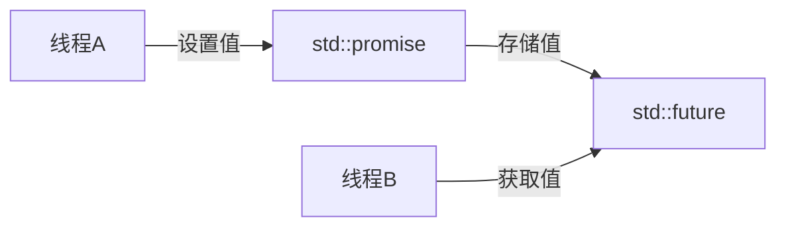

# C++ future与promise

在C++的多线程编程中，我们经常需要一种机制来获取异步操作的结果。如何在一个线程中执行任务，然后在另一个线程中获取该任务的结果？这就是`std::future`和`std::promise`发挥作用的地方。

## 什么是future和promise？

简单来说：
- `std::future` 表示"将来会得到的值"
- `std::promise` 表示"承诺会提供一个值"

它们组成了一个通信通道，允许一个线程（生产者）安全地向另一个线程（消费者）传递值或异常。



## 基本概念

### std::future

`std::future` 是一个模板类，表示一个尚未就绪的值。你可以使用`future`对象：

- 检查异步操作是否完成（`valid()`、`wait()`）
- 等待异步操作完成（`wait()`、`wait_for()`、`wait_until()`）
- 获取异步操作的结果（`get()`）

### std::promise

`std::promise` 也是一个模板类，它提供了一种设置值的方式，这个值可以被相关联的`future`对象异步获取。你可以使用`promise`对象：

- 设置值（`set_value()`）
- 设置异常（`set_exception()`）
- 获取关联的`future`对象（`get_future()`）

## 简单示例

让我们通过一个简单的例子来理解`std::future`和`std::promise`的基本用法：

```cpp
#include <iostream>
#include <future>
#include <thread>
#include <chrono>

void producer(std::promise<int> promise) {
    // 模拟复杂计算
    std::cout << "生产者: 开始计算..." << std::endl;
    std::this_thread::sleep_for(std::chrono::seconds(2));
    
    // 设置promise的值
    promise.set_value(42);
    std::cout << "生产者: 值已设置!" << std::endl;
}

int main() {
    // 创建promise对象
    std::promise<int> promise;
    
    // 获取关联的future对象
    std::future<int> future = promise.get_future();
    
    // 启动生产者线程
    std::thread t(producer, std::move(promise));
    
    // 消费者: 等待并获取结果
    std::cout << "消费者: 等待结果..." << std::endl;
    int result = future.get();  // 阻塞直到结果可用
    
    std::cout << "消费者: 结果是 " << result << std::endl;
    
    t.join();
    return 0;
}
```

**输出**:
```
消费者: 等待结果...
生产者: 开始计算...
生产者: 值已设置!
消费者: 结果是 42
```

## 深入理解future和promise

### future的主要方法

1. **get()** - 获取存储在future中的值。如果值尚未就绪，会阻塞当前线程。注意：`get()`只能调用一次，之后future变为无效状态。

2. **wait()** - 阻塞当前线程，直到结果可用。

3. **wait_for()** - 阻塞当前线程，直到结果可用或超时。

4. **wait_until()** - 阻塞当前线程，直到结果可用或达到指定时间点。

5. **valid()** - 检查future是否有效（可以调用get()）。

### promise的主要方法

1. **set_value()** - 设置关联future的值。

2. **set_exception()** - 设置关联future的异常。

3. **get_future()** - 获取关联的future对象（只能调用一次）。

## 异常处理

`std::promise`和`std::future`也可以用于传递异常：

```cpp
#include <iostream>
#include <future>
#include <thread>
#include <stdexcept>

void task_with_exception(std::promise<int> promise) {
    try {
        // 模拟出现异常的情况
        throw std::runtime_error("计算失败");
    } catch (...) {
        // 捕获异常并将其传递给future
        promise.set_exception(std::current_exception());
    }
}

int main() {
    std::promise<int> promise;
    std::future<int> future = promise.get_future();
    
    // 启动任务线程
    std::thread t(task_with_exception, std::move(promise));
    
    try {
        // 尝试获取结果
        int result = future.get();
        std::cout << "结果: " << result << std::endl;
    } catch (const std::exception& e) {
        std::cout << "捕获到异常: " << e.what() << std::endl;
    }
    
    t.join();
    return 0;
}
```

**输出**:
```
捕获到异常: 计算失败
```

## shared_future

有时我们需要多个线程等待同一个结果。由于`std::future::get()`只能调用一次，这时可以使用`std::shared_future`：

```cpp
#include <iostream>
#include <future>
#include <thread>
#include <vector>

void reader(std::shared_future<int> future, int id) {
    std::cout << "读取器 " << id << ": 等待数据..." << std::endl;
    int value = future.get();  // 多个线程可以安全地调用get()
    std::cout << "读取器 " << id << ": 数据是 " << value << std::endl;
}

int main() {
    std::promise<int> promise;
    
    // 从promise获取future，然后转换为shared_future
    std::shared_future<int> shared_future = promise.get_future().share();
    
    // 创建多个读取器线程
    std::vector<std::thread> readers;
    for (int i = 1; i <= 3; i++) {
        readers.emplace_back(reader, shared_future, i);
    }
    
    // 等待一会儿再设置值
    std::this_thread::sleep_for(std::chrono::seconds(1));
    std::cout << "主线程: 设置值为100" << std::endl;
    promise.set_value(100);
    
    // 等待所有读取器完成
    for (auto& t : readers) {
        t.join();
    }
    
    return 0;
}
```

**输出**（顺序可能略有不同）:
```
读取器 1: 等待数据...
读取器 2: 等待数据...
读取器 3: 等待数据...
主线程: 设置值为100
读取器 2: 数据是 100
读取器 1: 数据是 100
读取器 3: 数据是 100
```

## 实际应用场景

### 场景1: 异步计算结果

适用于需要耗时计算，但不想阻塞主线程的情况：

```cpp
#include <iostream>
#include <future>
#include <thread>
#include <chrono>
#include <cmath>

// 模拟一个耗时的计算函数
double complexCalculation(int param) {
    // 假设这是一个耗时的计算
    std::this_thread::sleep_for(std::chrono::seconds(2));
    return std::pow(param, 2.5);
}

int main() {
    std::cout << "开始异步计算..." << std::endl;
    
    // 启动异步任务
    std::future<double> result = std::async(std::launch::async, complexCalculation, 42);
    
    // 主线程可以继续执行其他工作
    std::cout << "主线程继续执行其他工作..." << std::endl;
    std::this_thread::sleep_for(std::chrono::seconds(1));
    std::cout << "主线程工作完成，等待计算结果..." << std::endl;
    
    // 当需要结果时，获取计算值（如果尚未完成，将阻塞等待）
    double value = result.get();
    std::cout << "计算结果: " << value << std::endl;
    
    return 0;
}
```

:::tip
`std::async` 是一个更高级别的接口，它内部使用了`std::promise`和`std::future`，但提供了更简洁的API。
:::

### 场景2: 实现超时机制

使用`wait_for`方法可以实现超时机制，防止无限期等待：

```cpp
#include <iostream>
#include <future>
#include <thread>
#include <chrono>

void longRunningTask(std::promise<std::string> promise) {
    // 模拟长时间运行的任务
    std::this_thread::sleep_for(std::chrono::seconds(5));
    promise.set_value("任务完成");
}

int main() {
    std::promise<std::string> promise;
    std::future<std::string> future = promise.get_future();
    
    // 启动长时间运行的任务
    std::thread t(longRunningTask, std::move(promise));
    t.detach();  // 分离线程，允许它独立运行
    
    // 等待结果，但设置3秒超时
    auto status = future.wait_for(std::chrono::seconds(3));
    
    if (status == std::future_status::ready) {
        std::cout << "任务已完成，结果: " << future.get() << std::endl;
    } else if (status == std::future_status::timeout) {
        std::cout << "任务超时!" << std::endl;
    } else {
        std::cout << "任务延迟中..." << std::endl;
    }
    
    return 0;
}
```

**输出**:
```
任务超时!
```

## future与packaged_task

`std::packaged_task`将一个可调用对象包装成一个异步任务，并提供一个`std::future`来获取结果：

```cpp
#include <iostream>
#include <future>
#include <thread>
#include <functional>

// 一个简单的函数
int calculate(int a, int b) {
    std::this_thread::sleep_for(std::chrono::seconds(1));
    return a + b;
}

int main() {
    // 将函数包装到packaged_task中
    std::packaged_task<int(int, int)> task(calculate);
    
    // 获取future
    std::future<int> result = task.get_future();
    
    // 在另一个线程中运行任务
    std::thread t(std::move(task), 10, 20);
    
    // 等待并获取结果
    std::cout << "等待结果..." << std::endl;
    std::cout << "结果: " << result.get() << std::endl;
    
    t.join();
    return 0;
}
```

**输出**:
```
等待结果...
结果: 30
```

## 总结

`std::future`和`std::promise`提供了一种强大的机制，用于在不同线程之间进行异步通信：

1. **异步获取结果**: 允许一个线程等待另一个线程的计算结果，而不需要持续轮询或复杂的同步机制。

2. **双向通信**: 通过promise设置值或异常，通过future获取结果。

3. **错误传播**: 可以优雅地处理跨线程的异常。

4. **超时控制**: 支持等待超时，避免无限期阻塞。

这些工具使得编写可靠、高效的多线程代码变得更容易。当你需要在线程之间传递数据而不使用共享内存和互斥锁时，`std::future`和`std::promise`是理想的选择。

## 练习

1. 创建一个程序，使用`std::promise`和`std::future`从一个线程向另一个线程传递一个字符串。

2. 实现一个同时执行多个计算任务的程序，使用`std::future`收集所有结果，并计算它们的总和。

3. 尝试实现一个简单的线程池，它接受任务并返回`std::future`对象，以便调用者获取结果。

4. 使用`std::promise`和`std::future`实现一个可以被取消的长时间运行任务。

## 扩展阅读

- C++标准库中的未来学: [`std::future`](https://en.cppreference.com/w/cpp/thread/future)和[`std::promise`](https://en.cppreference.com/w/cpp/thread/promise)
- [`std::packaged_task`](https://en.cppreference.com/w/cpp/thread/packaged_task)和[`std::async`](https://en.cppreference.com/w/cpp/thread/async)的更多信息
- 处理多个future: [`std::shared_future`](https://en.cppreference.com/w/cpp/thread/shared_future)
- C++17中的并行算法与执行策略

:::caution
一定要记住，`future::get()` 只能调用一次。如果需要多次访问结果，应使用 `shared_future`。
:::