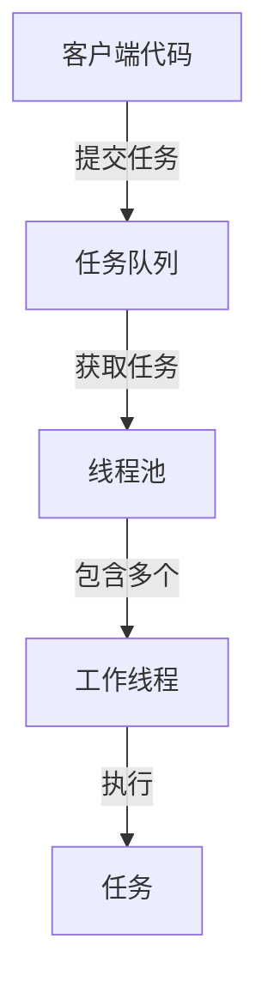

# C++ 线程池

## 什么是线程池？

线程池是一种线程使用模式，它允许程序在创建线程时重用已经存在的线程，而不是频繁创建和销毁线程，从而提高程序的性能和资源利用率。线程池维护多个线程，等待着去执行分配给它们的任务。

:::note 为什么需要线程池？
频繁创建和销毁线程会带来显著的性能开销。线程池通过预先创建线程并重用它们来避免这种开销。
:::

## 线程池的基本组成

一个典型的线程池由以下几个部分组成：

1. **工作线程集合**：预先创建的等待执行任务的线程
2. **任务队列**：存储等待执行的任务
3. **线程管理机制**：负责线程的创建、销毁和调度



## C++ 11中实现一个简单的线程池

让我们实现一个基础的线程池，它能接收任务并分配给空闲的线程执行：

```cpp
#include <iostream>
#include <thread>
#include <mutex>
#include <condition_variable>
#include <queue>
#include <functional>
#include <vector>
#include <future>

class ThreadPool {
public:
    // 构造函数，创建指定数量的工作线程
    ThreadPool(size_t threads) : stop(false) {
        for(size_t i = 0; i < threads; ++i)
            workers.emplace_back([this] {
                while(true) {
                    std::function<void()> task;
                    
                    {
                        std::unique_lock<std::mutex> lock(this->queue_mutex);
                        
                        // 等待，直到有新任务或线程池停止
                        this->condition.wait(lock, [this] { 
                            return this->stop || !this->tasks.empty(); 
                        });
                        
                        // 如果线程池停止且任务队列为空，退出线程
                        if(this->stop && this->tasks.empty())
                            return;
                            
                        // 获取一个任务
                        task = std::move(this->tasks.front());
                        this->tasks.pop();
                    }
                    
                    // 执行任务
                    task();
                }
            });
    }
    
    // 向线程池添加新任务，并返回future
    template<class F, class... Args>
    auto enqueue(F&& f, Args&&... args) 
        -> std::future<typename std::result_of<F(Args...)>::type> {
        
        using return_type = typename std::result_of<F(Args...)>::type;
        
        // 创建一个可调用对象和future
        auto task = std::make_shared<std::packaged_task<return_type()>>(
            std::bind(std::forward<F>(f), std::forward<Args>(args)...)
        );
        
        std::future<return_type> res = task->get_future();
        
        {
            std::unique_lock<std::mutex> lock(queue_mutex);
            
            // 不允许在线程池停止后添加任务
            if(stop)
                throw std::runtime_error("enqueue on stopped ThreadPool");
                
            // 添加任务到队列
            tasks.emplace([task](){ (*task)(); });
        }
        
        // 通知一个等待中的线程
        condition.notify_one();
        
        return res;
    }
    
    // 析构函数，停止所有线程
    ~ThreadPool() {
        {
            std::unique_lock<std::mutex> lock(queue_mutex);
            stop = true;
        }
        
        // 通知所有线程
        condition.notify_all();
        
        // 等待所有线程完成
        for(std::thread &worker: workers)
            worker.join();
    }
    
private:
    // 工作线程向量
    std::vector<std::thread> workers;
    
    // 任务队列
    std::queue<std::function<void()>> tasks;
    
    // 同步相关
    std::mutex queue_mutex;
    std::condition_variable condition;
    bool stop;
};
```

## 使用线程池的示例

让我们看一个简单的示例，展示如何使用上面实现的线程池：

```cpp
#include <iostream>
#include <chrono>

int main() {
    // 创建一个有4个工作线程的线程池
    ThreadPool pool(4);
    
    // 存储future结果的向量
    std::vector<std::future<int>> results;
    
    // 向线程池提交一些任务
    for(int i = 0; i < 8; ++i) {
        results.emplace_back(
            pool.enqueue([i] {
                std::cout << "Task " << i << " is running on thread " 
                          << std::this_thread::get_id() << std::endl;
                
                // 模拟耗时任务
                std::this_thread::sleep_for(std::chrono::seconds(1));
                
                return i * i;
            })
        );
    }
    
    // 获取结果
    for(auto && result : results)
        std::cout << "Result: " << result.get() << std::endl;
    
    return 0;
}
```

输出示例：
```
Task 0 is running on thread 140363772453632
Task 1 is running on thread 140363780846336
Task 2 is running on thread 140363789239040
Task 3 is running on thread 140363797631744
Task 4 is running on thread 140363772453632
Task 5 is running on thread 140363780846336
Task 6 is running on thread 140363789239040
Task 7 is running on thread 140363797631744
Result: 0
Result: 1
Result: 4
Result: 9
Result: 16
Result: 25
Result: 36
Result: 49
```

## 线程池的优化与改进

上面的实现是一个基础版本，在实际应用中可能需要考虑以下优化：

1. **线程动态调整**：根据负载动态增减工作线程数量
2. **任务优先级**：支持任务优先级排序
3. **等待任务完成**：添加等待所有任务完成的机制
4. **取消任务**：允许取消已提交但尚未执行的任务
5. **异常处理**：更健壮的异常捕获和处理

## 实际应用场景

线程池在许多应用场景中都非常有用：

### 1. 服务器应用

在Web服务器中，每个客户端请求可以作为一个任务提交给线程池处理，避免为每个连接创建新线程。

### 2. 图像处理

图像处理应用可以将大图像分割成多个块，并行处理这些块以提高性能。

```cpp
// 图像处理示例伪代码
void processImage(const Image& image) {
    ThreadPool pool(std::thread::hardware_concurrency());
    std::vector<std::future<void>> results;
    
    // 将图像分成多个块
    std::vector<ImageBlock> blocks = divideImage(image);
    
    // 处理每个块
    for(auto& block : blocks) {
        results.emplace_back(
            pool.enqueue([&block] {
                applyFilter(block);
            })
        );
    }
    
    // 等待所有处理完成
    for(auto& result : results) {
        result.get();
    }
    
    // 合并结果
    mergeBlocks(blocks);
}
```

### 3. 文件操作

读取和处理大量文件时，可以使用线程池并行执行I/O操作：

```cpp
// 并行文件处理示例
void processFiles(const std::vector<std::string>& filePaths) {
    ThreadPool pool(8); // 8个工作线程
    std::vector<std::future<FileResult>> results;
    
    for(const auto& path : filePaths) {
        results.emplace_back(
            pool.enqueue([path] {
                return processFile(path);
            })
        );
    }
    
    // 收集和汇总结果
    std::vector<FileResult> fileResults;
    for(auto& result : results) {
        fileResults.push_back(result.get());
    }
    
    analyzeResults(fileResults);
}
```

## 进阶：使用C++17标准库的线程池

不幸的是，C++标准库直到C++20都没有内置的线程池实现。不过，有几个常用的第三方库可以使用：

1. **Boost.Asio**：提供线程池功能
2. **Intel Threading Building Blocks (TBB)**：高级并行处理库
3. **Folly**：Facebook的开源C++库，包含线程池实现

在C++20中，引入了`std::jthread`和协程支持，使线程管理变得更加简单，但仍然没有标准的线程池。

## 线程池与异步编程

线程池是异步编程的重要基础设施。通过线程池，你可以方便地实现：

1. 异步操作的并发执行
2. 基于回调的事件处理
3. 异步任务的调度和协调

```cpp
// 异步回调示例
void performAsyncOperations() {
    ThreadPool pool(4);
    
    // 异步提交任务，并设置完成后的回调
    auto future = pool.enqueue([](int value) {
        // 耗时操作
        std::this_thread::sleep_for(std::chrono::seconds(2));
        return value * value;
    }, 42);
    
    // 可以继续执行其他操作，不阻塞主线程
    std::cout << "Waiting for result..." << std::endl;
    
    // 需要结果时获取（阻塞直到完成）
    int result = future.get();
    std::cout << "Result: " << result << std::endl;
}
```

## 总结

线程池是一种强大的并发编程模式，它通过重用线程来提高性能和资源利用率。在C++中，虽然没有标准库提供的线程池实现，但我们可以使用C++11及以上版本的标准线程库来构建自己的线程池。

实现线程池需要考虑线程安全、任务调度、资源管理等方面。一个好的线程池实现应该是：

- 高效且线程安全的
- 易于使用且功能强大的
- 在各种负载条件下都能表现良好的

通过本文的学习，你应该了解了线程池的基本概念、实现方法和应用场景，这将有助于你在C++并发编程中更有效地使用线程资源。

## 练习

1. 修改上面的线程池实现，添加一个方法来等待所有任务完成。
2. 实现一个支持任务优先级的线程池。
3. 使用线程池实现一个简单的并行排序算法。
4. 扩展线程池，支持取消已提交但尚未执行的任务。

## 延伸阅读

- 《C++ Concurrency in Action》by Anthony Williams
- 《Effective Modern C++》by Scott Meyers（关于线程和并发的章节）
- C++11/14/17标准文档中关于`<thread>`、`<future>`和`<mutex>`的部分

通过更深入地学习这些资源，你将能够在实际项目中更有效地应用线程池和并发编程技术。