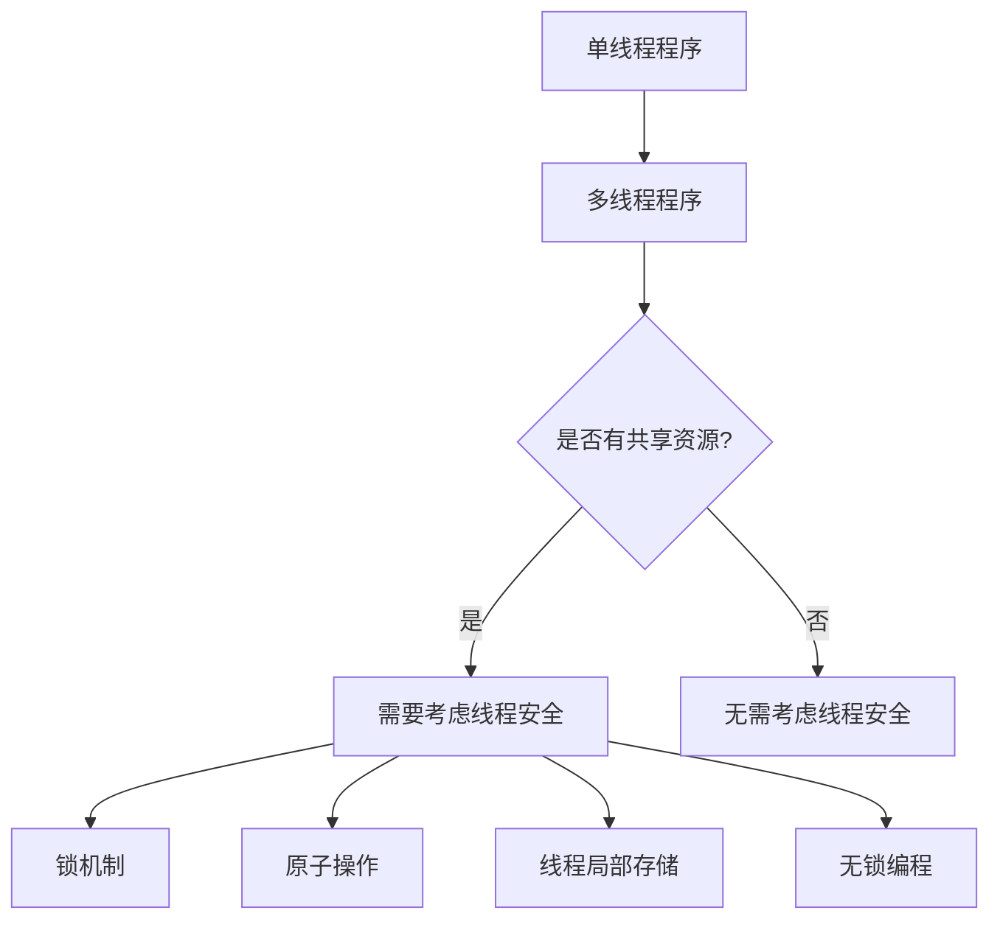
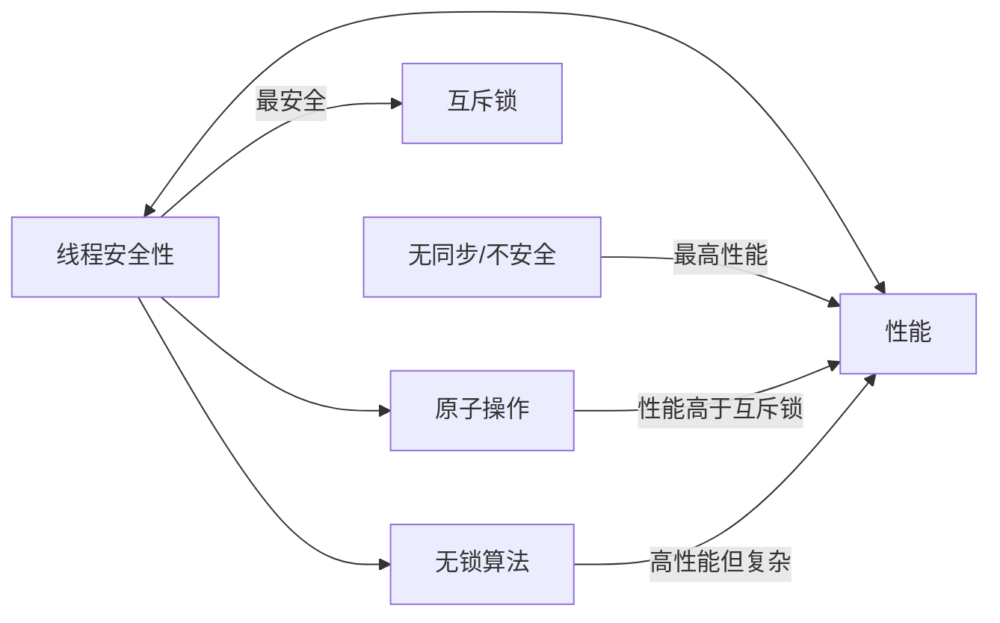

# C++ 线程安全

## 什么是线程安全？

线程安全是指在多线程环境下，程序能够正确地处理多个线程同时访问和修改共享数据的能力。当多个线程同时访问相同的资源（如变量、数据结构等）并且至少有一个线程进行写操作时，如果不采取适当的同步措施，就可能出现数据竞争和不一致的情况。

线程安全的代码需要保证，无论线程如何交错执行，程序最终的结果都是正确和可预测的。



## 为什么需要线程安全？

考虑以下简单的计数器示例：

```cpp
#include <iostream>
#include <thread>
#include <vector>

int counter = 0;

void increment_counter() {
    for (int i = 0; i < 10000; ++i) {
        counter++; // 非线程安全的操作
    }
}

int main() {
    std::vector<std::thread> threads;
    
    // 创建5个线程，每个线程增加计数器10000次
    for (int i = 0; i < 5; ++i) {
        threads.push_back(std::thread(increment_counter));
    }
    
    // 等待所有线程完成
    for (auto& t : threads) {
        t.join();
    }
    
    // 理论上结果应该是50000
    std::cout << "Counter value: " << counter << std::endl;
    
    return 0;
}
```

运行多次，你会发现输出的结果几乎每次都不是预期的50000，可能会少很多。这是因为 `counter++` 操作不是原子的，它实际上包含了三个步骤：
1. 读取counter的当前值
2. 增加值
3. 将结果写回counter

当多个线程同时执行这些步骤时，它们可能相互干扰，导致一些增量操作被丢失。

## 线程不安全的常见情况

1. **读-修改-写操作**：如上例中的 `counter++`
2. **复合操作**：当一组操作需要作为整体执行时
3. **延迟初始化**：首次访问时才初始化对象
4. **共享状态修改**：多个线程修改同一对象的状态
5. **迭代器失效**：一个线程修改容器时，另一个线程的迭代器可能失效

## 实现线程安全的技术

### 1. 互斥锁（Mutex）

最基本的同步机制是互斥锁（mutex），它确保同一时刻只有一个线程可以访问共享资源：

```cpp
#include <iostream>
#include <thread>
#include <vector>
#include <mutex>

int counter = 0;
std::mutex counter_mutex; // 保护counter的互斥锁

void increment_counter() {
    for (int i = 0; i < 10000; ++i) {
        counter_mutex.lock();   // 获取锁
        counter++;              // 安全地修改共享资源
        counter_mutex.unlock(); // 释放锁
    }
}

int main() {
    std::vector<std::thread> threads;
    
    for (int i = 0; i < 5; ++i) {
        threads.push_back(std::thread(increment_counter));
    }
    
    for (auto& t : threads) {
        t.join();
    }
    
    std::cout << "Counter value: " << counter << std::endl; // 输出将始终是50000
    
    return 0;
}
```

:::caution
直接使用 `lock()` 和 `unlock()` 可能导致在异常情况下锁没有释放。在实际代码中，推荐使用 `std::lock_guard` 或 `std::unique_lock`。
:::

### 2. 使用RAII锁包装器

`std::lock_guard` 提供了基于RAII（资源获取即初始化）的锁管理：

```cpp
void increment_counter_safe() {
    for (int i = 0; i < 10000; ++i) {
        std::lock_guard<std::mutex> lock(counter_mutex); // 自动锁定和解锁
        counter++;
    }
}
```

对于更复杂的场景，`std::unique_lock` 提供了更多的灵活性：

```cpp
void complex_operation() {
    std::unique_lock<std::mutex> lock(some_mutex);
    // 执行一些操作...
    
    lock.unlock(); // 临时释放锁
    // 执行不需要锁的操作...
    
    lock.lock(); // 重新获取锁
    // 继续执行需要锁的操作...
}
```

### 3. 原子操作

对于简单的操作，如递增计数器，可以使用 `std::atomic` 避免互斥锁的开销：

```cpp
#include <iostream>
#include <thread>
#include <vector>
#include <atomic>

std::atomic<int> atomic_counter(0); // 原子计数器

void increment_atomic_counter() {
    for (int i = 0; i < 10000; ++i) {
        atomic_counter++; // 原子递增操作
    }
}

int main() {
    std::vector<std::thread> threads;
    
    for (int i = 0; i < 5; ++i) {
        threads.push_back(std::thread(increment_atomic_counter));
    }
    
    for (auto& t : threads) {
        t.join();
    }
    
    std::cout << "Atomic counter value: " << atomic_counter << std::endl; // 始终是50000
    
    return 0;
}
```

原子类型支持多种操作，包括加、减、与、或、异或等，所有这些操作都可以原子地执行。

### 4. 读写锁

当有多个读取线程和少量写入线程时，可以使用 `std::shared_mutex`（C++17）：

```cpp
#include <shared_mutex>

std::shared_mutex rwlock;
int shared_data = 0;

void reader() {
    std::shared_lock<std::shared_mutex> lock(rwlock); // 多个读线程可同时获取
    // 读取shared_data...
}

void writer() {
    std::unique_lock<std::shared_mutex> lock(rwlock); // 独占锁，阻止其他读写线程
    // 修改shared_data...
}
```

### 5. 线程局部存储

线程局部存储允许每个线程有自己的变量副本：

```cpp
#include <iostream>
#include <thread>
#include <vector>

thread_local int tls_counter = 0; // 每个线程有自己的副本

void increment_tls_counter() {
    for (int i = 0; i < 10000; ++i) {
        tls_counter++; // 只修改当前线程的副本
    }
    std::cout << "Thread " << std::this_thread::get_id() << " counter: " << tls_counter << std::endl;
}

int main() {
    std::vector<std::thread> threads;
    
    for (int i = 0; i < 5; ++i) {
        threads.push_back(std::thread(increment_tls_counter));
    }
    
    for (auto& t : threads) {
        t.join();
    }
    
    return 0;
}
```

## 实际案例：线程安全的单例模式

单例模式是一个常见的设计模式，但在多线程环境下需要特别注意其线程安全性。下面是一个线程安全的单例实现：

```cpp
#include <iostream>
#include <thread>
#include <mutex>
#include <vector>

class Singleton {
private:
    static Singleton* instance;
    static std::mutex mutex_;
    
    // 私有构造函数
    Singleton() {
        std::cout << "Singleton constructed" << std::endl;
    }
    
    // 禁止拷贝和赋值
    Singleton(const Singleton&) = delete;
    Singleton& operator=(const Singleton&) = delete;
    
public:
    static Singleton* getInstance() {
        if (instance == nullptr) {
            std::lock_guard<std::mutex> lock(mutex_);
            if (instance == nullptr) {
                instance = new Singleton();
            }
        }
        return instance;
    }
    
    void someMethod() {
        std::cout << "Method called on singleton" << std::endl;
    }
    
    // 应有析构函数管理资源释放
    ~Singleton() {
        std::cout << "Singleton destructed" << std::endl;
    }
};

// 静态成员初始化
Singleton* Singleton::instance = nullptr;
std::mutex Singleton::mutex_;

// 测试函数
void testSingleton() {
    Singleton* s = Singleton::getInstance();
    s->someMethod();
}

int main() {
    std::vector<std::thread> threads;
    
    // 创建多个线程访问单例
    for (int i = 0; i < 5; ++i) {
        threads.push_back(std::thread(testSingleton));
    }
    
    for (auto& t : threads) {
        t.join();
    }
    
    return 0;
}
```

上面的实现使用了双检锁模式（Double-Checked Locking Pattern），它提供了高效而线程安全的延迟初始化。

:::note
在C++11及以后，可以使用更简单的方式实现线程安全的单例，利用局部静态变量的初始化保证是线程安全的：

```cpp
class Singleton {
private:
    Singleton() {}
    
public:
    static Singleton& getInstance() {
        static Singleton instance; // 线程安全的初始化
        return instance;
    }
};
```
:::

## 线程安全的注意事项和最佳实践

1. **最小化锁的范围**：锁应该只保护真正需要保护的代码区域
2. **避免死锁**：
   - 总是按相同的顺序获取多个锁
   - 使用 `std::lock` 或 `std::scoped_lock` 同时获取多个锁
   - 避免在持有锁的情况下调用用户提供的函数
3. **优先使用高级同步机制**：如 `std::async`, `std::future`, `std::promise`
4. **注意条件变量的虚假唤醒**：总是在循环中检查条件
5. **考虑无锁编程**：对于高性能场景，考虑使用原子操作和无锁数据结构
6. **理解内存模型**：了解 C++ 内存模型和内存序（memory ordering）对于高级并发编程至关重要

## 线程安全性与性能的权衡

线程安全会带来一些开销：

- **互斥锁**：获取和释放锁有开销，且可能导致线程阻塞
- **原子操作**：比普通操作慢，但通常比互斥锁快
- **锁争用**：多个线程竞争同一把锁会影响性能
- **内存消耗**：线程局部存储会为每个线程分配内存

在实际应用中，需要根据具体情况权衡线程安全性和性能：



## 总结

线程安全是多线程编程中的核心概念，它确保多个线程在访问共享资源时不会相互干扰，从而产生正确的结果。C++提供了多种实现线程安全的机制：

- 互斥锁（`std::mutex`）和锁包装器（`std::lock_guard`, `std::unique_lock`）
- 原子类型和操作（`std::atomic`）
- 读写锁（`std::shared_mutex`）
- 线程局部存储（`thread_local`）
- 条件变量（`std::condition_variable`）

选择合适的线程安全机制取决于具体的应用场景、性能要求以及代码复杂度的考量。

## 练习

1. 修改计数器示例，使用 `std::atomic<int>` 替代普通整数和互斥锁。
2. 实现一个线程安全的队列，支持多个生产者和消费者。
3. 分析并修复以下代码中的线程安全问题：
   ```cpp
   class Counter {
       int value = 0;
   public:
       void increment() { value++; }
       int get() const { return value; }
   };
   
   // 多个线程共享Counter对象
   ```
4. 实现一个使用读写锁的线程安全缓存，让多个读线程可以并发访问，而写线程需要独占访问。

## 进一步学习资源

- [C++ 参考文档中的并发支持库](https://en.cppreference.com/w/cpp/thread)
- 《C++ Concurrency in Action》 by Anthony Williams
- 《The Art of Multiprocessor Programming》by Maurice Herlihy and Nir Shavit