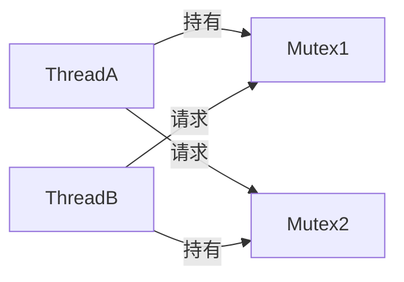

# C++ 死锁处理

## 什么是死锁？

死锁是多线程编程中的一个常见问题，当两个或更多线程互相等待对方释放资源时，就会发生死锁。这种情况下，所有相关线程都无法继续执行，程序将永远挂起。

:::note 定义
**死锁**：两个或多个线程永久阻塞，每个线程都在等待一个资源，而这个资源被另一个被阻塞的线程所持有。
:::

## 死锁产生的必要条件

要发生死锁，必须同时满足以下四个条件：

1. **互斥条件**：至少有一个资源必须处于非共享模式，即一次只能被一个线程使用
2. **占有并等待条件**：一个线程持有至少一个资源，并正在等待获取其他被占用的资源
3. **不可抢占条件**：资源只能由持有它们的线程自愿释放，无法被强制剥夺
4. **循环等待条件**：存在一系列等待线程，形成一个循环链，每个线程都在等待下一个线程持有的资源

## 死锁示例

下面是一个简单的C++死锁示例代码：

```cpp
#include <iostream>
#include <thread>
#include <mutex>

std::mutex mutex1, mutex2;

void ThreadA() {
    // 先锁住mutex1，再尝试锁住mutex2
    std::lock_guard<std::mutex> lock1(mutex1);
    std::cout << "Thread A acquired mutex1" << std::endl;
    
    // 模拟一些工作，增加死锁发生的概率
    std::this_thread::sleep_for(std::chrono::milliseconds(100));
    
    std::lock_guard<std::mutex> lock2(mutex2);
    std::cout << "Thread A acquired mutex2" << std::endl;
    
    // 临界区代码
    std::cout << "Thread A finished work" << std::endl;
}

void ThreadB() {
    // 先锁住mutex2，再尝试锁住mutex1
    std::lock_guard<std::mutex> lock2(mutex2);
    std::cout << "Thread B acquired mutex2" << std::endl;
    
    // 模拟一些工作，增加死锁发生的概率
    std::this_thread::sleep_for(std::chrono::milliseconds(100));
    
    std::lock_guard<std::mutex> lock1(mutex1);
    std::cout << "Thread B acquired mutex1" << std::endl;
    
    // 临界区代码
    std::cout << "Thread B finished work" << std::endl;
}

int main() {
    std::thread t1(ThreadA);
    std::thread t2(ThreadB);
    
    t1.join();
    t2.join();
    
    std::cout << "Program completed successfully" << std::endl;
    return 0;
}
```

**可能的输出**:
```
Thread A acquired mutex1
Thread B acquired mutex2
(程序永远挂起)
```

这里，ThreadA获取了mutex1并等待mutex2，而ThreadB获取了mutex2并等待mutex1，两个线程互相等待，形成了死锁。

## 死锁的识别

识别死锁通常可以通过以下方法：

1. **程序挂起**：程序突然停止响应是死锁的一个明显信号

2. **调试工具**：使用调试器查看线程状态和锁的持有情况

3. **日志分析**：通过在关键点添加日志，追踪线程执行情况

4. **资源分配图**：绘制线程和资源的分配关系图，查找循环等待



## 防止死锁的策略

### 1. 避免嵌套锁

尽量避免在持有一个锁的同时再获取另一个锁。如果必须使用多个锁，考虑一次性获取所有需要的锁。

### 2. 固定锁的顺序

如果必须获取多个锁，始终以相同的顺序获取锁：

```cpp
void SafeOperation() {
    // 总是先锁住mutex1，再锁住mutex2
    std::lock_guard<std::mutex> lock1(mutex1);
    std::lock_guard<std::mutex> lock2(mutex2);
    
    // 现在可以安全地访问共享资源
}
```

### 3. 使用 `std::lock` 同时锁定多个锁

C++标准库提供了 `std::lock` 函数，可以同时锁定多个互斥量而不会发生死锁：

```cpp
void SafeOperation() {
    std::unique_lock<std::mutex> lock1(mutex1, std::defer_lock);
    std::unique_lock<std::mutex> lock2(mutex2, std::defer_lock);
    
    // 同时锁定多个互斥量，避免死锁
    std::lock(mutex1, mutex2);
    
    // 临界区代码
    std::cout << "Safe operation with both mutexes" << std::endl;
}
```

### 4. 使用 `std::scoped_lock` (C++17)

C++17引入了 `std::scoped_lock`，它是 `std::lock` 的一个更简便的RAII包装器：

```cpp
void SafeOperation() {
    // 自动以无死锁方式锁定所有互斥量
    std::scoped_lock lock(mutex1, mutex2);
    
    // 临界区代码
    std::cout << "Safe operation with both mutexes using scoped_lock" << std::endl;
}
```

### 5. 使用超时锁

使用 `std::timed_mutex` 和 `std::unique_lock` 的超时版本 `try_lock_for` 或 `try_lock_until` 可以避免无限期等待：

```cpp
void ThreadWithTimeout() {
    std::timed_mutex timed_mutex;
    
    // 尝试获取锁，但最多只等待500毫秒
    if (timed_mutex.try_lock_for(std::chrono::milliseconds(500))) {
        // 成功获取锁
        std::cout << "Lock acquired, proceeding with work" << std::endl;
        // 执行工作...
        timed_mutex.unlock();
    } else {
        // 未能获取锁，执行备选操作
        std::cout << "Failed to acquire lock, performing alternative action" << std::endl;
    }
}
```

### 6. 使用死锁检测

在复杂系统中，可以实现一个死锁检测机制，周期性地检查资源分配图中是否存在循环。

## 实际应用场景

### 数据库事务

考虑一个银行转账系统，多个线程同时处理不同账户间的转账：

```cpp
#include <iostream>
#include <thread>
#include <mutex>
#include <vector>

class BankAccount {
public:
    BankAccount(int id, double initialBalance) 
        : id(id), balance(initialBalance) {}
    
    int getId() const { return id; }
    
    bool withdraw(double amount) {
        if (balance >= amount) {
            balance -= amount;
            return true;
        }
        return false;
    }
    
    void deposit(double amount) {
        balance += amount;
    }
    
    double getBalance() const { return balance; }
    
    std::mutex& getMutex() { return accountMutex; }
    
private:
    int id;
    double balance;
    std::mutex accountMutex;
};

// 有可能导致死锁的转账函数
void transferMoney(BankAccount& from, BankAccount& to, double amount) {
    // 获取第一个锁
    std::lock_guard<std::mutex> lockFrom(from.getMutex());
    std::cout << "Locked account " << from.getId() << std::endl;
    
    // 模拟网络延迟或其他处理
    std::this_thread::sleep_for(std::chrono::milliseconds(100));
    
    // 获取第二个锁
    std::lock_guard<std::mutex> lockTo(to.getMutex());
    std::cout << "Locked account " << to.getId() << std::endl;
    
    // 执行转账
    if (from.withdraw(amount)) {
        to.deposit(amount);
        std::cout << "Transferred " << amount 
                  << " from account " << from.getId() 
                  << " to account " << to.getId() << std::endl;
    } else {
        std::cout << "Insufficient funds in account " << from.getId() << std::endl;
    }
}

// 安全的转账函数
void safeTransferMoney(BankAccount& from, BankAccount& to, double amount) {
    // 使用std::scoped_lock避免死锁
    std::scoped_lock lock(from.getMutex(), to.getMutex());
    
    // 执行转账
    if (from.withdraw(amount)) {
        to.deposit(amount);
        std::cout << "Safely transferred " << amount 
                  << " from account " << from.getId() 
                  << " to account " << to.getId() << std::endl;
    } else {
        std::cout << "Insufficient funds in account " << from.getId() << std::endl;
    }
}

int main() {
    BankAccount account1(1, 1000);
    BankAccount account2(2, 2000);
    
    // 使用安全的转账函数
    std::thread t1(safeTransferMoney, std::ref(account1), std::ref(account2), 500);
    std::thread t2(safeTransferMoney, std::ref(account2), std::ref(account1), 300);
    
    t1.join();
    t2.join();
    
    std::cout << "Final balance of account 1: " << account1.getBalance() << std::endl;
    std::cout << "Final balance of account 2: " << account2.getBalance() << std::endl;
    
    return 0;
}
```

在这个例子中，我们展示了一个容易发生死锁的银行转账场景，以及如何使用 `std::scoped_lock` 安全地实现转账功能。

## 总结

死锁是并发程序中的一个常见问题，可能导致程序永久挂起。防止死锁的关键策略包括：

1. 避免嵌套锁
2. 遵循一致的锁顺序
3. 使用 `std::lock` 或 `std::scoped_lock` 同时锁定多个互斥量
4. 实现超时机制
5. 使用死锁检测工具

记住，良好的设计和遵循最佳实践是防止死锁的最佳方法。随着经验的积累，您将逐渐掌握识别潜在死锁情况和编写安全并发代码的技能。

## 练习

1. 修改本文中的死锁示例，使用 `std::lock` 或 `std::scoped_lock` 避免死锁。
2. 编写一个简单的资源分配场景，其中多个线程需要多个资源，并实现一个不会死锁的解决方案。
3. 查找并学习一种死锁检测工具，尝试在你的系统上运行它。

## 进一步阅读

- C++标准库中的并发支持
- 操作系统中的死锁预防和避免算法
- 分布式系统中的死锁处理策略

:::tip 建议
在处理多线程问题时，尽可能简化资源获取逻辑，减少持有多个锁的场景。如有可能，考虑使用更高级别的并发原语，如线程安全容器或任务队列，它们内部已经处理了锁定问题。
:::