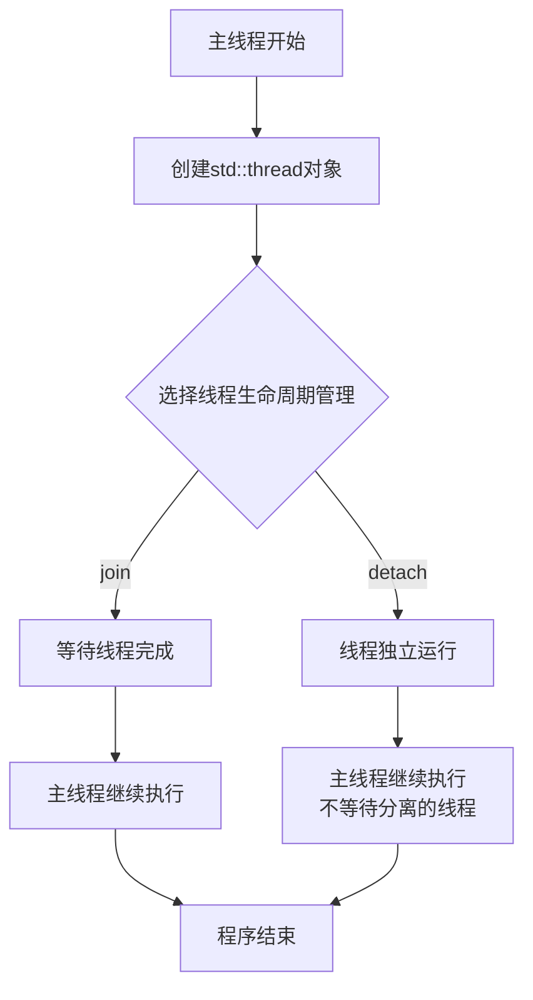

# C++ 启动线程

## 什么是线程？

在计算机科学中，线程是程序执行的最小单位。一个进程（程序的运行实例）可以包含多个线程，这些线程共享进程的资源但可以独立执行。通过多线程，我们可以实现程序的并行执行，提高程序的执行效率和响应速度。

:::note
想象你在烹饪一顿晚餐：如果你是单线程工作，你必须一次完成一项任务——先切菜，再煮饭，然后炒菜；而多线程就像是有多个帮手，一个人切菜，一个人煮饭，同时进行，大大提高了效率。
:::

## C++ 中的线程支持

C++11标准引入了线程支持库，使得在C++中创建和管理线程变得简单而直观。这个库包含在`<thread>`头文件中，提供了`std::thread`类来表示单个执行线程。

## 启动线程的基本方法

在C++中，启动线程通常有以下几种方式：

1. 使用函数指针
2. 使用函数对象（函数符）
3. 使用Lambda表达式
4. 使用成员函数

让我们逐一了解这些方法。

### 1. 使用函数指针

最简单的创建线程的方式是传递一个函数指针给`std::thread`构造函数。

```cpp
#include <iostream>
#include <thread>

// 线程执行函数
void hello_thread() {
    std::cout << "Hello from thread!" << std::endl;
}

int main() {
    // 创建线程，执行hello_thread函数
    std::thread t(hello_thread);
    
    // 等待线程完成
    t.join();
    
    std::cout << "Main thread continues execution." << std::endl;
    
    return 0;
}
```

输出：
```
Hello from thread!
Main thread continues execution.
```

在上面的例子中，我们创建了一个执行`hello_thread`函数的线程。通过调用`join()`方法，主线程会等待该线程完成后再继续执行。

:::tip
`join()`方法非常重要，它确保线程完成其工作后，主线程才会继续。如果不调用`join()`或`detach()`，程序在线程对象销毁时会终止（调用`std::terminate`）。
:::

### 2. 使用函数对象（函数符）

我们也可以使用函数对象（即重载了`operator()`的类的实例）来启动线程。

```cpp
#include <iostream>
#include <thread>

// 函数对象
class ThreadFunctor {
public:
    void operator()() const {
        std::cout << "Thread using functor!" << std::endl;
    }
};

int main() {
    // 创建函数对象
    ThreadFunctor functor;
    
    // 创建线程，使用函数对象
    std::thread t(functor);
    
    // 等待线程完成
    t.join();
    
    std::cout << "Main thread continues execution." << std::endl;
    
    return 0;
}
```

输出：
```
Thread using functor!
Main thread continues execution.
```

### 3. 使用Lambda表达式

Lambda表达式是C++11引入的特性，它提供了一种简洁的方式来定义匿名函数。在创建线程时使用Lambda表达式非常方便。

```cpp
#include <iostream>
#include <thread>

int main() {
    // 创建线程，使用Lambda表达式
    std::thread t([]() {
        std::cout << "Thread using lambda expression!" << std::endl;
    });
    
    // 等待线程完成
    t.join();
    
    std::cout << "Main thread continues execution." << std::endl;
    
    return 0;
}
```

输出：
```
Thread using lambda expression!
Main thread continues execution.
```

### 4. 使用成员函数

我们也可以在线程中执行类的成员函数。

```cpp
#include <iostream>
#include <thread>

class MyClass {
public:
    void thread_function() {
        std::cout << "Thread using member function!" << std::endl;
    }
};

int main() {
    MyClass obj;
    
    // 创建线程，执行成员函数
    std::thread t(&MyClass::thread_function, &obj);
    
    // 等待线程完成
    t.join();
    
    std::cout << "Main thread continues execution." << std::endl;
    
    return 0;
}
```

输出：
```
Thread using member function!
Main thread continues execution.
```

## 向线程函数传递参数

我们可以向线程函数传递参数，只需在创建线程时在函数名后添加参数即可。

```cpp
#include <iostream>
#include <thread>
#include <string>

void print_message(const std::string& message, int count) {
    for (int i = 0; i < count; ++i) {
        std::cout << message << " " << i << std::endl;
    }
}

int main() {
    // 创建线程，传递参数给线程函数
    std::thread t(print_message, "Count", 5);
    
    // 等待线程完成
    t.join();
    
    return 0;
}
```

输出：
```
Count 0
Count 1
Count 2
Count 3
Count 4
```

:::caution
传递参数时需要注意：默认情况下，参数是按值传递的。如果需要传递引用，必须使用`std::ref`或`std::cref`。
:::

## join() 和 detach()

`std::thread`有两种主要的方式来处理线程的生命周期：`join()`和`detach()`。

### join()

`join()`方法会阻塞当前线程，直到与之关联的线程完成执行。这是等待线程完成的常用方式。

```cpp
std::thread t(hello_thread);
t.join();  // 主线程会在此处等待线程t完成
```

### detach()

`detach()`方法将线程与`std::thread`对象分离，允许线程独立运行。一旦线程被分离，就不能再与之通信或等待它。

```cpp
std::thread t(hello_thread);
t.detach();  // 线程t将独立运行，主线程不再控制它
```

:::warning
使用`detach()`时要小心，因为如果主线程结束而分离的线程还在访问主线程的资源，可能会导致未定义的行为。
:::

## 多线程的实际应用场景

### 例子：并行计算

下面是一个使用多线程进行并行计算的简单例子，我们将计算一个大数组的总和：

```cpp
#include <iostream>
#include <thread>
#include <vector>
#include <numeric>
#include <functional>

void sum_range(const std::vector<int>& v, int start, int end, int& result) {
    result = std::accumulate(v.begin() + start, v.begin() + end, 0);
}

int main() {
    // 创建一个包含10000个元素的向量
    std::vector<int> data(10000, 1); // 10000个1
    
    // 将计算分成两部分
    int result1 = 0, result2 = 0;
    
    // 创建两个线程，分别计算前半部分和后半部分
    std::thread t1(sum_range, std::ref(data), 0, 5000, std::ref(result1));
    std::thread t2(sum_range, std::ref(data), 5000, 10000, std::ref(result2));
    
    // 等待两个线程完成
    t1.join();
    t2.join();
    
    // 合并结果
    int total = result1 + result2;
    
    std::cout << "总和: " << total << std::endl; // 应该输出10000
    
    return 0;
}
```

输出：
```
总和: 10000
```

在这个例子中，我们将一个大数组分成两部分，使用两个线程并行计算每部分的和，然后将结果合并。这种方法可以在处理大量数据时显著提高性能。

### 例子：用户界面响应

在图形用户界面(GUI)应用程序中，使用多线程可以保持界面响应性：

```cpp
// 注意：这是伪代码，展示概念
void long_running_task() {
    // 执行耗时操作，比如加载大文件或网络请求
    for (int i = 0; i < 100; ++i) {
        // 处理数据
        std::this_thread::sleep_for(std::chrono::milliseconds(50));
        // 更新进度条（需要线程安全的方式）
    }
}

// 在GUI事件处理中
void on_button_click() {
    // 启动后台线程执行耗时任务
    std::thread worker(long_running_task);
    worker.detach(); // 分离线程，让它在后台运行
    
    // 主线程继续处理UI事件，保持界面响应
}
```

这种模式使得耗时的操作（如文件加载、网络请求）可以在后台线程中进行，而主线程可以继续响应用户交互，保持应用程序的流畅性。

## 线程执行流程图

以下是线程创建和执行的基本流程：



## 注意事项与最佳实践

1. **总是处理线程对象** - 确保每个`std::thread`对象在销毁前调用了`join()`或`detach()`。

2. **避免资源竞争** - 多个线程访问共享数据时，使用互斥量（mutex）或其他同步机制防止数据竞争。

3. **避免过度使用线程** - 线程创建和管理有开销，应根据系统硬件合理使用线程数量。

4. **使用任务抽象** - 对于更复杂的场景，考虑使用`std::async`、`std::future`或线程池。

5. **异常处理** - 确保线程函数中的异常得到适当处理，否则程序将调用`std::terminate`终止。

## 总结

在C++中启动线程是构建并发程序的基础。通过`std::thread`类，我们可以使用函数指针、函数对象、Lambda表达式或成员函数来创建新线程。管理线程生命周期主要通过`join()`和`detach()`方法。多线程编程可以显著提高程序性能，特别是在处理I/O密集型任务或需要保持用户界面响应性时。

在开始编写复杂的多线程程序前，理解线程的基本概念、创建方式以及生命周期管理是非常重要的。

## 练习

1. 创建一个程序，启动两个线程分别打印1-10和11-20的数字。

2. 修改并行计算的例子，使用4个线程而不是2个，比较性能差异。

3. 创建一个线程，每秒打印当前时间，而主线程等待用户输入后终止程序。

4. 实现一个简单的线程池，可以将多个任务提交给固定数量的工作线程执行。

## 进一步学习资源

- C++标准库文档中的`<thread>`部分
- C++并发编程实战（C++ Concurrency in Action）- Anthony Williams
- 现代C++并发编程和多线程视频教程