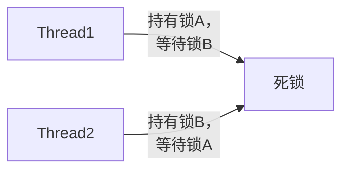

# C++ 线程同步

## 什么是线程同步

在多线程编程中，线程同步是一个核心概念。当多个线程同时访问共享资源时，如果不采取适当的同步措施，可能会导致数据竞争(data race)和不一致性问题。线程同步机制提供了一种控制多线程访问共享资源的方法，确保程序正确性。

:::note
**线程同步**是指协调多个线程的执行顺序和共享资源的访问，防止出现数据竞争和不确定的程序行为。
:::

## 为什么需要线程同步

考虑以下简单的代码示例，其中两个线程同时对一个共享变量进行递增操作：

```cpp
#include <iostream>
#include <thread>
#include <vector>

int counter = 0;

void increment_counter(int iterations) {
    for (int i = 0; i < iterations; ++i) {
        // 以下操作不是原子的，实际包含多个步骤：
        // 1. 读取counter的值
        // 2. 增加1
        // 3. 将结果写回counter
        counter++;
    }
}

int main() {
    const int iterations = 1000000;
    std::thread t1(increment_counter, iterations);
    std::thread t2(increment_counter, iterations);
    
    t1.join();
    t2.join();
    
    std::cout << "Expected: " << iterations * 2 << std::endl;
    std::cout << "Actual: " << counter << std::endl;
    
    return 0;
}
```

输出(可能的结果)：
```
Expected: 2000000
Actual: 1237546
```

你会发现最终的结果小于预期值。这是因为 `counter++` 操作不是原子的，当两个线程同时执行递增操作时会出现数据竞争，导致某些递增操作被"丢失"。

## 常用的线程同步机制

### 1. 互斥锁(Mutex)

互斥锁是最基本的线程同步机制，它可以确保在同一时间只有一个线程能够访问共享资源。C++11 中提供了 `std::mutex` 类来实现互斥锁。

#### 基本使用

```cpp
#include <iostream>
#include <thread>
#include <mutex>

int counter = 0;
std::mutex counter_mutex; // 声明一个互斥锁

void increment_counter(int iterations) {
    for (int i = 0; i < iterations; ++i) {
        counter_mutex.lock(); // 获取锁
        counter++;            // 临界区(Critical Section)
        counter_mutex.unlock(); // 释放锁
    }
}

int main() {
    const int iterations = 1000000;
    std::thread t1(increment_counter, iterations);
    std::thread t2(increment_counter, iterations);
    
    t1.join();
    t2.join();
    
    std::cout << "Expected: " << iterations * 2 << std::endl;
    std::cout << "Actual: " << counter << std::endl;
    
    return 0;
}
```

输出：
```
Expected: 2000000
Actual: 2000000
```

:::caution
直接使用 `lock()` 和 `unlock()` 可能会在异常发生时导致死锁。建议使用 RAII 风格的锁包装器，如 `std::lock_guard` 或 `std::unique_lock`。
:::

#### 使用 lock_guard

```cpp
#include <mutex>

std::mutex counter_mutex;

void increment_counter(int iterations) {
    for (int i = 0; i < iterations; ++i) {
        std::lock_guard<std::mutex> lock(counter_mutex); // 构造时获取锁，析构时释放锁
        counter++;
    }
}
```

#### 使用 unique_lock

`std::unique_lock` 比 `std::lock_guard` 更灵活，允许手动解锁和重新锁定：

```cpp
#include <mutex>

std::mutex counter_mutex;

void some_function() {
    std::unique_lock<std::mutex> lock(counter_mutex);
    // 做一些需要锁保护的工作
    
    lock.unlock(); // 手动释放锁
    // 执行不需要锁保护的代码
    
    lock.lock(); // 重新获取锁
    // 继续执行需要锁保护的代码
    // lock对象销毁时会自动释放锁
}
```

### 2. 读写锁(Shared Mutex)

当多个线程可以同时读取共享数据但只有一个线程可以写入时，可以使用读写锁(C++17引入的 `std::shared_mutex`)来提高性能。

```cpp
#include <iostream>
#include <thread>
#include <vector>
#include <shared_mutex>

class ThreadSafeCounter {
private:
    int value = 0;
    mutable std::shared_mutex mutex;

public:
    // 多个线程可以同时读取计数器的值
    int get() const {
        std::shared_lock<std::shared_mutex> lock(mutex); // 共享锁(读锁)
        return value;
    }

    // 一次只能有一个线程更新计数器的值
    void increment() {
        std::unique_lock<std::shared_mutex> lock(mutex); // 独占锁(写锁)
        value++;
    }
};

int main() {
    ThreadSafeCounter counter;
    std::vector<std::thread> threads;

    // 创建5个写线程
    for (int i = 0; i < 5; ++i) {
        threads.push_back(std::thread([&counter]() {
            for (int j = 0; j < 1000; ++j) {
                counter.increment();
            }
        }));
    }

    // 创建5个读线程
    for (int i = 0; i < 5; ++i) {
        threads.push_back(std::thread([&counter]() {
            for (int j = 0; j < 1000; ++j) {
                std::cout << "Counter value: " << counter.get() << std::endl;
            }
        }));
    }

    for (auto& t : threads) {
        t.join();
    }

    std::cout << "Final counter value: " << counter.get() << std::endl;
    return 0;
}
```

### 3. 条件变量(Condition Variable)

条件变量用于线程间的通信，允许一个或多个线程等待某个条件满足后再继续执行。

```cpp
#include <iostream>
#include <thread>
#include <mutex>
#include <condition_variable>
#include <queue>

std::mutex mtx;
std::condition_variable cv;
std::queue<int> data_queue;
bool done = false;

// 生产者线程
void producer() {
    for (int i = 0; i < 10; ++i) {
        {
            std::lock_guard<std::mutex> lock(mtx);
            data_queue.push(i);
            std::cout << "Produced: " << i << std::endl;
        }
        cv.notify_one(); // 通知一个等待的线程
        std::this_thread::sleep_for(std::chrono::milliseconds(100));
    }
    
    {
        std::lock_guard<std::mutex> lock(mtx);
        done = true;
    }
    cv.notify_all(); // 通知所有等待的线程
}

// 消费者线程
void consumer() {
    while (true) {
        std::unique_lock<std::mutex> lock(mtx);
        // wait会自动释放锁，直到条件满足
        cv.wait(lock, []{ return !data_queue.empty() || done; });
        
        if (done && data_queue.empty()) {
            std::cout << "Consumer finished" << std::endl;
            break;
        }
        
        int value = data_queue.front();
        data_queue.pop();
        lock.unlock(); // 在处理数据前释放锁
        
        std::cout << "Consumed: " << value << std::endl;
    }
}

int main() {
    std::thread producer_thread(producer);
    std::thread consumer_thread(consumer);
    
    producer_thread.join();
    consumer_thread.join();
    
    return 0;
}
```

输出可能如下：
```
Produced: 0
Consumed: 0
Produced: 1
Consumed: 1
Produced: 2
Consumed: 2
Produced: 3
Consumed: 3
Produced: 4
Consumed: 4
Produced: 5
Consumed: 5
Produced: 6
Consumed: 6
Produced: 7
Consumed: 7
Produced: 8
Consumed: 8
Produced: 9
Consumed: 9
Consumer finished
```

### 4. 原子操作(Atomic Operations)

对于简单的计数器等场景，使用原子操作往往比互斥锁更高效：

```cpp
#include <iostream>
#include <thread>
#include <atomic>

std::atomic<int> counter(0); // 原子类型

void increment_counter(int iterations) {
    for (int i = 0; i < iterations; ++i) {
        counter++; // 原子递增操作
    }
}

int main() {
    const int iterations = 1000000;
    std::thread t1(increment_counter, iterations);
    std::thread t2(increment_counter, iterations);
    
    t1.join();
    t2.join();
    
    std::cout << "Expected: " << iterations * 2 << std::endl;
    std::cout << "Actual: " << counter << std::endl;
    
    return 0;
}
```

输出：
```
Expected: 2000000
Actual: 2000000
```

### 5. 信号量(Semaphore, C++20)

C++20 引入了信号量，它可以控制对共享资源的访问数量：

```cpp
#include <iostream>
#include <thread>
#include <semaphore> // C++20
#include <vector>

// 二进制信号量(互斥量)
std::binary_semaphore mutex{1};

// 计数信号量，允许最多3个线程同时访问资源
std::counting_semaphore<3> resource_limiter{3};

void worker(int id) {
    // 尝试获取资源，如果没有可用资源，则阻塞
    resource_limiter.acquire();
    
    // 使用互斥量保护输出，避免混乱
    mutex.acquire();
    std::cout << "Worker " << id << " started using the resource" << std::endl;
    mutex.release();
    
    // 模拟使用资源的过程
    std::this_thread::sleep_for(std::chrono::seconds(1));
    
    mutex.acquire();
    std::cout << "Worker " << id << " finished using the resource" << std::endl;
    mutex.release();
    
    // 释放资源
    resource_limiter.release();
}

int main() {
    std::vector<std::thread> threads;
    
    for (int i = 0; i < 5; ++i) {
        threads.push_back(std::thread(worker, i));
    }
    
    for (auto& t : threads) {
        t.join();
    }
    
    return 0;
}
```

## 实际案例：线程安全的队列

下面是一个线程安全的队列实现，它可以在多线程环境中安全使用：

```cpp
#include <iostream>
#include <queue>
#include <mutex>
#include <condition_variable>
#include <thread>
#include <vector>

template <typename T>
class ThreadSafeQueue {
private:
    std::queue<T> queue;
    mutable std::mutex mutex;
    std::condition_variable cond;

public:
    // 添加元素到队列
    void push(T value) {
        std::lock_guard<std::mutex> lock(mutex);
        queue.push(std::move(value));
        cond.notify_one(); // 通知可能等待的线程
    }

    // 尝试弹出元素，如果队列为空返回false
    bool try_pop(T& value) {
        std::lock_guard<std::mutex> lock(mutex);
        if (queue.empty()) {
            return false;
        }
        
        value = std::move(queue.front());
        queue.pop();
        return true;
    }

    // 等待并弹出元素
    void wait_and_pop(T& value) {
        std::unique_lock<std::mutex> lock(mutex);
        cond.wait(lock, [this] { return !queue.empty(); });
        value = std::move(queue.front());
        queue.pop();
    }

    // 检查队列是否为空
    bool empty() const {
        std::lock_guard<std::mutex> lock(mutex);
        return queue.empty();
    }
};

// 使用线程安全队列的示例
void example_usage() {
    ThreadSafeQueue<int> safe_queue;
    
    // 生产者线程
    std::thread producer([&safe_queue]() {
        for (int i = 0; i < 10; ++i) {
            std::this_thread::sleep_for(std::chrono::milliseconds(200));
            std::cout << "Pushing " << i << std::endl;
            safe_queue.push(i);
        }
    });
    
    // 消费者线程
    std::thread consumer([&safe_queue]() {
        for (int i = 0; i < 10; ++i) {
            int value;
            safe_queue.wait_and_pop(value);
            std::cout << "Popped " << value << std::endl;
        }
    });
    
    producer.join();
    consumer.join();
}

int main() {
    example_usage();
    return 0;
}
```

输出可能如下：
```
Pushing 0
Popped 0
Pushing 1
Popped 1
Pushing 2
Popped 2
Pushing 3
Popped 3
Pushing 4
Popped 4
Pushing 5
Popped 5
Pushing 6
Popped 6
Pushing 7
Popped 7
Pushing 8
Popped 8
Pushing 9
Popped 9
```

## 线程同步问题及解决方案

### 1. 死锁(Deadlock)

当两个或更多线程互相等待对方持有的锁释放时，会发生死锁。



**解决方案**：
- 总是按照相同的顺序获取锁
- 使用 `std::lock` 或 `std::scoped_lock`(C++17) 同时获取多个锁
- 使用超时设置来避免永久等待

### 2. 饥饿(Starvation)

当一个线程长时间无法获得所需的资源时，会发生饥饿。

**解决方案**：
- 使用公平的锁分配策略
- 避免长时间持有锁
- 使用读写锁将读操作与写操作分离

### 3. 优先级反转(Priority Inversion)

当低优先级线程持有高优先级线程需要的锁时，会发生优先级反转。

**解决方案**：
- 优先级继承(优先级暂时提升)
- 优先级天花板协议
- 尽可能避免在不同优先级的线程间共享互斥锁

## 总结

线程同步是多线程编程中确保数据一致性和正确性的关键。本文介绍了C++中的主要同步机制：

1. **互斥锁(Mutex)**：确保一次只有一个线程可访问共享资源
2. **读写锁(Shared Mutex)**：允许多个读取者或一个写入者
3. **条件变量(Condition Variable)**：用于线程间的通信和同步
4. **原子操作(Atomic Operations)**：适用于简单的计数器等场景
5. **信号量(Semaphore)**：控制对资源的并发访问数量

选择合适的同步机制取决于具体的应用场景、性能要求和线程交互模式。在实际开发中，应该遵循以下原则：

- 尽可能使用高级抽象（如线程安全容器、任务系统）
- 最小化临界区大小和持有锁的时间
- 优先考虑无锁算法和数据结构（如果适用）
- 在设计阶段就考虑线程安全性

:::tip
线程同步不仅仅是技术问题，更是设计问题。良好的并发设计可以减少对同步机制的依赖，提高程序的性能和可维护性。
:::

## 练习

1. 实现一个线程安全的单例模式。
2. 修改线程安全队列，添加一个带超时的 `wait_and_pop` 方法。
3. 编写一个简单的读者-写者问题的解决方案，使用 `std::shared_mutex`。
4. 实现一个线程池，可以接受任务并在多个工作线程中执行它们。

## 附加资源

- [C++ Reference - Thread support library](https://en.cppreference.com/w/cpp/thread)
- [Anthony Williams - C++ Concurrency in Action](https://www.manning.com/books/c-plus-plus-concurrency-in-action-second-edition)
- [Herb Sutter - Effective Concurrency](https://herbsutter.com/effective-concurrency/)