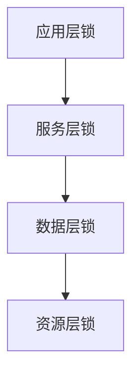

# C++ 锁定策略

在多线程编程中，一个核心挑战是如何安全地管理多个线程对共享资源的访问。锁定策略是解决这一问题的方法论，它定义了线程如何获取、持有和释放锁，从而保护共享资源不会被并发访问破坏。

## 为什么需要锁定策略？

当多个线程同时访问共享资源时，如果没有适当的同步机制，可能会导致数据竞争(data race)、死锁(deadlock)、饥饿(starvation)等问题。合适的锁定策略可以:

- 确保数据一致性
- 避免死锁情况
- 提高并发性能
- 简化代码逻辑

## C++ 中的基本锁类型

### 互斥锁(mutex)

互斥锁是最基本的锁类型，它确保同一时刻只有一个线程可以获取锁并访问受保护的资源。

```cpp
#include <iostream>
#include <thread>
#include <mutex>

std::mutex mtx;
int shared_value = 0;

void increment() {
    for (int i = 0; i < 1000; ++i) {
        mtx.lock();     // 获取锁
        shared_value++; // 安全地修改共享变量
        mtx.unlock();   // 释放锁
    }
}

int main() {
    std::thread t1(increment);
    std::thread t2(increment);
    
    t1.join();
    t2.join();
    
    std::cout << "Final value: " << shared_value << std::endl;
    return 0;
}

// 输出:
// Final value: 2000
```

:::caution
直接使用`lock()`和`unlock()`可能会导致问题，如果在`unlock()`之前发生异常，锁将永远不会被释放，导致死锁。
:::

### 锁守卫(Lock Guards)

为了避免忘记解锁的问题，C++提供了RAII风格的锁守卫:

```cpp
#include <mutex>
#include <iostream>
#include <thread>

std::mutex mtx;
int shared_value = 0;

void increment() {
    for (int i = 0; i < 1000; ++i) {
        std::lock_guard<std::mutex> guard(mtx); // 构造时自动上锁
        shared_value++;
        // 当guard离开作用域时，自动解锁
    }
}

int main() {
    std::thread t1(increment);
    std::thread t2(increment);
    
    t1.join();
    t2.join();
    
    std::cout << "Final value: " << shared_value << std::endl;
    return 0;
}
```

## 高级锁定策略

### 1. 唯一锁(unique_lock)

比`lock_guard`更灵活，允许手动锁定和解锁，适合需要条件变量的场景。

```cpp
std::mutex mtx;
std::condition_variable cv;
bool ready = false;

void worker() {
    std::unique_lock<std::mutex> lock(mtx); // 获取锁
    cv.wait(lock, []{ return ready; });     // 等待条件满足，期间会释放锁
    
    // 条件满足后，锁会被重新获取
    std::cout << "Worker thread is processing\n";
}

void setter() {
    {
        std::lock_guard<std::mutex> lock(mtx);
        ready = true;
    } // 锁在此处释放
    cv.notify_one(); // 通知等待的线程
}
```

### 2. 共享锁(shared_lock)与读写锁(shared_mutex)

C++17引入了`shared_mutex`，允许多个读操作同时进行，但写操作需要独占访问。

```cpp
#include <iostream>
#include <thread>
#include <shared_mutex>
#include <vector>

class ThreadSafeCounter {
private:
    mutable std::shared_mutex mutex_;
    int value_ = 0;

public:
    // 写操作 - 需要独占锁
    void increment() {
        std::unique_lock lock(mutex_);
        ++value_;
    }

    // 读操作 - 可以共享锁
    int get() const {
        std::shared_lock lock(mutex_);
        return value_;
    }
};

int main() {
    ThreadSafeCounter counter;
    std::vector<std::thread> threads;
    
    // 创建10个读线程
    for (int i = 0; i < 10; ++i) {
        threads.push_back(std::thread([&counter]() {
            for (int j = 0; j < 100; ++j) {
                std::cout << "Counter value: " << counter.get() << std::endl;
                std::this_thread::sleep_for(std::chrono::milliseconds(1));
            }
        }));
    }
    
    // 创建3个写线程
    for (int i = 0; i < 3; ++i) {
        threads.push_back(std::thread([&counter]() {
            for (int j = 0; j < 100; ++j) {
                counter.increment();
                std::this_thread::sleep_for(std::chrono::milliseconds(5));
            }
        }));
    }
    
    // 等待所有线程完成
    for (auto& t : threads) {
        t.join();
    }
    
    return 0;
}
```

### 3. 递归锁(recursive_mutex)

允许同一线程多次获取同一个锁，适合递归调用的场景。

```cpp
#include <iostream>
#include <thread>
#include <mutex>

class RecursiveData {
private:
    std::recursive_mutex mtx;
    int data;
    
public:
    RecursiveData() : data(0) {}
    
    void process(int count) {
        std::lock_guard<std::recursive_mutex> lock(mtx);
        data += count;
        
        // 递归调用，如果是普通mutex会导致死锁
        if (count > 1) {
            process(count - 1);
        }
    }
    
    int get_data() {
        std::lock_guard<std::recursive_mutex> lock(mtx);
        return data;
    }
};

int main() {
    RecursiveData rd;
    
    std::thread t1([&rd]() {
        rd.process(5);
    });
    
    t1.join();
    std::cout << "Final data: " << rd.get_data() << std::endl;
    
    return 0;
}

// 输出:
// Final data: 15
```

:::note
递归锁虽然方便，但可能掩盖设计问题，应谨慎使用。
:::

## 锁定策略的最佳实践

### 1. 按固定顺序获取多个锁

为了避免死锁，当需要获取多个锁时，应该总是按照相同的顺序获取它们。

```cpp
std::mutex mutex1, mutex2;

// 安全的写法 - 总是按照相同顺序获取锁
void safe_function() {
    std::lock_guard<std::mutex> lock1(mutex1);
    std::lock_guard<std::mutex> lock2(mutex2);
    // 处理共享资源
}

// 危险的写法 - 可能导致死锁
void unsafe_function1() {
    std::lock_guard<std::mutex> lock1(mutex1);
    std::lock_guard<std::mutex> lock2(mutex2);
    // 处理共享资源
}

void unsafe_function2() {
    std::lock_guard<std::mutex> lock2(mutex2);  // 顺序不同!
    std::lock_guard<std::mutex> lock1(mutex1);
    // 处理共享资源
}
```

### 2. 使用std::lock和std::scoped_lock

C++提供了`std::lock`和C++17的`std::scoped_lock`来一次性获取多个锁，避免死锁。

```cpp
#include <mutex>
#include <thread>
#include <iostream>

std::mutex mtx1, mtx2;

void process_data() {
    // C++17方式，一次性锁定多个互斥量
    std::scoped_lock lock(mtx1, mtx2);
    
    // 安全地访问受两个互斥量保护的资源
    std::cout << "Processing data...\n";
}

int main() {
    std::thread t1(process_data);
    std::thread t2(process_data);
    
    t1.join();
    t2.join();
    
    return 0;
}
```

### 3. 尽量减小临界区

锁保护的代码区域（临界区）应尽可能小，以提高并发性能。

```cpp
// 不好的做法 - 锁定时间过长
void process_data_bad(const std::vector<int>& input) {
    std::lock_guard<std::mutex> lock(mtx);
    
    // 这些计算不需要锁保护
    int sum = 0;
    for (int num : input) {
        sum += num;
    }
    
    // 只有这部分需要锁保护
    shared_result += sum;
}

// 好的做法 - 最小化临界区
void process_data_good(const std::vector<int>& input) {
    // 不需要锁的计算放在锁外
    int sum = 0;
    for (int num : input) {
        sum += num;
    }
    
    // 只锁定真正需要同步的部分
    {
        std::lock_guard<std::mutex> lock(mtx);
        shared_result += sum;
    }
}
```

### 4. 使用锁的层级(Lock Hierarchy)

为复杂系统创建锁的层级结构，确保低层级锁在高层级锁之后获取。



## 实际应用案例

### 线程安全的缓存实现

以下是一个使用读写锁实现的简单线程安全缓存:

```cpp
#include <iostream>
#include <unordered_map>
#include <shared_mutex>
#include <string>
#include <thread>
#include <vector>

template<typename Key, typename Value>
class ThreadSafeCache {
private:
    std::unordered_map<Key, Value> cache;
    mutable std::shared_mutex mutex;

public:
    // 写入缓存 - 需要独占锁
    void set(const Key& key, const Value& value) {
        std::unique_lock lock(mutex);
        cache[key] = value;
    }
    
    // 读取缓存 - 使用共享锁
    bool get(const Key& key, Value& value) const {
        std::shared_lock lock(mutex);
        auto it = cache.find(key);
        if (it == cache.end()) {
            return false;
        }
        value = it->second;
        return true;
    }
    
    // 删除缓存项 - 需要独占锁
    bool remove(const Key& key) {
        std::unique_lock lock(mutex);
        return cache.erase(key) > 0;
    }
};

int main() {
    ThreadSafeCache<std::string, int> cache;
    
    // 写入线程
    std::thread writer([&cache]() {
        for (int i = 0; i < 100; ++i) {
            cache.set("key" + std::to_string(i), i);
            std::this_thread::sleep_for(std::chrono::milliseconds(5));
        }
    });
    
    // 读取线程
    std::vector<std::thread> readers;
    for (int i = 0; i < 5; ++i) {
        readers.push_back(std::thread([&cache, i]() {
            for (int j = 0; j < 100; ++j) {
                int value;
                std::string key = "key" + std::to_string(j);
                if (cache.get(key, value)) {
                    std::cout << "Thread " << i << " read: " << key << " = " << value << std::endl;
                }
                std::this_thread::sleep_for(std::chrono::milliseconds(2));
            }
        }));
    }
    
    writer.join();
    for (auto& t : readers) {
        t.join();
    }
    
    return 0;
}
```

### 银行账户转账系统

下面的例子展示了如何使用`std::lock`来安全地在账户间转账:

```cpp
#include <iostream>
#include <mutex>
#include <thread>
#include <vector>

class BankAccount {
private:
    int id;
    double balance;
    std::mutex mtx;

public:
    BankAccount(int id, double initial_balance) 
        : id(id), balance(initial_balance) {}
    
    int getId() const { return id; }
    
    double getBalance() const {
        std::lock_guard<std::mutex> lock(mtx);
        return balance;
    }
    
    // 转账函数
    bool transfer(BankAccount& to, double amount) {
        // 使用std::lock同时锁定两个账户，避免死锁
        std::lock(mtx, to.mtx);
        
        // 创建lock_guard来管理已锁定的互斥量
        std::lock_guard<std::mutex> lock_from(mtx, std::adopt_lock);
        std::lock_guard<std::mutex> lock_to(to.mtx, std::adopt_lock);
        
        if (balance < amount) {
            return false; // 余额不足
        }
        
        balance -= amount;
        to.balance += amount;
        
        std::cout << "Transferred $" << amount << " from account " 
                  << id << " to account " << to.id << std::endl;
        return true;
    }
};

int main() {
    BankAccount account1(1, 1000);
    BankAccount account2(2, 500);
    
    std::vector<std::thread> transactions;
    
    // 创建多个转账线程
    for (int i = 0; i < 5; ++i) {
        transactions.push_back(std::thread([&account1, &account2]() {
            account1.transfer(account2, 100);
        }));
        
        transactions.push_back(std::thread([&account2, &account1]() {
            account2.transfer(account1, 50);
        }));
    }
    
    // 等待所有转账完成
    for (auto& t : transactions) {
        t.join();
    }
    
    std::cout << "Final balance of account 1: $" << account1.getBalance() << std::endl;
    std::cout << "Final balance of account 2: $" << account2.getBalance() << std::endl;
    
    return 0;
}
```

## 总结

锁定策略是多线程编程中至关重要的一部分，正确使用锁可以避免数据竞争和死锁问题。本文介绍了:

1. 基本锁类型: `mutex`, `lock_guard`
2. 高级锁类型: `unique_lock`, `shared_lock`, `recursive_mutex`
3. 锁定策略最佳实践:
   - 固定顺序获取多锁
   - 使用`std::lock`和`std::scoped_lock`
   - 最小化临界区
   - 建立锁层级

掌握这些锁定策略将帮助你编写更高效、更可靠的多线程程序。

## 练习

1. 实现一个线程安全的计数器类，支持增加、减少和获取当前值操作。
2. 修改银行账户示例，增加一个功能，允许同时转账给多个账户，而不会发生死锁。
3. 实现一个简单的读写锁模式的文件缓存系统，允许多线程读取但单线程写入。
4. 创建一个使用条件变量和互斥锁的生产者-消费者模型。

## 扩展阅读资源

- C++标准库参考: [cppreference.com](http://cppreference.com)
- 《C++ Concurrency in Action》by Anthony Williams
- 《Effective Modern C++》by Scott Meyers（特别是关于锁和并发的章节）

:::tip
随着经验的增长，尝试更高级的并发模式，如无锁数据结构和原子操作，它们在某些情况下可以提供更好的性能。
:::