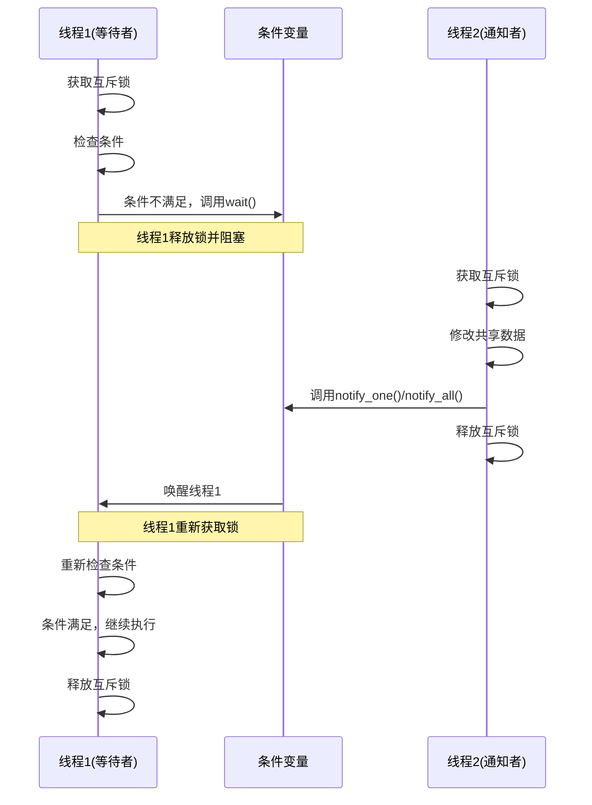

# C++ 条件变量

## 条件变量是什么？

条件变量是C++11引入的一种同步原语，用于在多线程环境中实现线程间的通信和协调。当一个线程需要等待某个条件满足时，它可以通过条件变量进入休眠状态，直到其他线程修改了条件并通知条件变量，等待的线程才会被唤醒并继续执行。

:::tip
条件变量通常与互斥锁一起使用，构成完整的线程同步机制。
:::

## 为什么需要条件变量？

在多线程编程中，我们经常遇到这样的场景：一个线程需要等待某个条件成立才能继续执行。例如：

- 消费者线程需要等待生产者线程生产出数据
- 工作线程需要等待任务队列中有任务可执行
- 主线程需要等待所有工作线程完成任务

如果没有条件变量，我们可能会使用"轮询"方式：线程不断检查条件是否满足，这会浪费CPU资源。条件变量则提供了一种更高效的机制，允许线程在条件不满足时进入休眠状态，不消耗CPU资源。

## 条件变量的核心方法

C++中的条件变量主要由`std::condition_variable`类实现，位于`<condition_variable>`头文件中。以下是其核心方法：

| 方法 | 描述 |
|------|------|
| `wait` | 使当前线程阻塞，直到条件变量被通知 |
| `wait_for` | 阻塞当前线程直到条件变量被通知或超时 |
| `wait_until` | 阻塞当前线程直到条件变量被通知或到达指定时间点 |
| `notify_one` | 通知一个等待的线程 |
| `notify_all` | 通知所有等待的线程 |

## 基本使用方式

以下是条件变量的基本使用模式：

```cpp
#include <iostream>
#include <thread>
#include <mutex>
#include <condition_variable>

std::mutex mtx;
std::condition_variable cv;
bool ready = false;  // 共享条件

void worker_thread() {
    // 准备一个锁，但先不获取它
    std::unique_lock<std::mutex> lock(mtx);
    
    // 等待条件变为true
    cv.wait(lock, []{ return ready; });
    
    // 条件满足，继续工作
    std::cout << "工作线程开始执行..." << std::endl;
}

int main() {
    std::thread worker(worker_thread);
    
    // 主线程做一些准备工作
    std::this_thread::sleep_for(std::chrono::seconds(2));
    
    {
        std::lock_guard<std::mutex> lock(mtx);
        ready = true;  // 设置共享条件
        std::cout << "主线程通知数据已就绪" << std::endl;
    }
    
    // 通知等待的线程
    cv.notify_one();
    
    worker.join();
    return 0;
}
```

**输出**:
```
主线程通知数据已就绪
工作线程开始执行...
```

## 条件变量的工作原理

条件变量的工作原理可以概括为以下几个步骤：



## 虚假唤醒问题

条件变量的等待可能会出现"虚假唤醒"(spurious wakeup)现象，即线程可能在没有收到通知的情况下被唤醒。因此，`wait()`方法通常需要传入一个谓词（predicate）函数，在线程被唤醒后再次检查条件是否满足。

:::caution
永远不要假设被唤醒就意味着条件一定满足，必须再次检查条件。
:::

## 生产者-消费者模式示例

下面是一个使用条件变量实现的生产者-消费者模式示例：

```cpp
#include <iostream>
#include <queue>
#include <thread>
#include <mutex>
#include <condition_variable>

std::queue<int> buffer;
const int MAX_BUFFER_SIZE = 10;
std::mutex mtx;
std::condition_variable buffer_not_full;
std::condition_variable buffer_not_empty;
bool done = false;

void producer(int id) {
    for (int i = 1; i <= 20; ++i) {
        std::unique_lock<std::mutex> lock(mtx);
        
        // 等待直到缓冲区不满
        buffer_not_full.wait(lock, []{ return buffer.size() < MAX_BUFFER_SIZE; });
        
        // 生产数据并放入缓冲区
        buffer.push(i);
        std::cout << "生产者 " << id << " 生产了数据: " << i 
                  << " (缓冲区大小: " << buffer.size() << ")" << std::endl;
        
        // 通知消费者
        buffer_not_empty.notify_one();
        
        // 释放锁，并稍作等待
        lock.unlock();
        std::this_thread::sleep_for(std::chrono::milliseconds(100));
    }
}

void consumer(int id) {
    while (!done || !buffer.empty()) {
        std::unique_lock<std::mutex> lock(mtx);
        
        // 等待直到缓冲区不空或任务完成
        buffer_not_empty.wait(lock, []{ return !buffer.empty() || done; });
        
        // 如果缓冲区为空且所有任务已完成，则退出
        if (buffer.empty() && done) {
            break;
        }
        
        // 消费数据
        int value = buffer.front();
        buffer.pop();
        std::cout << "消费者 " << id << " 消费了数据: " << value 
                  << " (缓冲区大小: " << buffer.size() << ")" << std::endl;
        
        // 通知生产者
        buffer_not_full.notify_one();
        
        // 释放锁，并稍作等待
        lock.unlock();
        std::this_thread::sleep_for(std::chrono::milliseconds(200));
    }
}

int main() {
    std::thread producer_thread(producer, 1);
    std::thread consumer_thread1(consumer, 1);
    std::thread consumer_thread2(consumer, 2);
    
    producer_thread.join();
    
    // 标记所有任务已完成
    {
        std::lock_guard<std::mutex> lock(mtx);
        done = true;
    }
    
    // 通知所有消费者
    buffer_not_empty.notify_all();
    
    consumer_thread1.join();
    consumer_thread2.join();
    
    return 0;
}
```

这个例子展示了如何使用条件变量协调生产者和消费者线程，确保生产者在缓冲区满时等待，消费者在缓冲区空时等待。

## 条件变量与互斥锁的配合

条件变量需要与互斥锁一起使用，主要有两个原因：
1. **避免竞态条件**：确保条件检查和等待是原子操作
2. **实现线程阻塞**：条件变量的wait操作会自动释放互斥锁，允许其他线程修改条件

常见使用模式是：
```cpp
std::unique_lock<std::mutex> lock(mtx);
cv.wait(lock, []{
    return condition_is_satisfied();
});
```

## 使用条件变量的最佳实践

1. **避免死锁**：确保在同一个线程中以相同的顺序获取多个锁
2. **避免虚假唤醒**：始终使用谓词函数重新检查条件
3. **避免忘记通知**：确保在改变条件后调用notify_one()或notify_all()
4. **选择合适的通知方法**：
   - 当只有一个线程需要被唤醒时，使用notify_one()
   - 当所有等待线程都需要检查条件时，使用notify_all()

## 实际应用场景

条件变量在实际开发中有许多应用场景，包括：

1. **线程池实现**：工作线程等待任务队列中的新任务
2. **异步任务完成通知**：主线程等待后台任务完成
3. **资源管理**：等待资源可用或资源状态改变
4. **定时器实现**：实现基于时间的任务调度

## 总结

条件变量是C++多线程编程中不可或缺的同步机制，提供了一种高效的方式让线程等待特定条件的发生。要点回顾：

- 条件变量用于线程间的通信和同步
- 总是与互斥锁配合使用
- 使用wait()方法等待条件满足，使用notify_one()/notify_all()方法通知等待线程
- 需要处理虚假唤醒问题
- 适用于生产者-消费者模式等多种多线程场景

## 练习

1. 修改生产者-消费者示例，使其支持多个生产者
2. 实现一个简单的线程安全队列，使用条件变量实现阻塞的push和pop操作
3. 实现一个计数门闩(CountDownLatch)，允许一个或多个线程等待直到一组操作完成
4. 使用条件变量实现一个简单的定时器，可以在特定时间后执行任务

## 进一步学习资源

- C++标准库文档中关于`std::condition_variable`的部分
- 《C++ Concurrency in Action》by Anthony Williams
- 《Effective Modern C++》by Scott Meyers中关于并发的章节