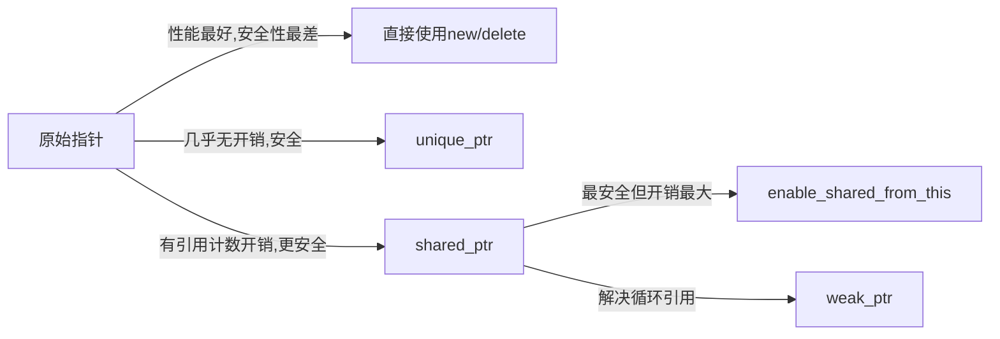

# C++ 智能指针详解

## 引言

在C++编程中，内存管理一直是一个棘手的问题。传统的手动内存管理方式（使用`new`和`delete`）容易导致内存泄漏、悬空指针等问题。为了解决这些问题，C++11引入了智能指针，它是对原始指针的封装，能够在适当的时机自动释放所管理的内存资源，极大地简化了内存管理工作。

本文将详细介绍C++中的智能指针，包括其基本概念、主要类型、使用方法以及实际应用场景，帮助初学者掌握这一重要的C++特性。

## 为什么需要智能指针？

在了解智能指针前，我们先看一个传统内存管理可能导致的问题：

```cpp
void someFunction() {
    Resource* resource = new Resource(); // 分配内存
    
    // 使用resource
    
    // 如果这里忘记delete或者由于异常提前返回，会导致内存泄漏
    
    delete resource; // 正确情况下应该释放内存
}
```

这种手动管理内存的方式有以下问题：
1. 容易忘记释放内存，导致内存泄漏
2. 可能多次释放同一块内存，导致程序崩溃
3. 在异常发生时难以确保内存被正确释放

智能指针正是为了解决这些问题而设计的，它采用RAII（Resource Acquisition Is Initialization，资源获取即初始化）技术，确保资源在离开作用域时被自动释放。

## C++ 智能指针的基本种类

C++11标准库提供了三种基本的智能指针：
1. `std::unique_ptr` - 独占所有权的智能指针
2. `std::shared_ptr` - 共享所有权的智能指针
3. `std::weak_ptr` - 不影响对象生命周期的弱引用智能指针

下面我们将逐一介绍这三种智能指针。

## std::unique_ptr

### 基本概念

`unique_ptr`是一种独占所有权的智能指针，它确保一个资源只能被一个指针所拥有。当`unique_ptr`被销毁时，它所管理的资源也会被自动释放。

### 基本用法

```cpp
#include <iostream>
#include <memory>

class Resource {
public:
    Resource() { std::cout << "Resource acquired\n"; }
    ~Resource() { std::cout << "Resource destroyed\n"; }
    void doSomething() { std::cout << "Resource is being used\n"; }
};

int main() {
    // 创建unique_ptr
    std::unique_ptr<Resource> res1(new Resource());
    
    // C++14推荐使用make_unique
    std::unique_ptr<Resource> res2 = std::make_unique<Resource>();
    
    // 使用资源
    res1->doSomething();
    
    // 转移所有权（移动语义）
    std::unique_ptr<Resource> res3 = std::move(res1);
    
    // res1现在为nullptr，不再拥有资源
    if (!res1) {
        std::cout << "res1 is null\n";
    }
    
    // res3拥有资源
    res3->doSomething();
    
    // 离开作用域时，res2和res3自动释放资源
    return 0;
}
```

输出：
```
Resource acquired
Resource acquired
Resource is being used
res1 is null
Resource is being used
Resource destroyed
Resource destroyed
```

### 注意事项

1. `unique_ptr`不能被复制，只能被移动
2. C++14及以后建议使用`std::make_unique<T>()`创建`unique_ptr`
3. `unique_ptr`可以管理数组资源，使用`unique_ptr<T[]>`语法

:::tip
使用`std::make_unique`创建智能指针比直接使用`new`更安全，因为它能避免内存泄漏，并且异常安全。
:::

## std::shared_ptr

### 基本概念

`shared_ptr`是一种共享所有权的智能指针，多个`shared_ptr`可以共同管理同一个资源。它使用引用计数机制，记录当前有多少个`shared_ptr`指向同一个资源，当引用计数归零时，资源会被自动释放。

### 基本用法

```cpp
#include <iostream>
#include <memory>

class Resource {
public:
    Resource() { std::cout << "Resource acquired\n"; }
    ~Resource() { std::cout << "Resource destroyed\n"; }
    void doSomething() { std::cout << "Resource is being used\n"; }
};

int main() {
    // 创建shared_ptr
    std::shared_ptr<Resource> res1(new Resource());
    
    // C++11及以后建议使用make_shared
    std::shared_ptr<Resource> res2 = std::make_shared<Resource>();
    
    // 复制shared_ptr，引用计数增加
    std::shared_ptr<Resource> res3 = res1;
    
    std::cout << "res1 引用计数: " << res1.use_count() << std::endl;
    std::cout << "res2 引用计数: " << res2.use_count() << std::endl;
    std::cout << "res3 引用计数: " << res3.use_count() << std::endl;
    
    // 释放res1，引用计数减少
    res1.reset();
    std::cout << "重置res1后，res3 引用计数: " << res3.use_count() << std::endl;
    
    // res3依然可以访问资源
    res3->doSomething();
    
    // 离开作用域时，所有shared_ptr被销毁，资源被释放
    return 0;
}
```

输出：
```
Resource acquired
Resource acquired
res1 引用计数: 2
res2 引用计数: 1
res3 引用计数: 2
重置res1后，res3 引用计数: 1
Resource is being used
Resource destroyed
Resource destroyed
```

### 注意事项

1. `shared_ptr`使用引用计数，管理开销比`unique_ptr`大
2. 循环引用会导致内存泄漏，需要使用`weak_ptr`来打破循环
3. 尽可能使用`std::make_shared<T>()`创建`shared_ptr`

:::warning
避免直接将同一块原始指针传递给多个`shared_ptr`构造函数，这会导致多次删除同一资源：

```cpp
Resource* r = new Resource();
std::shared_ptr<Resource> p1(r);  // 引用计数为1
std::shared_ptr<Resource> p2(r);  // 引用计数也为1，而不是2
// 当p1和p2都被销毁时，r将被删除两次！
```
:::

## std::weak_ptr

### 基本概念

`weak_ptr`是一种不控制对象生命周期的智能指针，它指向一个由`shared_ptr`管理的对象，但不会增加引用计数。`weak_ptr`主要用于解决`shared_ptr`的循环引用问题。

### 基本用法

```cpp
#include <iostream>
#include <memory>

class B; // 前置声明

class A {
public:
    std::shared_ptr<B> b_ptr;
    A() { std::cout << "A created\n"; }
    ~A() { std::cout << "A destroyed\n"; }
};

class B {
public:
    std::weak_ptr<A> a_ptr; // 使用weak_ptr避免循环引用
    B() { std::cout << "B created\n"; }
    ~B() { std::cout << "B destroyed\n"; }
};

int main() {
    // 创建对象
    std::shared_ptr<A> a = std::make_shared<A>();
    std::shared_ptr<B> b = std::make_shared<B>();
    
    // 建立相互引用
    a->b_ptr = b;
    b->a_ptr = a;
    
    std::cout << "a use count: " << a.use_count() << std::endl;
    std::cout << "b use count: " << b.use_count() << std::endl;
    
    // 使用weak_ptr
    std::shared_ptr<A> a2 = b->a_ptr.lock(); // 将weak_ptr转换为shared_ptr
    if (a2) {
        std::cout << "a2 is valid\n";
    }
    
    return 0;
}
```

输出：
```
A created
B created
a use count: 2
b use count: 2
a2 is valid
B destroyed
A destroyed
```

### 注意事项

1. `weak_ptr`不能直接访问所管理的对象，必须先转换为`shared_ptr`
2. 使用`weak_ptr::lock()`方法可以安全地获取`shared_ptr`
3. `weak_ptr::expired()`可以检查所指向的对象是否已被销毁

## 智能指针的实际应用场景

### 资源管理

智能指针最基本的应用是自动管理资源的生命周期，例如文件句柄、数据库连接等。

```cpp
std::unique_ptr<FILE, decltype(&fclose)> file(fopen("example.txt", "r"), &fclose);
if (file) {
    // 使用文件...
} // 文件会在此处自动关闭
```

### 工厂函数返回值

工厂函数通常需要动态创建对象并返回，使用智能指针能够确保对象被正确管理。

```cpp
std::unique_ptr<Widget> createWidget(int type) {
    if (type == 1) {
        return std::make_unique<SimpleWidget>();
    } else {
        return std::make_unique<ComplexWidget>();
    }
}
```

### 避免内存泄漏

智能指针能在异常发生时确保资源被释放，有效避免内存泄漏。

```cpp
void processSomething() {
    auto resource = std::make_unique<Resource>();
    
    // 即使下面的代码抛出异常，resource也会被正确释放
    doSomethingThatMightThrow();
    
} // resource自动释放
```

### 多态容器

管理多态对象的容器可以使用智能指针保存基类指针。

```cpp
std::vector<std::shared_ptr<Shape>> shapes;
shapes.push_back(std::make_shared<Circle>());
shapes.push_back(std::make_shared<Rectangle>());
shapes.push_back(std::make_shared<Triangle>());

for (const auto& shape : shapes) {
    shape->draw();
}
```

### 缓存实现

可以使用`weak_ptr`实现缓存，当缓存中的对象不再被使用时自动释放内存。

```cpp
class Cache {
private:
    std::unordered_map<std::string, std::weak_ptr<Resource>> cache;
    
public:
    std::shared_ptr<Resource> getResource(const std::string& key) {
        auto it = cache.find(key);
        if (it != cache.end()) {
            // 尝试从缓存获取
            if (auto resource = it->second.lock()) {
                return resource; // 缓存命中
            }
        }
        
        // 缓存未命中或对象已被释放，创建新对象
        auto resource = std::make_shared<Resource>();
        cache[key] = resource;
        return resource;
    }
};
```

## 智能指针性能考虑

虽然智能指针提供了自动内存管理的便利，但也需要注意其性能开销：

1. `unique_ptr`几乎没有额外开销，与原始指针性能相当
2. `shared_ptr`有引用计数的开销，引用计数通常是线程安全的，可能涉及原子操作
3. 创建和销毁智能指针有小额额外开销
4. `make_shared`比分开的`new`和`shared_ptr`构造更高效，因为它只分配一次内存



## 自定义删除器

智能指针可以配置自定义删除器，用于处理特殊资源的释放。

```cpp
#include <iostream>
#include <memory>

void customDeleter(int* p) {
    std::cout << "Custom deleter called\n";
    delete p;
}

int main() {
    // 使用自定义删除器的unique_ptr
    std::unique_ptr<int, decltype(&customDeleter)> p1(new int(42), customDeleter);
    
    // 使用lambda作为自定义删除器
    auto lambdaDeleter = [](int* p) {
        std::cout << "Lambda deleter called\n";
        delete p;
    };
    std::unique_ptr<int, decltype(lambdaDeleter)> p2(new int(100), lambdaDeleter);
    
    // shared_ptr的自定义删除器
    std::shared_ptr<int> p3(new int(200), customDeleter);
    
    return 0;
}
```

输出：
```
Lambda deleter called
Custom deleter called
Custom deleter called
```

## 常见错误和最佳实践

### 避免的错误

1. 使用`get()`方法获取原始指针后删除它

```cpp
std::shared_ptr<int> p = std::make_shared<int>(42);
int* raw = p.get();
delete raw; // 错误！不要手动删除智能指针管理的资源
```

2. 循环引用导致内存泄漏

```cpp
struct Node {
    std::shared_ptr<Node> next;
};

std::shared_ptr<Node> createCycle() {
    auto a = std::make_shared<Node>();
    auto b = std::make_shared<Node>();
    a->next = b;
    b->next = a; // 循环引用，导致内存泄漏
    return a;
}
```

### 最佳实践

1. 优先使用`std::make_unique`和`std::make_shared`创建智能指针
2. 使用`unique_ptr`作为独占资源的首选
3. 仅在需要共享资源时使用`shared_ptr`
4. 使用`weak_ptr`打破循环引用
5. 避免使用`new`直接构造智能指针
6. 为自定义类使用适当的智能指针
7. 处理特殊资源时使用自定义删除器

## 总结

智能指针是C++现代内存管理的核心工具，它们通过自动化资源释放极大地简化了代码并减少了内存泄漏的风险。本文详细介绍了三种主要的智能指针：

1. `std::unique_ptr` - 独占所有权，适合不共享的资源
2. `std::shared_ptr` - 共享所有权，适合多处使用的资源
3. `std::weak_ptr` - 弱引用，不控制生命周期，用于打破循环引用

掌握智能指针的使用是编写现代C++程序的必备技能。通过合理使用智能指针，可以编写更安全、更易维护的代码，同时避免手动内存管理的常见陷阱。

## 练习

1. 实现一个简单的资源管理类，使用`unique_ptr`管理文件句柄
2. 创建一个使用`shared_ptr`的对象池
3. 使用`weak_ptr`实现观察者模式，确保当主题被销毁时，观察者不会访问无效指针
4. 为自定义资源类型编写自定义删除器
5. 调试一个存在循环引用的程序，使用`weak_ptr`解决内存泄漏问题

## 附加资源

- [C++参考手册 - 智能指针](https://en.cppreference.com/w/cpp/memory)
- 《Effective Modern C++》第4章 - Scott Meyers
- 《C++ Primer》第12.1节 - 动态内存与智能指针

希望本文能帮助你理解C++智能指针的基本概念和用法。智能指针虽简单，但掌握好能极大提升你的C++代码质量！