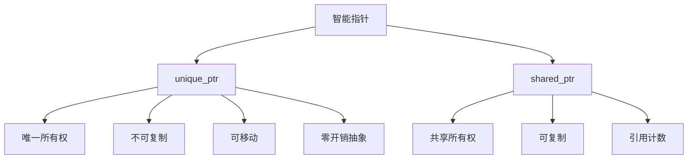

# C++ unique_ptr详解

## 什么是unique_ptr

`unique_ptr`是C++11标准引入的智能指针，它属于RAII（资源获取即初始化）设计理念的一部分，用于管理动态分配的资源。与传统的裸指针相比，`unique_ptr`能够自动管理内存，避免内存泄漏，并且体现了资源的唯一所有权概念。

:::tip
RAII(Resource Acquisition Is Initialization)是C++的一种资源管理技术，核心思想是将资源的生命周期与对象的生命周期绑定，通过构造函数获取资源，通过析构函数释放资源。
:::

## unique_ptr的核心特性

`unique_ptr`最重要的特性是**唯一所有权**，这意味着：

1. 某一时刻，只有一个`unique_ptr`可以拥有该资源
2. 当`unique_ptr`被销毁或重置时，它所管理的资源会被自动释放
3. `unique_ptr`**不允许复制**，但允许移动所有权

这些特性使`unique_ptr`成为管理独占资源的理想选择。

## 基本用法

### 1. 创建unique_ptr

```cpp
#include <iostream>
#include <memory> // 必须包含此头文件

int main() {
    // 创建管理int的unique_ptr
    std::unique_ptr<int> ptr1(new int(10));
    
    // C++14引入的更安全的创建方式
    std::unique_ptr<int> ptr2 = std::make_unique<int>(20);
    
    // 访问指针指向的值
    std::cout << "ptr1指向的值: " << *ptr1 << std::endl;
    std::cout << "ptr2指向的值: " << *ptr2 << std::endl;
    
    return 0;
}
```

**输出:**
```
ptr1指向的值: 10
ptr2指向的值: 20
```

:::caution
`std::make_unique`是C++14引入的，如果你使用C++11，则需要使用第一种方式创建unique_ptr。使用make_unique更安全，因为它能避免内存泄漏的可能性。
:::

### 2. 转移所有权（移动语义）

`unique_ptr`不能被复制，但可以被移动：

```cpp
#include <iostream>
#include <memory>

int main() {
    std::unique_ptr<int> ptr1 = std::make_unique<int>(100);
    
    // 以下代码会导致编译错误
    // std::unique_ptr<int> ptr2 = ptr1;  // 错误：不允许复制
    
    // 正确方式：使用std::move转移所有权
    std::unique_ptr<int> ptr2 = std::move(ptr1);
    
    // 此时ptr1不再拥有资源，变为nullptr
    if (ptr1 == nullptr) {
        std::cout << "ptr1现在是nullptr" << std::endl;
    }
    
    std::cout << "ptr2指向的值: " << *ptr2 << std::endl;
    
    return 0;
}
```

**输出:**
```
ptr1现在是nullptr
ptr2指向的值: 100
```

### 3. 重置和释放

```cpp
#include <iostream>
#include <memory>

int main() {
    std::unique_ptr<int> ptr = std::make_unique<int>(50);
    
    // 重置指针，释放当前资源，分配新资源
    ptr.reset(new int(100));
    std::cout << "重置后的值: " << *ptr << std::endl;
    
    // 释放所有权但不销毁对象，返回裸指针
    int* raw_ptr = ptr.release();
    
    // 此时ptr不再拥有资源
    if (ptr == nullptr) {
        std::cout << "ptr现在是nullptr" << std::endl;
    }
    
    std::cout << "原始指针的值: " << *raw_ptr << std::endl;
    
    // 注意：使用release后，需要手动删除原始指针
    delete raw_ptr;
    
    return 0;
}
```

**输出:**
```
重置后的值: 100
ptr现在是nullptr
原始指针的值: 100
```

## unique_ptr与数组

`unique_ptr`可以管理动态分配的数组，此时它会自动调用`delete[]`而非`delete`：

```cpp
#include <iostream>
#include <memory>

int main() {
    // 创建管理int数组的unique_ptr
    std::unique_ptr<int[]> array = std::make_unique<int[]>(5);
    
    // 为数组元素赋值
    for (int i = 0; i < 5; ++i) {
        array[i] = i * 10;
    }
    
    // 访问数组元素
    for (int i = 0; i < 5; ++i) {
        std::cout << "array[" << i << "] = " << array[i] << std::endl;
    }
    
    return 0;
}
```

**输出:**
```
array[0] = 0
array[1] = 10
array[2] = 20
array[3] = 30
array[4] = 40
```

## 自定义删除器

当需要管理非标准资源或执行特殊清理操作时，可以为`unique_ptr`提供自定义的删除器：

```cpp
#include <iostream>
#include <memory>
#include <fstream>

// 文件资源的自定义删除器
void file_deleter(std::FILE* fp) {
    if (fp) {
        std::fclose(fp);
        std::cout << "文件已关闭" << std::endl;
    }
}

int main() {
    // 使用自定义删除器的unique_ptr
    std::unique_ptr<std::FILE, decltype(&file_deleter)> 
        file_ptr(std::fopen("example.txt", "w"), file_deleter);
    
    if (file_ptr) {
        std::fputs("Hello, unique_ptr!", file_ptr.get());
        std::cout << "写入文件成功" << std::endl;
    }
    
    // 离开作用域时，file_ptr会自动调用file_deleter关闭文件
    return 0;
}
```

**输出:**
```
写入文件成功
文件已关闭
```

## unique_ptr在函数中的使用

### 1. 作为函数返回值

```cpp
#include <iostream>
#include <memory>
#include <string>

// 工厂函数，返回unique_ptr
std::unique_ptr<std::string> create_string(const char* text) {
    return std::make_unique<std::string>(text);
}

int main() {
    // 接收工厂函数返回的unique_ptr
    std::unique_ptr<std::string> message = create_string("Hello from factory function!");
    std::cout << *message << std::endl;
    
    return 0;
}
```

**输出:**
```
Hello from factory function!
```

### 2. 作为函数参数

```cpp
#include <iostream>
#include <memory>

// 接收unique_ptr的右值引用，获取所有权
void take_ownership(std::unique_ptr<int> ptr) {
    std::cout << "函数内部值: " << *ptr << std::endl;
    // 函数结束时，ptr自动释放
}

// 接收unique_ptr的引用，不获取所有权
void no_ownership(const std::unique_ptr<int>& ptr) {
    std::cout << "仅访问值: " << *ptr << std::endl;
    // 函数结束时，ptr不会被释放
}

int main() {
    auto ptr1 = std::make_unique<int>(100);
    no_ownership(ptr1);  // ptr1保持不变
    
    std::cout << "调用no_ownership后: " << *ptr1 << std::endl;
    
    // 移交所有权
    take_ownership(std::move(ptr1));
    
    // 此时ptr1为nullptr
    if (ptr1 == nullptr) {
        std::cout << "ptr1现在是nullptr" << std::endl;
    }
    
    return 0;
}
```

**输出:**
```
仅访问值: 100
调用no_ownership后: 100
函数内部值: 100
ptr1现在是nullptr
```

## 实际应用场景

### 场景1：资源管理类

```cpp
#include <iostream>
#include <memory>
#include <string>

class DatabaseConnection {
private:
    std::string connection_string;
    bool connected;
    
public:
    DatabaseConnection(const std::string& conn_str) 
        : connection_string(conn_str), connected(false) {
        std::cout << "创建数据库连接对象: " << connection_string << std::endl;
    }
    
    void connect() {
        // 模拟连接数据库
        connected = true;
        std::cout << "连接到数据库: " << connection_string << std::endl;
    }
    
    void execute_query(const std::string& query) {
        if (connected) {
            std::cout << "执行查询: " << query << std::endl;
        } else {
            std::cout << "错误：数据库未连接" << std::endl;
        }
    }
    
    ~DatabaseConnection() {
        if (connected) {
            std::cout << "关闭数据库连接: " << connection_string << std::endl;
        }
        std::cout << "销毁数据库连接对象" << std::endl;
    }
};

int main() {
    // 使用unique_ptr管理数据库连接
    std::unique_ptr<DatabaseConnection> db = 
        std::make_unique<DatabaseConnection>("server=localhost;database=testdb");
    
    db->connect();
    db->execute_query("SELECT * FROM users");
    
    // 无需手动关闭连接，unique_ptr会在作用域结束时自动处理
    return 0;
}
```

**输出:**
```
创建数据库连接对象: server=localhost;database=testdb
连接到数据库: server=localhost;database=testdb
执行查询: SELECT * FROM users
关闭数据库连接: server=localhost;database=testdb
销毁数据库连接对象
```

### 场景2：树形数据结构

```cpp
#include <iostream>
#include <memory>
#include <vector>
#include <string>

class TreeNode {
private:
    std::string value;
    std::vector<std::unique_ptr<TreeNode>> children;
    
public:
    TreeNode(const std::string& val) : value(val) {
        std::cout << "创建节点: " << value << std::endl;
    }
    
    void add_child(std::unique_ptr<TreeNode> child) {
        children.push_back(std::move(child));
    }
    
    void print(int depth = 0) const {
        std::string indent(depth * 2, ' ');
        std::cout << indent << value << std::endl;
        for (const auto& child : children) {
            child->print(depth + 1);
        }
    }
    
    ~TreeNode() {
        std::cout << "销毁节点: " << value << std::endl;
    }
};

int main() {
    // 创建树结构
    auto root = std::make_unique<TreeNode>("Root");
    
    auto child1 = std::make_unique<TreeNode>("Child 1");
    auto child2 = std::make_unique<TreeNode>("Child 2");
    
    auto grandchild1 = std::make_unique<TreeNode>("Grandchild 1");
    auto grandchild2 = std::make_unique<TreeNode>("Grandchild 2");
    
    // 构建树
    child1->add_child(std::move(grandchild1));
    child1->add_child(std::move(grandchild2));
    
    root->add_child(std::move(child1));
    root->add_child(std::move(child2));
    
    // 打印树
    std::cout << "\n树结构：\n";
    root->print();
    
    // 离开作用域时，整个树结构都会被正确清理
    return 0;
}
```

**输出:**
```
创建节点: Root
创建节点: Child 1
创建节点: Child 2
创建节点: Grandchild 1
创建节点: Grandchild 2

树结构：
Root
  Child 1
    Grandchild 1
    Grandchild 2
  Child 2
销毁节点: Root
销毁节点: Child 1
销毁节点: Grandchild 1
销毁节点: Grandchild 2
销毁节点: Child 2
```

## unique_ptr与shared_ptr的对比



| 特性 | unique_ptr | shared_ptr |
|------|------------|------------|
| 所有权 | 唯一 | 共享 |
| 复制 | 不允许 | 允许 |
| 移动 | 允许 | 允许 |
| 开销 | 几乎为零 | 引用计数的开销 |
| 适用场景 | 资源有明确的单一所有者 | 多个对象需要共享同一资源 |

## 最佳实践

1. **优先考虑unique_ptr**：除非需要共享所有权，否则应优先使用`unique_ptr`
2. **使用make_unique创建**：使用C++14引入的`std::make_unique`而不是直接使用`new`
3. **传参考不传对象**：当函数不需要获取所有权时，传递`const unique_ptr&`或原始指针`get()`
4. **返回unique_ptr**：工厂函数应返回`unique_ptr`
5. **使用std::move传递所有权**：显式使用`std::move`转移所有权
6. **避免使用release()除非必要**：使用`release()`后必须手动管理内存

## 总结

`unique_ptr`是C++现代内存管理的重要工具，它通过RAII原则实现了安全的资源管理，同时强制执行资源的唯一所有权概念。主要优点包括：

1. 自动资源释放，防止内存泄漏
2. 明确的所有权语义
3. 几乎零开销的抽象
4. 支持自定义删除器

通过本文的学习，你应该已经掌握了`unique_ptr`的基本使用方法和常见应用场景。在实际项目中，`unique_ptr`是替代裸指针的首选，尤其在需要动态分配内存但不需要共享资源的场景中。

## 练习

1. 创建一个使用`unique_ptr`管理动态分配对象的简单程序
2. 实现一个工厂函数，它返回`unique_ptr`
3. 创建一个类，其构造函数接受一个`unique_ptr`参数（通过移动语义）
4. 为文件句柄实现自定义删除器
5. 实现一个简单的对象池，使用`unique_ptr`管理池中的对象

## 进一步学习资源

- C++标准库文档中的[`std::unique_ptr`](https://en.cppreference.com/w/cpp/memory/unique_ptr)
- 《Effective Modern C++》by Scott Meyers，特别是关于智能指针的章节
- C++ Core Guidelines中关于[资源管理](https://isocpp.github.io/CppCoreGuidelines/CppCoreGuidelines#r-resource-management)的部分

通过这些资源和练习，你将能更深入地理解和熟练应用`unique_ptr`，从而写出更安全、更现代的C++代码。