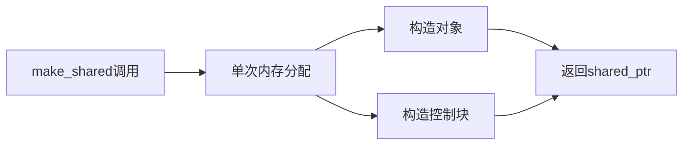

# C++ make_shared

## 什么是make_shared

`std::make_shared` 是C++11引入的一个函数模板，它提供了一种更安全、更高效的方式来创建 `std::shared_ptr` 对象。与直接使用 `shared_ptr` 构造函数相比，`make_shared` 能够在单次内存分配中同时创建对象和控制块，从而提高性能并减少内存碎片。

:::tip
`make_shared` 位于 `<memory>` 头文件中，使用前需要包含该头文件。
:::

## 基本用法

使用 `make_shared` 非常简单，它接受与目标类型构造函数相同的参数，并返回一个指向新创建对象的 `shared_ptr`。

```cpp
#include <iostream>
#include <memory>

int main() {
    // 创建一个指向整数的shared_ptr
    auto intPtr = std::make_shared<int>(42);
    std::cout << "整数值: " << *intPtr << std::endl;
    
    // 创建一个指向字符串的shared_ptr
    auto strPtr = std::make_shared<std::string>("Hello, make_shared!");
    std::cout << "字符串长度: " << strPtr->length() << std::endl;
    std::cout << "字符串内容: " << *strPtr << std::endl;
    
    return 0;
}
```

**输出**:
```
整数值: 42
字符串长度: 19
字符串内容: Hello, make_shared!
```

## make_shared 与直接构造 shared_ptr 的比较

让我们比较一下使用 `make_shared` 和直接构造 `shared_ptr` 的两种方式：

```cpp
// 方式1: 使用make_shared
auto ptr1 = std::make_shared<MyClass>(arg1, arg2);

// 方式2: 直接使用shared_ptr构造函数
auto ptr2 = std::shared_ptr<MyClass>(new MyClass(arg1, arg2));
```

虽然这两种方法都能创建 `shared_ptr`，但 `make_shared` 具有以下优势：

1. **单次内存分配**：`make_shared` 只进行一次内存分配，同时分配对象和控制块。而直接构造 `shared_ptr` 需要两次独立的内存分配。

2. **异常安全性**：直接构造方式存在潜在的内存泄漏风险，特别是在以下场景：

```cpp
function(std::shared_ptr<MyClass>(new MyClass()), function_that_might_throw());
```

如果 `function_that_might_throw()` 抛出异常，`new MyClass()` 创建的对象可能泄漏。而使用 `make_shared` 则不会有这个问题。

## 内部工作原理



当使用 `make_shared` 时，它会：

1. 计算需要分配的总内存大小（对象大小 + 控制块大小）
2. 分配一块连续的内存
3. 在这块内存中构造目标对象
4. 在同一块内存中创建控制块（引用计数等信息）
5. 返回指向该对象的 `shared_ptr`

## 常见用例

### 创建普通对象

```cpp
// 创建一个整数
auto intPtr = std::make_shared<int>(42);

// 创建一个字符串
auto strPtr = std::make_shared<std::string>("Hello, world!");
```

### 创建数组（C++20起支持）

```cpp
// C++20中的新功能：创建共享数组
auto arrPtr = std::make_shared<int[]>(10); // 创建大小为10的int数组
for (int i = 0; i < 10; ++i) {
    arrPtr[i] = i * i;
}
```

### 创建自定义类对象

```cpp
class Person {
public:
    Person(std::string name, int age) : name_(std::move(name)), age_(age) {
        std::cout << "构造Person: " << name_ << std::endl;
    }
    
    ~Person() {
        std::cout << "销毁Person: " << name_ << std::endl;
    }
    
    void introduce() const {
        std::cout << "我是 " << name_ << "，今年 " << age_ << " 岁。" << std::endl;
    }
    
private:
    std::string name_;
    int age_;
};

int main() {
    // 创建一个Person对象
    auto person = std::make_shared<Person>("张三", 25);
    person->introduce();
    
    // 作用域结束时，shared_ptr引用计数归零，自动释放内存
    return 0;
}
```

**输出**:
```
构造Person: 张三
我是 张三，今年 25 岁。
销毁Person: 张三
```

## 实际应用场景

### 工厂模式实现

```cpp
class Product {
public:
    virtual void use() = 0;
    virtual ~Product() = default;
};

class ConcreteProductA : public Product {
public:
    void use() override {
        std::cout << "使用产品A" << std::endl;
    }
};

class ConcreteProductB : public Product {
public:
    void use() override {
        std::cout << "使用产品B" << std::endl;
    }
};

// 工厂类
class Factory {
public:
    static std::shared_ptr<Product> createProduct(const std::string& type) {
        if (type == "A") {
            return std::make_shared<ConcreteProductA>();
        } else if (type == "B") {
            return std::make_shared<ConcreteProductB>();
        }
        return nullptr;
    }
};

// 使用
void clientCode() {
    auto productA = Factory::createProduct("A");
    if (productA) {
        productA->use();
    }
    
    auto productB = Factory::createProduct("B");
    if (productB) {
        productB->use();
    }
}
```

### 对象容器管理

```cpp
#include <iostream>
#include <memory>
#include <vector>
#include <string>

class Task {
public:
    Task(std::string name) : name_(std::move(name)) {}
    
    void execute() {
        std::cout << "执行任务: " << name_ << std::endl;
    }
    
private:
    std::string name_;
};

class TaskManager {
public:
    void addTask(const std::string& name) {
        tasks_.push_back(std::make_shared<Task>(name));
    }
    
    void executeTasks() {
        std::cout << "开始执行所有任务..." << std::endl;
        for (const auto& task : tasks_) {
            task->execute();
        }
        std::cout << "所有任务执行完毕!" << std::endl;
    }
    
private:
    std::vector<std::shared_ptr<Task>> tasks_;
};

int main() {
    TaskManager manager;
    manager.addTask("数据备份");
    manager.addTask("文件同步");
    manager.addTask("垃圾清理");
    
    manager.executeTasks();
    
    return 0;
}
```

**输出**:
```
开始执行所有任务...
执行任务: 数据备份
执行任务: 文件同步
执行任务: 垃圾清理
所有任务执行完毕!
```

## make_shared 的限制

尽管 `make_shared` 很强大，但它也有一些限制：

1. **无法使用自定义删除器**：如果需要自定义删除器，必须使用 `shared_ptr` 的构造函数：

```cpp
auto ptr = std::shared_ptr<MyClass>(new MyClass(), 
                                   [](MyClass* p) { 
                                       // 自定义删除操作
                                       custom_delete(p); 
                                   });
```

2. **内存释放延迟**：当使用 `make_shared` 时，对象内存和控制块内存是一起分配的。如果有 `weak_ptr` 引用这个控制块，即使 `shared_ptr` 计数归零，对象的内存也不会被释放，直到所有 `weak_ptr` 也过期。

3. **C++17之前不支持数组**：在C++17之前，`make_shared` 不支持创建数组。C++20才完全支持数组版本。

## 性能对比

下面是一个简单的性能对比示例，展示 `make_shared` 的性能优势：

```cpp
#include <iostream>
#include <memory>
#include <chrono>
#include <vector>

class BigObject {
    int data[100]; // 一些数据
};

int main() {
    const int iterations = 1000000;
    
    // 测量make_shared的性能
    auto start1 = std::chrono::high_resolution_clock::now();
    
    for (int i = 0; i < iterations; ++i) {
        auto ptr = std::make_shared<BigObject>();
    }
    
    auto end1 = std::chrono::high_resolution_clock::now();
    std::chrono::duration<double, std::milli> time1 = end1 - start1;
    
    // 测量直接构造shared_ptr的性能
    auto start2 = std::chrono::high_resolution_clock::now();
    
    for (int i = 0; i < iterations; ++i) {
        auto ptr = std::shared_ptr<BigObject>(new BigObject());
    }
    
    auto end2 = std::chrono::high_resolution_clock::now();
    std::chrono::duration<double, std::milli> time2 = end2 - start2;
    
    std::cout << "make_shared 用时: " << time1.count() << " 毫秒" << std::endl;
    std::cout << "直接构造 用时: " << time2.count() << " 毫秒" << std::endl;
    std::cout << "性能提升: " << (time2.count() / time1.count()) << "倍" << std::endl;
    
    return 0;
}
```

:::note
实际运行结果会因系统、编译器和硬件而异，但通常 `make_shared` 会比直接构造快 10%-30%。
:::

## 最佳实践

- 在大多数情况下，优先使用 `make_shared` 而非直接构造 `shared_ptr`。
- 如果需要自定义删除器或其他特殊需求，可以使用 `shared_ptr` 构造函数。
- 避免循环引用，即使使用 `make_shared`，循环引用仍然会导致内存泄漏。
- 了解 `make_shared` 和控制块内存释放的特性，特别是当使用 `weak_ptr` 时。

## 总结

`std::make_shared` 是创建 `shared_ptr` 的推荐方式，它提供了以下优势：

1. 单次内存分配，提高性能
2. 更好的异常安全性
3. 更简洁的代码

虽然有一些限制，但在大多数情况下，使用 `make_shared` 是明智的选择。通过合理使用 `make_shared`，你可以编写更高效、更安全的代码。

## 练习

1. 使用 `make_shared` 创建一个存储学生信息的智能指针数组，并实现添加、删除和查找功能。
2. 比较在大型项目中使用 `make_shared` 和直接构造 `shared_ptr` 的性能差异。
3. 实现一个简单的观察者模式，使用 `make_shared` 管理观察者对象。

## 扩展阅读

- C++17中的 `std::make_shared` 改进
- C++20中新增的数组支持
- 智能指针的内存管理机制
- 控制块内部结构和工作原理