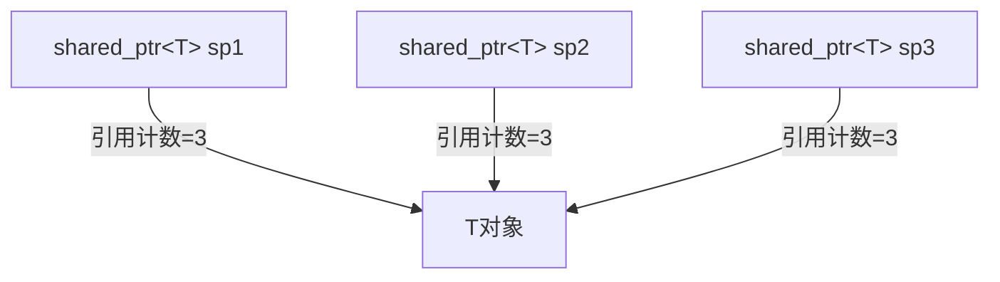
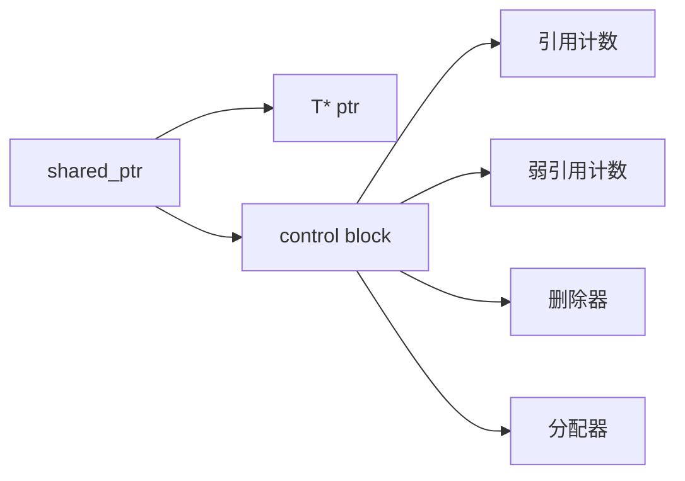

# C++ shared_ptr详解

## 什么是shared_ptr

`std::shared_ptr`是C++11引入的智能指针类型，它实现了引用计数的共享所有权概念。多个`shared_ptr`实例可以指向同一个对象，当最后一个指向该对象的`shared_ptr`被销毁或重置时，该对象会被自动删除。

:::note
`shared_ptr`定义在`<memory>`头文件中，属于`std`命名空间。
:::



## shared_ptr的基本用法

### 创建shared_ptr

有多种方式可以创建`shared_ptr`：

```cpp
#include <iostream>
#include <memory>

int main() {
    // 方式1：使用std::make_shared创建(推荐)
    std::shared_ptr<int> sp1 = std::make_shared<int>(42);
    
    // 方式2：从原始指针创建
    int* rawPtr = new int(100);
    std::shared_ptr<int> sp2(rawPtr);
    
    // 方式3：从nullptr创建空的shared_ptr
    std::shared_ptr<int> sp3 = nullptr;
    
    // 方式4：使用复制构造函数
    std::shared_ptr<int> sp4 = sp1;
    
    std::cout << "sp1值: " << *sp1 << ", 引用计数: " << sp1.use_count() << std::endl;
    std::cout << "sp4值: " << *sp4 << ", 引用计数: " << sp4.use_count() << std::endl;
    
    return 0;
}
```

输出:
```
sp1值: 42, 引用计数: 2
sp4值: 42, 引用计数: 2
```

:::tip
**强烈推荐使用`std::make_shared`**创建`shared_ptr`，它比直接使用构造函数更高效，因为它只分配一次内存（同时为引用计数和对象分配内存）。
:::

### 常用操作

`shared_ptr`提供了许多有用的操作：

```cpp
#include <iostream>
#include <memory>

int main() {
    // 创建shared_ptr
    auto sp = std::make_shared<int>(100);
    
    // 获取引用计数
    std::cout << "引用计数: " << sp.use_count() << std::endl;  // 输出: 1
    
    // 创建一个共享所有权的shared_ptr
    auto sp2 = sp;
    std::cout << "共享后引用计数: " << sp.use_count() << std::endl;  // 输出: 2
    
    // 访问指向的对象
    *sp = 200;
    std::cout << "修改后的值: " << *sp2 << std::endl;  // 输出: 200
    
    // 检查是否为空
    if(sp) {
        std::cout << "sp不为空" << std::endl;
    }
    
    // 重置shared_ptr
    sp.reset();  // sp现在为空
    std::cout << "sp1重置后，sp2引用计数: " << sp2.use_count() << std::endl;  // 输出: 1
    
    if(!sp) {
        std::cout << "sp已经为空" << std::endl;
    }
    
    // 使用reset创建新对象
    sp.reset(new int(300));
    std::cout << "sp重新指向新对象: " << *sp << std::endl;
    std::cout << "sp2仍然指向原对象: " << *sp2 << std::endl;
    
    return 0;
}
```

输出：
```
引用计数: 1
共享后引用计数: 2
修改后的值: 200
sp不为空
sp1重置后，sp2引用计数: 1
sp已经为空
sp重新指向新对象: 300
sp2仍然指向原对象: 200
```

## shared_ptr的内部实现原理

`shared_ptr`内部包含两个指针：
1. 一个指向管理的对象
2. 一个指向控制块（包含引用计数、弱引用计数和删除器等信息）



当引用计数降为0时，管理的对象会被删除，但控制块可能因为存在`weak_ptr`而保留。只有当弱引用计数也降为0时，控制块才会被删除。

## 使用shared_ptr的注意事项

### 避免循环引用

`shared_ptr`最常见的问题是循环引用（circular reference），这会导致内存泄漏。

```cpp
#include <iostream>
#include <memory>

class B; // 前向声明

class A {
public:
    std::shared_ptr<B> b_ptr;
    ~A() { std::cout << "A被销毁" << std::endl; }
};

class B {
public:
    std::shared_ptr<A> a_ptr;
    ~B() { std::cout << "B被销毁" << std::endl; }
};

int main() {
    {
        auto a = std::make_shared<A>();
        auto b = std::make_shared<B>();
        
        // 创建循环引用
        a->b_ptr = b;
        b->a_ptr = a;
        
        std::cout << "a引用计数: " << a.use_count() << std::endl;  // 输出: 2
        std::cout << "b引用计数: " << b.use_count() << std::endl;  // 输出: 2
    }
    // 这里应该销毁a和b，但它们不会被销毁，因为循环引用导致引用计数始终为1
    std::cout << "离开作用域" << std::endl;
    
    return 0;
}
```

输出：
```
a引用计数: 2
b引用计数: 2
离开作用域
```

注意：`A被销毁`和`B被销毁`的消息没有输出，表明对象没有被销毁，发生了内存泄漏。

:::caution
解决循环引用问题，通常使用`std::weak_ptr`，我们会在后续文章中详细介绍。
:::

### 避免从原始指针创建多个shared_ptr

从同一个原始指针创建多个`shared_ptr`会导致多次删除同一块内存的问题：

```cpp
#include <iostream>
#include <memory>

int main() {
    int* rawPtr = new int(42);
    
    // 错误用法：从同一原始指针创建多个shared_ptr
    std::shared_ptr<int> sp1(rawPtr);
    std::shared_ptr<int> sp2(rawPtr); // 危险！
    
    std::cout << "sp1引用计数: " << sp1.use_count() << std::endl; // 输出: 1
    std::cout << "sp2引用计数: " << sp2.use_count() << std::endl; // 输出: 1
    
    // 当sp1和sp2离开作用域时，都会尝试删除同一个int对象，导致未定义行为
    
    return 0;
}
```

:::warning
上面的代码是错误的！当`sp1`和`sp2`离开作用域时，同一块内存会被释放两次，这会导致未定义行为。
:::

### 正确的做法：

```cpp
#include <iostream>
#include <memory>

int main() {
    // 好的做法1：使用make_shared
    auto sp1 = std::make_shared<int>(42);
    
    // 好的做法2：使用已存在的shared_ptr创建新的shared_ptr
    auto sp2 = sp1;
    
    std::cout << "引用计数: " << sp1.use_count() << std::endl; // 输出: 2
    
    return 0;
}
```

## 自定义删除器

有时候我们需要在释放资源时执行特定的操作，这时可以使用自定义删除器：

```cpp
#include <iostream>
#include <memory>
#include <fstream>

void closeFile(std::FILE* fp) {
    std::cout << "关闭文件" << std::endl;
    std::fclose(fp);
}

int main() {
    // 使用lambda作为自定义删除器
    {
        std::shared_ptr<int> sp(new int[10], [](int* p) {
            std::cout << "使用delete[]删除数组" << std::endl;
            delete[] p;
        });
    }  // 离开作用域时会打印消息并删除数组
    
    // 使用函数作为自定义删除器
    {
        FILE* fp = std::fopen("test.txt", "w");
        std::shared_ptr<FILE> filePtr(fp, closeFile);
        // 使用文件...
    }  // 离开作用域时会调用closeFile函数
    
    return 0;
}
```

输出:
```
使用delete[]删除数组
关闭文件
```

## 性能考虑

使用`shared_ptr`会带来一些运行时开销：

1. 对象大小：`shared_ptr`通常是原始指针的两倍大（包含指向对象的指针和指向控制块的指针）
2. 控制块分配：除非使用`make_shared`，否则需要额外的堆分配
3. 引用计数操作：每次复制、赋值或销毁都需要原子操作来修改引用计数

但`shared_ptr`的好处通常超过这些开销：它可以防止内存泄漏和悬垂指针问题。

## 实际应用场景

### 1. 缓存实现

```cpp
#include <iostream>
#include <memory>
#include <unordered_map>
#include <string>

class ExpensiveObject {
public:
    ExpensiveObject(int id) : id_(id) {
        std::cout << "创建昂贵对象 " << id_ << std::endl;
    }
    
    ~ExpensiveObject() {
        std::cout << "销毁昂贵对象 " << id_ << std::endl;
    }
    
    void doSomething() {
        std::cout << "使用对象 " << id_ << std::endl;
    }
    
private:
    int id_;
};

class ObjectCache {
public:
    std::shared_ptr<ExpensiveObject> getObject(int id) {
        auto it = cache_.find(id);
        if (it == cache_.end()) {
            // 创建新对象并加入缓存
            auto obj = std::make_shared<ExpensiveObject>(id);
            cache_[id] = obj;
            return obj;
        }
        std::cout << "从缓存获取对象 " << id << std::endl;
        return it->second;
    }
    
private:
    std::unordered_map<int, std::shared_ptr<ExpensiveObject>> cache_;
};

int main() {
    ObjectCache cache;
    
    {
        auto obj1 = cache.getObject(1);  // 创建新对象
        obj1->doSomething();
    }  // obj1离开作用域，但对象仍在缓存中
    
    {
        auto obj1_again = cache.getObject(1);  // 从缓存获取
        auto obj2 = cache.getObject(2);  // 创建新对象
        obj1_again->doSomething();
        obj2->doSomething();
    }  // 离开作用域，但对象仍在缓存中
    
    return 0;  // 程序结束，缓存销毁，所有对象被删除
}
```

输出:
```
创建昂贵对象 1
使用对象 1
从缓存获取对象 1
创建昂贵对象 2
使用对象 1
使用对象 2
销毁昂贵对象 1
销毁昂贵对象 2
```

### 2. 观察者模式

```cpp
#include <iostream>
#include <memory>
#include <vector>
#include <algorithm>
#include <string>

// 前向声明
class Observer;

// 被观察主题
class Subject {
public:
    void attach(std::shared_ptr<Observer> observer) {
        observers_.push_back(observer);
    }
    
    void detach(std::shared_ptr<Observer> observer) {
        observers_.erase(
            std::remove_if(observers_.begin(), observers_.end(),
                [observer](std::weak_ptr<Observer> o) {
                    return o.lock() == observer;
                }
            ),
            observers_.end()
        );
    }
    
    void notify(const std::string& message);
    
private:
    std::vector<std::weak_ptr<Observer>> observers_;  // 使用weak_ptr避免循环引用
};

// 观察者接口
class Observer {
public:
    virtual ~Observer() {}
    virtual void update(Subject* subject, const std::string& message) = 0;
};

void Subject::notify(const std::string& message) {
    for (auto it = observers_.begin(); it != observers_.end();) {
        if (auto observer = it->lock()) {
            observer->update(this, message);
            ++it;
        } else {
            // 观察者已被销毁，移除弱引用
            it = observers_.erase(it);
        }
    }
}

// 具体观察者
class ConcreteObserver : public Observer {
public:
    ConcreteObserver(const std::string& name) : name_(name) {}
    
    ~ConcreteObserver() {
        std::cout << "观察者 " << name_ << " 被销毁" << std::endl;
    }
    
    void update(Subject* subject, const std::string& message) override {
        std::cout << "观察者 " << name_ << " 收到消息: " << message << std::endl;
    }
    
private:
    std::string name_;
};

int main() {
    Subject subject;
    
    // 创建观察者
    auto observer1 = std::make_shared<ConcreteObserver>("Observer1");
    auto observer2 = std::make_shared<ConcreteObserver>("Observer2");
    
    // 添加观察者
    subject.attach(observer1);
    subject.attach(observer2);
    
    // 通知所有观察者
    subject.notify("Hello World");
    
    // 移除一个观察者
    subject.detach(observer1);
    
    // 再次通知
    subject.notify("Hello Again");
    
    return 0;
}
```

输出:
```
观察者 Observer1 收到消息: Hello World
观察者 Observer2 收到消息: Hello World
观察者 Observer2 收到消息: Hello Again
观察者 Observer1 被销毁
观察者 Observer2 被销毁
```

## 总结

`std::shared_ptr`是C++中的共享所有权智能指针，它通过引用计数机制自动管理动态分配的内存。主要特点包括：

1. 多个`shared_ptr`可以共享同一个对象的所有权
2. 当最后一个`shared_ptr`离开作用域，对象被自动删除
3. 可以安全地在容器中存储，也可以安全地作为函数参数传递
4. 支持自定义删除器
5. 需要注意避免循环引用问题

### 最佳实践

- 优先使用`std::make_shared`创建`shared_ptr`
- 避免从原始指针创建多个`shared_ptr`
- 使用`std::weak_ptr`打破循环引用
- 不要用`shared_ptr`管理没有分配在堆上的对象
- 考虑使用`unique_ptr`替代`shared_ptr`，除非确实需要共享所有权

## 练习

1. 创建一个使用`shared_ptr`管理的简单链表，节点之间可以安全地共享
2. 实现一个简单的资源池，使用`shared_ptr`和自定义删除器来管理资源
3. 修正一个包含循环引用的程序，使用`weak_ptr`解决内存泄漏问题
4. 构建一个线程安全的共享缓存，使用`shared_ptr`实现

## 延伸阅读

- C++ `weak_ptr`详解
- C++ `unique_ptr`详解
- C++智能指针对比与选择
- 引用计数与垃圾回收