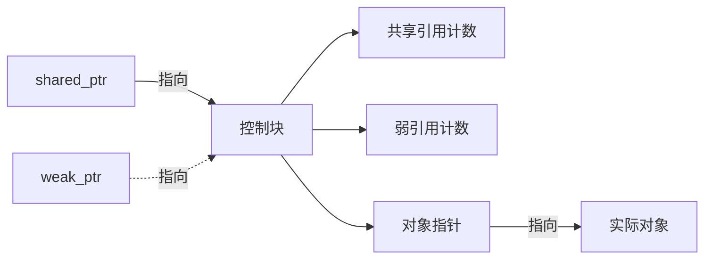

# C++ weak_ptr详解

在C++智能指针家族中，`weak_ptr`可能是最容易被误解和忽视的一员。然而，它在解决某些特定问题（尤其是循环引用问题）时扮演着不可替代的角色。本文将全面介绍`weak_ptr`的概念、用法和应用场景，帮助初学者彻底理解这个重要的工具。

## weak_ptr的基本概念

`weak_ptr`是C++11标准库中引入的一种智能指针，它是`shared_ptr`的助手而非替代品。`weak_ptr`最关键的特性是：

- 它**不拥有**它所指向的对象
- 它**不影响**对象的引用计数
- 它不能直接访问对象，必须先转换为`shared_ptr`

`weak_ptr`就像一个"旁观者"，它可以观察`shared_ptr`所管理的对象，但不参与对象生命周期的管理。

:::tip
你可以将`weak_ptr`理解为一个对象的"弱引用"，它不会阻止对象被销毁。
:::

## weak_ptr的基本用法

### 创建weak_ptr

`weak_ptr`通常从一个`shared_ptr`创建：

```cpp
#include <iostream>
#include <memory>

int main() {
    // 创建一个shared_ptr
    std::shared_ptr<int> sp = std::make_shared<int>(42);
    
    // 从shared_ptr创建weak_ptr
    std::weak_ptr<int> wp = sp;
    
    std::cout << "shared_ptr引用计数: " << sp.use_count() << std::endl;
    
    return 0;
}
```

输出：
```
shared_ptr引用计数: 1
```

注意创建`weak_ptr`后，`shared_ptr`的引用计数没有增加。

### 使用weak_ptr

由于`weak_ptr`不能直接访问所指向的对象，我们需要先将其转换为`shared_ptr`：

```cpp
#include <iostream>
#include <memory>

int main() {
    std::shared_ptr<int> sp = std::make_shared<int>(42);
    std::weak_ptr<int> wp = sp;
    
    // 检查weak_ptr是否过期
    if (!wp.expired()) {
        // 将weak_ptr转换为shared_ptr
        std::shared_ptr<int> sp2 = wp.lock();
        if (sp2) {
            std::cout << "值: " << *sp2 << std::endl;
            std::cout << "引用计数: " << sp2.use_count() << std::endl;
        }
    } else {
        std::cout << "weak_ptr已过期" << std::endl;
    }
    
    return 0;
}
```

输出：
```
值: 42
引用计数: 2
```

### 检查weak_ptr是否过期

当`weak_ptr`指向的对象已被销毁时，我们称这个`weak_ptr`为"过期"(expired)的：

```cpp
#include <iostream>
#include <memory>

int main() {
    std::weak_ptr<int> wp;
    
    {
        auto sp = std::make_shared<int>(42);
        wp = sp;
        
        std::cout << "wp过期了吗？" << (wp.expired() ? "是" : "否") << std::endl;
    } // sp离开作用域，对象被销毁
    
    std::cout << "现在wp过期了吗？" << (wp.expired() ? "是" : "否") << std::endl;
    
    // 尝试获取已过期的weak_ptr
    if (auto sp = wp.lock()) {
        std::cout << "wp有效: " << *sp << std::endl;
    } else {
        std::cout << "wp已过期，无法获取值" << std::endl;
    }
    
    return 0;
}
```

输出：
```
wp过期了吗？否
现在wp过期了吗？是
wp已过期，无法获取值
```

## weak_ptr解决循环引用问题

`weak_ptr`最常见的用途是解决`shared_ptr`的循环引用问题。当两个对象通过`shared_ptr`互相引用时，会导致引用计数永不为0，从而造成内存泄漏。

### 循环引用问题示例

```cpp
#include <iostream>
#include <memory>

class B; // 前向声明

class A {
public:
    std::shared_ptr<B> b_ptr;
    
    A() { std::cout << "A构造函数" << std::endl; }
    ~A() { std::cout << "A析构函数" << std::endl; }
};

class B {
public:
    std::shared_ptr<A> a_ptr;
    
    B() { std::cout << "B构造函数" << std::endl; }
    ~B() { std::cout << "B析构函数" << std::endl; }
};

int main() {
    std::cout << "创建对象..." << std::endl;
    {
        auto a = std::make_shared<A>();
        auto b = std::make_shared<B>();
        
        // 创建循环引用
        a->b_ptr = b;
        b->a_ptr = a;
        
        std::cout << "a引用计数: " << a.use_count() << std::endl;
        std::cout << "b引用计数: " << b.use_count() << std::endl;
    } // a和b离开作用域
    
    std::cout << "程序结束" << std::endl;
    return 0;
}
```

输出：
```
创建对象...
A构造函数
B构造函数
a引用计数: 2
b引用计数: 2
程序结束
```

注意，A和B的析构函数没有被调用，这表明对象没有被正确释放，发生了内存泄漏。

### 使用weak_ptr解决循环引用

```cpp
#include <iostream>
#include <memory>

class B; // 前向声明

class A {
public:
    std::shared_ptr<B> b_ptr;
    
    A() { std::cout << "A构造函数" << std::endl; }
    ~A() { std::cout << "A析构函数" << std::endl; }
};

class B {
public:
    std::weak_ptr<A> a_ptr; // 改为weak_ptr
    
    B() { std::cout << "B构造函数" << std::endl; }
    ~B() { std::cout << "B析构函数" << std::endl; }
};

int main() {
    std::cout << "创建对象..." << std::endl;
    {
        auto a = std::make_shared<A>();
        auto b = std::make_shared<B>();
        
        // 创建引用关系，但不再是循环引用
        a->b_ptr = b;
        b->a_ptr = a;
        
        std::cout << "a引用计数: " << a.use_count() << std::endl;
        std::cout << "b引用计数: " << b.use_count() << std::endl;
        
        // 使用B中的weak_ptr
        if (auto a_sp = b->a_ptr.lock()) {
            std::cout << "B可以访问A" << std::endl;
        }
    } // a和b离开作用域
    
    std::cout << "程序结束" << std::endl;
    return 0;
}
```

输出：
```
创建对象...
A构造函数
B构造函数
a引用计数: 1
b引用计数: 2
B可以访问A
A析构函数
B析构函数
程序结束
```

通过将其中一个`shared_ptr`改为`weak_ptr`，我们打破了循环引用，两个对象都能被正确释放。

## weak_ptr在观察者模式中的应用

`weak_ptr`非常适合实现观察者模式，因为主题对象不需要保持观察者的所有权：

```cpp
#include <iostream>
#include <memory>
#include <vector>
#include <algorithm>

class Observer;

// 主题类
class Subject {
private:
    int value;
    // 存储观察者的weak_ptr
    std::vector<std::weak_ptr<Observer>> observers;
    
public:
    Subject() : value(0) {}
    
    // 添加观察者
    void addObserver(std::shared_ptr<Observer> observer) {
        observers.push_back(observer);
    }
    
    // 移除过期的观察者
    void cleanExpiredObservers() {
        observers.erase(
            std::remove_if(observers.begin(), observers.end(),
                [](const std::weak_ptr<Observer>& o) { return o.expired(); }),
            observers.end()
        );
    }
    
    // 设置值并通知观察者
    void setValue(int v);
};

// 观察者接口
class Observer {
public:
    virtual void update(int value) = 0;
    virtual ~Observer() {}
};

// 具体观察者
class ConcreteObserver : public Observer {
private:
    std::string name;
    std::weak_ptr<Subject> subject; // 不要保持主题的强引用
    
public:
    ConcreteObserver(const std::string& n, std::shared_ptr<Subject> s)
        : name(n), subject(s) {}
    
    void update(int value) override {
        std::cout << name << " 收到更新: " << value << std::endl;
    }
    
    ~ConcreteObserver() {
        std::cout << name << " 被销毁" << std::endl;
    }
};

// 实现Subject的setValue方法
void Subject::setValue(int v) {
    value = v;
    
    // 清理过期观察者
    cleanExpiredObservers();
    
    // 通知所有观察者
    for (auto& wo : observers) {
        if (auto observer = wo.lock()) {
            observer->update(value);
        }
    }
}

int main() {
    // 创建主题
    auto subject = std::make_shared<Subject>();
    
    // 创建观察者
    {
        auto observer1 = std::make_shared<ConcreteObserver>("Observer1", subject);
        subject->addObserver(observer1);
        
        {
            auto observer2 = std::make_shared<ConcreteObserver>("Observer2", subject);
            subject->addObserver(observer2);
            
            // 设置值，通知所有观察者
            subject->setValue(42);
        } // observer2离开作用域被销毁
        
        // 再次设置值
        subject->setValue(100);
    } // observer1离开作用域被销毁
    
    // 所有观察者都已销毁
    subject->setValue(200); // 不会有任何通知
    
    return 0;
}
```

输出：
```
Observer1 收到更新: 42
Observer2 收到更新: 42
Observer2 被销毁
Observer1 收到更新: 100
Observer1 被销毁
```

在这个例子中，`Subject`使用`weak_ptr`存储观察者引用，这样当观察者被销毁时，`Subject`不会阻止这种销毁。同时，`Observer`也使用`weak_ptr`引用`Subject`，避免循环引用。

## weak_ptr与shared_ptr性能比较

虽然`weak_ptr`有很多优点，但它也有一些性能开销。理解这些开销有助于我们在适当的场景下使用它：

```cpp
#include <iostream>
#include <memory>
#include <chrono>

const int ITERATIONS = 10000000;

void testSharedPtr() {
    auto start = std::chrono::high_resolution_clock::now();
    
    std::shared_ptr<int> sp = std::make_shared<int>(42);
    
    for (int i = 0; i < ITERATIONS; ++i) {
        std::shared_ptr<int> copy = sp;
        volatile int value = *copy;
    }
    
    auto end = std::chrono::high_resolution_clock::now();
    std::chrono::duration<double, std::milli> duration = end - start;
    std::cout << "shared_ptr访问时间: " << duration.count() << "ms" << std::endl;
}

void testWeakPtr() {
    auto start = std::chrono::high_resolution_clock::now();
    
    std::shared_ptr<int> sp = std::make_shared<int>(42);
    std::weak_ptr<int> wp = sp;
    
    for (int i = 0; i < ITERATIONS; ++i) {
        if (auto lockedPtr = wp.lock()) {
            volatile int value = *lockedPtr;
        }
    }
    
    auto end = std::chrono::high_resolution_clock::now();
    std::chrono::duration<double, std::milli> duration = end - start;
    std::cout << "weak_ptr访问时间: " << duration.count() << "ms" << std::endl;
}

int main() {
    testSharedPtr();
    testWeakPtr();
    return 0;
}
```

执行这段代码，你会发现`weak_ptr`的访问开销通常比`shared_ptr`大，这是因为每次`lock()`操作都需要原子操作来检查对象是否已被销毁。

:::caution
`weak_ptr`适用于不频繁访问但需要检查对象是否存在的场景。对于频繁访问的代码路径，应考虑其他替代方案。
:::

## weak_ptr最佳实践

### 1. 何时使用weak_ptr

- 解决循环引用问题
- 实现观察者模式
- 管理临时拥有/共享对象的场景
- 缓存系统中实现自动清理过期资源

### 2. 安全使用weak_ptr

```cpp
// 推荐的使用方式
if (auto sp = weakPtr.lock()) {
    // 使用sp...
} else {
    // 对象已不存在，执行备用逻辑
}

// 不推荐
auto sp = weakPtr.lock();  // 没有检查sp是否有效
*sp = 42;  // 可能导致空指针解引用
```

### 3. 使用expired()与lock()的区别

虽然可以先调用`expired()`检查，再调用`lock()`获取`shared_ptr`，但这可能导致时序问题：

```cpp
// 不安全的使用方式
if (!wp.expired()) {
    // 此时对象可能被销毁
    std::shared_ptr<T> sp = wp.lock();  // sp可能为空
    // 使用sp...
}

// 安全的使用方式
if (auto sp = wp.lock()) {
    // 使用sp...
}
```

直接使用`lock()`可以原子地执行检查和获取操作，更安全。

## weak_ptr内部工作原理

要真正理解`weak_ptr`，需要了解它的内部工作原理：



`shared_ptr`和`weak_ptr`共享同一个控制块，但控制块维护两个计数：
- **共享引用计数**：跟踪指向对象的`shared_ptr`数量
- **弱引用计数**：跟踪指向对象的`weak_ptr`数量

当共享引用计数变为0时，对象被销毁，但控制块仍存在。只有当弱引用计数也变为0时，控制块才被销毁。

## 小结

`weak_ptr`是C++智能指针家族中的重要一员，它解决了`shared_ptr`在特定场景下的局限性：

1. **解决循环引用**：防止对象因互相引用而无法释放
2. **表达"临时所有权"**：可以观察对象但不延长其生命周期
3. **实现回调和观察者模式**：避免悬空指针问题

虽然`weak_ptr`不能直接访问所指向的对象，需要通过`lock()`函数转换为`shared_ptr`，但这种设计正是它的优势——它强制开发者检查对象是否仍然存在。

## 练习

1. 创建一个缓存系统，使用`weak_ptr`存储缓存项，当对象不再被系统其他部分引用时自动从缓存中移除。

2. 修改观察者模式示例，添加一个方法允许观察者主动取消订阅。

3. 实现一个简单的事件系统，使用`weak_ptr`存储事件处理器，确保当处理器对象被销毁时不会导致系统崩溃。

## 进一步阅读

- C++标准库文档中关于[`weak_ptr`](https://en.cppreference.com/w/cpp/memory/weak_ptr)的详细说明
- Scott Meyers的《Effective Modern C++》，特别是关于智能指针的章节
- Herb Sutter的文章"[Guru of the Week: Smart Pointers](http://www.gotw.ca/gotw/)"

通过掌握`weak_ptr`，你的智能指针知识工具箱将更加完整，能够处理更多复杂的内存管理场景。