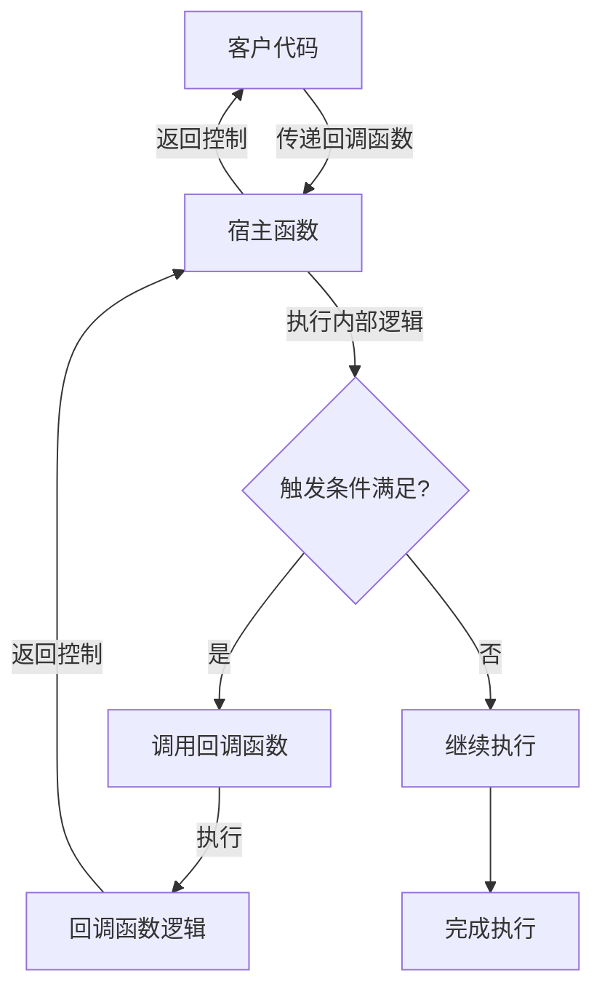

# C++ 回调函数

在C++编程中，回调函数是一种强大的编程技术，允许我们将函数作为参数传递给其他函数。这种机制使代码更加灵活和模块化，能够在不同的场景下重用代码。本文将全面介绍C++回调函数的概念、实现方法、常见应用场景以及最佳实践。

## 什么是回调函数？

回调函数是一个被作为参数传递给另一个函数（称为"宿主函数"）的函数，宿主函数在某一时刻会"回调"（调用）这个传入的函数。通过回调机制，我们可以自定义宿主函数在特定事件发生时的行为，而不需要修改宿主函数的代码。

:::note
回调函数的概念源于"控制反转"(IoC, Inversion of Control)的设计原则，即将部分控制权从代码转移给用户或框架。
:::

## 回调函数的基本形式

在C++中，实现回调函数有几种常见方式：

1. 使用函数指针
2. 使用函数对象（仿函数）
3. 使用Lambda表达式
4. 使用标准库的`std::function`

让我们逐一了解这些实现方式。

## 使用函数指针实现回调

函数指针是实现回调最基本的方式。它允许我们存储和传递函数的地址。

### 基本语法

```cpp
// 声明一个函数指针类型
typedef void (*CallbackType)(int);

// 接受回调函数的宿主函数
void hostFunction(CallbackType callback, int value) {
    // 在适当的时机调用回调函数
    callback(value);
}

// 回调函数的定义
void myCallback(int value) {
    std::cout << "回调函数被调用，值为: " << value << std::endl;
}

// 使用回调函数
int main() {
    hostFunction(myCallback, 42);
    return 0;
}
```

### 完整示例

```cpp
#include <iostream>

// 定义回调函数类型
typedef void (*PrintCallback)(const std::string&);

// 宿主函数，接受回调函数和数据
void processString(const std::string& text, PrintCallback callback) {
    // 处理数据
    std::string processed = "处理后的数据: " + text;
    
    // 调用回调函数
    callback(processed);
}

// 两个不同的回调函数
void printNormal(const std::string& message) {
    std::cout << "普通打印: " << message << std::endl;
}

void printWithStars(const std::string& message) {
    std::cout << "★★★ " << message << " ★★★" << std::endl;
}

int main() {
    // 使用不同的回调函数处理相同的数据
    processString("Hello World", printNormal);
    processString("Hello World", printWithStars);
    
    return 0;
}
```

**输出结果：**
```
普通打印: 处理后的数据: Hello World
★★★ 处理后的数据: Hello World ★★★
```

## 使用函数对象（仿函数）实现回调

函数对象是重载了`operator()`的类，使其实例可以像函数一样被调用。与函数指针相比，它们可以携带状态。

```cpp
#include <iostream>
#include <string>

// 定义宿主函数，接受任何可调用对象
template <typename CallbackType>
void processData(int data, CallbackType callback) {
    // 处理数据
    int result = data * 2;
    
    // 调用回调
    callback(result);
}

// 函数对象
class ResultPrinter {
private:
    std::string prefix;
    
public:
    ResultPrinter(const std::string& p) : prefix(p) {}
    
    void operator()(int value) const {
        std::cout << prefix << value << std::endl;
    }
};

int main() {
    // 创建两个不同的函数对象
    ResultPrinter normalPrinter("结果是: ");
    ResultPrinter fancyPrinter("===> ");
    
    // 使用不同的回调处理相同的数据
    processData(21, normalPrinter);
    processData(21, fancyPrinter);
    
    return 0;
}
```

**输出结果：**
```
结果是: 42
===> 42
```

## 使用Lambda表达式实现回调

C++11引入了Lambda表达式，它提供了一种简洁的方式来定义匿名函数对象。这使得回调函数的定义更加简洁和灵活。

```cpp
#include <iostream>
#include <vector>
#include <algorithm>

// 定义一个处理数据并应用回调的函数
template <typename CallbackType>
void processVector(const std::vector<int>& data, CallbackType callback) {
    for (int value : data) {
        callback(value);
    }
}

int main() {
    std::vector<int> numbers = {1, 2, 3, 4, 5};
    
    // 使用Lambda表达式作为回调，计算并打印每个数的平方
    processVector(numbers, [](int x) {
        std::cout << "数字 " << x << " 的平方是: " << x * x << std::endl;
    });
    
    // 使用另一个Lambda表达式，打印每个偶数
    std::cout << "\n偶数有: ";
    processVector(numbers, [](int x) {
        if (x % 2 == 0) {
            std::cout << x << " ";
        }
    });
    std::cout << std::endl;
    
    return 0;
}
```

**输出结果：**
```
数字 1 的平方是: 1
数字 2 的平方是: 4
数字 3 的平方是: 9
数字 4 的平方是: 16
数字 5 的平方是: 25

偶数有: 2 4 
```

## 使用std::function实现回调

C++11引入的`std::function`是一个通用的函数包装器，它可以存储、复制和调用任何可调用目标，包括函数、Lambda表达式、函数对象等。

```cpp
#include <iostream>
#include <functional>

// 使用std::function定义回调函数类型
void performOperation(int a, int b, std::function<void(int, int, int)> callback) {
    int sum = a + b;
    callback(a, b, sum); // 调用回调函数
}

int main() {
    // 使用Lambda表达式作为回调
    auto sumCallback = [](int x, int y, int result) {
        std::cout << x << " + " << y << " = " << result << std::endl;
    };
    
    // 使用标准函数作为回调
    std::function<void(int, int, int)> productCallback = [](int x, int y, int sum) {
        std::cout << "和为 " << sum << ", " << x << " * " << y << " = " << x * y << std::endl;
    };
    
    performOperation(5, 3, sumCallback);
    performOperation(5, 3, productCallback);
    
    // 直接使用匿名Lambda
    performOperation(10, 20, [](int x, int y, int result) {
        std::cout << "操作数: " << x << " 和 " << y << ", 结果: " << result << std::endl;
    });
    
    return 0;
}
```

**输出结果：**
```
5 + 3 = 8
和为 8, 5 * 3 = 15
操作数: 10 和 20, 结果: 30
```

## 回调函数的实际应用场景

回调函数在C++程序中有许多实用的应用场景：

### 1. 事件处理

在图形用户界面(GUI)编程中，回调函数常用于处理用户事件，如点击按钮、鼠标移动等。

```cpp
// 伪代码示例
class Button {
public:
    void setOnClickCallback(std::function<void()> callback) {
        onClick = callback;
    }
    
    void click() {
        // 当按钮被点击时，调用回调函数
        if (onClick) {
            onClick();
        }
    }
    
private:
    std::function<void()> onClick;
};

// 使用
Button myButton;
myButton.setOnClickCallback([]() {
    std::cout << "按钮被点击了!" << std::endl;
});

// 模拟用户点击
myButton.click();
```

### 2. 异步编程

回调函数在异步操作中非常有用，如文件IO、网络通信等。

```cpp
// 伪代码示例
void readFileAsync(const std::string& filename, std::function<void(const std::string&)> onSuccess, 
                   std::function<void(const std::string&)> onError) {
    // 假设这里异步读取文件
    bool success = true; // 假设成功读取
    
    if (success) {
        std::string content = "文件内容..."; // 假设这是文件内容
        onSuccess(content);
    } else {
        onError("文件读取失败");
    }
}

// 使用
readFileAsync("data.txt",
    [](const std::string& content) {
        std::cout << "成功读取文件: " << content << std::endl;
    },
    [](const std::string& error) {
        std::cerr << "错误: " << error << std::endl;
    }
);
```

### 3. 算法定制

标准库算法如`std::sort`、`std::transform`等允许通过回调函数定制其行为。

```cpp
#include <iostream>
#include <vector>
#include <algorithm>

int main() {
    std::vector<int> numbers = {4, 2, 5, 1, 3};
    
    // 使用自定义比较函数排序（降序）
    std::sort(numbers.begin(), numbers.end(), [](int a, int b) {
        return a > b; // 降序排列
    });
    
    std::cout << "降序排列: ";
    for (int num : numbers) {
        std::cout << num << " ";
    }
    std::cout << std::endl;
    
    return 0;
}
```

**输出结果：**
```
降序排列: 5 4 3 2 1
```

## 回调函数的工作原理

下面是一个流程图，展示了回调函数的基本工作原理：



## 回调函数的最佳实践

1. **类型安全**：使用`std::function`代替传统的函数指针，它提供了更好的类型安全性。

2. **错误处理**：在回调函数中加入适当的错误处理机制，保证程序的健壮性。

   ```cpp
   void safeCallback(std::function<void()> callback) {
       try {
           if (callback) {
               callback();
           }
       } catch (const std::exception& e) {
           std::cerr << "回调执行出错: " << e.what() << std::endl;
       }
   }
   ```

3. **避免悬空引用**：确保回调函数引用的对象在调用时仍然有效。

   ```cpp
   // 不安全的方式
   void badExample() {
       auto data = std::make_unique<int>(42);
       auto callback = [&data]() {
           std::cout << *data << std::endl; // 危险!
       };
       saveForLater(callback); // 回调可能在data析构后调用
   }
   
   // 更安全的方式
   void goodExample() {
       auto data = std::make_shared<int>(42);
       auto callback = [data]() { // 捕获副本
           std::cout << *data << std::endl;
       };
       saveForLater(callback);
   }
   ```

4. **使用Lambda表达式简化代码**：当回调逻辑简单时，使用Lambda可以让代码更加紧凑。

5. **避免过度回调**：过多的嵌套回调会导致"回调地狱"，降低代码可读性。考虑使用Promise或其他异步编程模型。

## 实践案例：简易事件系统

下面是一个综合实例，展示如何使用回调函数构建一个简单的事件系统：

```cpp
#include <iostream>
#include <functional>
#include <map>
#include <string>
#include <vector>

// 简易事件系统
class EventSystem {
public:
    // 注册事件处理函数
    void subscribe(const std::string& eventName, std::function<void(const std::string&)> callback) {
        subscribers[eventName].push_back(callback);
    }
    
    // 触发事件
    void publish(const std::string& eventName, const std::string& eventData = "") {
        if (subscribers.find(eventName) != subscribers.end()) {
            for (auto& callback : subscribers[eventName]) {
                callback(eventData);
            }
        }
    }
    
private:
    std::map<std::string, std::vector<std::function<void(const std::string&)>>> subscribers;
};

// 使用示例
int main() {
    EventSystem events;
    
    // 注册事件处理函数
    events.subscribe("login", [](const std::string& username) {
        std::cout << "用户 " << username << " 已登录" << std::endl;
    });
    
    events.subscribe("logout", [](const std::string& username) {
        std::cout << "用户 " << username << " 已登出" << std::endl;
    });
    
    // 再添加一个登录事件处理函数
    events.subscribe("login", [](const std::string& username) {
        std::cout << "向 " << username << " 发送欢迎邮件" << std::endl;
    });
    
    // 触发事件
    std::cout << "--- 触发登录事件 ---" << std::endl;
    events.publish("login", "Alice");
    
    std::cout << "\n--- 触发登出事件 ---" << std::endl;
    events.publish("logout", "Alice");
    
    return 0;
}
```

**输出结果：**
```
--- 触发登录事件 ---
用户 Alice 已登录
向 Alice 发送欢迎邮件

--- 触发登出事件 ---
用户 Alice 已登出
```

## 总结

回调函数是C++编程中一种强大且灵活的机制，它使代码更加模块化、可复用，并且支持控制反转的设计模式。在C++中，我们可以通过多种方式实现回调：

1. **函数指针**：最基本的方法，适合简单场景
2. **函数对象**：可以保存状态的可调用对象
3. **Lambda表达式**：C++11引入，简洁而强大
4. **std::function**：统一的函数包装器，支持各种可调用对象

回调函数在事件处理、异步编程、算法定制等多个领域有广泛应用。掌握回调技术对提高C++编程能力非常重要。

## 练习

1. 编写一个函数`processNumbers`，接受一个整数数组和一个回调函数。回调函数决定如何处理每个数字（如求平方、求立方等）。

2. 实现一个简单的命令模式，使用回调函数作为命令的执行方法。

3. 创建一个简单的计时器类，它可以在指定时间后执行注册的回调函数。

4. 修改上面的事件系统示例，添加取消订阅的功能。

5. 尝试使用回调函数实现一个简单的观察者模式。

## 进一步学习资源

- C++标准库文档，特别是`<functional>`部分
- 设计模式相关书籍，了解回调函数在不同模式中的应用
- 现代C++特性，如Lambda表达式和函数对象的更多高级用法