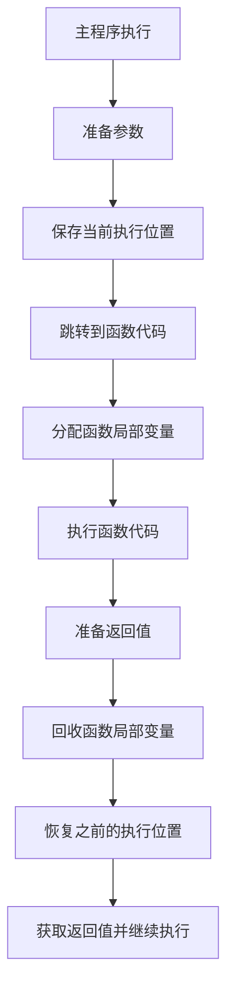

# C++ 函数调用

## 函数调用的基础概念

函数是C++程序的基本构建块，它将一系列相关操作封装成一个单元，使代码更易于理解、维护和重用。函数调用则是指程序执行到某一点时，暂时离开当前执行流程，转而执行函数体内的代码，完成后再返回原来的位置继续执行的过程。

函数调用的基本语法如下：

```cpp
函数名(参数1, 参数2, ...);
```

当函数被调用时，会发生以下步骤：

1. 程序流程转向被调用的函数
2. 函数参数按照定义的顺序被传递给函数
3. 函数体内的代码被执行
4. 执行完毕后，返回值（如果有）被传回调用处
5. 程序继续从调用点之后的语句执行

:::tip
函数调用是C++程序执行的核心机制之一，掌握它对于理解程序执行流程至关重要。
:::

## 函数调用的基本示例

下面是一个简单的函数调用示例：

```cpp
#include <iostream>
using namespace std;

// 函数声明
int add(int a, int b);

int main() {
    int num1 = 5;
    int num2 = 10;
    
    // 函数调用
    int result = add(num1, num2);
    
    cout << "Sum: " << result << endl;
    return 0;
}

// 函数定义
int add(int a, int b) {
    return a + b;
}
```

输出结果：
```
Sum: 15
```

在这个例子中:
- 函数 `add` 被声明、定义并在 `main` 函数中被调用
- 参数 `num1` 和 `num2` 的值被传递给函数参数 `a` 和 `b`
- 函数执行加法操作并返回结果
- 返回值被存储在 `result` 中并输出

## 参数传递方式

C++中函数调用时传递参数的方式主要有三种：值传递、引用传递和指针传递。

### 值传递

值传递是最基本的参数传递方式，它将实参的值复制一份给形参。在函数内对形参的修改不会影响原始实参。

```cpp
#include <iostream>
using namespace std;

void modifyValue(int x) {
    x = 100;  // 修改的是形参x，不影响实参
    cout << "Inside function: x = " << x << endl;
}

int main() {
    int num = 10;
    cout << "Before function call: num = " << num << endl;
    
    modifyValue(num);
    
    cout << "After function call: num = " << num << endl;
    return 0;
}
```

输出结果：
```
Before function call: num = 10
Inside function: x = 100
After function call: num = 10
```

:::note
值传递适用于简单数据类型或当你不希望函数修改原始数据时。对于大型对象，值传递可能效率较低，因为需要复制整个对象。
:::

### 引用传递

引用传递将参数作为原始数据的别名传递给函数。函数内对引用参数的任何修改都会直接影响原始数据。

```cpp
#include <iostream>
using namespace std;

void modifyValueByReference(int &x) {
    x = 100;  // 直接修改原始变量
    cout << "Inside function: x = " << x << endl;
}

int main() {
    int num = 10;
    cout << "Before function call: num = " << num << endl;
    
    modifyValueByReference(num);
    
    cout << "After function call: num = " << num << endl;
    return 0;
}
```

输出结果：
```
Before function call: num = 10
Inside function: x = 100
After function call: num = 100
```

:::tip
引用传递更高效（避免复制大对象）且允许函数修改实参。当你需要函数返回多个值或修改大型对象时，引用传递特别有用。
:::

### 指针传递

指针传递将变量的地址传递给函数。通过解引用操作，函数可以修改原始数据。

```cpp
#include <iostream>
using namespace std;

void modifyValueByPointer(int *x) {
    *x = 100;  // 通过指针修改原始变量
    cout << "Inside function: *x = " << *x << endl;
}

int main() {
    int num = 10;
    cout << "Before function call: num = " << num << endl;
    
    modifyValueByPointer(&num);
    
    cout << "After function call: num = " << num << endl;
    return 0;
}
```

输出结果：
```
Before function call: num = 10
Inside function: *x = 100
After function call: num = 100
```

:::caution
指针传递需要更加小心，因为不正确的指针操作可能导致程序崩溃或难以调试的错误。但它在处理动态分配的内存或大型数据结构时非常有用。
:::

## 函数参数的默认值

C++允许为函数参数指定默认值。当调用函数时，如果未提供相应的实参，则使用默认值。

```cpp
#include <iostream>
using namespace std;

void printMessage(string message, int times = 1) {
    for(int i = 0; i < times; i++) {
        cout << message << endl;
    }
}

int main() {
    // 不提供第二个参数时，使用默认值1
    printMessage("Hello!");
    
    cout << "-------------------" << endl;
    
    // 提供两个参数
    printMessage("Hi there!", 3);
    
    return 0;
}
```

输出结果：
```
Hello!
-------------------
Hi there!
Hi there!
Hi there!
```

:::note
默认参数必须从右向左指定。也就是说，如果某个参数有默认值，那么它右边的所有参数也必须有默认值。
:::

## 函数重载

C++支持函数重载，即可以定义多个同名但参数列表不同的函数。编译器会根据调用时提供的参数类型和数量来选择合适的函数。

```cpp
#include <iostream>
using namespace std;

// 接受两个整数参数
int add(int a, int b) {
    cout << "Called int add(int, int)" << endl;
    return a + b;
}

// 接受三个整数参数
int add(int a, int b, int c) {
    cout << "Called int add(int, int, int)" << endl;
    return a + b + c;
}

// 接受两个浮点数参数
double add(double a, double b) {
    cout << "Called double add(double, double)" << endl;
    return a + b;
}

int main() {
    cout << add(5, 10) << endl;
    cout << add(5, 10, 15) << endl;
    cout << add(3.5, 7.5) << endl;
    
    return 0;
}
```

输出结果：
```
Called int add(int, int)
15
Called int add(int, int, int)
30
Called double add(double, double)
11
```

:::tip
函数重载使代码更加直观，因为可以使用相同的函数名处理不同类型或数量的参数，而不必为每种情况创建不同名称的函数。
:::

## 递归函数调用

递归是函数调用自身的过程。递归函数必须包含一个基本情况（终止条件），以防止无限递归。

```cpp
#include <iostream>
using namespace std;

// 阶乘函数的递归实现
int factorial(int n) {
    // 基本情况：0! = 1
    if (n == 0) {
        return 1;
    }
    // 递归情况：n! = n * (n-1)!
    else {
        return n * factorial(n-1);
    }
}

int main() {
    for (int i = 0; i <= 5; i++) {
        cout << i << "! = " << factorial(i) << endl;
    }
    
    return 0;
}
```

输出结果：
```
0! = 1
1! = 1
2! = 2
3! = 6
4! = 24
5! = 120
```

:::warning
递归函数必须有适当的终止条件，否则会导致堆栈溢出。同时，过深的递归可能会消耗大量堆栈内存。
:::

## 函数调用的内部机制

了解函数调用的内部机制有助于理解程序的执行流程和内存使用情况。



在函数调用过程中，计算机会：
1. 将函数参数按顺序压入栈中
2. 保存当前的程序计数器（PC）值，即返回地址
3. 跳转到函数的第一条指令
4. 在栈中为局部变量分配空间
5. 执行函数代码
6. 将返回值存储在约定的位置（通常是寄存器）
7. 释放局部变量占用的栈空间
8. 恢复程序计数器的值，返回调用点
9. 从栈中移除参数

## 实际应用案例

### 银行账户操作系统

以下是一个简单的银行账户操作系统示例，演示了各种函数调用方式的实际应用：

```cpp
#include <iostream>
#include <string>
using namespace std;

// 账户结构体
struct BankAccount {
    string accountNumber;
    string ownerName;
    double balance;
};

// 通过值传递显示账户信息（只读）
void displayAccount(BankAccount account) {
    cout << "Account Number: " << account.accountNumber << endl;
    cout << "Owner Name: " << account.ownerName << endl;
    cout << "Balance: $" << account.balance << endl;
}

// 通过引用传递存款（修改原始数据）
void deposit(BankAccount &account, double amount) {
    if (amount > 0) {
        account.balance += amount;
        cout << "$" << amount << " has been deposited." << endl;
        cout << "New balance: $" << account.balance << endl;
    } else {
        cout << "Invalid deposit amount." << endl;
    }
}

// 通过指针传递取款（修改原始数据）
bool withdraw(BankAccount *account, double amount) {
    if (amount > 0 && amount <= account->balance) {
        account->balance -= amount;
        cout << "$" << amount << " has been withdrawn." << endl;
        cout << "New balance: $" << account->balance << endl;
        return true;
    } else {
        cout << "Invalid withdrawal amount or insufficient funds." << endl;
        return false;
    }
}

// 带默认利率的计算利息函数
double calculateInterest(const BankAccount &account, double rate = 0.03) {
    double interest = account.balance * rate;
    cout << "Annual interest at " << (rate * 100) << "%: $" << interest << endl;
    return interest;
}

// 函数重载 - 不同类型的转账函数
void transfer(BankAccount &from, BankAccount &to, double amount) {
    if (amount > 0 && amount <= from.balance) {
        from.balance -= amount;
        to.balance += amount;
        cout << "$" << amount << " transferred from account " << from.accountNumber 
             << " to account " << to.accountNumber << endl;
    } else {
        cout << "Invalid transfer amount or insufficient funds." << endl;
    }
}

void transfer(BankAccount &from, string externalAccount, double amount) {
    if (amount > 0 && amount <= from.balance) {
        from.balance -= amount;
        cout << "$" << amount << " transferred from account " << from.accountNumber 
             << " to external account " << externalAccount << endl;
    } else {
        cout << "Invalid transfer amount or insufficient funds." << endl;
    }
}

int main() {
    // 创建账户
    BankAccount account1 = {"AC001", "John Doe", 1000.0};
    BankAccount account2 = {"AC002", "Jane Smith", 500.0};
    
    cout << "=== Initial Account Information ===" << endl;
    displayAccount(account1);
    cout << endl;
    displayAccount(account2);
    cout << endl;
    
    // 使用引用传递进行存款
    deposit(account1, 200.0);
    cout << endl;
    
    // 使用指针传递进行取款
    withdraw(&account1, 50.0);
    cout << endl;
    
    // 计算利息 - 使用默认利率
    calculateInterest(account1);
    cout << endl;
    
    // 计算利息 - 指定利率
    calculateInterest(account2, 0.05);
    cout << endl;
    
    // 在账户之间转账 - 重载函数
    transfer(account1, account2, 300.0);
    cout << endl;
    
    // 向外部账户转账 - 重载函数
    transfer(account2, "EXT9876", 100.0);
    cout << endl;
    
    cout << "=== Final Account Information ===" << endl;
    displayAccount(account1);
    cout << endl;
    displayAccount(account2);
    
    return 0;
}
```

输出结果：
```
=== Initial Account Information ===
Account Number: AC001
Owner Name: John Doe
Balance: $1000

Account Number: AC002
Owner Name: Jane Smith
Balance: $500

$200 has been deposited.
New balance: $1200

$50 has been withdrawn.
New balance: $1150

Annual interest at 3%: $34.5

Annual interest at 5%: $25

$300 transferred from account AC001 to account AC002

$100 transferred from account AC002 to external account EXT9876

=== Final Account Information ===
Account Number: AC001
Owner Name: John Doe
Balance: $850

Account Number: AC002
Owner Name: Jane Smith
Balance: $700
```

这个例子展示了：
- 值传递用于只读操作（显示账户信息）
- 引用传递用于修改原始数据（存款、转账）
- 指针传递用于修改原始数据（取款）
- 默认参数（计算利息时的默认利率）
- 函数重载（两种不同的转账方式）

## 总结

函数调用是C++程序设计中的基本概念，掌握不同的参数传递方式及其适用场景对编写高效、可靠的代码至关重要：

- **值传递**：适用于简单数据或需要保护原始数据不被修改的情况
- **引用传递**：高效地修改原始数据，避免大对象的复制开销
- **指针传递**：提供额外的灵活性，可用于操作动态分配的内存

此外，C++还提供了函数重载和默认参数等强大功能，使代码更加灵活和易于使用。递归函数则展示了函数调用自身解决问题的能力。

深入理解函数调用机制有助于你编写更高效、更稳健的代码，并且能够更好地理解和调试程序行为。

## 练习

1. 编写一个使用值传递的函数，接收一个整数数组并返回其中的最大值。
2. 修改上述函数，使用引用传递一个向量（vector）而不是数组，比较两种实现的异同。
3. 创建一个函数，用指针传递的方式交换两个整数的值。
4. 实现一个带有默认参数的函数，计算圆的面积和周长。
5. 创建一个函数重载示例，实现不同数据类型的数组求和。
6. 编写一个递归函数计算斐波那契数列的第n项，然后尝试用迭代方式实现同样的功能，比较两种方法的效率。
7. 修改银行账户示例，增添一个查询账户交易历史的功能。

:::caution
练习题5中，请注意考虑使用模板可能是更好的解决方案，但这涉及到更高级的C++概念。
:::