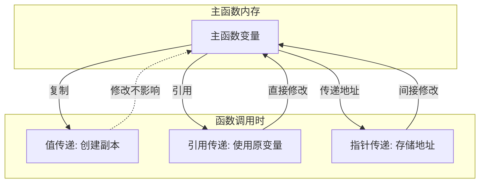

# C++ 函数参数

函数参数是C++编程中的重要概念，它允许我们向函数传递数据，使函数能够处理不同的输入并产生相应的输出。掌握函数参数的使用是成为熟练的C++程序员的关键一步。

## 什么是函数参数？

函数参数是在调用函数时传递给函数的值。这些值被函数用来执行其预定的操作。函数参数在函数定义的括号内声明，并在函数调用时提供实际值。

```cpp
// 函数定义
int add(int a, int b) {  // a和b是形式参数
    return a + b;
}

// 函数调用
int result = add(5, 3);  // 5和3是实际参数
```

在上面的例子中：
- `a`和`b`是形式参数（或形参）
- `5`和`3`是实际参数（或实参）

## 形式参数与实际参数

### 形式参数（形参）
形参是在函数定义时声明的变量。它们在函数主体内作为局部变量，并在函数执行期间接收调用者提供的值。

### 实际参数（实参）
实参是调用函数时传递给函数的实际值。这些值被复制到相应的形参中。

```cpp
#include <iostream>
using namespace std;

void displaySum(int x, int y) {  // x和y是形参
    cout << "Sum: " << x + y << endl;
}

int main() {
    int a = 10, b = 20;
    displaySum(a, b);  // a和b是实参
    return 0;
}
```

**输出：**
```
Sum: 30
```

## 参数传递方式

C++中有三种主要的参数传递方式：

### 1. 值传递（Pass by Value）

在值传递中，函数接收实参的副本。对形参的任何修改都不会影响原始变量。

```cpp
#include <iostream>
using namespace std;

void modifyValue(int x) {
    x = 100;  // 修改的只是副本
    cout << "Inside function: " << x << endl;
}

int main() {
    int num = 10;
    cout << "Before function: " << num << endl;
    modifyValue(num);
    cout << "After function: " << num << endl;  // 原值不变
    return 0;
}
```

**输出：**
```
Before function: 10
Inside function: 100
After function: 10
```

### 2. 引用传递（Pass by Reference）

在引用传递中，函数接收对原始变量的引用。这意味着对形参的任何修改都会影响原始变量。

```cpp
#include <iostream>
using namespace std;

void modifyValue(int& x) {
    x = 100;  // 修改的是原始变量
    cout << "Inside function: " << x << endl;
}

int main() {
    int num = 10;
    cout << "Before function: " << num << endl;
    modifyValue(num);
    cout << "After function: " << num << endl;  // 原值被修改
    return 0;
}
```

**输出：**
```
Before function: 10
Inside function: 100
After function: 100
```

:::tip
引用传递通常用于：
- 当你需要函数修改传入的变量时
- 当传递大对象以避免复制开销时
:::

### 3. 指针传递（Pass by Pointer）

指针传递是通过传递指向变量的指针来实现的。函数可以通过解引用指针来修改原始变量。

```cpp
#include <iostream>
using namespace std;

void modifyValue(int* ptr) {
    *ptr = 100;  // 通过指针修改原始变量
    cout << "Inside function: " << *ptr << endl;
}

int main() {
    int num = 10;
    cout << "Before function: " << num << endl;
    modifyValue(&num);  // 传递num的地址
    cout << "After function: " << num << endl;  // 原值被修改
    return 0;
}
```

**输出：**
```
Before function: 10
Inside function: 100
After function: 100
```

## 默认参数

C++允许为函数参数提供默认值。如果调用函数时没有为该参数提供值，则使用默认值。

```cpp
#include <iostream>
using namespace std;

// 定义带有默认参数的函数
void printMessage(string message, int times = 1) {
    for (int i = 0; i < times; i++) {
        cout << message << endl;
    }
}

int main() {
    // 只提供必需的参数
    printMessage("Hello");
    
    // 提供两个参数
    printMessage("Welcome", 3);
    
    return 0;
}
```

**输出：**
```
Hello
Welcome
Welcome
Welcome
```

:::caution
默认参数必须从右向左提供。如果一个参数有默认值，那么它右边的所有参数也必须有默认值。
:::

错误示范：
```cpp
void func(int a = 10, int b);  // 错误！b也必须有默认值
```

正确示范：
```cpp
void func(int a, int b = 20);  // 正确
void func(int a = 10, int b = 20);  // 也正确
```

## 常量参数

通过使用`const`关键字，可以防止函数修改通过引用或指针传递的参数。

```cpp
#include <iostream>
using namespace std;

// 使用const引用参数
void printData(const int& data) {
    // data = 100;  // 错误！不能修改常量引用
    cout << "Data: " << data << endl;
}

int main() {
    int value = 42;
    printData(value);
    return 0;
}
```

:::note
使用常量引用参数可以兼顾效率（避免复制）和安全性（防止意外修改）。
:::

## 函数重载与参数

C++允许函数重载，即同一函数名可以有多个实现，只要它们的参数列表不同。

```cpp
#include <iostream>
using namespace std;

// 重载add函数
int add(int a, int b) {
    return a + b;
}

double add(double a, double b) {
    return a + b;
}

int add(int a, int b, int c) {
    return a + b + c;
}

int main() {
    cout << add(5, 3) << endl;          // 调用int版本
    cout << add(3.5, 2.5) << endl;      // 调用double版本
    cout << add(1, 2, 3) << endl;       // 调用三参数版本
    return 0;
}
```

**输出：**
```
8
6
6
```

## 可变参数

C++提供了处理可变数量参数的多种方式：

### 1. 使用C风格的可变参数

```cpp
#include <iostream>
#include <cstdarg>
using namespace std;

// 计算任意数量整数的平均值
double average(int count, ...) {
    va_list args;
    double sum = 0;
    
    va_start(args, count);
    for (int i = 0; i < count; i++) {
        sum += va_arg(args, int);
    }
    va_end(args);
    
    return sum / count;
}

int main() {
    cout << "Average: " << average(5, 10, 20, 30, 40, 50) << endl;
    return 0;
}
```

**输出：**
```
Average: 30
```

### 2. 使用现代C++方法（C++11之后）

```cpp
#include <iostream>
using namespace std;

// 使用模板和可变参数模板
template<typename... Args>
auto sum(Args... args) {
    return (args + ...);
}

int main() {
    cout << "Sum: " << sum(1, 2, 3, 4, 5) << endl;
    cout << "Sum: " << sum(1.5, 2.5, 3.5) << endl;
    return 0;
}
```

**输出：**
```
Sum: 15
Sum: 7.5
```

## 函数参数的内存模型

为了更好地理解函数参数的工作方式，我们可以看一下它们在内存中的表现：



## 实际应用案例

### 案例1：银行账户转账系统

以下是一个简单的银行账户转账系统，展示了不同参数传递方式的应用：

```cpp
#include <iostream>
#include <string>
using namespace std;

struct BankAccount {
    string name;
    double balance;
};

// 使用引用传递修改账户余额
void deposit(BankAccount& account, double amount) {
    account.balance += amount;
    cout << amount << " deposited to " << account.name << "'s account." << endl;
}

// 使用常量引用传递以避免复制，但不允许修改
void displayAccount(const BankAccount& account) {
    cout << "Account: " << account.name << ", Balance: $" << account.balance << endl;
}

// 使用引用传递来完成转账
bool transferMoney(BankAccount& from, BankAccount& to, double amount) {
    if (from.balance < amount) {
        cout << "Insufficient funds!" << endl;
        return false;
    }
    
    from.balance -= amount;
    to.balance += amount;
    cout << "Transferred $" << amount << " from " << from.name << " to " << to.name << endl;
    return true;
}

int main() {
    BankAccount alice = {"Alice", 1000.0};
    BankAccount bob = {"Bob", 500.0};
    
    displayAccount(alice);
    displayAccount(bob);
    
    deposit(alice, 200.0);
    transferMoney(alice, bob, 300.0);
    
    displayAccount(alice);
    displayAccount(bob);
    
    return 0;
}
```

**输出：**
```
Account: Alice, Balance: $1000
Account: Bob, Balance: $500
200 deposited to Alice's account.
Transferred $300 from Alice to Bob
Account: Alice, Balance: $900
Account: Bob, Balance: $800
```

### 案例2：图形计算器

以下是一个使用默认参数和函数重载的几何计算器示例：

```cpp
#include <iostream>
#include <cmath>
using namespace std;

// 计算圆的面积（使用默认参数）
double calculateArea(double radius, double pi = 3.14159) {
    return pi * radius * radius;
}

// 函数重载：计算矩形面积
double calculateArea(double length, double width) {
    return length * width;
}

// 函数重载：计算三角形面积
double calculateArea(double a, double b, double c) {
    // 使用海伦公式
    double s = (a + b + c) / 2;
    return sqrt(s * (s - a) * (s - b) * (s - c));
}

int main() {
    cout << "Circle area (radius 5): " << calculateArea(5.0) << endl;
    cout << "Rectangle area (4x6): " << calculateArea(4.0, 6.0) << endl;
    cout << "Triangle area (sides 3,4,5): " << calculateArea(3.0, 4.0, 5.0) << endl;
    return 0;
}
```

**输出：**
```
Circle area (radius 5): 78.5398
Rectangle area (4x6): 24
Triangle area (sides 3,4,5): 6
```

## 总结

函数参数是C++编程中的关键概念，理解不同的参数传递方式及其应用场景对编写高效、正确的代码至关重要。在本文中，我们学习了：

1. 形参和实参的区别
2. 三种参数传递方式：值传递、引用传递和指针传递
3. 默认参数的使用
4. 常量参数的用途
5. 函数重载与参数
6. 可变参数的处理方法
7. 实际应用案例

通过掌握这些概念，你将能够更有效地使用函数参数，编写更灵活、可维护的C++代码。

## 练习

1. 编写一个函数，接受一个整数数组和其长度，返回数组中的最大值。
2. 创建一个交换两个变量值的函数，分别使用值传递、引用传递和指针传递实现。
3. 实现一个函数，接受任意数量的整数，并返回它们的乘积。
4. 编写一个函数，接受一个字符串引用参数，将其中的所有小写字母转换为大写。

:::tip 进阶学习
要深入了解C++函数参数的更多用法，可以探索现代C++的特性，如：lambda表达式中的参数捕获、移动语义与std::move、完美转发与std::forward等概念。
:::