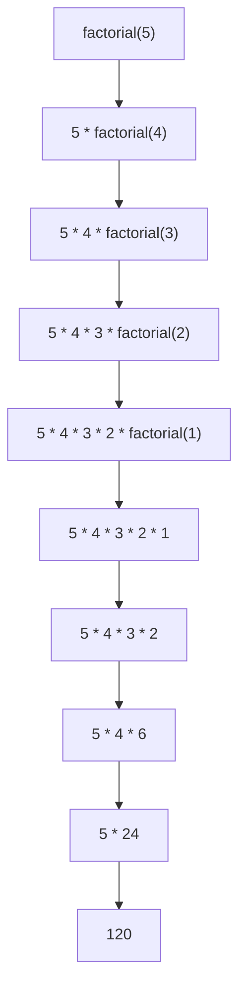

# C++ 递归函数

## 递归的基本概念

递归是编程中一个强大且优雅的概念，它指的是**函数直接或间接调用自身**的过程。换句话说，递归函数是一个会在其定义中引用自身的函数。

递归解决问题的思路是：
1. 将问题分解为更小的同类问题
2. 解决这些小问题（通过递归调用）
3. 将这些小问题的解决方案组合起来，解决原始问题

:::tip 理解递归
如果你站在两面相对的镜子之间，你会看到自己的无限倒影。这就像递归函数一样，函数不断调用自身，创建了一种"镜像效果"。
:::

## 递归函数的基本结构

一个完整的递归函数通常由两部分组成：

1. **基本情况（Base Case）**：当问题简单到可以直接解决时的条件，也称为"递归出口"。
2. **递归情况（Recursive Case）**：将问题分解为更小的子问题，并调用自身来解决。

```cpp
返回类型 递归函数名(参数列表) {
    // 基本情况：递归的终止条件
    if (终止条件) {
        return 基本情况的值;
    }
    // 递归情况：调用自身
    else {
        return 递归调用自身(更小的问题);
    }
}
```

## 递归的工作原理

让我们通过计算阶乘的例子来理解递归的工作原理。

阶乘定义：n! = n × (n-1) × (n-2) × ... × 2 × 1

```cpp
int factorial(int n) {
    // 基本情况
    if (n == 0 || n == 1) {
        return 1;
    }
    // 递归情况
    else {
        return n * factorial(n - 1);
    }
}

int main() {
    std::cout << "5! = " << factorial(5) << std::endl;
    return 0;
}
```

输出：
```
5! = 120
```

### 递归调用栈过程分析

当我们调用 `factorial(5)` 时，发生了以下过程：



每次递归调用都会在内存中的**栈**上分配空间，直到达到基本情况。然后，函数开始"返回"，计算在栈中累积的表达式。

## 递归与迭代的比较

递归和迭代（循环）都可以用来解决重复性问题，但它们各有优缺点：

**递归优点：**
- 代码更简洁、更优雅
- 对于某些问题（如树遍历）表达自然
- 思路清晰，易于理解算法

**递归缺点：**
- 效率可能较低（函数调用开销）
- 可能导致栈溢出错误
- 调试复杂度较高

**迭代的阶乘实现对比：**

```cpp
int factorial_iterative(int n) {
    int result = 1;
    for (int i = 1; i <= n; ++i) {
        result *= i;
    }
    return result;
}
```

## 常见递归问题示例

### 1. 斐波那契数列

斐波那契数列：1, 1, 2, 3, 5, 8, 13, 21...（每个数是前两个数之和）

```cpp
int fibonacci(int n) {
    // 基本情况
    if (n == 0) return 0;
    if (n == 1) return 1;
    
    // 递归情况
    return fibonacci(n - 1) + fibonacci(n - 2);
}

int main() {
    std::cout << "斐波那契数列的前10项：" << std::endl;
    for (int i = 0; i < 10; ++i) {
        std::cout << fibonacci(i) << " ";
    }
    return 0;
}
```

输出：
```
斐波那契数列的前10项：
0 1 1 2 3 5 8 13 21 34
```

:::caution 警告
上面的斐波那契递归实现效率很低，因为它重复计算了许多值。在实际应用中，我们通常会使用动态规划或记忆化搜索来优化。
:::

### 2. 汉诺塔问题

汉诺塔是一个经典的递归问题，涉及到将一组盘子从一个柱子移动到另一个柱子，遵循以下规则：
1. 一次只能移动一个盘子
2. 大盘子不能放在小盘子上面

```cpp
void hanoi(int n, char source, char auxiliary, char target) {
    // 基本情况
    if (n == 1) {
        std::cout << "将盘子 1 从 " << source << " 移动到 " << target << std::endl;
        return;
    }
    
    // 递归情况
    // 1. 将 n-1 个盘子从源柱移到辅助柱
    hanoi(n - 1, source, target, auxiliary);
    
    // 2. 将第 n 个盘子从源柱移到目标柱
    std::cout << "将盘子 " << n << " 从 " << source << " 移动到 " << target << std::endl;
    
    // 3. 将 n-1 个盘子从辅助柱移到目标柱
    hanoi(n - 1, auxiliary, source, target);
}

int main() {
    int n = 3; // 3个盘子
    hanoi(n, 'A', 'B', 'C');
    return 0;
}
```

输出：
```
将盘子 1 从 A 移动到 C
将盘子 2 从 A 移动到 B
将盘子 1 从 C 移动到 B
将盘子 3 从 A 移动到 C
将盘子 1 从 B 移动到 A
将盘子 2 从 B 移动到 C
将盘子 1 从 A 移动到 C
```

## 尾递归优化

尾递归是递归的一种特殊形式，其中递归调用是函数执行的最后一个操作。许多现代编译器可以将尾递归优化成循环，避免栈溢出的风险。

```cpp
// 普通递归阶乘
int factorial(int n) {
    if (n == 0) return 1;
    return n * factorial(n - 1); // 递归调用后还需要进行乘法运算
}

// 尾递归阶乘
int factorial_tail(int n, int result = 1) {
    if (n == 0) return result;
    return factorial_tail(n - 1, n * result); // 递归调用是最后一个操作
}
```

:::tip
在C++中，是否进行尾递归优化取决于编译器。GCC和Clang在优化选项开启时通常会进行尾递归优化。
:::

## 递归的真实应用场景

### 1. 文件系统遍历

递归非常适合用于遍历目录结构，因为文件系统本身就是一个递归数据结构。

```cpp
#include <iostream>
#include <filesystem>
namespace fs = std::filesystem;

void list_directory(const fs::path& path, int level = 0) {
    if (!fs::exists(path)) return;
    
    for (const auto& entry : fs::directory_iterator(path)) {
        // 打印当前文件/文件夹
        for (int i = 0; i < level; ++i) std::cout << "  ";
        std::cout << entry.path().filename() << std::endl;
        
        // 如果是目录，递归进入
        if (fs::is_directory(entry)) {
            list_directory(entry.path(), level + 1);
        }
    }
}

int main() {
    list_directory("./examples");
    return 0;
}
```

### 2. 数据结构操作

递归天然适合处理树形结构，如二叉树的遍历：

```cpp
struct TreeNode {
    int value;
    TreeNode* left;
    TreeNode* right;
    
    TreeNode(int val) : value(val), left(nullptr), right(nullptr) {}
};

// 中序遍历: 左子树 -> 根节点 -> 右子树
void inorder_traversal(TreeNode* root) {
    if (root == nullptr) return;
    
    inorder_traversal(root->left);    // 递归遍历左子树
    std::cout << root->value << " ";  // 访问根节点
    inorder_traversal(root->right);   // 递归遍历右子树
}
```

### 3. 算法设计

许多分治算法使用递归实现，如快速排序：

```cpp
void quick_sort(int arr[], int low, int high) {
    if (low < high) {
        // 获取分区点
        int pivot_index = partition(arr, low, high);
        
        // 递归排序左右子数组
        quick_sort(arr, low, pivot_index - 1);
        quick_sort(arr, pivot_index + 1, high);
    }
}

int partition(int arr[], int low, int high) {
    int pivot = arr[high];
    int i = low - 1;
    
    for (int j = low; j < high; j++) {
        if (arr[j] <= pivot) {
            i++;
            std::swap(arr[i], arr[j]);
        }
    }
    
    std::swap(arr[i + 1], arr[high]);
    return i + 1;
}
```

## 常见递归问题及解决方法

### 栈溢出

递归层数过多可能导致栈溢出错误。解决方法：

1. **使用尾递归**：如前所述，允许编译器进行优化
2. **转换为迭代**：某些递归算法可以重写为循环
3. **增加栈大小**：一些编译器允许设置更大的栈空间
4. **记忆化**：存储已计算过的结果，避免重复计算

### 重复计算

以斐波那契为例，简单递归会导致大量重复计算。使用记忆化可以解决：

```cpp
#include <unordered_map>

int fibonacci_memoized(int n, std::unordered_map<int, int>& memo) {
    // 检查是否已经计算过
    if (memo.find(n) != memo.end()) {
        return memo[n];
    }
    
    // 基本情况
    if (n <= 1) {
        return n;
    }
    
    // 计算并存储结果
    memo[n] = fibonacci_memoized(n - 1, memo) + fibonacci_memoized(n - 2, memo);
    return memo[n];
}

int fibonacci(int n) {
    std::unordered_map<int, int> memo;
    return fibonacci_memoized(n, memo);
}
```

## 总结

递归是一种强大的编程技术，它通过将问题分解成更小的同类问题来解决复杂任务。虽然递归可能在效率上不如迭代，但它能够使代码更简洁、更优雅，特别是在处理天然具有递归结构的问题时。

要成功使用递归：
1. 确保有明确的基本情况（递归终止条件）
2. 确保递归调用逐渐接近基本情况
3. 注意效率问题，在必要时使用优化技术
4. 理解递归调用栈的工作原理，避免栈溢出

掌握递归思想不仅可以解决特定问题，更能培养分治的思维方式，这对算法设计和问题分析都非常有帮助。

## 练习题

1. 编写一个递归函数计算整数的次方 (x^n)
2. 使用递归实现二分查找
3. 编写递归函数计算字符串的长度
4. 使用递归实现数组求和
5. 编写函数判断字符串是否为回文（正反读相同）

## 扩展阅读

- 《算法导论》中的递归章节
- 尾递归优化的更多细节
- 记忆化搜索与动态规划的关系

祝你在递归的世界中探索愉快！