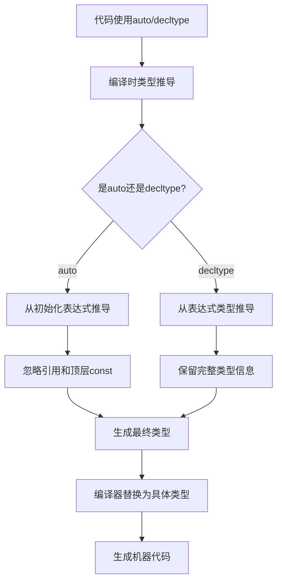

# C++ 11自动类型推导

C++11引入了一系列新特性，使代码编写更加简洁高效。其中，自动类型推导是最实用的特性之一，它让我们不再需要显式地指定每个变量的类型，而是让编译器根据初始化表达式自动推断出合适的类型。本文将详细介绍C++11中的自动类型推导功能，主要包括`auto`和`decltype`关键字的使用。

## 自动类型推导的必要性

在C++11之前，编写代码时我们总是需要明确指定变量的类型：

```cpp
std::vector<int>::iterator it = v.begin();
std::map<std::string, std::vector<int>>::iterator mapIt = m.begin();
```

对于复杂的类型，这样的声明既冗长又容易出错。而且，当使用模板或库函数返回复杂类型时，有时甚至很难确定返回值的确切类型。C++11通过引入自动类型推导解决了这个问题。

## auto关键字

### 基本用法

`auto`关键字允许编译器根据初始化表达式自动推导变量的类型：

```cpp
auto i = 42;        // i 是 int 类型
auto d = 42.5;      // d 是 double 类型
auto s = "hello";   // s 是 const char* 类型
auto v = {1, 2, 3}; // v 是 std::initializer_list<int> 类型
```

### 迭代器简化

使用`auto`可以大大简化迭代器的声明：

```cpp
std::vector<int> numbers = {1, 2, 3, 4, 5};

// 传统方式
for (std::vector<int>::iterator it = numbers.begin(); it != numbers.end(); ++it) {
    std::cout << *it << " ";
}

// 使用auto
for (auto it = numbers.begin(); it != numbers.end(); ++it) {
    std::cout << *it << " ";
}

// 更现代的方式，结合范围for循环
for (const auto& num : numbers) {
    std::cout << num << " ";
}
```

输出：
```
1 2 3 4 5
1 2 3 4 5
1 2 3 4 5
```

### auto与修饰符

`auto`可以与指针、引用和const限定符结合使用：

```cpp
auto x = 10;         // x 是 int 类型
auto& rx = x;        // rx 是 int& 类型
const auto& crx = x; // crx 是 const int& 类型
auto* px = &x;       // px 是 int* 类型
const auto* cpx = &x;// cpx 是 const int* 类型
```

:::caution 注意
使用`auto`时，引用和顶层`const`属性会被忽略，如果需要保留这些属性，必须显式指定：
:::

```cpp
int i = 42;
const int ci = i;
auto a = ci;  // a 是 int 类型，const 被忽略
const auto ca = ci;  // ca 是 const int 类型
auto& ra = ci;  // ra 是 const int& 类型，引用绑定到 const int
```

## decltype关键字

### 基本用法

`decltype`关键字用于获取表达式的类型，而不实际计算表达式的值：

```cpp
int i = 42;
decltype(i) j = 0;  // j 是 int 类型

const int& ri = i;
decltype(ri) k = i;  // k 是 const int& 类型

std::vector<int> v;
decltype(v.begin()) it = v.begin();  // it 是 std::vector<int>::iterator 类型
```

### decltype与表达式

`decltype`的规则比`auto`更复杂，它会精确地推导表达式的类型，包括引用和cv限定符：

```cpp
int i = 42;
int& ri = i;
int* pi = &i;

decltype(i) a = 0;    // a 是 int
decltype(ri) b = i;   // b 是 int&
decltype(pi) c = &i;  // c 是 int*

// 表达式结果
decltype(i + 0) d = 0;  // d 是 int
decltype(*pi) e = i;    // e 是 int&，因为*pi是左值
decltype((i)) f = i;    // f 是 int&，因为(i)是左值表达式
```

:::tip 技巧
记住一个简单规则：如果表达式是左值，`decltype`会产生引用类型；如果表达式只是一个变量名，则`decltype`会产生该变量的声明类型。
:::

## auto与decltype的区别

虽然两者都用于类型推导，但它们的工作方式不同：

1. `auto`会忽略引用和顶层const，而`decltype`会保留这些属性
2. `auto`实际上使用初始化表达式的值来推导类型，而`decltype`只关心表达式的类型，不会实际计算表达式

```cpp
const int i = 42;
auto a = i;         // a 是 int，忽略了 const
decltype(i) b = 0;  // b 是 const int，保留了 const
```

## 实际应用场景

### 1. 处理复杂的迭代器类型

```cpp
std::map<std::string, std::vector<std::pair<int, double>>> complexData;

// 使用auto简化迭代
for (const auto& entry : complexData) {
    const auto& key = entry.first;
    const auto& values = entry.second;
    
    for (const auto& value : values) {
        std::cout << key << ": " << value.first << ", " << value.second << std::endl;
    }
}
```

### 2. 处理lambda表达式返回类型

```cpp
auto multiply = [](int a, int b) { return a * b; };
auto result = multiply(5, 3);  // result 是 int
```

### 3. 在模板编程中使用decltype

```cpp
template<typename T, typename U>
auto add(T t, U u) -> decltype(t + u) {
    return t + u;
}

auto sum1 = add(5, 3.5);    // sum1 是 double
auto sum2 = add(5, 'a');    // sum2 是 int
```

### 4. 实现泛型算法

```cpp
template<typename Container>
void printElements(const Container& c) {
    for (const auto& element : c) {
        std::cout << element << " ";
    }
    std::cout << std::endl;
}

std::vector<int> nums = {1, 2, 3};
std::list<std::string> names = {"Alice", "Bob", "Charlie"};
printElements(nums);   // 输出: 1 2 3
printElements(names);  // 输出: Alice Bob Charlie
```

## 使用自动类型推导的最佳实践

1. **可读性优先**：只在类型明显的情况下使用`auto`
   ```cpp
   auto i = 10;                 // 明显是整数
   auto p = new MyClass();      // 明显是MyClass指针
   ```

2. **避免过度使用**：不要在可能造成混淆的地方使用
   ```cpp
   auto result = someFunction();  // 如果不明确返回类型，可能造成误解
   ```

3. **使用auto提高代码维护性**：当真正的类型名很长或可能改变时
   ```cpp
   auto it = myMap.find(key);  // 比 std::map<std::string, std::vector<int>>::iterator 简洁
   ```

4. **结合引用使用auto避免不必要的拷贝**
   ```cpp
   for (const auto& item : collection) {
       // 使用引用避免拷贝
   }
   ```

## 自动类型推导的工作原理



## 总结

C++11的自动类型推导大幅提升了C++编程的体验：

- `auto`关键字帮助我们避免冗长的类型声明，使代码更简洁
- `decltype`允许我们在不求值的情况下获取表达式的确切类型
- 两者结合使用在泛型编程中尤为有用，可以实现更灵活的模板函数

虽然自动类型推导提供了很大的便利，但也需要谨慎使用。过度使用可能会使代码难以理解，特别是当推导出的类型不明显时。良好的做法是在类型显而易见或过于冗长的情况下使用自动类型推导。

## 练习

1. 分析以下代码中各变量的具体类型：
   ```cpp
   int x = 10;
   const int cx = x;
   int& rx = x;
   const int& crx = x;
   
   auto a1 = x;
   auto a2 = cx;
   auto a3 = rx;
   auto a4 = crx;
   auto& a5 = x;
   auto& a6 = cx;
   const auto& a7 = x;
   
   decltype(x) d1 = 0;
   decltype(cx) d2 = 0;
   decltype(rx) d3 = x;
   decltype(crx) d4 = x;
   decltype((x)) d5 = x;
   ```

2. 编写一个函数模板，使用`auto`和`decltype`实现两个不同类型数值的加法，并确保返回类型是两者相加的结果类型。

3. 实现一个使用`auto`的泛型函数，可以打印任何容器的内容。

:::tip 扩展阅读
如果你想深入了解C++11类型推导的更多细节，可以参考：
- Scott Meyers的《Effective Modern C++》第1-4条
- C++标准库中关于`std::declval`的使用
- C++14中的返回类型推导和`decltype(auto)`
:::