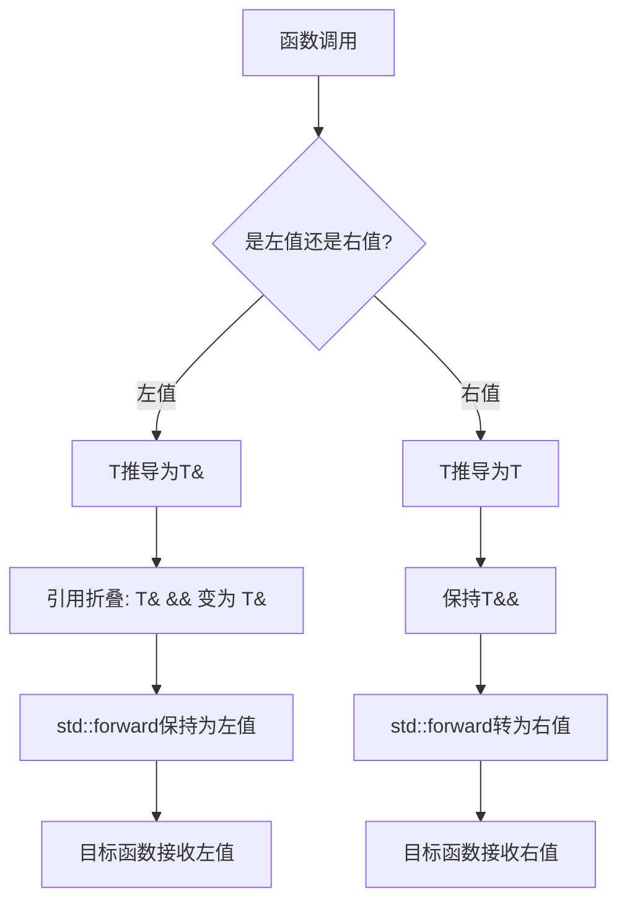

# C++ 11完美转发

## 什么是完美转发？

在C++编程中，我们经常需要编写通用的工具函数，这些函数接收参数后不做修改直接传递给其他函数。这种"转发"参数的场景非常常见，但在C++11之前，保持参数原有的性质（如左值/右值、const/非const等）是很困难的。

**完美转发(Perfect Forwarding)**就是C++11提供的一种机制，能够：

- 将函数参数按照原来的类型和值类别（左值/右值）转发给另一个函数
- 保留参数的所有原始属性，包括是否为const、是否为右值等

简单来说，完美转发让参数"完美地"保持其原始状态被传递下去。

## 为什么需要完美转发？

在不使用完美转发的情况下，我们可能需要为不同类型的参数编写多个重载版本：

```cpp
template <typename T>
void wrapper(const T& arg) {
    // 用于处理左值
    some_function(arg);
}

template <typename T>
void wrapper(T&& arg) {
    // 用于处理右值
    some_function(std::move(arg));
}
```

这种方式不仅代码冗余，而且在参数数量增加时，重载函数的数量会呈指数级增长。完美转发正是为了解决这个问题而设计的。

## 完美转发的核心组件

### 1. 通用引用（Universal Reference）

完美转发的基础是**通用引用**，它的形式是`T&&`，其中T是一个模板参数。通用引用既可以绑定到左值也可以绑定到右值。

:::note
不要将通用引用和右值引用混淆！虽然它们语法相同（都是`T&&`），但通用引用必须涉及类型推导。
:::

```cpp
template <typename T>
void func(T&& param) {  // 这是通用引用，不是右值引用
    // ...
}

int main() {
    int x = 10;
    
    func(x);      // T推导为int&，param是左值引用
    func(10);     // T推导为int，param是右值引用
}
```

### 2. 引用折叠（Reference Collapsing）

当类型推导涉及引用的引用时，C++11引入了**引用折叠**规则：

- `T& &` 折叠为 `T&`
- `T& &&` 折叠为 `T&`
- `T&& &` 折叠为 `T&`
- `T&& &&` 折叠为 `T&&`

简单记忆：只有两个都是右值引用时，结果才是右值引用，否则结果是左值引用。

```cpp
template <typename T>
void func(T&& param) {
    // 当传入左值时，T被推导为int&
    // 此时param的类型为int& && （折叠为int&）
    
    // 当传入右值时，T被推导为int
    // 此时param的类型为int&&
}
```

### 3. std::forward

`std::forward`是完美转发的核心，它是一个条件性转换函数：

- 如果传入的是左值，则保持为左值
- 如果传入的是右值，则转换为右值

```cpp
template <typename T>
void forwarder(T&& arg) {
    // 完美转发参数
    receiver(std::forward<T>(arg));
}
```

`std::forward<T>`看起来像类型转换，实际上它能智能地判断参数的原始类型并相应地处理。

## 完美转发实战示例

### 基本用法

```cpp
#include <iostream>
#include <utility>
#include <string>

void process(int& x) {
    std::cout << "处理左值: " << x << std::endl;
}

void process(int&& x) {
    std::cout << "处理右值: " << x << std::endl;
}

// 使用完美转发的包装函数
template <typename T>
void perfect_forwarder(T&& arg) {
    std::cout << "通过完美转发: ";
    process(std::forward<T>(arg));
}

int main() {
    int a = 10;
    
    process(a);            // 输出: 处理左值: 10
    process(20);           // 输出: 处理右值: 20
    
    perfect_forwarder(a);  // 输出: 通过完美转发: 处理左值: 10
    perfect_forwarder(20); // 输出: 通过完美转发: 处理右值: 20
    
    return 0;
}
```

在这个例子中，`perfect_forwarder`函数接收参数并完美地转发给`process`函数，保持原参数的左值或右值属性。

### 转发多个参数

完美转发也可以处理多个参数：

```cpp
#include <iostream>
#include <utility>
#include <string>

// 目标函数接收多个参数
void target_function(int&& a, std::string&& b, double& c) {
    std::cout << "接收到参数: " << a << ", " << b << ", " << c << std::endl;
    c += 1.0;  // 修改引用参数
}

// 使用可变参数模板和完美转发
template <typename... Args>
void forward_to_target(Args&&... args) {
    target_function(std::forward<Args>(args)...);
}

int main() {
    double value = 3.14;
    
    forward_to_target(42, std::string("C++11"), value);
    std::cout << "value现在是: " << value << std::endl;  // 输出: value现在是: 4.14
    
    return 0;
}
```

### 实际应用场景：工厂函数

完美转发在工厂模式中特别有用，可以用于转发构造函数参数：

```cpp
#include <iostream>
#include <memory>
#include <string>
#include <utility>

class Widget {
public:
    Widget(int x, std::string y) 
        : m_x(x), m_y(std::move(y)) {
        std::cout << "构造Widget: " << m_x << ", " << m_y << std::endl;
    }

private:
    int m_x;
    std::string m_y;
};

// 使用完美转发的工厂函数
template<typename... Args>
std::unique_ptr<Widget> create_widget(Args&&... args) {
    return std::make_unique<Widget>(std::forward<Args>(args)...);
}

int main() {
    std::string name = "测试";
    
    // 转发左值
    auto w1 = create_widget(42, name);
    
    // 转发右值
    auto w2 = create_widget(100, std::string("Widget"));
    
    return 0;
}
```

输出：
```
构造Widget: 42, 测试
构造Widget: 100, Widget
```

### 实际应用场景：可变参数函数包装器

完美转发对于编写通用的函数包装器非常有用：

```cpp
#include <iostream>
#include <utility>
#include <functional>

// 一个可以测量任何函数执行时间的通用包装器
template<typename Func, typename... Args>
auto time_function(Func&& func, Args&&... args) {
    auto start = std::chrono::high_resolution_clock::now();
    
    // 完美转发函数和所有参数
    auto result = std::forward<Func>(func)(std::forward<Args>(args)...);
    
    auto end = std::chrono::high_resolution_clock::now();
    std::chrono::duration<double, std::milli> duration = end - start;
    
    std::cout << "函数执行时间: " << duration.count() << " 毫秒" << std::endl;
    
    return result;
}

// 示例函数
int add(int a, int b) {
    std::this_thread::sleep_for(std::chrono::milliseconds(100));  // 模拟耗时操作
    return a + b;
}

int main() {
    int a = 5, b = 10;
    
    // 使用完美转发包装器调用add函数
    int result = time_function(add, a, b);
    
    std::cout << "结果: " << result << std::endl;
    return 0;
}
```

## 完美转发的陷阱与注意事项

尽管完美转发非常强大，但也有一些限制：

### 1. 不能转发的情况

某些参数类型会导致完美转发失败：

- 大括号初始化列表
- 0或NULL作为空指针（应使用nullptr）
- 声明为`const char[N]`的字符串字面量
- 位域

```cpp
template<typename T>
void f(T&&) { }

int main() {
    // 无法转发大括号初始化列表
    // f({1, 2, 3});  // 编译错误
    
    // 正确做法：先创建变量
    auto list = {1, 2, 3};
    f(list);
    
    return 0;
}
```

### 2. 引用折叠容易混淆

引用折叠规则并不直观，初学者容易混淆：

```cpp
template<typename T>
void confusion(T&& x) {
    T y = x;  // 危险！如果T是引用类型，y也将是引用
    
    // 更安全的写法：
    std::remove_reference_t<T> safe_y = x;
}
```

### 3. 与std::move混用

`std::forward`和`std::move`有根本的区别：

- `std::move`无条件地将参数转为右值引用
- `std::forward`有条件地转换，保留原参数的值类别

```cpp
template<typename T>
void dangerous(T&& x) {
    // 错误：永远转为右值，破坏了完美转发
    process(std::move(x));
    
    // 正确：保持x的原始类型
    process(std::forward<T>(x));
}
```

## 完美转发工作原理图解



## 总结

完美转发是C++11中的一项重要特性，它通过通用引用、引用折叠和`std::forward`的组合使用，解决了参数转发中保留原始属性的问题。

关键点回顾：

- 完美转发让我们能够编写通用的转发函数，保留参数的左值/右值特性
- 通用引用（`T&&`）是完美转发的基础，它可以绑定到任何值类别
- 引用折叠规则决定了最终参数的引用类型
- `std::forward<T>`是实现完美转发的核心函数
- 完美转发在工厂函数、泛型编程和函数包装器中有广泛应用

掌握完美转发对于理解现代C++库和编写通用、高效的代码至关重要。虽然概念上有一定难度，但它是C++11最强大的特性之一，值得深入学习和应用。

## 练习

1. 编写一个通用函数`printArgs`，它可以接受任意数量的参数并将它们打印出来，同时保留参数的左值/右值特性。

2. 实现一个简单的事件分发器，可以注册回调函数并完美转发参数。

3. 修改以下代码，使其能够正确工作：
   ```cpp
   template<typename T>
   void wrapper(T&& arg) {
       helper(arg);  // 目前会丢失右值特性
   }
   ```

4. 解释为什么以下代码可能存在问题：
   ```cpp
   template<typename T>
   void problem(T&& x) {
       T y = x;
       otherFunc(std::forward<T>(y));
   }
   ```

5. 尝试实现一个通用的缓存函数，它可以缓存任何函数的结果，并在相同参数再次调用时返回缓存的结果。使用完美转发确保参数能正确传递。

## 进一步阅读资源

- [C++ Reference: std::forward](https://en.cppreference.com/w/cpp/utility/forward)
- Scott Meyers的《Effective Modern C++》第23-30条
- Herb Sutter的《Exceptional C++》系列

通过进一步学习和实践，你将能够充分利用C++11的完美转发特性，编写更加通用和高效的代码。